# Testing

El **testing** es la práctica de verificar que tu código funciona correctamente. No es opcional: es parte fundamental del desarrollo profesional. Un buen suite de tests te da **confianza** para refactorizar y desplegar.

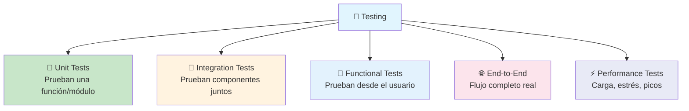

### La pirámide de tests

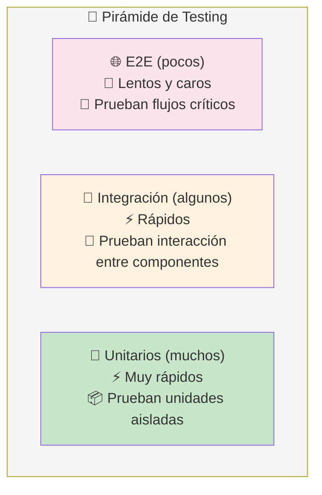

> **Regla:** Muchos tests unitarios rápidos, algunos de integración, pocos E2E. Invertir la pirámide (muchos E2E, pocos unitarios) = tests lentos y frágiles.

---

## Unit Testing

Un **test unitario** prueba la **unidad más pequeña** de código (una función, un método) de forma **aislada**, sin dependencias externas (BD, APIs, archivos).

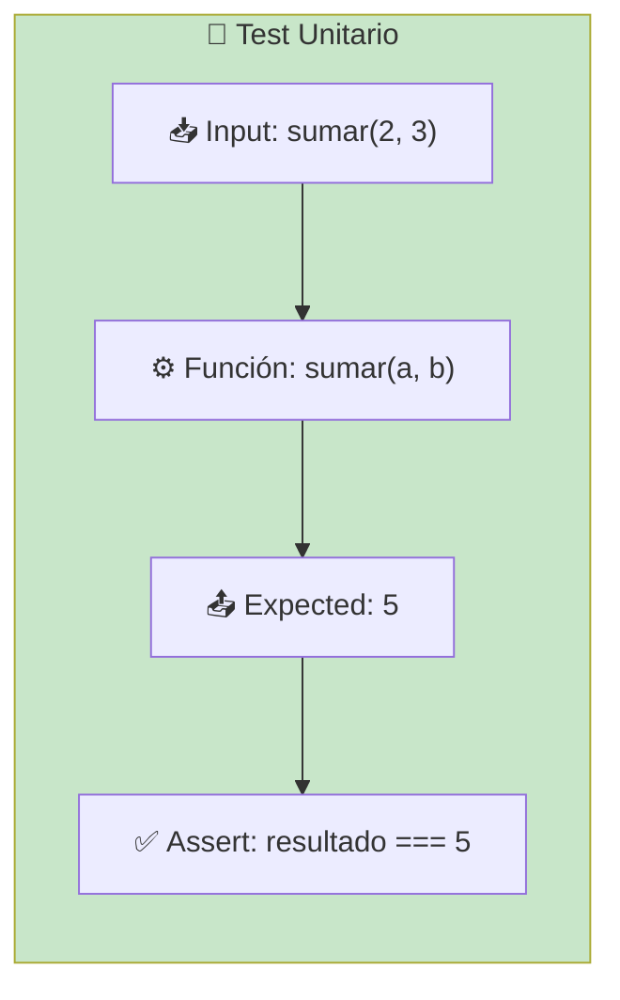

### Ejemplo

```javascript
// Código a testear
function calcularTotal(precio, cantidad, descuento = 0) {
    const subtotal = precio * cantidad;
    return subtotal - (subtotal * descuento);
}

// Test unitario (Vitest / Jest)
describe('calcularTotal', () => {
    it('calcula el total sin descuento', () => {
        expect(calcularTotal(100, 2)).toBe(200);
    });

    it('aplica descuento porcentual', () => {
        expect(calcularTotal(100, 2, 0.1)).toBe(180);
    });

    it('devuelve 0 si la cantidad es 0', () => {
        expect(calcularTotal(100, 0)).toBe(0);
    });

    it('maneja descuento del 100%', () => {
        expect(calcularTotal(100, 2, 1)).toBe(0);
    });
});
```

```python
# Python con pytest
def calcular_total(precio, cantidad, descuento=0):
    subtotal = precio * cantidad
    return subtotal - (subtotal * descuento)

def test_sin_descuento():
    assert calcular_total(100, 2) == 200

def test_con_descuento():
    assert calcular_total(100, 2, 0.1) == 180

def test_cantidad_cero():
    assert calcular_total(100, 0) == 0
```

### Características de un buen test unitario

- **Aislado** — no depende de BD, red, archivos
- **Rápido** — milisegundos
- **Determinista** — misma entrada → mismo resultado siempre
- **Una cosa** — prueba un solo comportamiento
- **Legible** — nombre describe qué prueba

### Mocks y Stubs

Para aislar el código, reemplazas dependencias externas con **mocks**.

```javascript
// Mock de la base de datos
const mockDb = {
    query: vi.fn().mockResolvedValue([{ id: 1, nombre: 'Ana' }])
};

// Test sin BD real
it('obtiene usuarios', async () => {
    const usuarios = await getUsuarios(mockDb);
    expect(usuarios).toHaveLength(1);
    expect(mockDb.query).toHaveBeenCalledWith('SELECT * FROM usuarios');
});
```

---

## Integration Testing

Un **test de integración** verifica que **varios componentes funcionan juntos** correctamente: función + BD, API + servicio externo, etc.

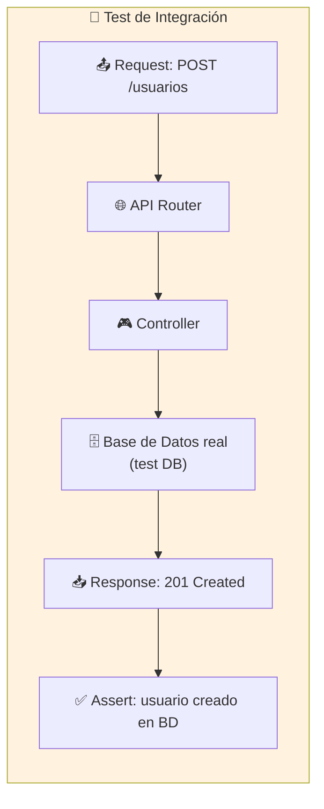

### Ejemplo

```javascript
// Test de integración: API + BD (supertest + vitest)
describe('POST /api/usuarios', () => {
    it('crea un usuario y lo persiste', async () => {
        const res = await request(app)
            .post('/api/usuarios')
            .send({ nombre: 'Ana', email: 'ana@email.com' });

        expect(res.status).toBe(201);
        expect(res.body.nombre).toBe('Ana');

        // Verificar que realmente se guardó en BD
        const usuario = await db.query(
            'SELECT * FROM usuarios WHERE email = $1',
            ['ana@email.com']
        );
        expect(usuario.rows).toHaveLength(1);
    });
});
```

### Integration testing con BD de test

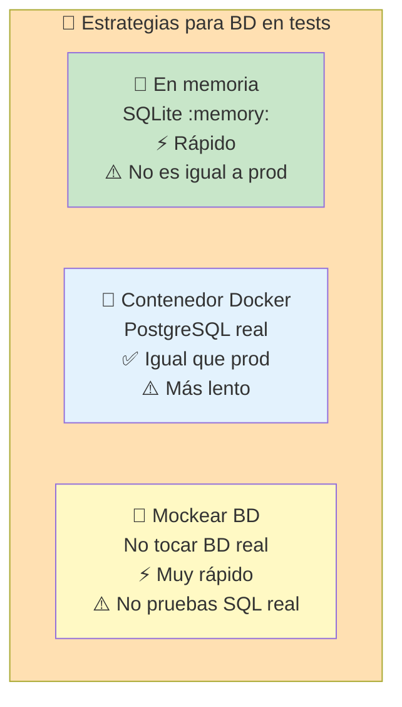

---

## Functional Testing

El **testing funcional** (o de aceptación) verifica el comportamiento desde la **perspectiva del usuario**: dado un input, espero un output específico. No le importa la implementación interna.

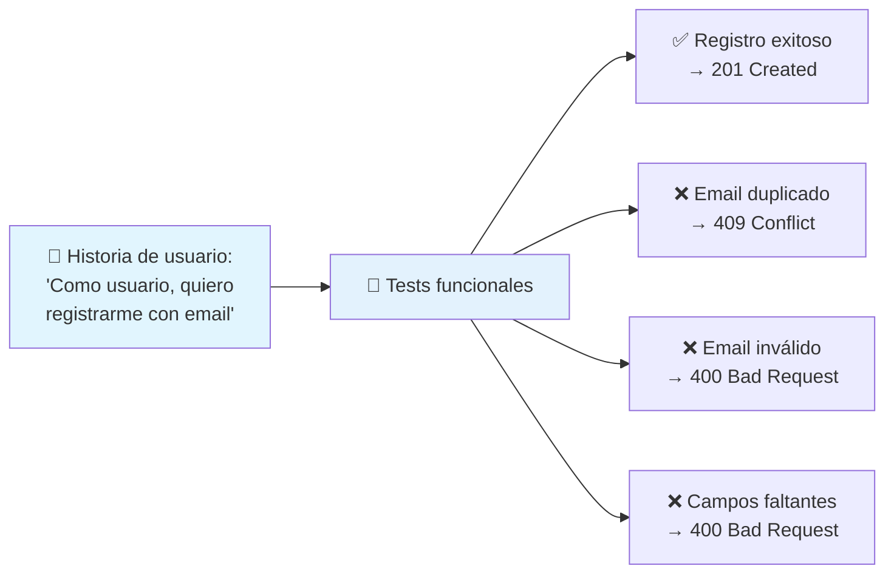

### Ejemplo

```javascript
describe('Registro de usuarios', () => {
    it('registra un usuario con datos válidos', async () => {
        const res = await request(app)
            .post('/api/auth/register')
            .send({
                nombre: 'Ana',
                email: 'ana@email.com',
                password: 'Pass123!'
            });

        expect(res.status).toBe(201);
        expect(res.body).toHaveProperty('token');
    });

    it('rechaza email duplicado', async () => {
        // Primero registrar
        await request(app).post('/api/auth/register')
            .send({ nombre: 'Ana', email: 'ana@email.com', password: 'Pass123!' });

        // Segundo registro con mismo email
        const res = await request(app).post('/api/auth/register')
            .send({ nombre: 'Bob', email: 'ana@email.com', password: 'Pass456!' });

        expect(res.status).toBe(409);
        expect(res.body.error).toContain('ya existe');
    });
});
```

---

## E2E Testing (End-to-End)

Los tests E2E prueban el **flujo completo** del sistema desde la interfaz de usuario hasta la base de datos, simulando un usuario real.

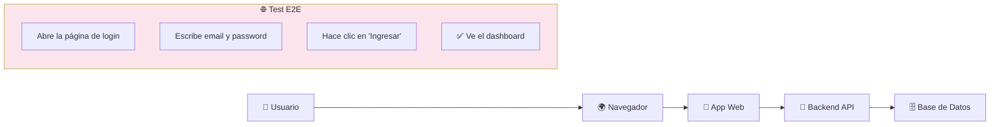

### Herramientas E2E

| Herramienta | Lenguaje      | Ideal para                     |
| ----------- | ------------- | ------------------------------ |
| **Playwright** | JS/TS/Python | Tests modernos, multi-browser |
| **Cypress**    | JS/TS       | Frontend, debug visual        |
| **Selenium**   | Múltiples    | Legacy, compatibilidad máxima |

```javascript
// Test E2E con Playwright
test('usuario puede iniciar sesión', async ({ page }) => {
    await page.goto('/login');
    await page.fill('[name="email"]', 'ana@email.com');
    await page.fill('[name="password"]', 'Pass123!');
    await page.click('button[type="submit"]');

    await expect(page.locator('.dashboard')).toBeVisible();
    await expect(page.locator('.user-name')).toHaveText('Ana');
});
```

---

## Estrategia de testing

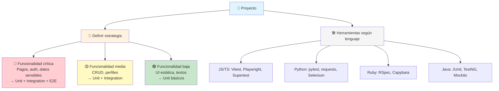

---

## Buenas prácticas

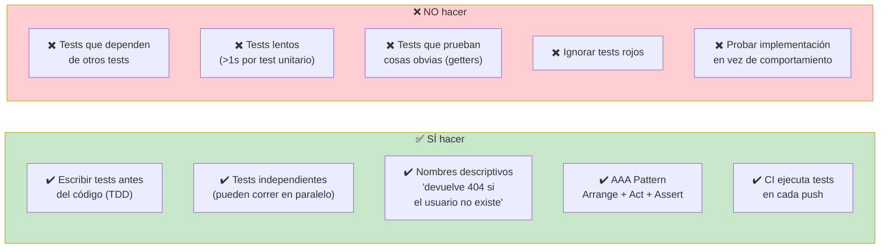

### El patrón AAA

```javascript
describe('obtenerUsuario', () => {
    it('devuelve el usuario si existe', async () => {
        // ARRANGE: preparar datos
        const usuario = await crearUsuario({ nombre: 'Ana' });

        // ACT: ejecutar la acción
        const resultado = await obtenerUsuario(usuario.id);

        // ASSERT: verificar resultado
        expect(resultado.nombre).toBe('Ana');
    });
});
```

---

## Cobertura de código

La **cobertura** mide qué porcentaje del código es ejecutado por los tests. Útil para encontrar código no probado, pero **no es una meta en sí misma**.

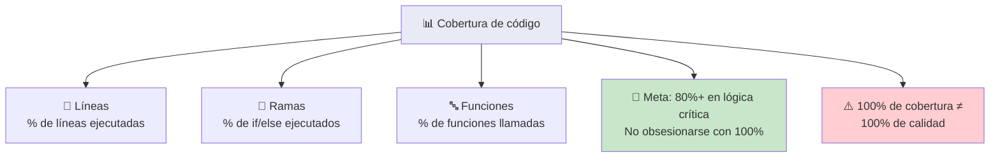

---

## Resumen visual

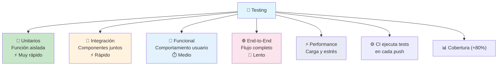

---

> **Siguiente paso:** Agrega tests unitarios a una función existente de tu proyecto. Luego un test de integración para un endpoint. Haz que el CI los ejecute automáticamente. La práctica constante es la clave.

## Relacionados:
- [[mas-acerca-de-bases-de-datos]] #anterior 
- [[containerización]]