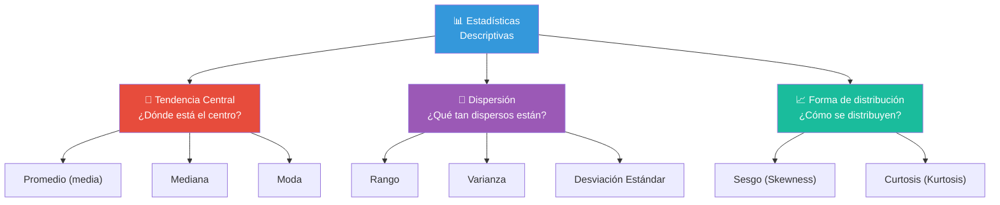
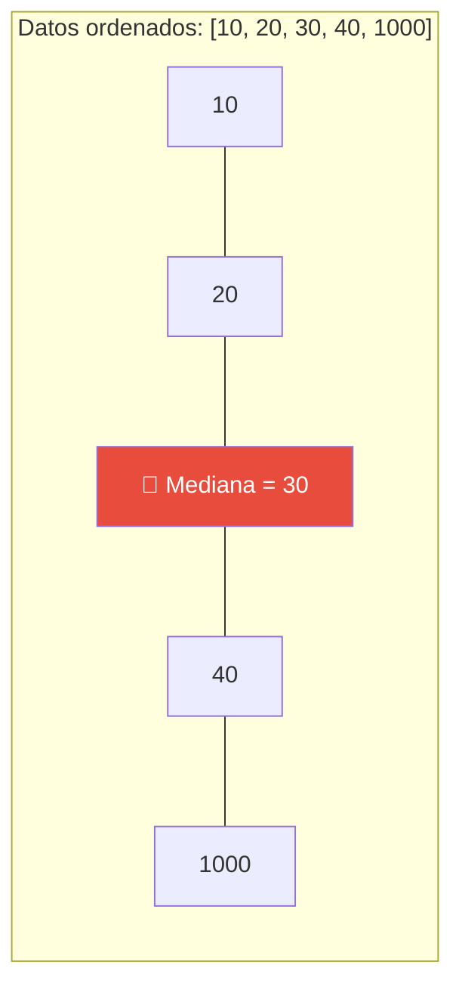
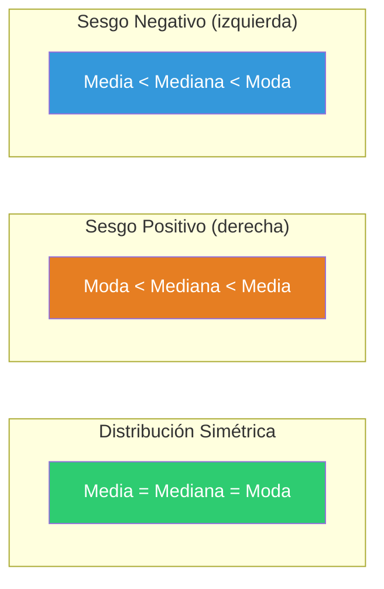
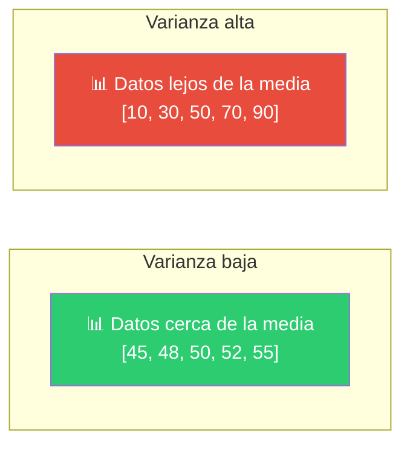
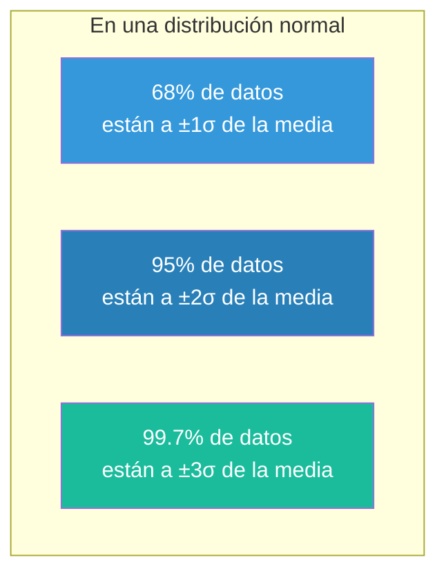
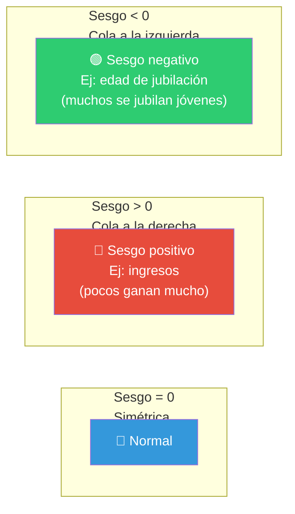
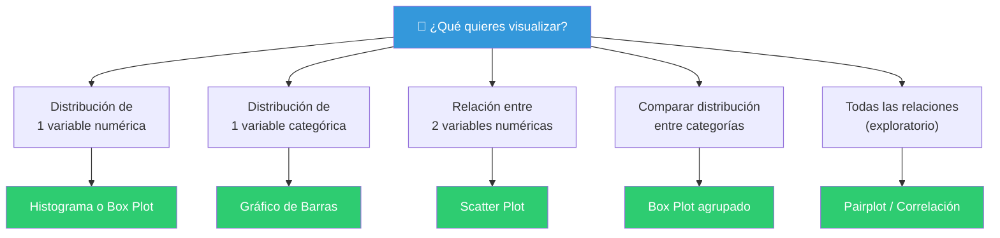
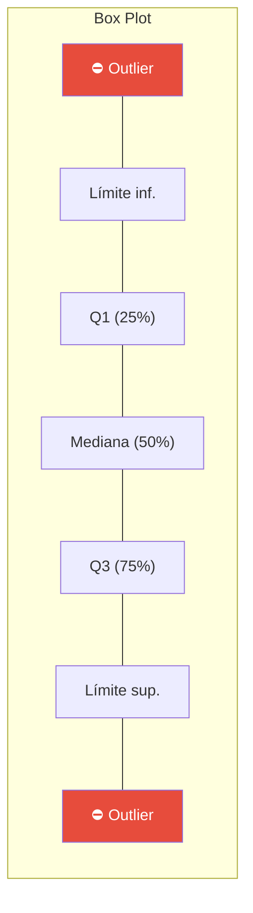
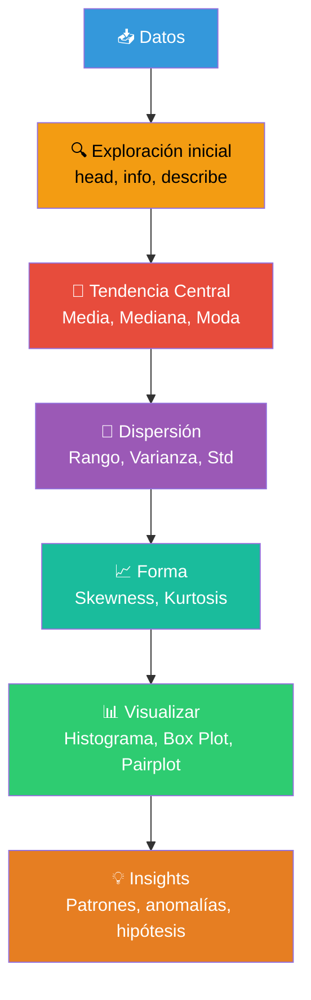

# Análisis descriptivo

El análisis descriptivo responde a la pregunta **"¿Qué pasó?"**. Consiste en **resumir y describir** las características principales de un conjunto de datos usando medidas estadísticas y visualizaciones. Es el punto de partida de cualquier análisis.


---

## Generando estadísticas

Las estadísticas descriptivas se dividen en **3 categorías** principales:



---

### Tendencia central

La **tendencia central** busca el valor "típico" o "central" de un conjunto de datos.

| Medida | Definición | ¿Cuándo usarla? |
|--------|-----------|-----------------|
| **Media (promedio)** | Suma de valores ÷ cantidad de valores | Datos simétricos, sin outliers |
| **Mediana** | Valor central cuando los datos están ordenados | Datos con outliers o asimétricos |
| **Moda** | Valor que más se repite | Datos categóricos o discretos |

#### Media (Promedio)

```
Media = (x₁ + x₂ + ... + xₙ) / n
```

```python
import pandas as pd

df["columna"].mean()
```

| Datos | Media |
|-------|-------|
| [10, 20, 30, 40, 50] | 30 |
| [10, 20, 30, 40, 1000] | 220 ← **outlier distorsiona** |

> ⚠️ La media es **sensible a outliers**. Un valor extremo la arrastra.

#### Mediana

La mediana es el valor que divide los datos en dos mitades iguales. No se ve afectada por outliers.

```python
df["columna"].median()
```

| Datos | Mediana |
|-------|---------|
| [10, 20, 30, 40, 50] | 30 |
| [10, 20, 30, 40, 1000] | **30** ← el outlier no la afecta |



#### Moda

La moda es el valor que aparece con mayor frecuencia. Única medida de tendencia central para datos categóricos.

```python
df["columna"].mode()[0]
```

| Datos | Moda |
|-------|------|
| ["rojo", "azul", "rojo", "verde", "rojo"] | "rojo" |
| [1, 1, 2, 2, 3] | 1 y 2 (bimodal) |

#### Media vs Mediana vs Moda — Visualmente



---

### Dispersión

La **dispersión** mide qué tan **alejados** están los datos entre sí o del centro.

#### Rango

Es la medida más simple: **valor máximo − valor mínimo**.

```
Rango = max(datos) - min(datos)
```

```python
df["columna"].max() - df["columna"].min()
```

| Conjunto | Datos | Rango |
|----------|-------|-------|
| A | [10, 20, 30, 40, 50] | 40 |
| B | [10, 10, 10, 50, 50] | 40 (mismo rango, pero distribución distinta) |

> ⚠️ El rango solo usa **2 valores** (mínimo y máximo), ignora todo lo demás.

#### Varianza

Mide qué tan **dispersos** están los datos respecto a la media. Una varianza alta = datos muy dispersos; varianza baja = datos concentrados alrededor de la media.

```
Varianza = Σ(xᵢ - media)² / n
```

```python
df["columna"].var()
```



#### Desviación Estándar

Es la **raíz cuadrada de la varianza**. Se interpreta en las mismas unidades que los datos originales, lo que la hace más fácil de entender.

```
Desv. Estándar = √Varianza
```

```python
df["columna"].std()
```

| Conjunto | Datos | Media | Desviación Estándar |
|----------|-------|-------|---------------------|
| A | [45, 48, 50, 52, 55] | 50 | ≈ **3.7** |
| B | [10, 30, 50, 70, 90] | 50 | ≈ **28.3** |

**Regla empírica (distribución normal):**



---

### Forma de distribución

#### Skewness (Sesgo / Asimetría)

Mide qué tan **asimétrica** es la distribución de los datos.

```python
df["columna"].skew()
```



#### Kurtosis (Curtosis)

Mide qué tan **"afilada"** o **"aplanada"** es la distribución respecto a una normal.

```python
df["columna"].kurtosis()
```

| Valor | Significado | Forma |
|-------|-------------|-------|
| **Kurtosis = 0** | Normal (mesocúrtica) | 📊 Normal |
| **Kurtosis > 0** | Más puntiaguda (leptocúrtica) | 📈 Pico alto, colas gruesas |
| **Kurtosis < 0** | Más aplanada (platicúrtica) | 📉 Pico bajo, colas delgadas |

---

### Tabla resumen: todas las medidas

| Categoría | Medida | ¿Qué mide? | Python | R |
|-----------|--------|-----------|--------|----|
| **Central** | Media | Promedio aritmético | `df['x'].mean()` | `mean(df$x)` |
| **Central** | Mediana | Valor central | `df['x'].median()` | `median(df$x)` |
| **Central** | Moda | Valor más frecuente | `df['x'].mode()[0]` | `names(sort(-table(df$x)))[1]` |
| **Dispersión** | Rango | Máx − mín | `df['x'].max() - df['x'].min()` | `max(df$x) - min(df$x)` |
| **Dispersión** | Varianza | Dispersión cuadrada | `df['x'].var()` | `var(df$x)` |
| **Dispersión** | Desv. Estándar | Dispersión en unidades originales | `df['x'].std()` | `sd(df$x)` |
| **Forma** | Skewness | Asimetría | `df['x'].skew()` | `library(e1071); skewness(df$x)` |
| **Forma** | Kurtosis | Punta / aplanamiento | `df['x'].kurtosis()` | `library(e1071); kurtosis(df$x)` |

### Código completo: estadísticas descriptivas

```python
import pandas as pd

df = pd.read_csv("datos.csv")

# Todas las estadísticas descriptivas de un tirón
df.describe()  # Media, std, min, quartiles, max

# Por columna
print(f"Media:      {df['edad'].mean():.2f}")
print(f"Mediana:    {df['edad'].median():.2f}")
print(f"Moda:       {df['edad'].mode()[0]}")
print(f"Rango:      {df['edad'].max() - df['edad'].min()}")
print(f"Varianza:   {df['edad'].var():.2f}")
print(f"Desv. Std:  {df['edad'].std():.2f}")
print(f"Sesgo:      {df['edad'].skew():.2f}")
print(f"Curtosis:   {df['edad'].kurtosis():.2f}")
```

---

## Visualizando distribuciones

Los números son útiles, pero **una imagen vale más que mil estadísticas**. Las visualizaciones te permiten ver patrones que los números no muestran.



### Histograma

Muestra la **frecuencia** de valores en intervalos (bins). Ideal para entender la forma de la distribución.

```python
import matplotlib.pyplot as plt
import seaborn as sns

# Histograma básico
df["edad"].hist(bins=30, edgecolor="black")
plt.title("Distribución de Edad")
plt.xlabel("Edad")
plt.ylabel("Frecuencia")
plt.show()

# Histograma con seaborn (más bonito)
sns.histplot(data=df, x="edad", bins=30, kde=True)  # kde=True añade curva
plt.title("Distribución de Edad con KDE")
plt.show()
```

```r
library(ggplot2)

# Histograma
ggplot(df, aes(x = edad)) +
  geom_histogram(bins = 30, fill = "steelblue", color = "black") +
  labs(title = "Distribución de Edad")

# Histograma + curva de densidad
ggplot(df, aes(x = edad)) +
  geom_histogram(aes(y = after_stat(density)), bins = 30, fill = "steelblue") +
  geom_density(color = "red", linewidth = 1) +
  labs(title = "Distribución de Edad con KDE")
```

### Box Plot (Diagrama de Caja y Bigotes)

Resume **5 estadísticas** de un vistazo: mínimo, Q1, mediana, Q3, máximo (y muestra outliers).



```python
# Box plot simple
sns.boxplot(data=df, x="columna")
plt.title("Box Plot")
plt.show()

# Box plot por categoría (comparar grupos)
sns.boxplot(data=df, x="categoria", y="valor")
plt.title("Distribución por Categoría")
plt.show()
```

```r
# Box plot simple
ggplot(df, aes(y = columna)) +
  geom_boxplot(fill = "steelblue") +
  labs(title = "Box Plot")

# Box plot por categoría
ggplot(df, aes(x = categoria, y = valor)) +
  geom_boxplot(fill = "steelblue") +
  labs(title = "Distribución por Categoría")
```

### Densidad (KDE)

Una versión **suavizada** del histograma. Muestra la forma de la distribución sin depender del número de bins.

```python
sns.kdeplot(data=df, x="edad", fill=True)
plt.title("Densidad de Edad")
plt.show()
```

### Múltiples distribuciones en un solo gráfico

```python
# Comparar distribuciones por categoría
sns.kdeplot(data=df, x="edad", hue="genero", fill=True)
plt.title("Distribución de Edad por Género")
plt.show()
```

### Matriz de correlación

Muestra cómo se **relacionan** todas las variables numéricas entre sí.

```python
import seaborn as sns

# Calcular correlaciones
corr = df.corr()

# Heatmap de correlaciones
sns.heatmap(corr, annot=True, cmap="coolwarm", center=0)
plt.title("Matriz de Correlación")
plt.show()
```

### Pairplot (todas las relaciones)

El gráfico exploratorio definitivo: muestra **todas las combinaciones** de variables.

```python
# Pairplot (solo numéricas)
sns.pairplot(df, hue="categoria")
plt.show()
```

---

## Flujo completo: análisis descriptivo



> 📁 **Ver también**: [[introduccion-analisis-de-datos]], [[limpieza-de-datos]], [[ganar-habilidades-de-programacion]]

## Relacionados:
- [[limpieza-de-datos]] #anterior 
- [[visualizacion-de-datos]] #siguiente 