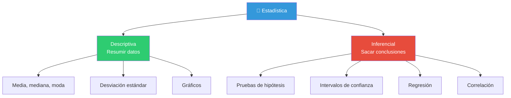
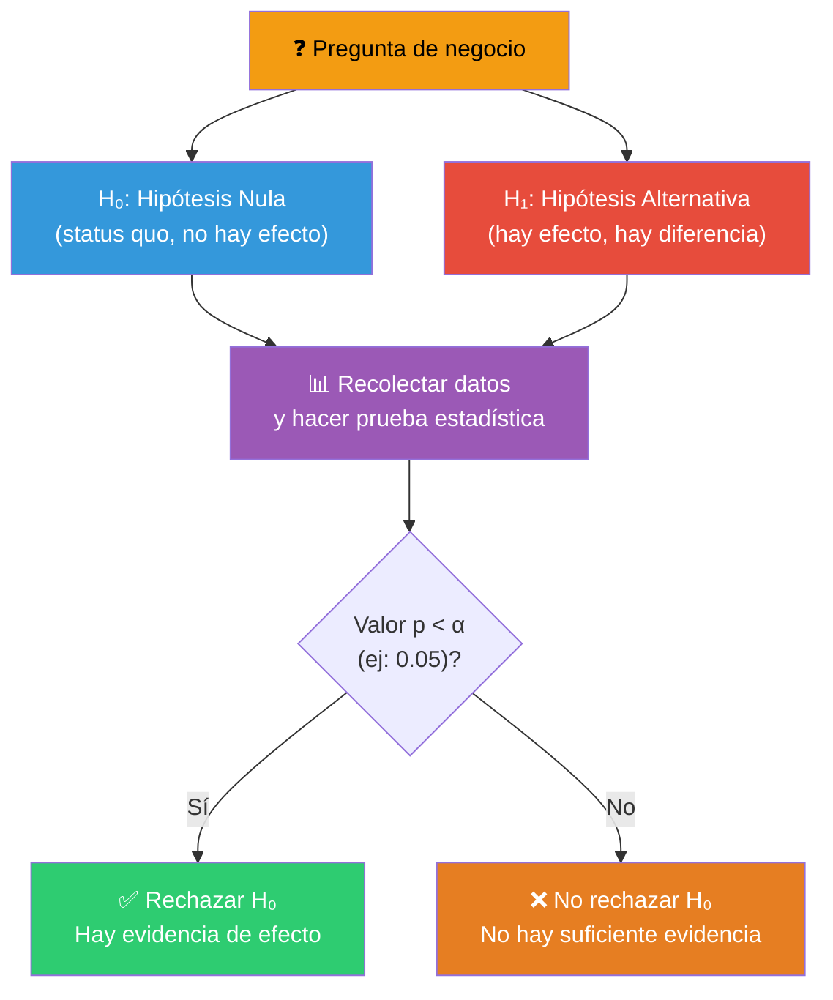
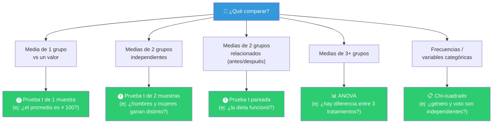
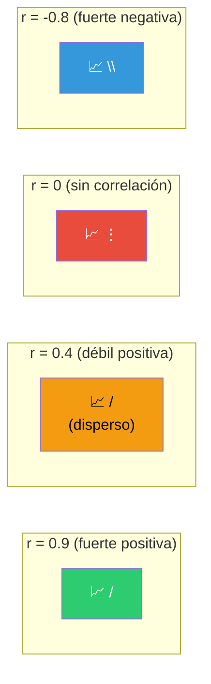
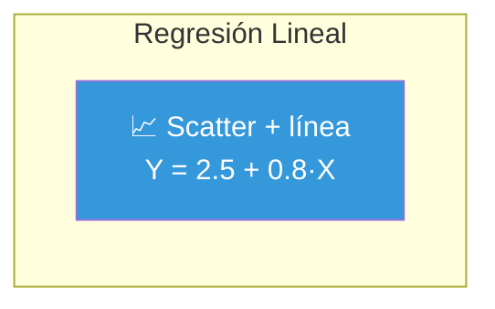
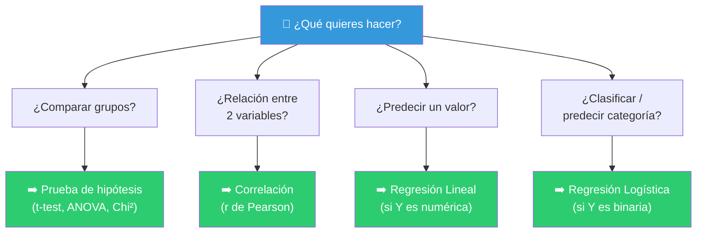

# Análisis estadístico

El análisis estadístico nos permite **sacar conclusiones** de los datos más allá de lo que vemos a simple vista. Mientras el análisis descriptivo describe *lo que pasó*, el análisis estadístico nos ayuda a determinar *si lo que vemos es real o solo casualidad*.


---

## Estadística descriptiva vs inferencial



---

## Probando hipótesis

### ¿Qué es una prueba de hipótesis?

Es un procedimiento estadístico para **decidir si una afirmación sobre los datos es apoyada por la evidencia**. Funciona así:



### Conceptos clave

| Concepto | Definición | Analogía |
|----------|-----------|----------|
| **H₀ (Hipótesis Nula)** | No hay efecto, no hay diferencia | "Inocente hasta que se demuestre lo contrario" |
| **H₁ (Hipótesis Alternativa)** | Hay efecto, hay diferencia | "Culpable" |
| **Valor p (p-value)** | Probabilidad de observar estos datos si H₀ es cierta | ¿Qué tan raro sería esto si el acusado fuera inocente? |
| **α (alfa)** | Nivel de significancia (típicamente 0.05) | El umbral de "más allá de toda duda razonable" |
| **Error Tipo I** | Rechazar H₀ cuando es verdadera | Falso positivo |
| **Error Tipo II** | No rechazar H₀ cuando es falsa | Falso negativo |

> 💡 **Interpretación del valor p**: Un p < 0.05 significa: "Si realmente no hubiera efecto, solo veríamos estos datos el 5% de las veces". Es poco probable, así que probablemente *sí* hay efecto.

### Pruebas comunes



### Ejemplo: prueba t en Python

```python
from scipy import stats

# Prueba t de 1 muestra: ¿la media es diferente de 100?
datos = [98, 102, 95, 105, 99, 101, 97, 103, 96, 104]
t_stat, p_valor = stats.ttest_1samp(datos, popmean=100)

print(f"Estadístico t: {t_stat:.3f}")
print(f"Valor p: {p_valor:.3f}")

if p_valor < 0.05:
    print("✅ Rechazamos H₀: la media es significativamente diferente de 100")
else:
    print("❌ No rechazamos H₀: no hay evidencia de que la media sea ≠ 100")
```

### Ejemplo: prueba t en R

```r
# Prueba t de 1 muestra
datos <- c(98, 102, 95, 105, 99, 101, 97, 103, 96, 104)
resultado <- t.test(datos, mu = 100)

print(resultado)

if (resultado$p.value < 0.05) {
  print("✅ Rechazamos H₀")
} else {
  print("❌ No rechazamos H₀")
}
```

---

## Análisis de correlación

La **correlación** mide la **relación lineal** entre dos variables numéricas. No implica causalidad.

> ⚠️ **Regla de oro**: Correlación **NO** es causalidad. El hecho de que dos variables se muevan juntas no significa que una cause la otra. Ejemplo: las ventas de helados y los ataques de tiburones están correlacionados (ambos suben en verano), pero uno no causa el otro.

### Coeficiente de correlación (r de Pearson)

| Valor | Interpretación |
|-------|---------------|
| **r = 1** | Correlación positiva perfecta |
| **0.7 < r < 1** | Correlación positiva fuerte |
| **0.3 < r < 0.7** | Correlación positiva moderada |
| **0 < r < 0.3** | Correlación positiva débil |
| **r = 0** | Sin correlación lineal |
| **-0.3 < r < 0** | Correlación negativa débil |
| **-0.7 < r < -0.3** | Correlación negativa moderada |
| **r = -1** | Correlación negativa perfecta |



### Cálculo en Python

```python
import pandas as pd
import seaborn as sns
import matplotlib.pyplot as plt

# Correlación entre dos variables
corr = df["ingreso"].corr(df["gasto"])
print(f"Correlación: {corr:.3f}")

# Matriz de correlación completa
corr_matrix = df.corr()
print(corr_matrix)

# Visualizar con heatmap
sns.heatmap(corr_matrix, annot=True, cmap="coolwarm", center=0)
plt.title("Matriz de Correlación")
plt.show()
```

### Cálculo en R

```r
# Correlación entre dos variables
cor(df$ingreso, df$gasto)

# Matriz de correlación
cor(df %>% select(where(is.numeric)))

# Visualizar
library(ggplot2)
library(reshape2)

corr <- cor(df %>% select(where(is.numeric)))
melted_corr <- melt(corr)

ggplot(melted_corr, aes(x = Var1, y = Var2, fill = value)) +
  geom_tile() +
  scale_fill_gradient2(low = "red", mid = "white", high = "blue") +
  geom_text(aes(label = round(value, 2))) +
  theme_minimal()
```

> ⚠️ **Correlación != Causalidad**: Dos cosas correlacionan por casualidad, por una tercera variable oculta, o porque una causa a la otra. Siempre investiga antes de concluir causalidad.

---

## Regresión

La **regresión** modela la relación entre una variable dependiente (Y) y una o más variables independientes (X). Sirve para **entender relaciones** y **hacer predicciones**.

### Regresión Lineal Simple

Modela la relación entre **una X** (predictora) y **una Y** (respuesta) como una línea recta:

```
Y = β₀ + β₁·X + ε
```

- **β₀** (intercepto): valor de Y cuando X = 0
- **β₁** (pendiente): cambio en Y por cada unidad de cambio en X
- **ε** (error): lo que el modelo no explica



### Regresión en Python

```python
from sklearn.linear_model import LinearRegression
from sklearn.model_selection import train_test_split
from sklearn.metrics import r2_score, mean_squared_error
import pandas as pd

# Preparar datos
X = df[["ingreso"]]  # Predictora (debe ser 2D)
y = df["gasto"]      # Respuesta

# Dividir en entrenamiento y prueba
X_train, X_test, y_train, y_test = train_test_split(
    X, y, test_size=0.2, random_state=42
)

# Crear y entrenar modelo
modelo = LinearRegression()
modelo.fit(X_train, y_train)

# Coeficientes
print(f"Intercepto (β₀): {modelo.intercept_:.3f}")
print(f"Pendiente (β₁): {modelo.coef_[0]:.3f}")

# Predecir
y_pred = modelo.predict(X_test)

# Evaluar
print(f"R²: {r2_score(y_test, y_pred):.3f}")
print(f"RMSE: {mean_squared_error(y_test, y_pred, squared=False):.3f}")
```

### Regresión en R

```r
# Modelo de regresión
modelo <- lm(gasto ~ ingreso, data = df)

# Resumen completo
summary(modelo)

# Coeficientes
coef(modelo)

# Predecir
df$prediccion <- predict(modelo, newdata = df)

# Visualizar
ggplot(df, aes(x = ingreso, y = gasto)) +
  geom_point() +
  geom_smooth(method = "lm", se = TRUE) +
  labs(title = "Regresión: Gasto vs Ingreso")
```

### Interpretación del resumen

```text
Call:
lm(formula = gasto ~ ingreso, data = df)

Coefficients:
            Estimate  Std. Error  t value  Pr(>|t|)    
(Intercept)   2.5000     1.2000    2.083    0.045 *  
ingreso       0.8000     0.0500   16.000   <2e-16 ***
---
Signif. codes:  0 '***' 0.001 '**' 0.01 '*' 0.05 '.' 0.1 ' ' 1

Residual standard error: 5.2 on 48 degrees of freedom
Multiple R-squared:  0.842,	Adjusted R-squared:  0.839
F-statistic: 256 on 1 and 48 DF,  p-value: < 2.2e-16
```

**¿Qué mirar primero?**
1. **R² (0.842)** — El modelo explica el 84.2% de la variabilidad. Excelente.
2. **p-value del modelo** (< 2.2e-16) — El modelo es significativo.
3. **Pendiente p-value** (< 2e-16) — La variable ingreso es significativa.
4. **Residual standard error (5.2)** — Error típico de predicción.

### Regresión Lineal Múltiple

Varias variables predictoras:

```python
# Múltiples variables
X = df[["ingreso", "edad", "hijos"]]  # 3 predictoras
y = df["gasto"]

modelo = LinearRegression()
modelo.fit(X, y)

print(f"R²: {modelo.score(X, y):.3f}")
print(f"Coeficientes: {modelo.coef_}")
```

```r
# Regresión múltiple
modelo <- lm(gasto ~ ingreso + edad + hijos, data = df)
summary(modelo)
```

### Regresión Logística (para clasificación binaria)

Cuando la variable respuesta es **categórica binaria** (sí/no, compra/no compra):

```python
from sklearn.linear_model import LogisticRegression

X = df[["ingreso"]]
y = df["compro"]  # 0 o 1

modelo = LogisticRegression()
modelo.fit(X, y)

# Probabilidad de compra
prob = modelo.predict_proba(X)[:, 1]
```

---

## Resumen visual



> 📁 **Ver también**: [[analisis-descriptivo]], [[ganar-habilidades-de-programacion]], [[introduccion-analisis-de-datos]]

## Relacionados:
- [[visualizacion-de-datos]] #anterior 
- [[machine-learning]] #siguiente 