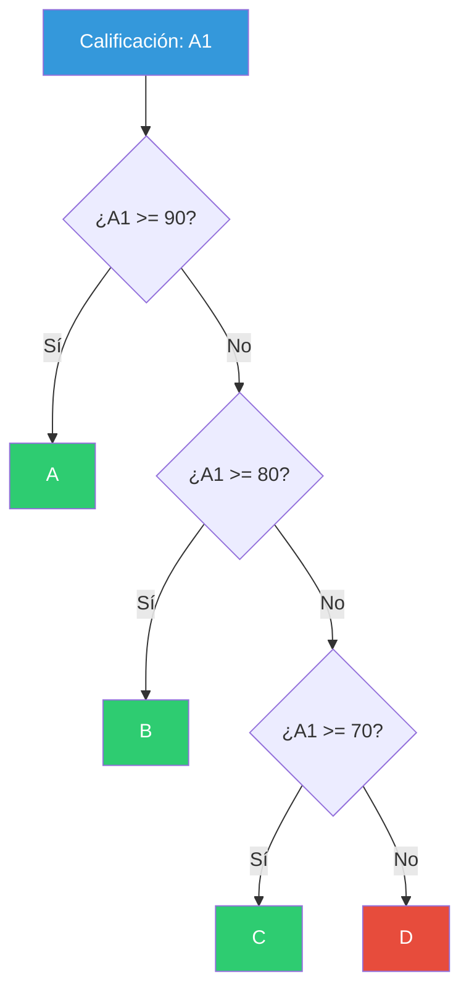
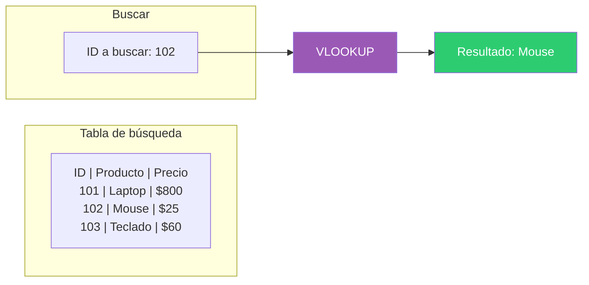
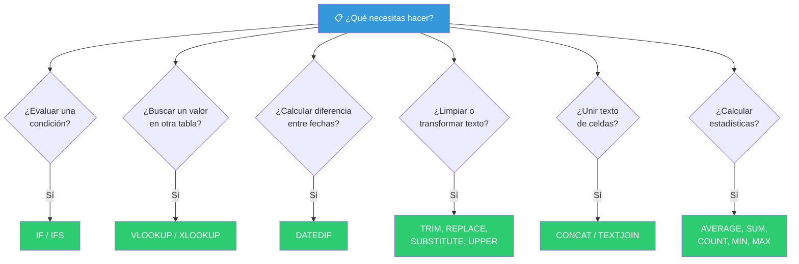
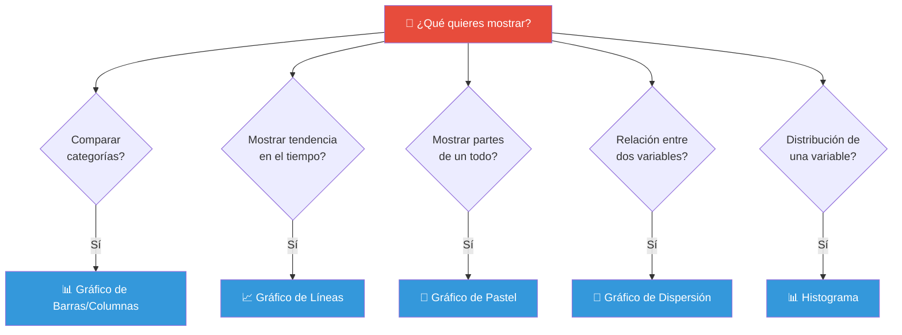
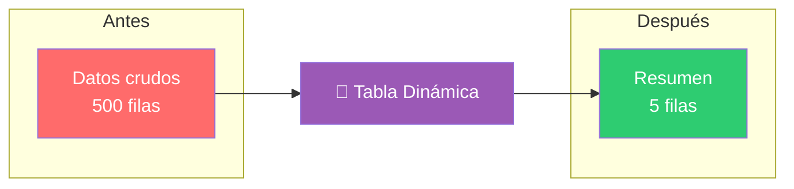
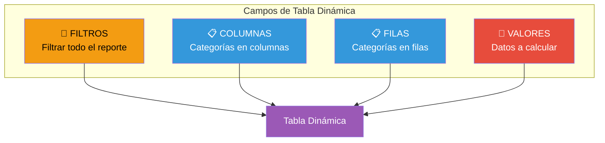
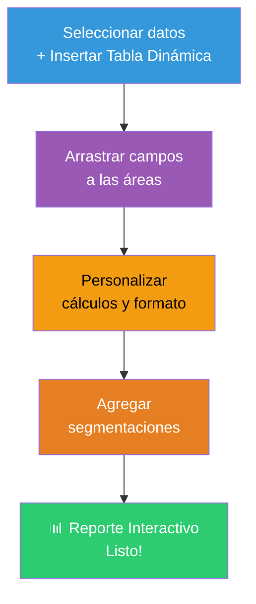

# Análisis / Reportando con Excel

Excel es una de las herramientas más poderosas y accesibles para el análisis de datos. Combina **cálculos, visualización y organización** en una sola interfaz. Este documento cubre las funciones y técnicas esenciales para reportar con Excel.


---

## Aprendiendo funciones comunes

Todas las funciones en Excel siguen la misma estructura básica:

```
=NOMBRE_FUNCION(argumento1, argumento2, ...)
```

El signo `=` le indica a Excel que vas a usar una función.

---

### IF (SI)

Evalúa una condición y devuelve un valor si es **VERDADERA** y otro si es **FALSA**.

**Sintaxis:**
```
=IF(condición, valor_si_verdadero, valor_si_falso)
```

**Ejemplo:**
| Producto | Ventas | ¿Cumple meta? (fórmula) |
|----------|--------|------------------------|
| A | 120 | `=IF(B2>=100, "Cumple", "No cumple")` → **Cumple** |
| B | 80 | `=IF(B3>=100, "Cumple", "No cumple")` → **No cumple** |

**IF anidados** (múltiples condiciones):
```excel
=IF(A1>=90, "A", IF(A1>=80, "B", IF(A1>=70, "C", "D")))
```



> **Alternativa moderna**: `IFS()` para múltiples condiciones sin anidar:
> ```excel
> =IFS(A1>=90,"A", A1>=80,"B", A1>=70,"C", A1<70,"D")
> ```

---

### DATEDIF (SIFECHA)

Calcula la **diferencia entre dos fechas** en días, meses o años.

**Sintaxis:**
```
=DATEDIF(fecha_inicio, fecha_fin, unidad)
```

**Unidades disponibles:**
| Unidad | Significado | Ejemplo |
|--------|-------------|---------|
| `"Y"` | Años completos | Edad de una persona |
| `"M"` | Meses completos | Antigüedad en meses |
| `"D"` | Días | Días entre dos fechas |
| `"YM"` | Meses ignorando el año | "Han pasado 3 meses" (sin importar el año) |
| `"YD"` | Días ignorando el año | Días hasta el próximo cumpleaños |
| `"MD"` | Días ignorando mes y año | Días restantes del mes |

**Ejemplo:**
```excel
=DATEDIF(A1, B1, "Y")   → 5   (años completos)
=DATEDIF(A1, B1, "M")   → 62  (meses completos)
=DATEDIF(A1, B1, "D")   → 1892 (días totales)
```

| Fecha inicio | Fecha fin | Edad (años) | Antigüedad |
|-------------|----------|-------------|------------|
| 15/03/2020 | 01/06/2025 | `=DATEDIF(A2,B2,"Y")` → **5** | `=DATEDIF(A2,B2,"YM")` → **2 meses** |

---

### VLOOKUP / HLOOKUP (BUSCARV / BUSCARH)

Busca un valor en una tabla y devuelve un dato relacionado.

#### VLOOKUP (búsqueda vertical)

> ⚠️ **Importante**: El valor buscado **siempre debe estar en la primera columna** de la tabla.

**Sintaxis:**
```
=VLOOKUP(valor_buscado, tabla_rango, columna_devolver, [ordenado])
```

- `valor_buscado` — lo que quieres encontrar (ej: ID del producto)
- `tabla_rango` — el rango de la tabla donde buscar
- `columna_devolver` — número de columna (1 = primera columna del rango)
- `ordenado` — `FALSE` para coincidencia exacta (recomendado), `TRUE` para aproximada

**Ejemplo:**
```excel
=VLOOKUP(E2, A2:C6, 2, FALSE)
```



| ID Producto | Producto | Precio |
|-------------|----------|--------|
| 101 | Laptop | $800 |
| 102 | Mouse | $25 |
| 103 | Teclado | $60 |

```excel
=VLOOKUP(102, A2:C4, 2, FALSE)  → "Mouse"
=VLOOKUP(102, A2:C4, 3, FALSE)  → $25
```

> **Alternativa moderna**: `XLOOKUP()` (disponible en Excel 365/2021):
> ```excel
> =XLOOKUP(valor_buscado, columna_buscar, columna_devolver)
> ```
> Ventaja: no requiere que el valor esté en la primera columna.

#### HLOOKUP (búsqueda horizontal)

Igual que VLOOKUP pero busca en **filas** en lugar de columnas:

```
=HLOOKUP(valor_buscado, tabla_rango, fila_devolver, FALSE)
```

---

### REPLACE / SUBSTITUTE (REEMPLAZAR / SUSTITUIR)

Ambas reemplazan texto, pero de formas diferentes.

| Función | ¿Qué hace? | Ejemplo |
|---------|-----------|---------|
| **REPLACE** | Reemplaza **por posición** | `=REPLACE("Hola Mundo", 1, 4, "Adiós")` → "Adiós Mundo" |
| **SUBSTITUTE** | Reemplaza **por texto específico** | `=SUBSTITUTE("a-b-c", "-", "/")` → "a/b/c" |

**REPLACE — Sintaxis:**
```
=REPLACE(texto_original, inicio, num_caracteres, nuevo_texto)
```

**SUBSTITUTE — Sintaxis:**
```
=SUBSTITUTE(texto_original, texto_viejo, texto_nuevo, [num_ocurrencia])
```

**Ejemplos prácticos:**

| Dato original | Fórmula | Resultado |
|--------------|---------|-----------|
| "2024-12-25" | `=REPLACE(A2, 5, 2, "01")` | "2024-01-25" |
| "gato-perro-gato" | `=SUBSTITUTE(A3, "gato", "pez")` | "pez-perro-pez" |
| "gato-perro-gato" | `=SUBSTITUTE(A4, "gato", "pez", 1)` | "pez-perro-gato" |

---

### UPPER / LOWER / PROPER (MAYUSC / MINUSC / NOMPROPIO)

Transforman el **formato de texto** (mayúsculas/minúsculas).

| Función | ¿Qué hace? | Ejemplo | Resultado |
|---------|-----------|---------|-----------|
| `UPPER()` | Convierte a **MAYÚSCULAS** | `=UPPER("hola")` | "HOLA" |
| `LOWER()` | Convierte a **minúsculas** | `=LOWER("HOLA")` | "hola" |
| `PROPER()` | **Primera letra** de cada palabra en mayúscula | `=PROPER("hola mundo")` | "Hola Mundo" |

> **Útil para**: estandarizar datos como nombres, ciudades, direcciones.

---

### CONCAT (CONCATENAR)

Une dos o más cadenas de texto en una sola.

```
=CONCAT(texto1, texto2, ...)
```

**Ejemplos:**
```excel
=CONCAT("Hola", " ", "Mundo")           → "Hola Mundo"
=CONCAT(A1, " - ", B1)                  → "Juan - Pérez"
=CONCAT("ID-", A1)                      → "ID-123"
```

> **Nota**: `CONCAT()` reemplaza a la antigua `CONCATENATE()`. También existe `TEXTJOIN()` que permite un delimitador:
> ```excel
> =TEXTJOIN(", ", TRUE, A1:A5)   → "Juan, Ana, Luis, María, Pedro"
> ```

---

### TRIM (ESPACIOS)

Elimina **espacios adicionales** del texto, dejando solo un espacio entre palabras.

```
=TRIM(texto)
```

| Texto original | Fórmula | Resultado |
|---------------|---------|-----------|
| "  Hola   Mundo  " | `=TRIM(A1)` | "Hola Mundo" |
| "Juan   Pérez" | `=TRIM(A2)` | "Juan Pérez" |

> 🧹 **Ideal para limpiar datos** importados de otros sistemas que suelen traer espacios extra.

---

### AVERAGE (PROMEDIO)

Calcula el **promedio aritmético** de un conjunto de números.

```
=AVERAGE(rango)
```

| Estudiante | Nota 1 | Nota 2 | Nota 3 | Promedio |
|------------|--------|--------|--------|----------|
| Ana | 85 | 90 | 92 | `=AVERAGE(B2:D2)` → **89** |
| Luis | 70 | 75 | 68 | `=AVERAGE(B3:D3)` → **71** |

**Variantes:**
```excel
=AVERAGE(A1:A10)        → Promedio simple
=AVERAGEIF(A1:A10, ">5") → Promedio solo de valores > 5
=AVERAGEIFS(A1:A10, B1:B10, "Activo") → Promedio con múltiples condiciones
```

---

### COUNT (CONTAR)

Cuenta celdas que contienen **números**.

```
=COUNT(rango)
```

**Familia de funciones COUNT:**

| Función | ¿Qué cuenta? | Ejemplo |
|---------|-------------|---------|
| `COUNT()` | Celdas con **números** | `=COUNT(A1:A10)` |
| `COUNTA()` | Celdas **no vacías** (números o texto) | `=COUNTA(A1:A10)` |
| `COUNTBLANK()` | Celdas **vacías** | `=COUNTBLANK(A1:A10)` |
| `COUNTIF()` | Celdas que cumplen **una condición** | `=COUNTIF(A1:A10, ">5")` |
| `COUNTIFS()` | Celdas que cumplen **varias condiciones** | `=COUNTIFS(A1:A10, ">5", B1:B10, "Sí")` |

---

### SUM (SUMA)

Suma todos los números en un rango.

```
=SUM(rango)
```

| Producto | Ene | Feb | Mar | Total |
|----------|-----|-----|-----|-------|
| Laptop | 10 | 12 | 15 | `=SUM(B2:D2)` → **37** |
| Mouse | 30 | 28 | 35 | `=SUM(B3:D3)` → **93** |

**Variantes:**
```excel
=SUM(A1:A10)               → Suma simple
=SUMIF(A1:A10, ">5")       → Suma solo valores > 5
=SUMIFS(A1:A10, B1:B10, "Activo") → Suma con múltiples condiciones
```

---

### MIN / MAX

Encuentran el valor **mínimo** y **máximo** en un rango.

```
=MIN(rango)
=MAX(rango)
```

| Mes | Ventas | Fórmula | Resultado |
|-----|--------|---------|-----------|
| Ene | 120 | | |
| Feb | 95 | `=MIN(B2:B5)` | **80** |
| Mar | 150 | `=MAX(B2:B5)` | **150** |
| Abr | 80 | | |

**Variante útil:**
```excel
=MINIFS(rango, criterio_rango, criterio)  → Mínimo con condición
=MAXIFS(rango, criterio_rango, criterio)  → Máximo con condición
```

---

### Resumen visual: ¿qué función usar?



---

## Charting (Gráficos)

Los gráficos transforman números en **información visual** que se entiende de un vistazo.

### Pasos para crear un gráfico

1. **Selecciona** los datos (incluyendo encabezados)
2. Ve a la pestaña **Insertar** → **Gráficos**
3. **Elige** el tipo de gráfico según tu objetivo
4. **Personaliza** colores, títulos, etiquetas

### ¿Qué gráfico usar?



### Configuración recomendada

| Elemento | Recomendación |
|----------|---------------|
| **Título** | Claro y descriptivo (ej: "Ventas por mes - 2025") |
| **Ejes** | Etiqueta los ejes X y Y con unidades |
| **Leyenda** | Inclúyela si hay múltiples series |
| **Colores** | Usa una paleta consistente, evita colores muy brillantes |
| **Etiquetas** | Solo cuando aporten valor, evita saturar |
| **Gridlines** | Mantén las líneas de cuadrícula sutiles |

### Atajos útiles

- `Alt + F1` — Insertar gráfico en la misma hoja
- `F11` — Insertar gráfico en una hoja nueva
- **Doble clic** en elementos del gráfico para abrir formato

---

## Pivot Tables (Tablas Dinámicas)

Las **tablas dinámicas** son la herramienta más poderosa de Excel para **resumir, analizar y explorar** grandes volúmenes de datos sin escribir fórmulas.



### ¿Qué puedes hacer con una tabla dinámica?

- **Resumir** miles de filas en segundos
- **Agrupar** datos por categorías, fechas, rangos
- **Filtrar** y explorar diferentes perspectivas
- **Calcular** sumas, promedios, conteos, porcentajes
- **Crear** informes interactivos

### Anatomía de una tabla dinámica



### Ejemplo práctico

**Datos originales** (500 filas de ventas):
| Fecha | Producto | Región | Vendedor | Monto |
|-------|----------|--------|----------|-------|
| 01/01 | Laptop | Norte | Ana | $800 |
| 02/01 | Mouse | Sur | Luis | $25 |
| ... | ... | ... | ... | ... |

**Tabla dinámica resultante:**
| Región | Suma de Monto | Promedio | # Ventas |
|--------|--------------|----------|----------|
| Norte | $45,000 | $320 | 140 |
| Sur | $38,000 | $290 | 131 |
| Este | $52,000 | $350 | 148 |
| **Total** | **$135,000** | **$320** | **419** |

### Pasos para crear una tabla dinámica

1. **Selecciona** todos los datos (incluyendo encabezados)
2. Ve a **Insertar** → **Tabla dinámica**
3. Elige si ponerla en una **hoja nueva** o **existente**
4. Arrastra los campos a las áreas correspondientes:
   - **Filas**: Región, Producto, Categoría
   - **Valores**: Monto, Cantidad (arrastra varias veces para sumar y contar)
   - **Columnas**: Período (mes, trimestre, año)
   - **Filtros**: Vendedor, Región (para segmentar)

### Consejos avanzados

| Técnica | Cómo hacerlo |
|---------|-------------|
| **Agrupar fechas** | Clic derecho en una fecha → Agrupar → Por meses, trimestres, años |
| **Agrupar números** | Clic derecho → Agrupar → Define inicio, fin y tamaño |
| **Campo calculado** | Analizar → Campos, elementos y conjuntos → Campo calculado |
| **Segmentación** | Analizar → Insertar segmentación (filtros visuales) |
| **Actualizar datos** | Clic derecho → Actualizar (o `Alt + F5`) |
| **Formato condicional** | Aplica formato a las celdas de valores para ver patrones |



---

## Flujo de trabajo completo: datos → reporte


## Relacionados:
- [[introduccion-analisis-de-datos]] #anterior 
- [[sql-roadmap.canvas]] #canvas
- [[ganar-habilidades-de-programacion]] #siguiente 