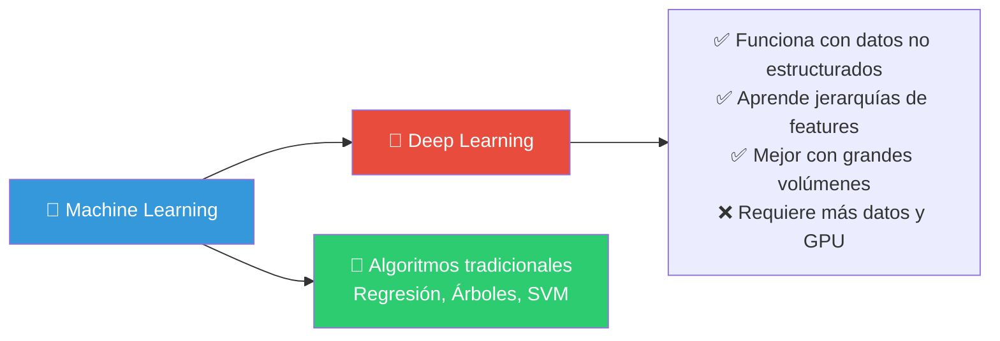
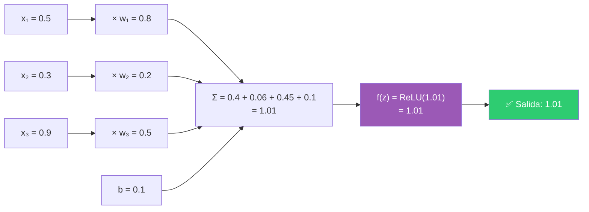
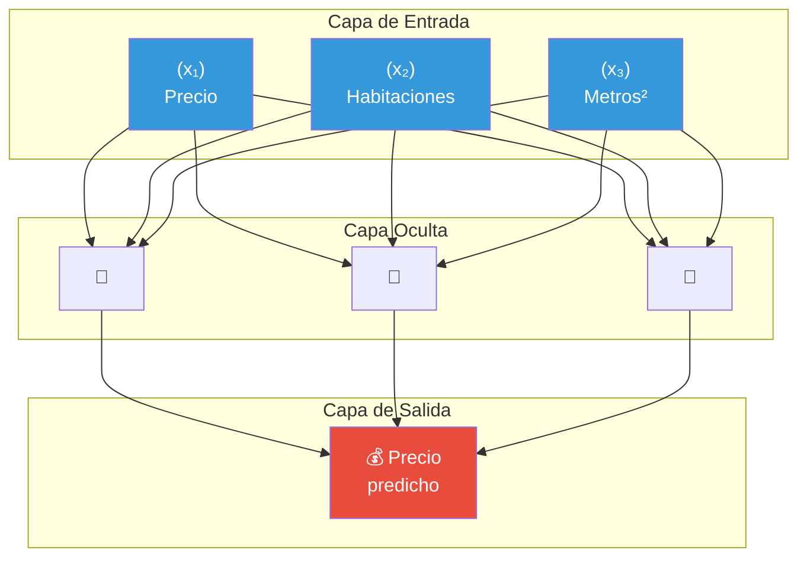
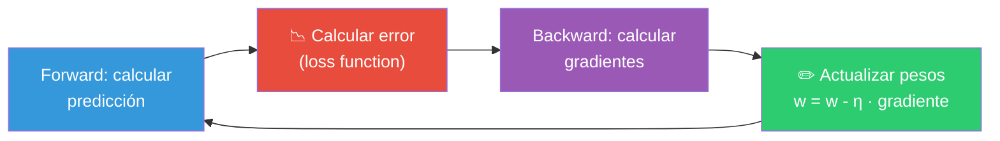
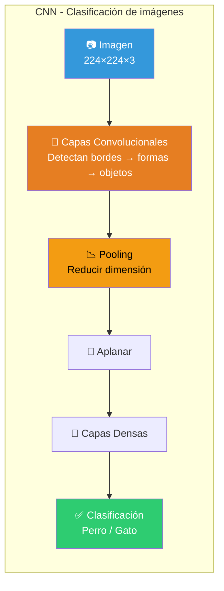
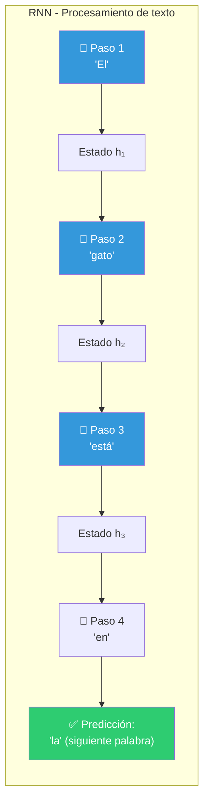
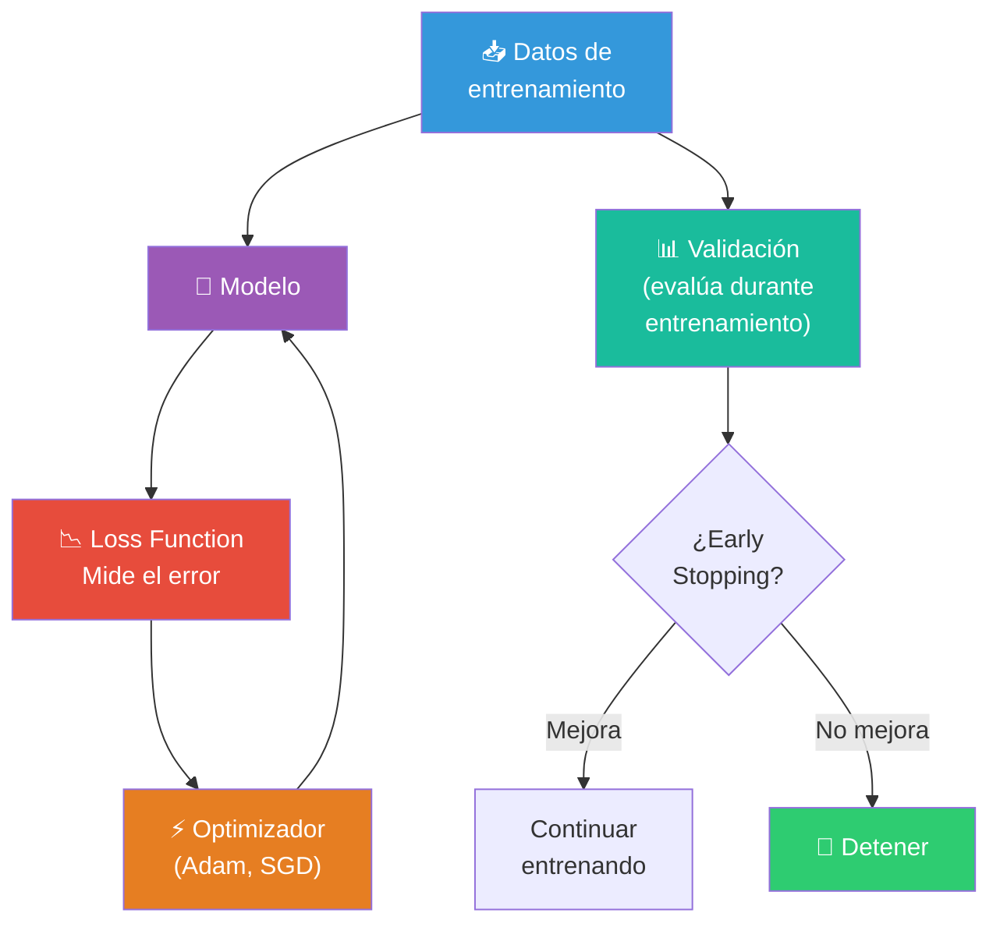
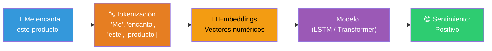
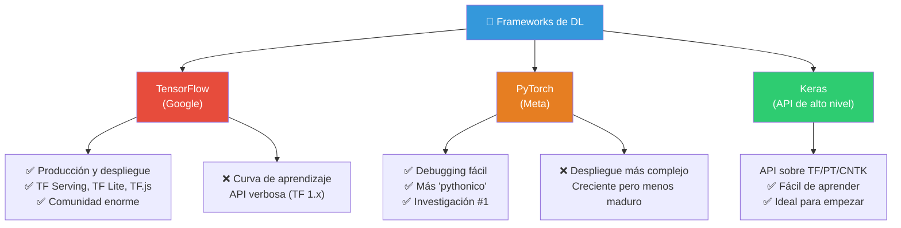
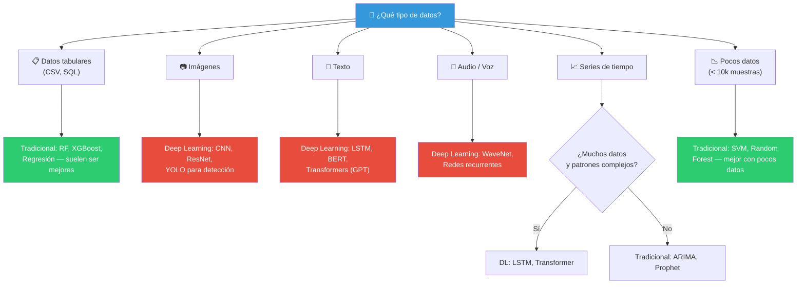

# Deep Learning

**Deep Learning** es una rama del Machine Learning que usa **redes neuronales profundas** (con muchas capas) para aprender patrones complejos. Inspirado en el cerebro humano, ha revolucionado áreas como visión por computadora, procesamiento de lenguaje natural y reconocimiento de voz.



---

## Aprendiendo las bases

### Redes Neuronales

Una **neurona artificial** es la unidad básica. Recibe inputs, los multiplica por pesos, suma un sesgo y aplica una función de activación.



#### De una neurona a una red



#### Funciones de activación

| Función | Rango | ¿Para qué? |
|---------|-------|-----------|
| **ReLU** | [0, ∞) | La más usada en capas ocultas |
| **Sigmoid** | (0, 1) | Clasificación binaria (probabilidad) |
| **Tanh** | (-1, 1) | Datos centrados en 0 |
| **Softmax** | (0, 1) suma = 1 | Clasificación multiclase |

#### ¿Cómo aprende una red? (Backpropagation)



### Redes Convolucionales (CNNs)

Las **CNN** están diseñadas para procesar datos con estructura de **cuadrícula** (imágenes, video). Usan **convoluciones** para detectar patrones.



**Usos:** Reconocimiento de imágenes, detección de objetos, diagnóstico médico por imágenes, autos autónomos.

```python
import tensorflow as tf
from tensorflow.keras import layers, models

modelo = models.Sequential([
    layers.Conv2D(32, (3, 3), activation='relu', input_shape=(64, 64, 3)),
    layers.MaxPooling2D((2, 2)),
    layers.Conv2D(64, (3, 3), activation='relu'),
    layers.MaxPooling2D((2, 2)),
    layers.Conv2D(128, (3, 3), activation='relu'),
    layers.Flatten(),
    layers.Dense(128, activation='relu'),
    layers.Dense(10, activation='softmax')  # 10 clases
])

modelo.compile(optimizer='adam',
               loss='categorical_crossentropy',
               metrics=['accuracy'])
```

### Redes Recurrentes (RNN)

Las **RNN** están diseñadas para datos **secuenciales** (texto, audio, series de tiempo). Tienen "memoria": el estado oculto se pasa de un paso al siguiente.



**Problema:** Las RNN simples sufren de **gradientes que desaparecen** (no recuerdan contextos largos). **Solución:** LSTM (Long Short-Term Memory) y GRU.

```python
from tensorflow.keras import layers, models

modelo = models.Sequential([
    layers.Embedding(10000, 128),              # Vocabulario de 10k palabras
    layers.LSTM(128, return_sequences=True),    # LSTM en lugar de RNN simple
    layers.LSTM(64),
    layers.Dense(1, activation='sigmoid')
])

modelo.compile(optimizer='adam',
               loss='binary_crossentropy',
               metrics=['accuracy'])
```

---

## Práctica de entrenamiento de modelos

El flujo para entrenar un modelo de Deep Learning es:

```python
# === 1. PREPARAR DATOS ===
(x_train, y_train), (x_test, y_test) = tf.keras.datasets.cifar10.load_data()

# Normalizar píxeles (0-255 → 0-1)
x_train = x_train.astype('float32') / 255.0
x_test = x_test.astype('float32') / 255.0

# === 2. DEFINIR MODELO ===
modelo = models.Sequential([
    layers.Flatten(input_shape=(32, 32, 3)),
    layers.Dense(512, activation='relu'),
    layers.Dropout(0.2),  # Regularización
    layers.Dense(256, activation='relu'),
    layers.Dense(10, activation='softmax')
])

# === 3. COMPILAR ===
modelo.compile(optimizer='adam',
               loss='sparse_categorical_crossentropy',
               metrics=['accuracy'])

# === 4. ENTRENAR ===
historial = modelo.fit(
    x_train, y_train,
    epochs=20,
    batch_size=64,
    validation_data=(x_test, y_test)
)

# === 5. EVALUAR ===
test_loss, test_acc = modelo.evaluate(x_test, y_test)
print(f'Precisión en test: {test_acc:.3f}')

# === 6. PREDECIR ===
predicciones = modelo.predict(x_test[:5])
```

### Componentes clave del entrenamiento



### Reconocimiento de imágenes

Una de las aplicaciones más exitosas de Deep Learning. Las CNN han superado el rendimiento humano en tareas de clasificación de imágenes.

**Datasets famosos:**

| Dataset  | Tamaño        | Clases               | Uso                         |
| -------- | ------------- | -------------------- | --------------------------- |
| MNIST    | 70k imágenes  | 10 digitos           | Hello world de DL           |
| CIFAR-10 | 60k imágenes  | 10 avion, auto, gato | Clasificación básica        |
| ImageNet | 14M imágenes  | 20k                  | El estándar de la industria |
| COCO     | 330k imágenes | 80 objetos           | Detección y segmentación    |


**Arquitecturas famosas pre-entrenadas (Transfer Learning):**

```python
# Usar un modelo pre-entrenado (Transfer Learning)
from tensorflow.keras.applications import VGG16, ResNet50, EfficientNetB0

base_model = ResNet50(
    weights='imagenet',     # Ya entrenado en ImageNet
    include_top=False,      # Quitamos la capa de clasificación
    input_shape=(224, 224, 3)
)

# Congelar capas pre-entrenadas
base_model.trainable = False

# Agregar nuestras propias capas
modelo = models.Sequential([
    base_model,
    layers.GlobalAveragePooling2D(),
    layers.Dense(256, activation='relu'),
    layers.Dropout(0.3),
    layers.Dense(10, activation='softmax')  # Nuestras 10 clases
])
```

> 💡 **Transfer Learning**: Usa un modelo entrenado en millones de imágenes y re-entrena solo las últimas capas para tu problema específico. Mucho más rápido y con menos datos.

---

### Procesamiento de Lenguaje Natural (NLP)

El NLP permite a las máquinas **entender, interpretar y generar lenguaje humano**.



**Tareas comunes de NLP:**

| Tarea | Descripción | Ejemplo |
|-------|-------------|---------|
| **Clasificación de texto** | Asignar categoría | Spam / No spam |
| **Análisis de sentimiento** | ¿Positivo, negativo o neutral? | Reviews de productos |
| **Traducción automática** | De un idioma a otro | Google Translate |
| **Reconocimiento de entidades (NER)** | Extraer nombres, fechas, lugares | "Apple en Cupertino" → [ORG, LOC] |
| **Resumen de texto** | Resumir documentos | Noticias |
| **Chatbots / QA** | Responder preguntas | ChatGPT |

**Ejemplo: Clasificación de texto con TensorFlow**

```python
from tensorflow.keras.preprocessing.text import Tokenizer
from tensorflow.keras.preprocessing.sequence import pad_sequences

# Preparar texto
tokenizer = Tokenizer(num_words=10000)
tokenizer.fit_on_texts(textos_train)
secuencias = tokenizer.texts_to_sequences(textos_train)
X_train = pad_sequences(secuencias, maxlen=100)

# Modelo
modelo = models.Sequential([
    layers.Embedding(10000, 128, input_length=100),
    layers.LSTM(64, dropout=0.2, recurrent_dropout=0.2),
    layers.Dense(1, activation='sigmoid')
])

modelo.compile(optimizer='adam', loss='binary_crossentropy', metrics=['accuracy'])
modelo.fit(X_train, y_train, epochs=10, batch_size=64, validation_split=0.2)
```

> 🚀 **Transformers**: Desde 2017, los Transformers (como BERT y GPT) han revolucionado el NLP. Usan un mecanismo de **atención** que procesa toda la secuencia a la vez (en paralelo), no paso a paso como las RNN. Son la base de ChatGPT, BERT y la mayoría de modelos modernos.

---

## Frameworks de Deep Learning



### TensorFlow

Desarrollado por **Google**, es el framework más usado en **producción**.

```python
import tensorflow as tf
from tensorflow.keras import layers, models

# Definir modelo con Keras (API de alto nivel de TF)
modelo = models.Sequential([
    layers.Dense(128, activation='relu', input_shape=(784,)),
    layers.Dropout(0.2),
    layers.Dense(10, activation='softmax')
])

# Compilar
modelo.compile(optimizer='adam',
               loss='categorical_crossentropy',
               metrics=['accuracy'])

# Entrenar
modelo.fit(X_train, y_train, epochs=10, batch_size=32, validation_split=0.2)

# Guardar para producción
modelo.save('modelo.h5')

# Cargar en producción
modelo_cargado = tf.keras.models.load_model('modelo.h5')
```

### PyTorch

Desarrollado por **Meta (Facebook)**, es el favorito en **investigación académica** por su flexibilidad y debugging sencillo.

```python
import torch
import torch.nn as nn
import torch.optim as optim

# Definir modelo (más explícito que Keras)
class MiRed(nn.Module):
    def __init__(self):
        super().__init__()
        self.fc1 = nn.Linear(784, 128)
        self.fc2 = nn.Linear(128, 10)
        self.relu = nn.ReLU()
        self.softmax = nn.Softmax(dim=1)
    
    def forward(self, x):
        x = self.relu(self.fc1(x))
        x = self.softmax(self.fc2(x))
        return x

modelo = MiRed()
criterio = nn.CrossEntropyLoss()
optimizador = optim.Adam(modelo.parameters(), lr=0.001)

# Entrenamiento explícito
for epoch in range(10):
    for X_batch, y_batch in dataloader:
        optimizador.zero_grad()
        predicciones = modelo(X_batch)
        loss = criterio(predicciones, y_batch)
        loss.backward()
        optimizador.step()
```

### TensorFlow vs PyTorch

| Aspecto | TensorFlow | PyTorch |
|---------|-----------|---------|
| **Creador** | Google | Meta (Facebook) |
| **Facilidad de aprendizaje** | ⭐⭐⭐ | ⭐⭐⭐⭐ |
| **Debugging** | ⭐⭐ | ⭐⭐⭐⭐⭐ |
| **Despliegue** | ⭐⭐⭐⭐⭐ | ⭐⭐⭐ |
| **Investigación** | ⭐⭐⭐ | ⭐⭐⭐⭐⭐ |
| **Industria** | ⭐⭐⭐⭐⭐ | ⭐⭐⭐⭐ |
| **Mobile / Edge** | ⭐⭐⭐⭐⭐ (TFLite) | ⭐⭐ (torch mobile) |

> 💡 **¿Cuál elegir?** Si trabajas en **investigación**: PyTorch. Si trabajas en **industria/producción**: TensorFlow. Si empiezas: **Keras** (sobre TF) o **PyTorch**. Ambos son excelentes.

---

## Cuándo usar Deep Learning vs Machine Learning tradicional



> 📁 **Ver también**: [[machine-learning]], [[analisis-estadistico]], [[ganar-habilidades-de-programacion]]

## Relacionados:
- [[tecnicas-de-big-data]] #anterior 