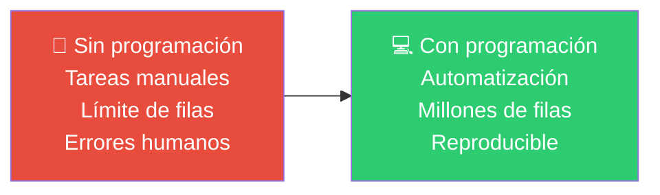
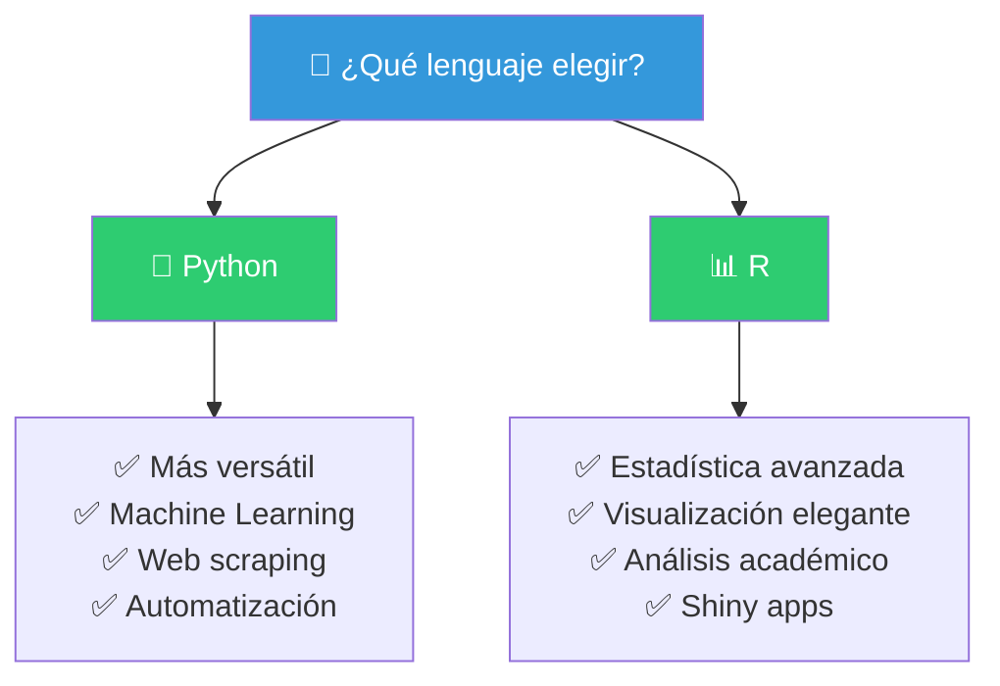
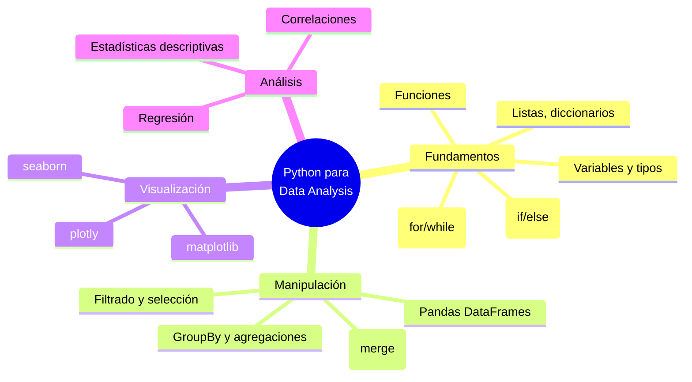
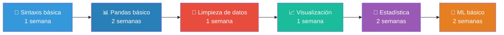
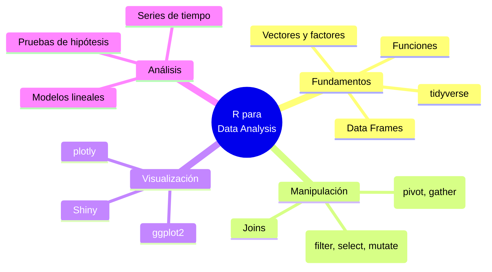
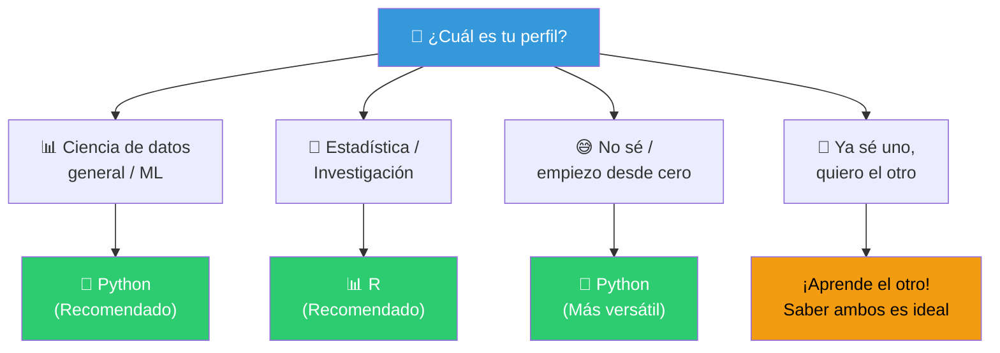
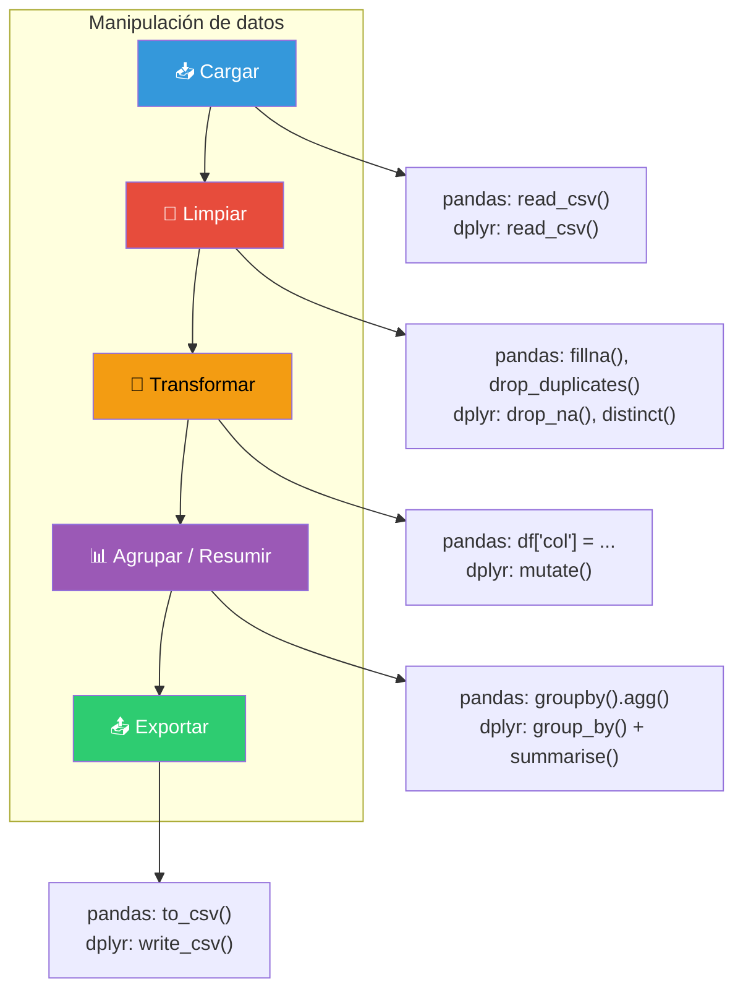
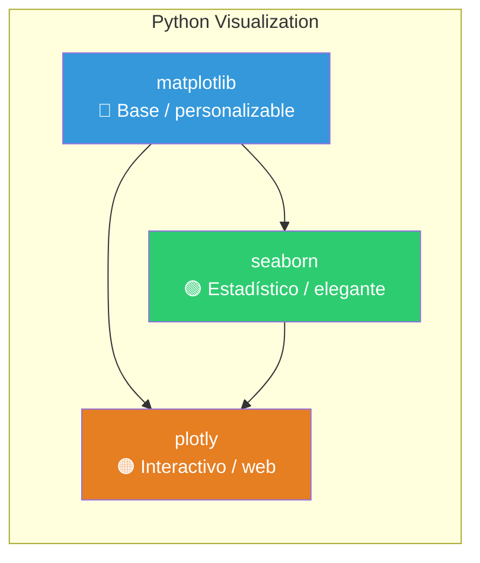
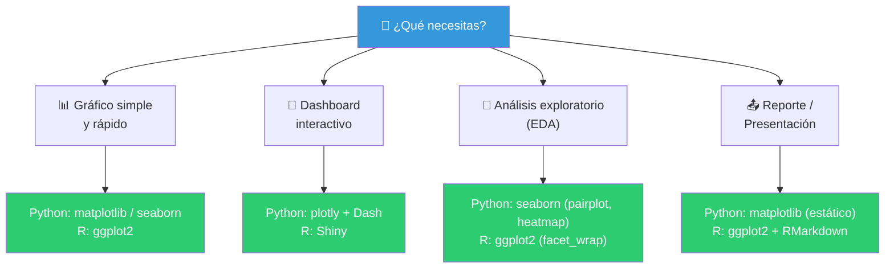
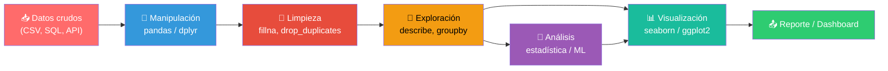

# Ganar habilidades de programación

La programación es una habilidad fundamental para el análisis de datos. Te permite **automatizar tareas**, **manipular grandes volúmenes de datos** y **crear análisis reproducibles** que Excel simplemente no puede manejar.



---

## Aprender un lenguaje de programación

Como analista de datos, tu objetivo **no es ser ingeniero de software**, sino usar la programación como herramienta para analizar datos más rápido y mejor.



---

### Python

Python es el lenguaje más popular para análisis de datos por su **simplicidad, versatilidad y enorme ecosistema** de librerías.

#### ¿Por qué Python?

| Característica | Beneficio |
|---------------|-----------|
| **Sintaxis simple** | Fácil de aprender, se lee como inglés |
| **Grande comunidad** | Millones de tutoriales, foros, soluciones |
| **Multipropósito** | Análisis, ML, web, automatización |
| **Librerías maduras** | Pandas, NumPy, scikit-learn, etc. |

#### Conceptos básicos que debes dominar



#### Tu primer script en Python

```python
import pandas as pd

# Cargar datos
df = pd.read_csv("ventas.csv")

# Ver estructura
print(df.head())
print(df.info())

# Ventas totales por región
resumen = df.groupby("region")["monto"].sum()
print(resumen)
```

> **Tip**: Empieza con **Google Colab** o **Jupyter Notebook** — no necesitas instalar nada y puedes experimentar de inmediato.

#### Ruta de aprendizaje recomendada



---

### R

R es el lenguaje preferido en **estadística académica e investigación** por su enfoque nativo en análisis de datos.

#### ¿Por qué R?

| Característica | Beneficio |
|---------------|-----------|
| **Hecho para datos** | Nace como lenguaje estadístico |
| **ggplot2** | El estándar de oro en visualización |
| **RStudio** | IDE excelente para análisis |
| **Paquetes estadísticos** | Los mejores modelos listos para usar |
| **Shiny** | Dashboards interactivos sin frontend |

#### Conceptos básicos en R



#### Tu primer script en R

```r
library(tidyverse)

# Cargar datos
df <- read_csv("ventas.csv")

# Ver estructura
glimpse(df)

# Ventas totales por región
resumen <- df %>%
  group_by(region) %>%
  summarise(total = sum(monto))

print(resumen)
```

#### Python vs R: ¿Cuál elegir?



> 💡 **Recomendación**: Si empiezas de cero, elige **Python** por su versatilidad. Si tu trabajo es puramente estadístico, **R** es excelente. Idealmente, aprende **ambos**.

---

## Librerías de manipulación de datos

Son el **corazón** del análisis de datos programático. Te permiten cargar, limpiar, transformar y unir datos.

### Python: Pandas

Pandas introduce el **DataFrame** — una estructura de datos tabular (como una hoja de Excel) sobre la que puedes hacer operaciones poderosas con una línea de código.

```python
import pandas as pd

df = pd.read_csv("datos.csv")

# Las 4 operaciones fundamentales
df.head()              # Ver primeras filas
df.info()              # Info del DataFrame
df.describe()          # Estadísticas resumen
df.isnull().sum()      # Valores faltantes

# Selección y filtrado
df["columna"]                     # Seleccionar columna
df[df["edad"] > 30]               # Filtrar filas
df[["nombre", "edad"]]            # Seleccionar varias columnas

# Transformaciones
df["nueva_col"] = df["a"] + df["b"]  # Crear columna
df.drop_duplicates()                 # Eliminar duplicados
df.fillna(0)                         # Llenar valores nulos

# Agrupación (el GROUP BY de SQL)
df.groupby("categoria")["ventas"].sum()
df.groupby("categoria")["ventas"].agg(["sum", "mean", "count"])

# Unir tablas (JOINs)
pd.merge(df1, df2, on="id", how="left")
```

### R: dplyr + tidyr

dplyr y tidyr son parte del **tidyverse**, un ecosistema de paquetes diseñados para la manipulación de datos.

```r
library(dplyr)
library(tidyr)

df <- read_csv("datos.csv")

# Verbos principales de dplyr
select(df, columna1, columna2)    # Seleccionar columnas
filter(df, edad > 30)             # Filtrar filas
mutate(df, nueva_col = a + b)    # Crear columna
arrange(df, desc(edad))           # Ordenar
summarise(df, media = mean(edad)) # Resumir

# Agrupación
df %>%
  group_by(categoria) %>%
  summarise(
    total = sum(ventas),
    promedio = mean(ventas),
    n = n()
  )

# Joins
left_join(df1, df2, by = "id")
```

### Pandas vs dplyr: el mismo concepto en ambos lenguajes

| Operación | Python (pandas) | R (dplyr) |
|-----------|----------------|-----------|
| Filtrar | `df[df["x"] > 5]` | `filter(df, x > 5)` |
| Seleccionar | `df[["a", "b"]]` | `select(df, a, b)` |
| Crear columna | `df["c"] = df["a"] * 2` | `mutate(df, c = a * 2)` |
| Agrupar y sumar | `df.groupby("g")["v"].sum()` | `df %>% group_by(g) %>% summarise(total = sum(v))` |
| Ordenar | `df.sort_values("x")` | `arrange(df, x)` |
| Unir tablas | `pd.merge(a, b, on="id")` | `left_join(a, b, by="id")` |



---

## Librerías de visualización de datos

Los gráficos son tu mejor herramienta para **entender los datos** y **comunicar hallazgos**.

### Python: matplotlib, seaborn y plotly



#### matplotlib

La librería base. Todo se construye desde cero, dándote **control total**.

```python
import matplotlib.pyplot as plt

# Gráfico de líneas simple
plt.plot(df["fecha"], df["ventas"])
plt.title("Ventas por mes")
plt.xlabel("Fecha")
plt.ylabel("Ventas ($)")
plt.show()
```

#### seaborn

Construida sobre matplotlib, ofrece gráficos **estadísticos** con mejor estilo por defecto.

```python
import seaborn as sns

# Box plot por categoría
sns.boxplot(data=df, x="categoria", y="precio")

# Heatmap de correlaciones
sns.heatmap(df.corr(), annot=True, cmap="coolwarm")

# Pairplot (todas las relaciones)
sns.pairplot(df)
```

#### plotly

Gráficos **interactivos** que funcionan en navegador. Ideal para dashboards.

```python
import plotly.express as px

# Gráfico interactivo
fig = px.scatter(df, x="ingreso", y="gasto", color="region",
                 size="poblacion", hover_data=["nombre"])
fig.show()
```

### R: ggplot2 y plotly

#### ggplot2

El **estándar de oro** de la visualización. Se basa en la **Gramática de Gráficos**: construyes el gráfico por capas.

```r
library(ggplot2)

# Box plot por categoría
ggplot(df, aes(x = categoria, y = precio)) +
  geom_boxplot() +
  labs(title = "Precio por categoría")

# Dispersión con regresión
ggplot(df, aes(x = ingreso, y = gasto, color = region)) +
  geom_point() +
  geom_smooth(method = "lm")

# Heatmap de correlaciones
df %>%
  select(where(is.numeric)) %>%
  cor() %>%
  as.data.frame() %>%
  rownames_to_column("var1") %>%
  pivot_longer(-var1, names_to = "var2", values_to = "cor") %>%
  ggplot(aes(x = var1, y = var2, fill = cor)) +
  geom_tile() +
  scale_fill_gradient2()
```

### R: Shiny — Dashboards interactivos

Shiny te permite crear **aplicaciones web interactivas** solo con R:

```r
library(shiny)

ui <- fluidPage(
  selectInput("region", "Selecciona región:", choices = unique(df$region)),
  plotOutput("grafico")
)

server <- function(input, output) {
  output$grafico <- renderPlot({
    df %>%
      filter(region == input$region) %>%
      ggplot(aes(x = mes, y = ventas)) +
      geom_line()
  })
}

shinyApp(ui, server)
```

### Comparativa: ¿qué librería usar?



---

## Flujo completo de trabajo: programación para análisis de datos



---

## Recursos para aprender

| Recurso | Lenguaje | Tipo | ¿Para quién? |
|---------|----------|------|-------------|
| [Python for Everybody](https://www.py4e.com/) | Python | Curso gratuito | Principiantes |
| [R for Data Science](https://r4ds.had.co.nz/) | R | Libro gratuito | Principiantes en R |
| [Kaggle Learn](https://www.kaggle.com/learn) | Python/R | Micro-cursos interactivos | Todos los niveles |
| [DataCamp](https://www.datacamp.com/) | Python/R | Cursos interactivos | Principiantes |
| [YouTube: Corey Schafer](https://www.youtube.com/user/schafer5) | Python | Tutoriales en video | Aprendizaje visual |
| [YouTube: RStudio](https://www.youtube.com/c/RStudio) | R | Tutoriales oficiales | Usuarios de R |

> 📁 **Ver también**: [[introduccion-analisis-de-datos]], [[limpieza-de-datos]], [[data-analyst-roadmap]]

## Relacionados:
- [[analisis-reportando-con-excel]] #anterior 
- [[recoleccion-de-datos]] #siguiente 