# Introducción al Análisis de Datos

El análisis de datos es el proceso de **transformar datos crudos en información útil** para la toma de decisiones. Imagina que los datos son como piezas de un rompecabezas: el análisis es el proceso de armarlas para ver la imagen completa.

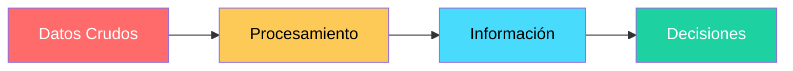

---

## ¿Qué es un analista de datos?

Un **analista de datos** es un profesional que recolecta, procesa y analiza datos para ayudar a las organizaciones a tomar mejores decisiones. Es un **detective de información**: busca patrones, encuentra pistas y resuelve problemas usando datos.

### Habilidades clave de un analista de datos

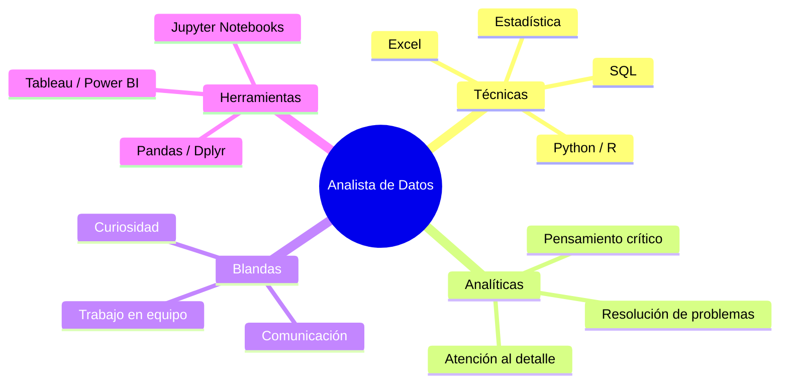

### Día a día de un analista

1. **Reunirse con stakeholders** para entender qué necesitan saber
2. **Recolectar datos** de bases de datos, APIs o archivos
3. **Limpiar y preparar** los datos para el análisis
4. **Explorar y analizar** usando estadística y visualizaciones
5. **Comunicar hallazgos** mediante informes, dashboards o presentaciones
6. **Hacer recomendaciones** basadas en los datos

---

## Tipos de análisis de datos

Existen **4 tipos principales** de análisis, ordenados de menor a mayor complejidad y valor:

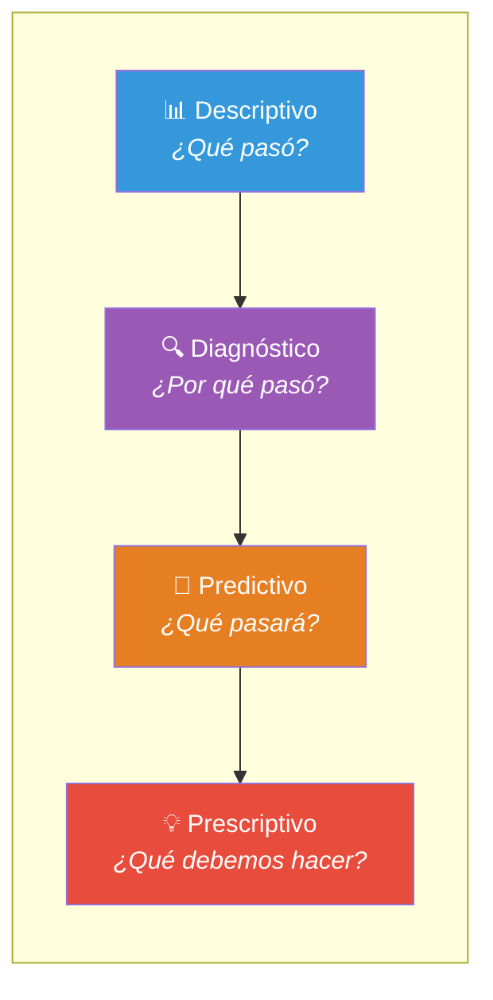

### Análisis descriptivo

> **"¿Qué pasó?"**

Es el tipo más básico y común. Responde **qué ocurrió** en el pasado usando datos históricos.

- **Ejemplo**: "Las ventas del Q1 2025 fueron de $1.2M, un 15% más que el Q1 2024"
- **Técnicas**: Promedios, totales, porcentajes, gráficos de barras/líneas
- **Herramientas**: Excel, SQL, Tableau, Power BI

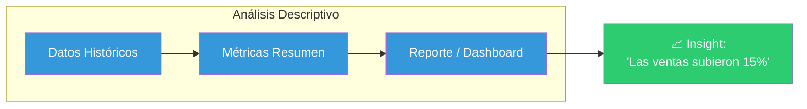

### Análisis diagnóstico

> **"¿Por qué pasó?"**

Va un paso más allá: busca entender **las causas** de lo que ocurrió.

- **Ejemplo**: "Las ventas subieron 15% porque lanzamos una campaña en redes sociales que generó 50,000 visitas nuevas"
- **Técnicas**: Segmentación, correlación, drill-down, análisis de causa raíz
- **Herramientas**: SQL (GROUP BY, JOINs), Python (correlaciones), Excel (tablas dinámicas)

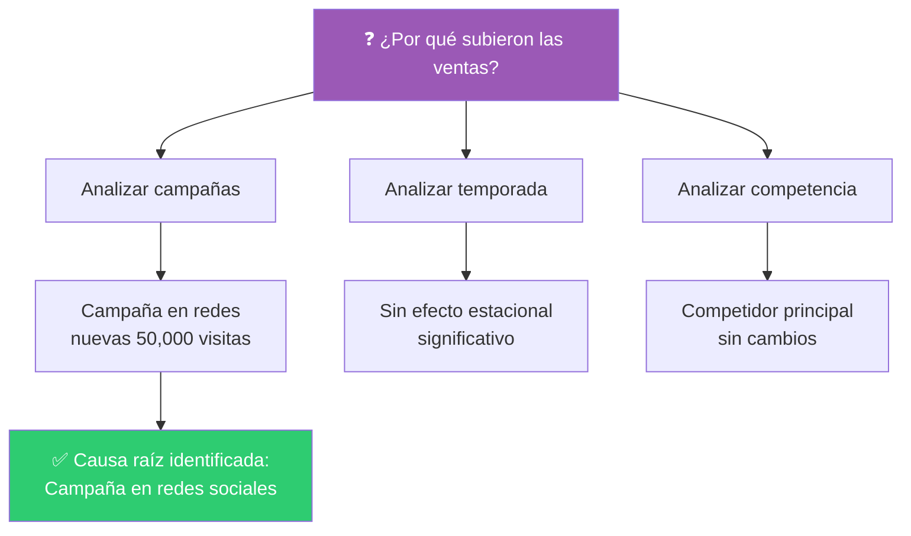

### Análisis predictivo

> **"¿Qué pasará?"**

Usa datos históricos + modelos estadísticos para **pronosticar** el futuro.

- **Ejemplo**: "Basado en las tendencias actuales, las ventas del Q2 2025 serán de aproximadamente $1.4M"
- **Técnicas**: Regresión lineal, series de tiempo, machine learning
- **Herramientas**: Python (scikit-learn, statsmodels), R, SQL

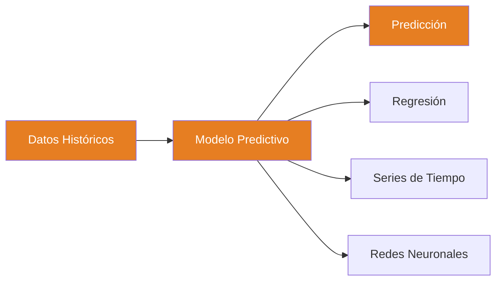

### Análisis prescriptivo

> **"¿Qué debemos hacer?"**

Es el más avanzado. No solo predice, sino que **recomienda acciones** específicas.

- **Ejemplo**: "Para alcanzar $1.4M en Q2, debes invertir $50K en ads y enfocarte en el segmento de 25-34 años"
- **Técnicas**: Optimización, simulación, algoritmos de recomendación, IA
- **Herramientas**: Python (PuLP, ortools), R, software especializado

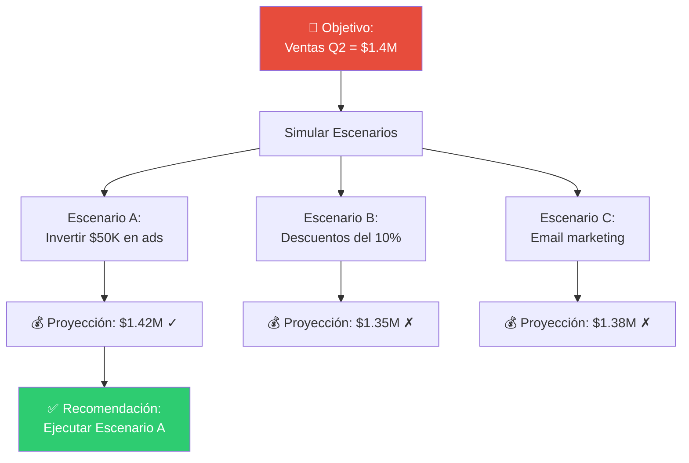

---

## Proceso de análisis de datos (Ciclo de vida)

El análisis de datos sigue un proceso iterativo conocido como el **ciclo de vida del dato**:

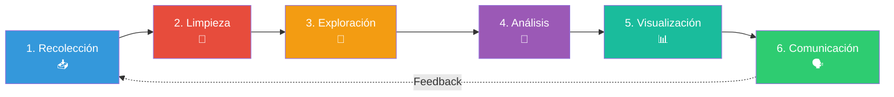

---

## Conceptos clave

### Recolección

Obtener datos de diversas fuentes. Es el **primer paso** y uno de los más importantes: datos de mala calidad generan análisis incorrectos.

| Fuente | Ejemplo | Formato |
|--------|---------|---------|
| Bases de datos | PostgreSQL, MySQL | Tablas SQL |
| Archivos | CSV, Excel, JSON | Archivos planos |
| APIs | Twitter API, Stripe API | JSON / XML |
| Web Scraping | Extraer datos de sitios web | HTML / CSV |
| Sensores | IoT, dispositivos | Streaming |

> 📁 **Ver más**: [[recoleccion-de-datos]]

### Limpieza

También llamado **data wrangling** o **data cleaning**. Es el proceso de detectar y corregir errores en los datos.

**Problemas comunes:**
- **Valores faltantes** — celdas vacías (NaN, NULL)
- **Duplicados** — registros repetidos
- **Outliers** — valores extremos que distorsionan el análisis
- **Inconsistencias** — formatos distintos para el mismo dato ("USA" vs "EE.UU.")
- **Errores de tipo** — números almacenados como texto

> 📁 **Ver más**: [[limpieza-de-datos]]

### Exploración

También conocido como **EDA (Exploratory Data Analysis)**. Consiste en entender la estructura, distribución y relaciones de los datos *antes* de aplicar modelos.

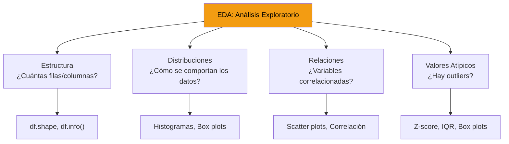

### Visualización

Representar los datos gráficamente para identificar patrones y comunicar hallazgos de forma clara.

**Tipos de gráficos según el objetivo:**

| Gráfico | ¿Cuándo usarlo? |
|---------|-----------------|
| **Barras** | Comparar categorías |
| **Líneas** | Mostrar tendencias en el tiempo |
| **Dispersión (scatter)** | Relación entre dos variables |
| **Pastel (pie)** | Proporciones de un todo (pocas categorías) |
| **Box plot** | Distribución y outliers |
| **Heatmap** | Correlaciones o datos en matriz |
| **Histograma** | Distribución de una variable numérica |

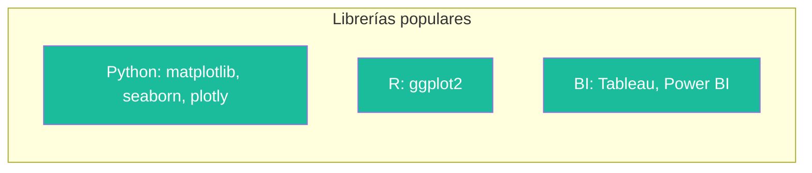

### Análisis estadístico

Aplicar métodos estadísticos para obtener conclusiones rigurosas de los datos.

**Dos grandes ramas:**

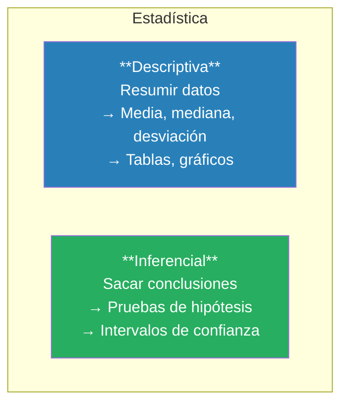

> 📁 **Ver más**: [[analisis-descriptivo]]

### Machine Learning

Rama de la IA que permite a las computadoras **aprender patrones** de los datos sin ser programadas explícitamente para cada caso.

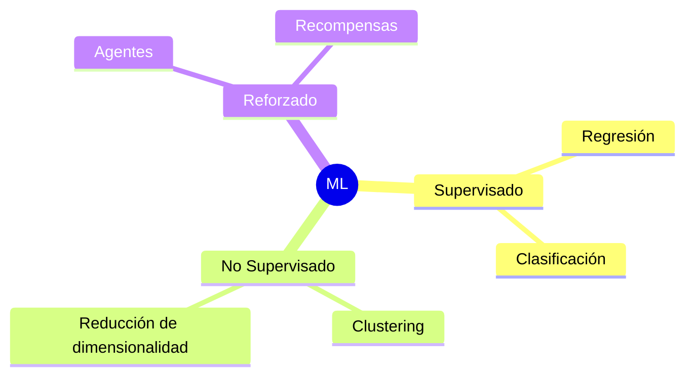

**Ejemplos prácticos:**
- **Supervisado**: Predecir precio de una casa (regresión) o detectar spam (clasificación)
- **No supervisado**: Segmentar clientes por comportamiento (clustering)
- **Reforzado**: Algoritmos de juegos, recomendaciones

---

## Resumen visual del flujo completo

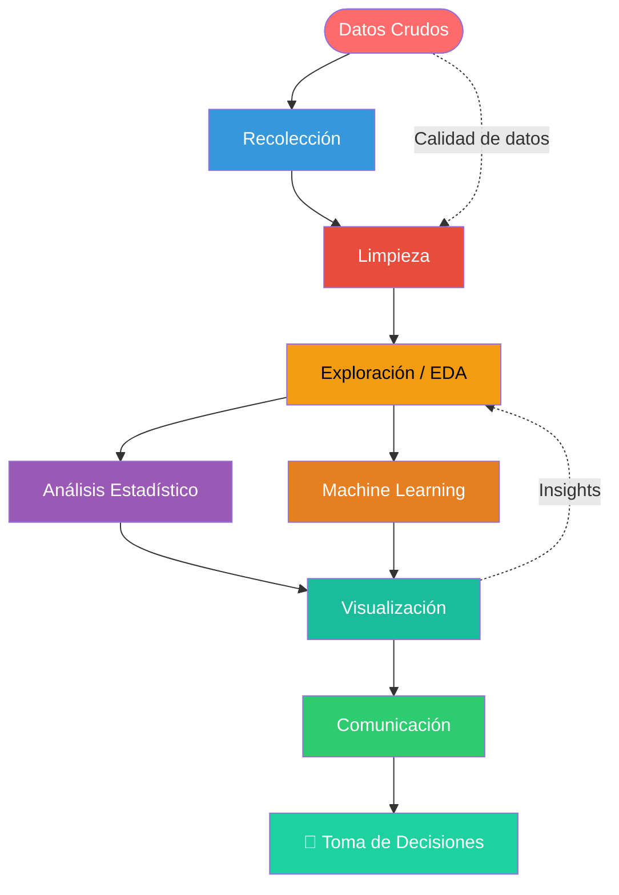

---

## Para empezar tu ruta de aprendizaje

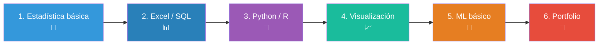

> 📁 **Roadmap completo**: [[data-analyst-roadmap]]

## Relacionados:
- [[analisis-reportando-con-excel]] #siguiente 