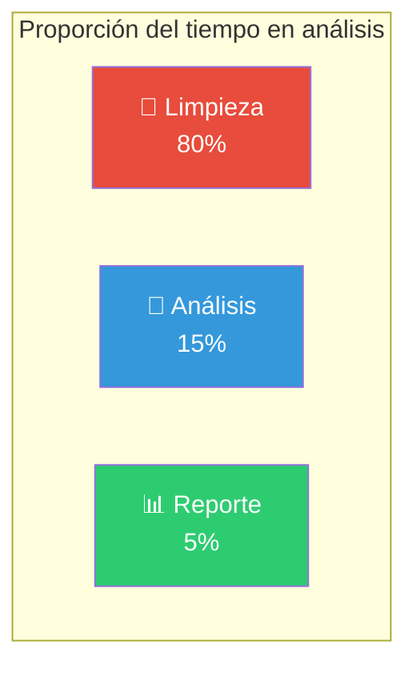
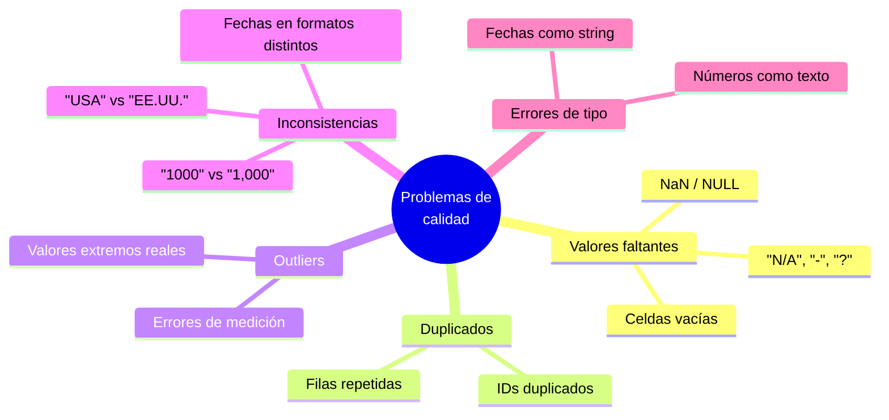
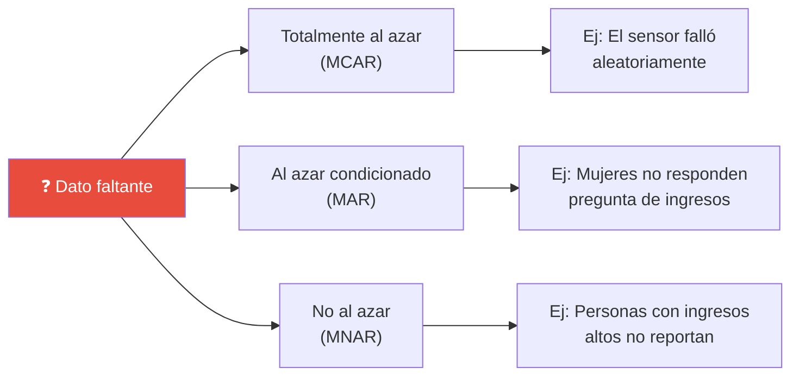
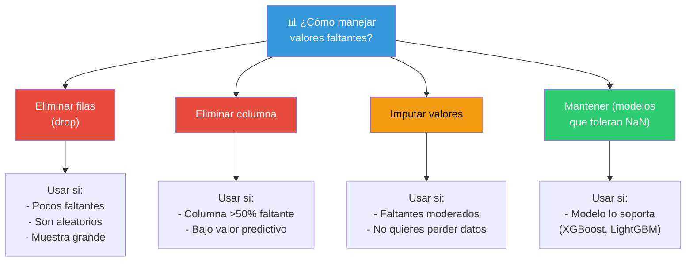
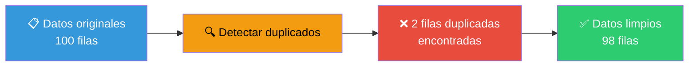
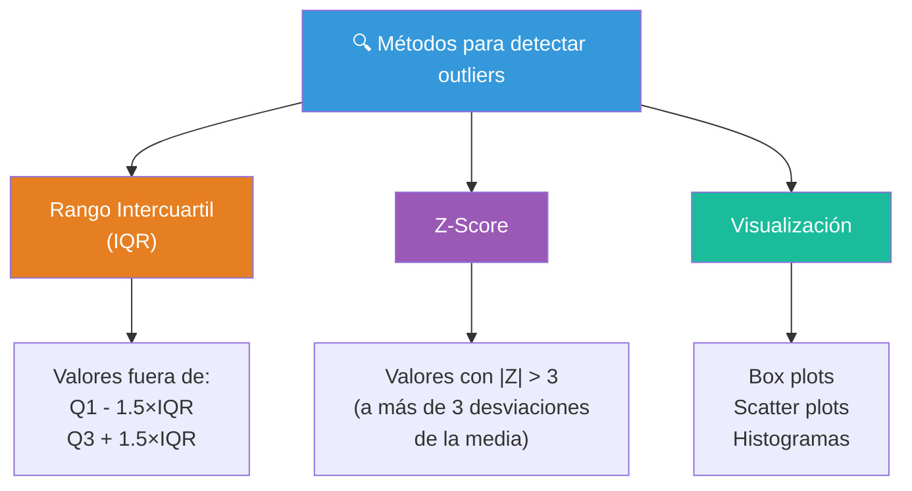
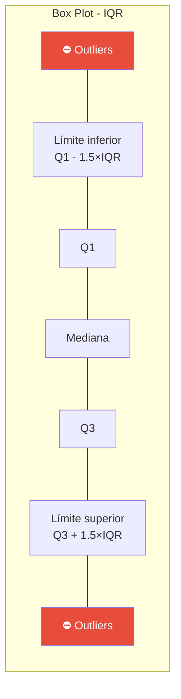
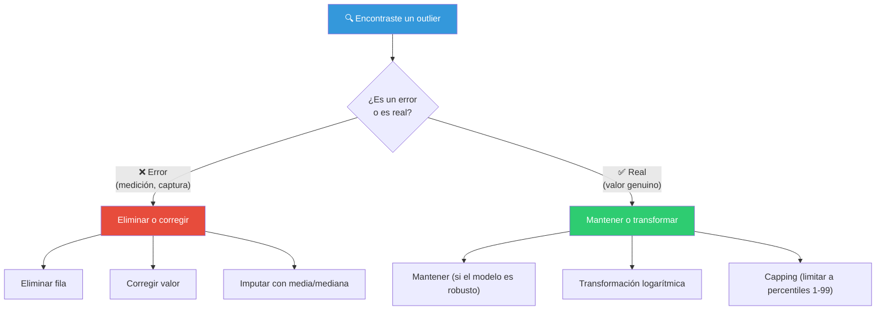
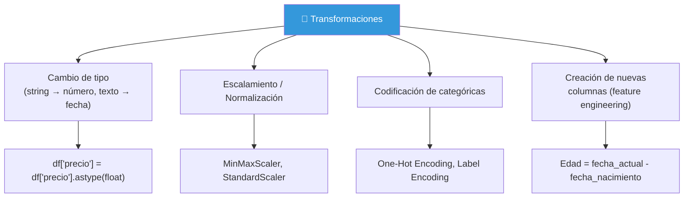
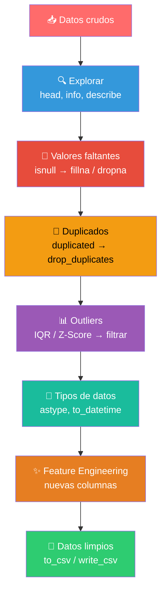

# Limpieza de datos

La limpieza de datos (también llamada **data cleaning** o **data wrangling**) es el proceso de **detectar y corregir** errores, inconsistencias y valores atípicos en los datos. Es el paso que consume **~80% del tiempo** de un analista, pero es **fundamental** para obtener resultados confiables.



---

## Problemas comunes en los datos



---

## Manejo de datos perdidos

Los **valores faltantes** son uno de los problemas más comunes. En Python aparecen como `NaN` (Not a Number) o `None`; en R como `NA`.

### ¿Por qué faltan datos?



### Cómo identificar valores faltantes

```python
import pandas as pd

# Detectar valores faltantes
df.isnull().sum()         # Conteo por columna
df.isnull().sum().sum()   # Total de faltantes
df.isnull().mean() * 100  # Porcentaje por columna

# Visualizar patrón de faltantes
import missingno as msno
msno.matrix(df)           # Matriz de valores faltantes
msno.heatmap(df)          # Correlación entre faltantes
```

```r
library(dplyr)

# Detectar valores faltantes
sapply(df, function(x) sum(is.na(x)))  # Conteo por columna
sum(is.na(df))                          # Total de faltantes
colMeans(is.na(df)) * 100              # Porcentaje por columna
```

### Estrategias para manejar datos perdidos



#### 1. Eliminar filas con valores faltantes

```python
# Eliminar cualquier fila con al menos un NaN
df_clean = df.dropna()

# Eliminar si cierta columna tiene NaN
df_clean = df.dropna(subset=["columna_importante"])
```

```r
# Eliminar cualquier fila con al menos un NA
df_clean <- na.omit(df)

# Eliminar si cierta columna tiene NA
df_clean <- df[!is.na(df$columna_importante), ]
```

#### 2. Imputar (rellenar) valores faltantes

| Estrategia | Cuándo usarla | Código |
|-----------|--------------|--------|
| **Media / Mediana** | Variables numéricas con distribución normal | `df.fillna(df.mean())` |
| **Moda** | Variables categóricas | `df.fillna(df.mode()[0])` |
| **Valor constante** | Cuando sabes el valor por defecto | `df.fillna(0)` |
| **Forward fill** | Series de tiempo (usar valor anterior) | `df.fillna(method="ffill")` |
| **Backward fill** | Series de tiempo (usar valor siguiente) | `df.fillna(method="bfill")` |
| **Interpolación** | Series de tiempo (estimar entre puntos) | `df.interpolate()` |
| **KNN / Modelo** | Cuando hay relación entre variables | `from sklearn.impute import KNNImputer` |

```python
# Imputación en Python
df["edad"] = df["edad"].fillna(df["edad"].median())     # Mediana
df["genero"] = df["genero"].fillna(df["genero"].mode()[0])  # Moda
df["ingreso"] = df["ingreso"].fillna(0)                  # Constante
df["temperatura"] = df["temperatura"].interpolate()       # Interpolación
```

```r
# Imputación en R
library(tidyr)

df$edad <- ifelse(is.na(df$edad), median(df$edad, na.rm = TRUE), df$edad)
df <- df %>% fill(temperatura, .direction = "down")  # Forward fill
```

> ⚠️ **Precaución**: Imputar puede introducir sesgo. Siempre documenta cómo manejaste los valores faltantes.

---

## Removiendo duplicados

Los **duplicados** son registros idénticos (o con el mismo identificador) que pueden distorsionar tus análisis.

### Cómo identificar duplicados

```python
# Encontrar duplicados
df.duplicated()                    # Booleanos (True = duplicado)
df.duplicated().sum()              # Total de duplicados
df[df.duplicated()]                # Ver filas duplicadas

# Duplicados basados en columnas específicas
df.duplicated(subset=["email", "id"])
```

```r
# Encontrar duplicados
sum(duplicated(df))               # Total de duplicados
df[duplicated(df), ]              # Ver filas duplicadas

# Duplicados basados en columnas específicas
df[duplicated(df[c("email", "id")]), ]
```

### Cómo eliminar duplicados

```python
# Eliminar duplicados (conserva la primera ocurrencia)
df_sin_dups = df.drop_duplicates()

# Conservar la última ocurrencia
df_sin_dups = df.drop_duplicates(keep="last")

# Basado en columnas específicas
df_sin_dups = df.drop_duplicates(subset=["email"])

# Reiniciar índice después de limpiar
df_sin_dups = df.drop_duplicates().reset_index(drop=True)
```

```r
# Eliminar duplicados
library(dplyr)

df_sin_dups <- distinct(df)                      # Todas las columnas
df_sin_dups <- distinct(df, email, .keep_all = TRUE)  # Solo email
```



---

## Encontrando Outliers

Los **outliers** (valores atípicos) son observaciones que se alejan significativamente del resto. Pueden ser errores o información valiosa.

> 💡 **Regla práctica**: No todos los outliers son errores. Un ingreso de $1M puede ser un outlier legítimo (una persona rica). El contexto lo determina.

### Métodos para detectar outliers



#### Método 1: IQR (Rango Intercuartil)

```python
# Método IQR para detectar outliers
Q1 = df["columna"].quantile(0.25)
Q3 = df["columna"].quantile(0.75)
IQR = Q3 - Q1

limite_inferior = Q1 - 1.5 * IQR
limite_superior = Q3 + 1.5 * IQR

outliers = df[(df["columna"] < limite_inferior) | (df["columna"] > limite_superior)]
print(f"Outliers encontrados: {len(outliers)}")
```

```r
# Método IQR en R
Q1 <- quantile(df$columna, 0.25)
Q3 <- quantile(df$columna, 0.75)
IQR <- Q3 - Q1

limite_inferior <- Q1 - 1.5 * IQR
limite_superior <- Q3 + 1.5 * IQR

outliers <- df[df$columna < limite_inferior | df$columna > limite_superior, ]
print(paste("Outliers encontrados:", nrow(outliers)))
```



#### Método 2: Z-Score

```python
from scipy import stats

# Calcular Z-Score
z_scores = stats.zscore(df["columna"])
outliers = df[abs(z_scores) > 3]
print(f"Outliers (|Z| > 3): {len(outliers)}")
```

#### Método 3: Visualización

```python
import matplotlib.pyplot as plt
import seaborn as sns

# Box plot
sns.boxplot(data=df, x="columna")
plt.show()

# Histograma
df["columna"].hist(bins=50)
plt.show()

# Scatter plot (para ver relación + outliers)
sns.scatterplot(data=df, x="col1", y="col2")
plt.show()
```

### ¿Qué hacer con los outliers?



---

## Data transformation (Transformación de datos)

A veces los datos no están en el formato que necesitas para analizarlos. Aquí es donde entran las **transformaciones**.

### Tipos de transformaciones comunes



#### 1. Cambio de tipos

```python
# Convertir tipos en Python
df["precio"] = df["precio"].astype(float)                    # String → float
df["fecha"] = pd.to_datetime(df["fecha"])                    # String → datetime
df["codigo"] = df["codigo"].astype(str)                      # Número → string
df["activo"] = df["activo"].map({"Sí": True, "No": False})  # Categórica → booleano
```

```r
# Convertir tipos en R
df$precio <- as.numeric(df$precio)                           # String → numérico
df$fecha <- as.Date(df$fecha)                                # String → Date
df$codigo <- as.character(df$codigo)                         # Número → string
df$activo <- ifelse(df$activo == "Sí", TRUE, FALSE)          # Categórica → booleano
```

#### 2. Escalamiento / Normalización

```python
from sklearn.preprocessing import StandardScaler, MinMaxScaler

# Estandarización (media=0, desv=1) — ideal para ML
scaler = StandardScaler()
df["edad_std"] = scaler.fit_transform(df[["edad"]])

# Normalización (0 a 1)
scaler = MinMaxScaler()
df["edad_norm"] = scaler.fit_transform(df[["edad"]])
```

#### 3. Codificación de variables categóricas

```python
# One-Hot Encoding (crear columnas dummy)
df_encoded = pd.get_dummies(df, columns=["region"], drop_first=True)

# Label Encoding (asignar número a cada categoría)
from sklearn.preprocessing import LabelEncoder
le = LabelEncoder()
df["region_cod"] = le.fit_transform(df["region"])
```

| Categoría original | One-Hot Encoding (3 columnas) | Label Encoding |
|-------------------|-------------------------------|----------------|
| Norte | Norte=1, Sur=0, Este=0 | 0 |
| Sur | Norte=0, Sur=1, Este=0 | 1 |
| Este | Norte=0, Sur=0, Este=1 | 2 |

#### 4. Feature Engineering (crear columnas)

```python
# Ejemplos de nuevas columnas
df["edad"] = 2025 - df["año_nacimiento"]            # Cálculo simple
df["ingreso_anual"] = df["ingreso_mensual"] * 12     # Escalamiento
df["nombre_completo"] = df["nombre"] + " " + df["apellido"]    # Concatenación
df["fecha_trimestre"] = df["fecha"].dt.to_period("Q")          # Extraer trimestre
df["es_fin_semana"] = df["fecha"].dt.weekday >= 5              # Extraer día
```

---

## Usando librerías para limpieza

### Pandas (Python)

Pandas es la librería más importante para manipulación y limpieza de datos en Python.

```python
import pandas as pd

# === 1. CARGAR ===
df = pd.read_csv("datos.csv")

# === 2. EXPLORAR ===
df.head()                 # Primeras filas
df.info()                 # Tipos de datos y no nulos
df.describe()             # Estadísticas descriptivas
df.shape                  # Dimensiones (filas, columnas)
df.columns                # Nombres de columnas

# === 3. LIMPIAR ===

# Renombrar columnas
df.columns = df.columns.str.lower().str.replace(" ", "_")
df.rename(columns={"ventas_2024": "ventas"}, inplace=True)

# Valores faltantes
df.isnull().sum()
df.dropna(subset=["columna_critica"], inplace=True)
df["edad"].fillna(df["edad"].median(), inplace=True)

# Duplicados
df.drop_duplicates(inplace=True)

# Outliers (IQR)
Q1, Q3 = df["precio"].quantile([0.25, 0.75])
IQR = Q3 - Q1
df = df[(df["precio"] >= Q1 - 1.5*IQR) & (df["precio"] <= Q3 + 1.5*IQR)]

# Cambio de tipos
df["fecha"] = pd.to_datetime(df["fecha"])
df["precio"] = pd.to_numeric(df["precio"], errors="coerce")

# === 4. GUARDAR ===
df.to_csv("datos_limpios.csv", index=False)
```

### Dplyr (R)

Dplyr es parte del **tidyverse** y ofrece una sintaxis limpia y consistente para manipular datos.

```r
library(dplyr)
library(tidyr)

# === 1. CARGAR ===
df <- read_csv("datos.csv")

# === 2. EXPLORAR ===
glimpse(df)               # Vista previa de estructura
summary(df)               # Estadísticas descriptivas
dim(df)                   # Dimensiones
names(df)                 # Nombres de columnas

# === 3. LIMPIAR ===

# Renombrar columnas
df <- df %>%
  rename_with(tolower) %>%
  rename_with(~ gsub(" ", "_", .x))

# Valores faltantes
colSums(is.na(df))
df <- df %>%
  drop_na(columna_critica) %>%
  mutate(edad = ifelse(is.na(edad), median(edad, na.rm = TRUE), edad))

# Duplicados
df <- df %>% distinct()

# Outliers (IQR)
Q1 <- quantile(df$precio, 0.25)
Q3 <- quantile(df$precio, 0.75)
IQR <- Q3 - Q1
df <- df %>%
  filter(precio >= Q1 - 1.5*IQR & precio <= Q3 + 1.5*IQR)

# Cambio de tipos
df <- df %>%
  mutate(
    fecha = as.Date(fecha),
    precio = as.numeric(precio)
  )

# === 4. GUARDAR ===
write_csv(df, "datos_limpios.csv")
```

### Flujo completo de limpieza



---

## Buenas prácticas

| Práctica | Descripción |
|----------|-------------|
| **Respaldar datos originales** | Nunca modifiques los datos crudos. Trabaja siempre sobre una copia |
| **Documentar cambios** | Lleva un registro de cada transformación que aplicaste |
| **Validar después de limpiar** | Verifica que las dimensiones, tipos y rangos sean correctos |
| **Crear pipeline reproducible** | Escribe un script que ejecute toda la limpieza de principio a fin |
| **No imputar sin pensar** | Entiende por qué faltan datos antes de decidir cómo manejarlos |
| **Visualizar antes y después** | Un box plot antes/después de limpiar outliers muestra tu impacto |

> 📁 **Ver también**: [[recoleccion-de-datos]], [[ganar-habilidades-de-programacion]], [[analisis-descriptivo]]

## Relacionados
- [[recoleccion-de-datos]] #anterior 
- [[analisis-descriptivo]] #siguiente 