# Machine Learning

El **Machine Learning (ML)** es una rama de la Inteligencia Artificial que permite a las computadoras **aprender patrones** de los datos sin ser programadas explícitamente para cada tarea. En lugar de escribir regñas manuales, el algoritmo "aprende" de ejemplos.


### ML vs Programación tradicional

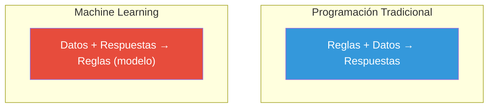

---

## Tipos de Machine Learning

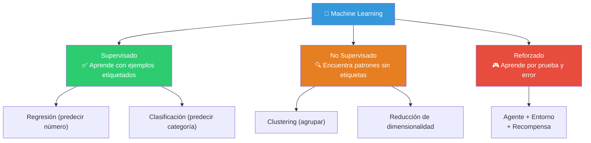

### Aprendizaje Supervisado

El modelo aprende de datos **etiquetados** (ya sabes la respuesta correcta) para predecir respuestas en datos nuevos.

| Tipo | ¿Qué predice? | Ejemplos |
|------|--------------|----------|
| **Regresión** | Un número | Precio de casa, temperatura, ventas |
| **Clasificación** | Una categoría | Spam / No spam, Perro / Gato, Enfermo / Sano |

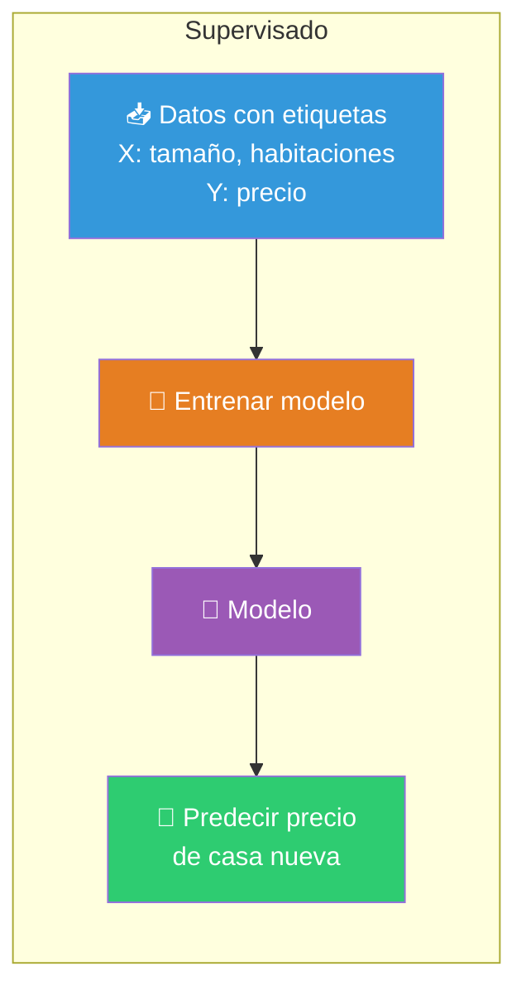

### Aprendizaje No Supervisado

El modelo encuentra **patrones ocultos** en datos **sin etiquetas**. No sabe la respuesta, busca estructura.

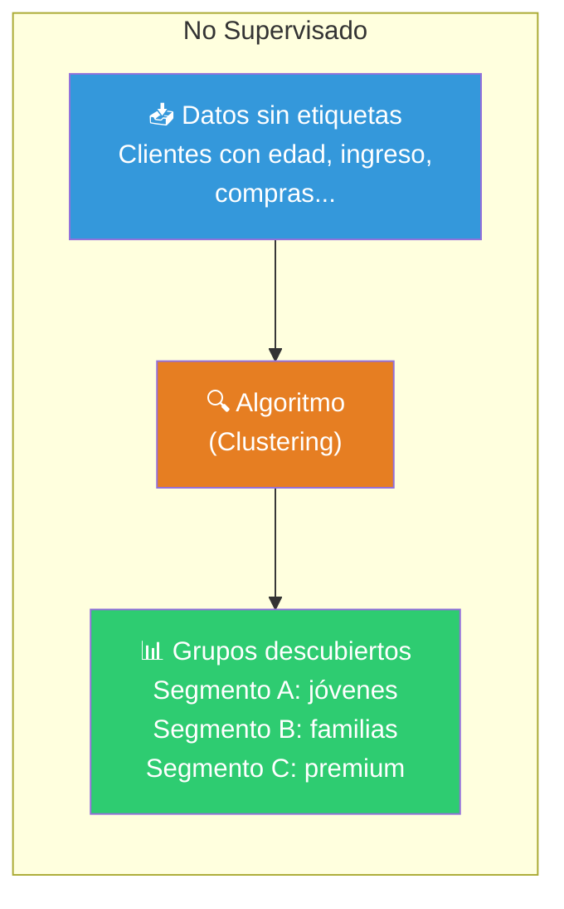

### Aprendizaje Reforzado

Un **agente** aprende a tomar decisiones interactuando con un **entorno**, recibiendo **recompensas** o **castigos** por sus acciones.

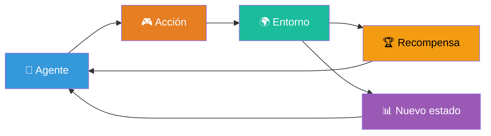

---

## Algoritmos populares de ML

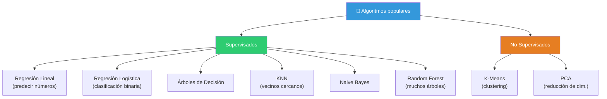

### Árboles de Decisión

Un árbol que **divide** los datos en ramas según preguntas sí/no, como un juego de "20 preguntas".

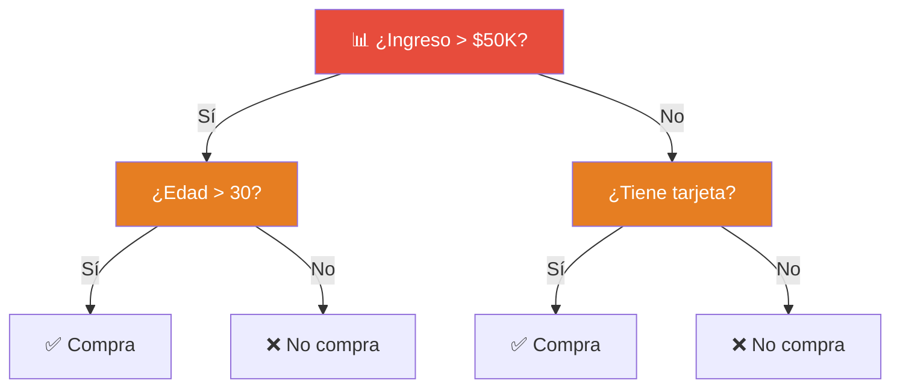

**Ventajas:** Fácil de entender e interpretar (árbol visual).
**Desventajas:** Propenso a overfitting (se aprende los datos de memoria).

```python
from sklearn.tree import DecisionTreeClassifier

modelo = DecisionTreeClassifier(max_depth=3)  # limita profundidad
modelo.fit(X_train, y_train)
predicciones = modelo.predict(X_test)
```

---

### Naive Bayes

Clasificador basado en el **Teorema de Bayes**. Asume que todas las variables son **independientes** entre sí (de ahí lo de "naive" — ingenuo).

**Ideal para:** Clasificación de texto, detección de spam, análisis de sentimientos.

```python
from sklearn.naive_bayes import GaussianNB

modelo = GaussianNB()
modelo.fit(X_train, y_train)
predicciones = modelo.predict(X_test)
```

A pesar de su supuesto "ingenuo", funciona sorprendentemente bien en la práctica, especialmente con texto.

---

### KNN (K-Nearest Neighbors)

Clasifica un punto según la **mayoría de sus K vecinos más cercanos**.

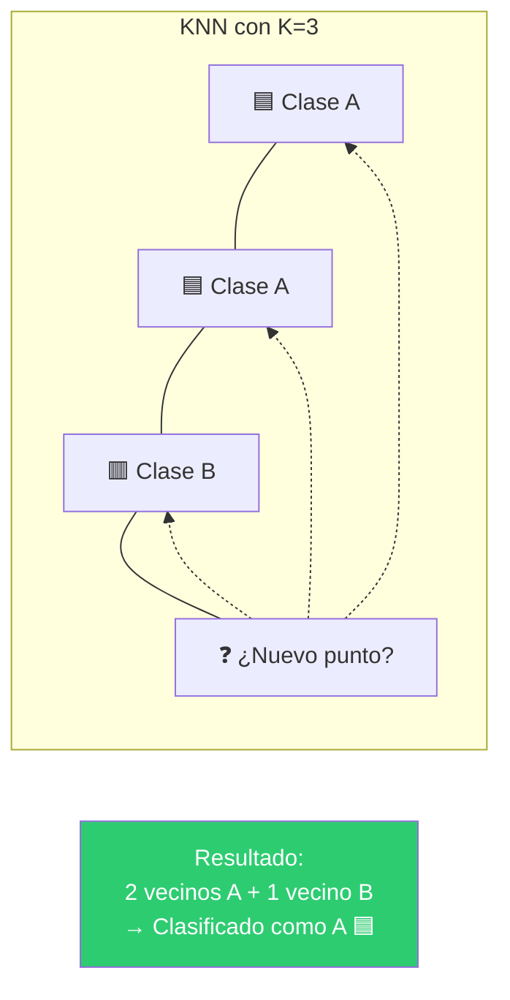

**Ideal para:** Cuando los datos forman grupos naturales.

**Desventaja:** No escala bien con muchos datos ni muchas dimensiones.

```python
from sklearn.neighbors import KNeighborsClassifier

modelo = KNeighborsClassifier(n_neighbors=5)
modelo.fit(X_train, y_train)
predicciones = modelo.predict(X_test)
```

---

### K-Means Clustering

Algoritmo **no supervisado** que agrupa datos en **K grupos** basándose en su cercanía.

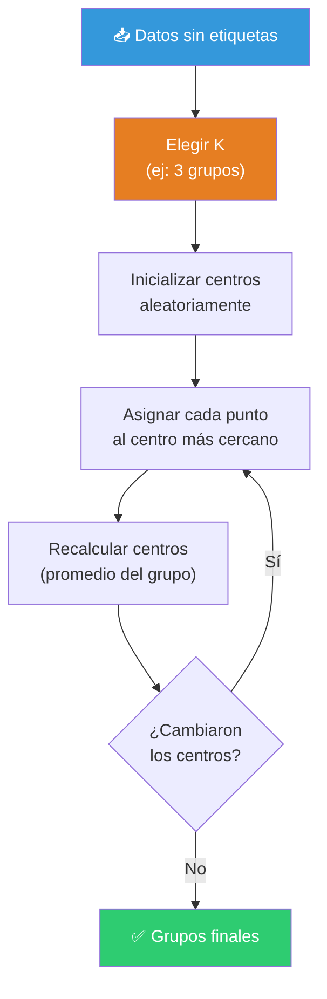

**Ideal para:** Segmentación de clientes, compresión de imágenes, análisis exploratorio.

```python
from sklearn.cluster import KMeans

modelo = KMeans(n_clusters=3, random_state=42)
modelo.fit(X)
df["cluster"] = modelo.labels_
```

> **¿Cómo elegir K?** Usa el **método del codo (elbow method)**: grafica la inercia vs K y busca el punto donde la mejora se ralentiza.

---

### Regresión Logística

A pesar del nombre, es un algoritmo de **clasificación** (no regresión). Predice la **probabilidad** de que un caso pertenezca a una clase.

```
P(Y=1) = 1 / (1 + e^-(β₀ + β₁·X))
```

```python
from sklearn.linear_model import LogisticRegression

modelo = LogisticRegression()
modelo.fit(X_train, y_train)
predicciones = modelo.predict(X_test)

# Probabilidades
probabilidades = modelo.predict_proba(X_test)[:, 1]
```

**Ideal para:** Clasificación binaria (sí/no, compra/no compra, enfermo/sano).

---

## Pipeline completo de ML

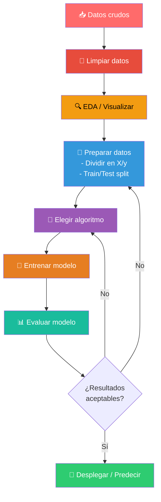

---

## Técnicas de evaluación de modelos

¿Cómo saber si tu modelo es bueno? Divides los datos en **entrenamiento** y **prueba**, entrenas con unos y evaluas con otros.

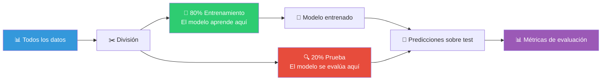

### Métricas para clasificación

```python
from sklearn.metrics import accuracy_score, precision_score, recall_score, f1_score, confusion_matrix

y_pred = modelo.predict(X_test)

# Métricas principales
print(f"Accuracy:  {accuracy_score(y_test, y_pred):.3f}")
print(f"Precision: {precision_score(y_test, y_pred):.3f}")
print(f"Recall:    {recall_score(y_test, y_pred):.3f}")
print(f"F1-Score:  {f1_score(y_test, y_pred):.3f}")

# Matriz de confusión
print(confusion_matrix(y_test, y_pred))
```

#### Matriz de Confusión

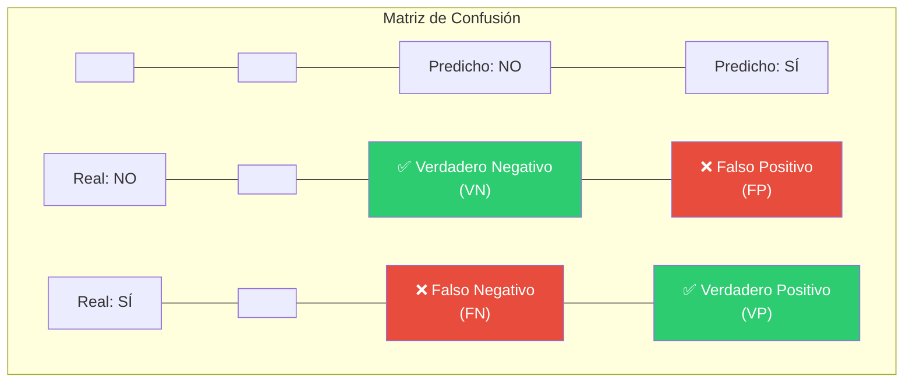

| Métrica | Fórmula | ¿Qué mide? |
|---------|---------|-----------|
| **Accuracy** | (VP + VN) / Total | ¿Qué tan seguido acierta el modelo? |
| **Precision** | VP / (VP + FP) | De los que predijo como SÍ, ¿cuántos eran realmente SÍ? |
| **Recall** | VP / (VP + FN) | De los SÍ reales, ¿cuántos detectó? |
| **F1-Score** | 2 × (P × R) / (P + R) | Balance entre precisión y recall |

> 💡 **¿Cuál mirar?** Depende del problema. En detección de spam, prefiere **precision** (no marcar correos buenos como spam). En detección de cáncer, prefiere **recall** (no dejar pasar un caso real).

### Métricas para regresión

```python
from sklearn.metrics import mean_absolute_error, mean_squared_error, r2_score

y_pred = modelo.predict(X_test)

print(f"MAE:  {mean_absolute_error(y_test, y_pred):.3f}")
print(f"MSE:  {mean_squared_error(y_test, y_pred):.3f}")
print(f"RMSE: {mean_squared_error(y_test, y_pred, squared=False):.3f}")
print(f"R²:   {r2_score(y_test, y_pred):.3f}")
```

| Métrica | ¿Qué mide? | Rango ideal |
|---------|-----------|-------------|
| **MAE** | Error promedio absoluto | Lo más bajo posible |
| **MSE** | Error cuadrático (penaliza más errores grandes) | Lo más bajo posible |
| **RMSE** | Raíz del MSE (misma unidad que Y) | Lo más bajo posible |
| **R²** | Proporción de varianza explicada | 0 a 1 (más alto = mejor) |

### Overfitting y Underfitting

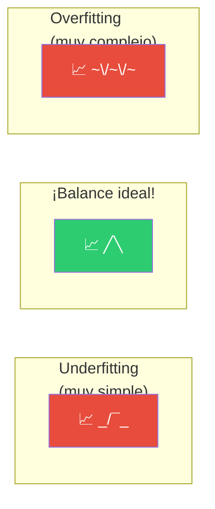

| Problema | Síntoma | Solución |
|----------|---------|----------|
| **Underfitting** | Modelo muy simple, no aprende ni en training | Aumentar complejidad, más features, menos regularización |
| **Overfitting** | Modelo muy complejo, memoriza training pero falla en test | Regularización, más datos, reducir features, podar árbol |

### Validación Cruzada (Cross-Validation)

En lugar de un solo split train/test, divide los datos en **K partes** y entrena K veces, usando cada parte como test una vez:

```python
from sklearn.model_selection import cross_val_score

# Validación cruzada con 5 pliegues
scores = cross_val_score(modelo, X, y, cv=5)
print(f"Accuracy promedio: {scores.mean():.3f} (+/- {scores.std()*2:.3f})")
```

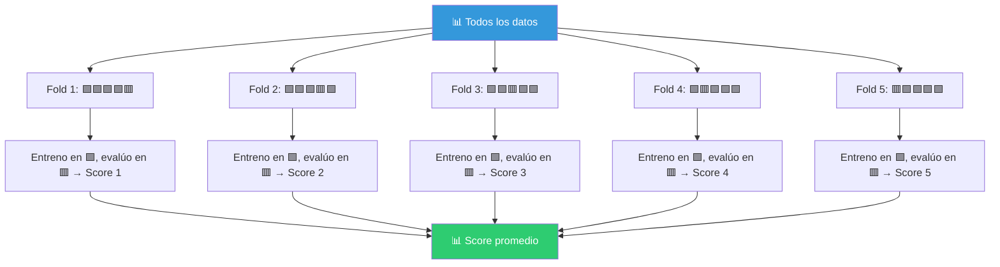

---

## Algoritmo vs tipo de problema

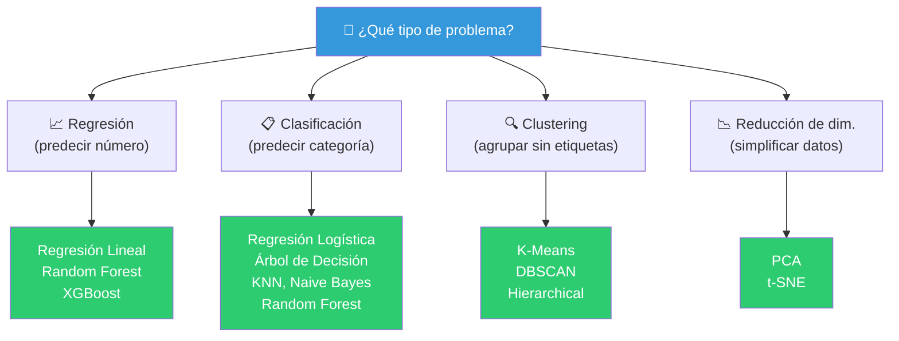

> 📁 **Ver también**: [[analisis-estadistico]], [[ganar-habilidades-de-programacion]], [[introduccion-analisis-de-datos]]

## Relacionados:
- [[analisis-estadistico]] #anterior 
- [[tecnicas-de-big-data]] #siguiente 