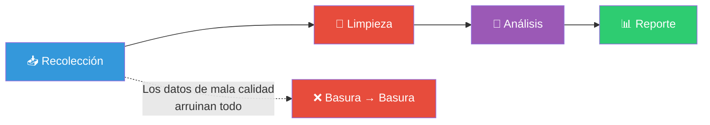
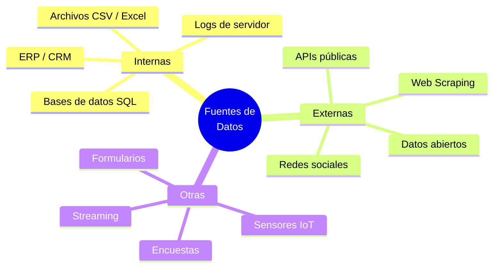
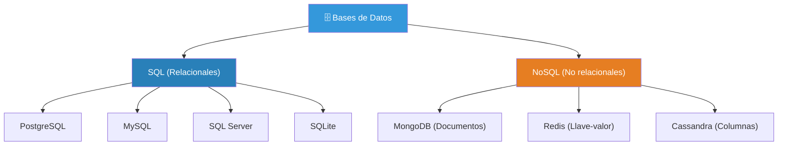
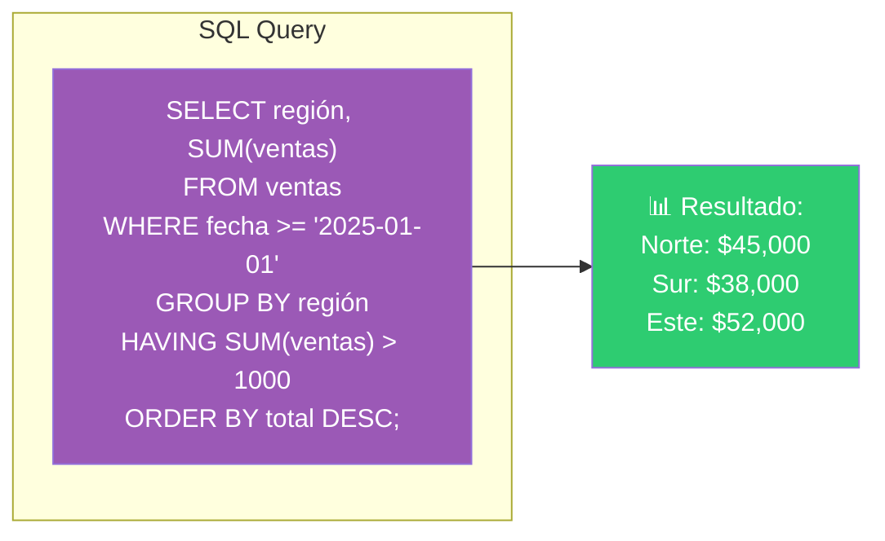
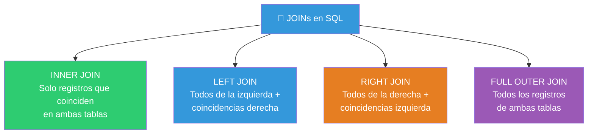
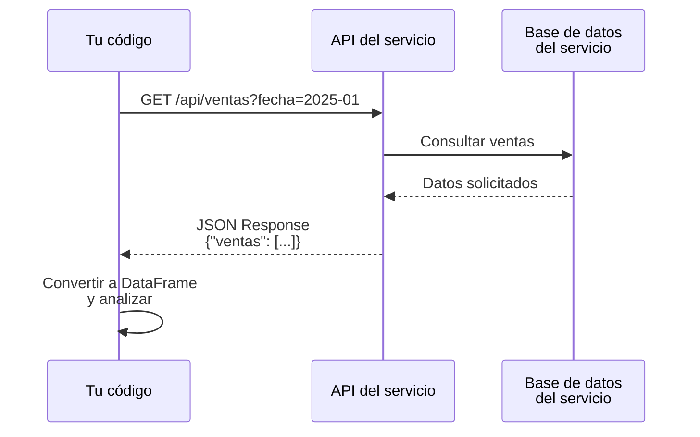
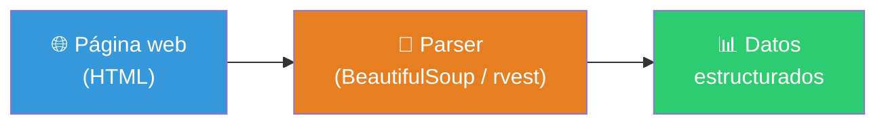
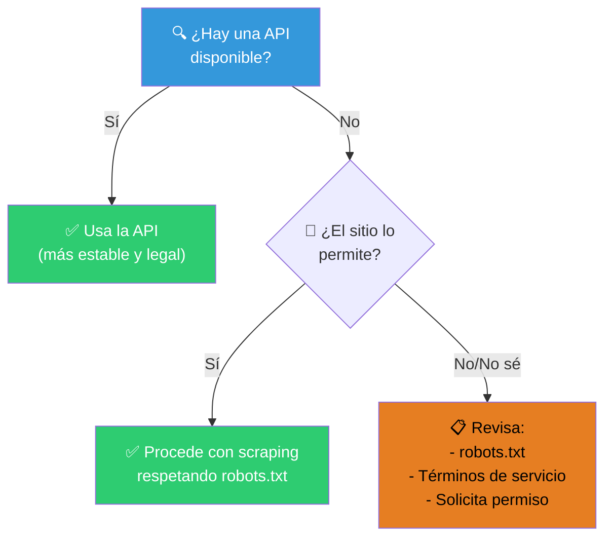
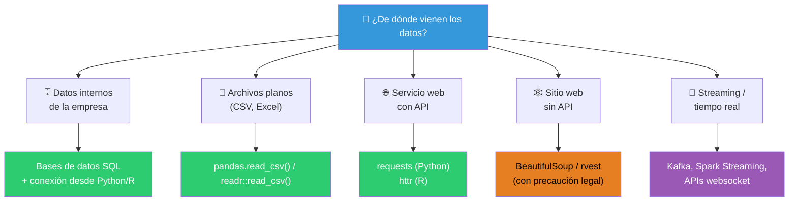

# Recolección de datos

La recolección de datos es el **primer paso** de cualquier análisis. Obtener datos de calidad de las fuentes correctas determina el éxito de todo lo que sigue. Como dice el dicho: **"basura entra, basura sale"** (garbage in, garbage out).



---

## Fuentes de datos



---

## Bases de datos

Las bases de datos son la fuente más común y confiable de datos empresariales. Almacenan información de forma **estructurada** y **eficiente**.

### Tipos de bases de datos



### SQL para analistas de datos

El lenguaje **SQL** (Structured Query Language) es la habilidad #1 para un analista de datos. Te permite extraer datos de bases de datos relacionales.



### Comandos SQL esenciales

| Comando | ¿Qué hace? | Ejemplo |
|---------|-----------|---------|
| `SELECT` | Selecciona columnas | `SELECT nombre, edad FROM clientes` |
| `FROM` | Especifica la tabla | `FROM ventas` |
| `WHERE` | Filtra filas | `WHERE edad > 30` |
| `GROUP BY` | Agrupa por categoría | `GROUP BY ciudad` |
| `HAVING` | Filtra grupos | `HAVING COUNT(*) > 5` |
| `ORDER BY` | Ordena resultados | `ORDER BY total DESC` |
| `JOIN` | Une tablas | `INNER JOIN clientes ON ventas.cliente_id = clientes.id` |
| `LIMIT` | Limita filas | `LIMIT 10` |

### Tipos de JOIN



### Conexión desde Python

```python
import pandas as pd
import sqlite3  # o psycopg2 para PostgreSQL, pymysql para MySQL

# Conectar a la base de datos
conn = sqlite3.connect("ventas.db")

# Consulta SQL → DataFrame de pandas
df = pd.read_sql_query("""
    SELECT 
        region,
        SUM(monto) as total_ventas
    FROM ventas
    WHERE fecha >= '2025-01-01'
    GROUP BY region
    ORDER BY total_ventas DESC
""", conn)

# Cerrar conexión
conn.close()

print(df)
```

### Conexión desde R

```r
library(DBI)
library(RSQLite)  # o RPostgreSQL, RMariaDB

# Conectar
conn <- dbConnect(SQLite(), "ventas.db")

# Consulta SQL
df <- dbGetQuery(conn, "
    SELECT region, SUM(monto) as total_ventas
    FROM ventas
    WHERE fecha >= '2025-01-01'
    GROUP BY region
    ORDER BY total_ventas DESC
")

# Cerrar
dbDisconnect(conn)

print(df)
```

---

## Archivos CSV

Los archivos CSV (Comma-Separated Values) son el **formato universal** para intercambiar datos tabulares. Son simples, ligeros y compatibles con cualquier herramienta.

### Estructura de un CSV

```csv
nombre,edad,ciudad,salario
Ana Pérez,30,Bogotá,45000
Luis García,25,Medellín,38000
María López,35,Cali,52000
```

Cada línea es un **registro** (fila), la primera línea suele ser el **encabezado** y las columnas se separan por **comas** (u otro delimitador como `;` o tabulación).

### Leyendo CSV en Python

```python
import pandas as pd

# Lectura básica
df = pd.read_csv("datos.csv")

# Especificar delimitador (por si es punto y coma)
df = pd.read_csv("datos.csv", sep=";")

# Sin encabezado
df = pd.read_csv("datos.csv", header=None)

# Solo ciertas columnas
df = pd.read_csv("datos.csv", usecols=["nombre", "edad"])

# Filtrar al cargar (solo ciertas filas)
df = pd.read_csv("datos.csv", nrows=100)  # primeras 100 filas
```

### Leyendo CSV en R

```r
library(readr)

# Lectura básica
df <- read_csv("datos.csv")

# Especificar delimitador
df <- read_csv("datos.csv", delim = ";")

# Sin encabezado
df <- read_csv("datos.csv", col_names = FALSE)

# Solo ciertas columnas
df <- read_csv("datos.csv", col_select = c(nombre, edad))
```

### Problemas comunes con CSVs

| Problema | Síntoma | Solución |
|----------|---------|----------|
| **Delimitador incorrecto** | Todo en una columna | Usar `sep=";"` o `sep="\t"` |
| **Encoding incorrecto** | Caracteres raros (ñ, é) | Usar `encoding="utf-8"` o `"latin1"` |
| **Espacios extra** | " Bogotá " vs "Bogotá" | Usar `skipinitialspace=True` en pandas |
| **Comillas en texto** | "Bogotá, DC" rompe columnas | Usar `quoting=csv.QUOTE_ALL` |
| **Fechas no parseadas** | "2025-01-15" como texto | Usar `parse_dates=["columna"]` |

---

## APIs

Una API (Application Programming Interface) es una **interfaz programática** que permite a dos aplicaciones comunicarse. Las APIs de datos te permiten obtener información actualizada de servicios externos.

### ¿Cómo funciona?



### Tipos de APIs

| Tipo | Formato | Ejemplo | Autenticación |
|------|---------|---------|--------------|
| **REST** | JSON | Twitter, GitHub, Stripe | API Key / OAuth |
| **GraphQL** | JSON | GitHub, Shopify | API Key |
| **SOAP** | XML | Servicios empresariales | Token |

### Datos abiertos vía API

Muchos gobiernos y organizaciones ofrecen APIs públicas gratuitas:

| API | ¿Qué ofrece? | Documentación |
|-----|-------------|---------------|
| **OpenWeather** | Clima actual y pronóstico | `api.openweathermap.org` |
| **GitHub API** | Repositorios, commits, issues | `api.github.com` |
| **Twitter API** | Tweets, tendencias | `api.twitter.com` |
| **Google Maps API** | Geocodificación, distancias | `maps.googleapis.com` |
| **Datos.gov (México)** | Datos abiertos del gobierno | `api.datos.gob.mx` |

### Llamando una API desde Python

```python
import requests
import pandas as pd

# GET request a una API pública
response = requests.get(
    "https://api.github.com/repos/pandas-dev/pandas/issues",
    headers={"Accept": "application/vnd.github.v3+json"}
)

# Verificar si la request fue exitosa
if response.status_code == 200:
    data = response.json()  # Lista de diccionarios
    df = pd.DataFrame(data)
    print(df[["title", "state", "created_at"]].head())
else:
    print(f"Error: {response.status_code}")
```

### Llamando una API desde R

```r
library(httr)
library(jsonlite)

# GET request
response <- GET(
  "https://api.github.com/repos/tidyverse/dplyr/issues",
  add_headers(Accept = "application/vnd.github.v3+json")
)

# Verificar
if (status_code(response) == 200) {
  data <- content(response, "parsed")
  df <- bind_rows(lapply(data, as.data.frame))
  print(df[, c("title", "state", "created_at")])
} else {
  print(paste("Error:", status_code(response)))
}
```

### API con autenticación

```python
import requests

# Muchas APIs requieren una API Key
headers = {
    "Authorization": "Bearer TU_API_KEY_AQUI"
}

response = requests.get(
    "https://api.ejemplo.com/v1/datos",
    headers=headers,
    params={"limit": 100, "offset": 0}
)

data = response.json()
```

> ⚠️ **Importante**: Nunca subas tus API keys a GitHub. Usa **variables de entorno**:
> ```python
> import os
> api_key = os.environ.get("MI_API_KEY")
> ```

---

## Web Scraping

El **web scraping** es el proceso de extraer datos de sitios web automáticamente. Útil cuando no hay una API disponible.



### ¿Cuándo usar web scraping?



> ⚠️ **Consideraciones legales y éticas**:
> - Siempre revisa el `robots.txt` del sitio (`sitio.com/robots.txt`)
> - No sobrecargues el servidor (usa `time.sleep()` entre requests)
> - Respeta los términos de servicio del sitio
> - No extraigas datos personales sin consentimiento
> - Algunos sitios lo prohíben explícitamente

### Web Scraping con Python (BeautifulSoup)

```python
import requests
from bs4 import BeautifulSoup
import pandas as pd
import time

# 1. Obtener el HTML
url = "https://ejemplo.com/productos"
response = requests.get(url)
soup = BeautifulSoup(response.text, "html.parser")

# 2. Extraer datos (ej: una tabla de productos)
productos = []

for item in soup.select(".producto"):
    nombre = item.select_one(".nombre").text.strip()
    precio = item.select_one(".precio").text.strip()
    rating = item.select_one(".rating").text.strip()
    
    productos.append({
        "nombre": nombre,
        "precio": precio,
        "rating": rating
    })

    time.sleep(1)  # No sobrecargar el servidor

# 3. Convertir a DataFrame
df = pd.DataFrame(productos)
print(df)
```

### Web Scraping con Python (pandas - tablas HTML)

Para tablas HTML, pandas puede leerlas directamente:

```python
import pandas as pd

# Lee todas las tablas HTML de la página
tables = pd.read_html("https://ejemplo.com/tabla")
df = tables[0]  # La primera tabla
print(df)
```

### Web Scraping con R (rvest)

```r
library(rvest)
library(dplyr)

# 1. Obtener el HTML
url <- "https://ejemplo.com/productos"
page <- read_html(url)

# 2. Extraer datos
productos <- page %>%
  html_elements(".producto") %>%
  purrr::map_df(~tibble(
    nombre = .x %>% html_element(".nombre") %>% html_text(trim = TRUE),
    precio = .x %>% html_element(".precio") %>% html_text(trim = TRUE),
    rating = .x %>% html_element(".rating") %>% html_text(trim = TRUE)
  ))

print(productos)
```

### Herramientas de scraping

| Herramienta | Lenguaje | Ideal para |
|-------------|----------|-----------|
| **BeautifulSoup** | Python | HTML simple y estructurado |
| **Scrapy** | Python | Scraping a gran escala |
| **Selenium** | Python | Sitios con JavaScript |
| **rvest** | R | Scraping desde R |
| **Playwright** | Python/R | Automatización de navegador |

---

## Resumen: ¿qué fuente usar?



> 📁 **Ver también**: [[introduccion-analisis-de-datos]], [[limpieza-de-datos]], [[ganar-habilidades-de-programacion]]

## Relacionados:
- [[ganar-habilidades-de-programacion]] #anterior 
- [[limpieza-de-datos]] #siguiente 