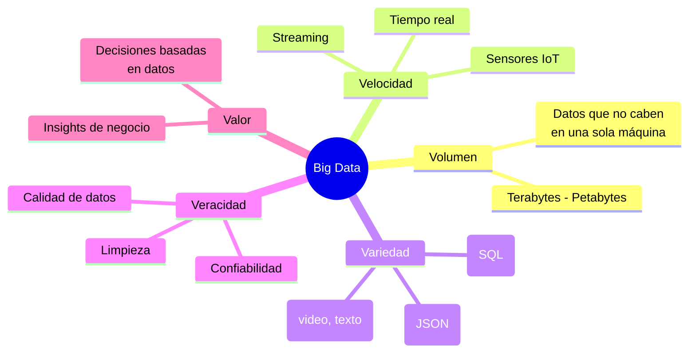
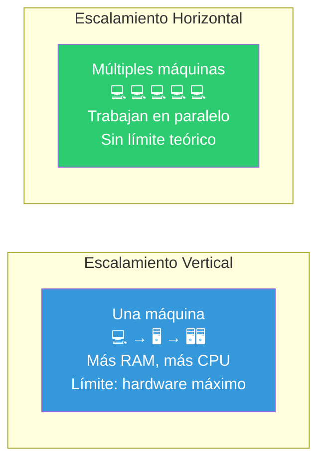
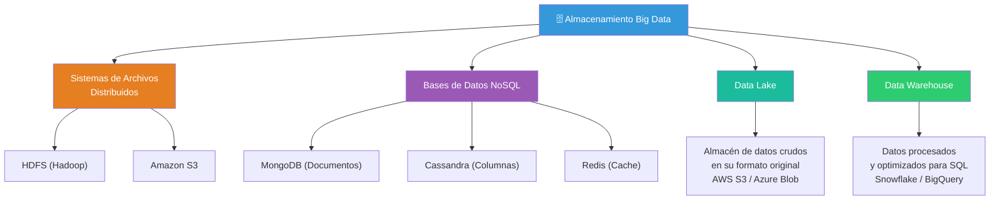
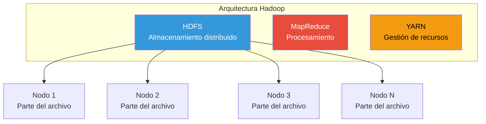
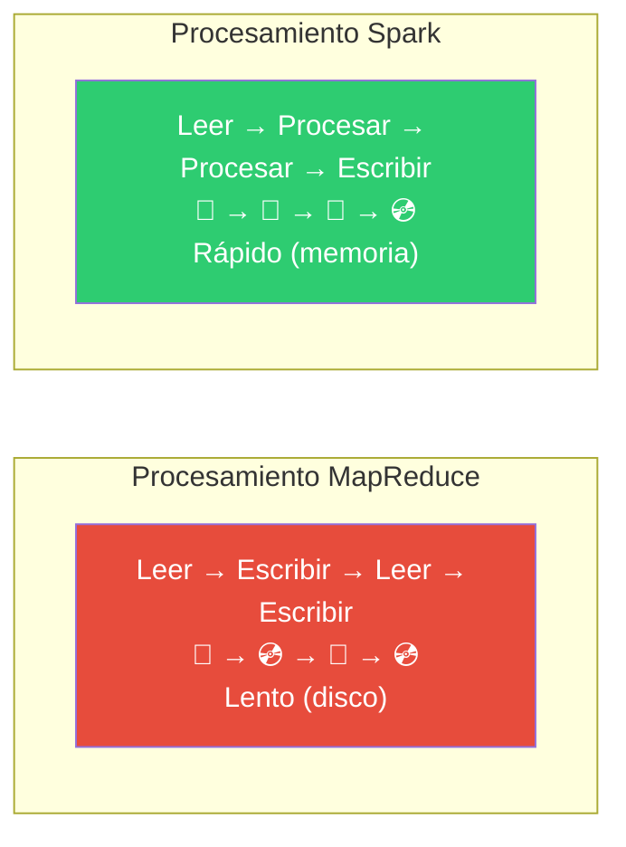
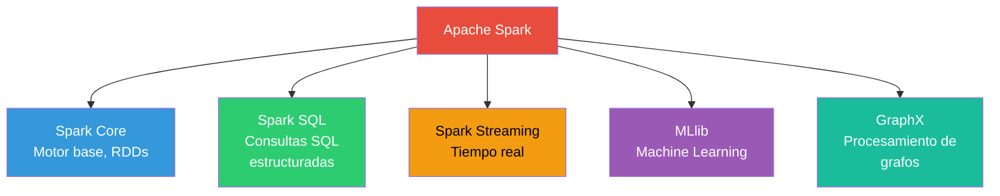
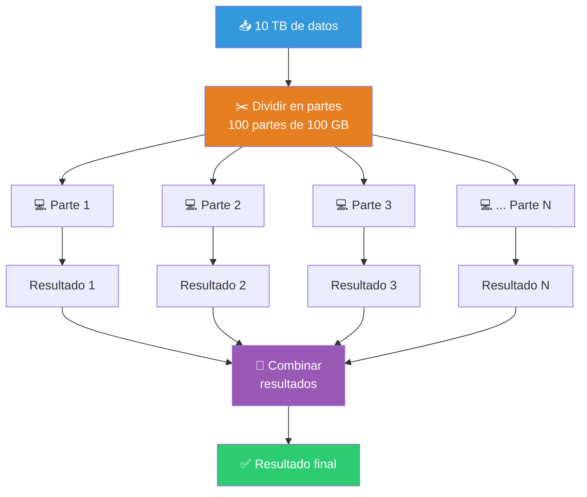
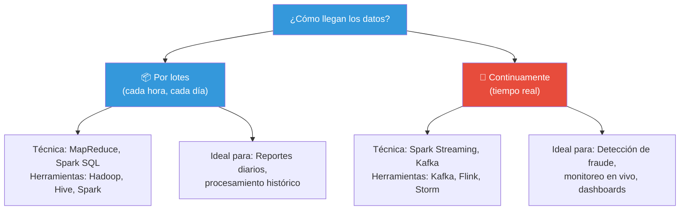
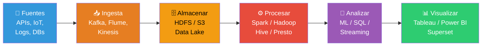
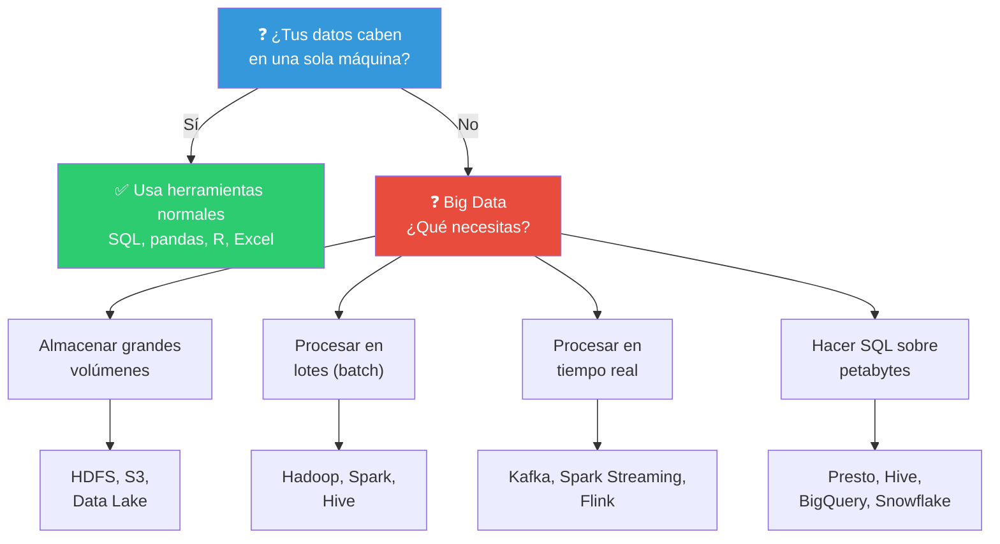

# Técnicas de Big Data

**Big Data** se refiere a conjuntos de datos tan **grandes, rápidos o complejos** que las herramientas tradicionales (Excel, SQL en una sola máquina, Python con pandas) no pueden procesarlos. Aquí es donde entran las técnicas y frameworks de Big Data.

> "Big Data no se trata de los datos, sino de lo que haces con ellos."

---

## Conceptos de Big Data

### Las 5 V's del Big Data



| V | Pregunta clave | Ejemplo |
|---|---------------|---------|
| **Volumen** | ¿Cuántos datos? | 10 TB de logs de servidor por día |
| **Velocidad** | ¿Qué tan rápido llegan? | 1M de tweets por minuto |
| **Variedad** | ¿Qué tipos de datos? | CSV + JSON + imágenes + video |
| **Veracidad** | ¿Son confiables? | Sensores con ruido, datos incompletos |
| **Valor** | ¿Qué ganamos? | Recomendaciones de producto personalizadas |

### Escalamiento: Vertical vs Horizontal



---

## Soluciones de almacenaje de datos

Cuando los datos no caben en una sola base de datos, necesitas soluciones distribuidas.



### Data Lake vs Data Warehouse

| Aspecto | Data Lake | Data Warehouse |
|---------|-----------|---------------|
| **Datos** | Crudos, cualquier formato | Procesados, estructurados |
| **Propósito** | Exploración, ML, almacenar | Reporting, BI, análisis |
| **Esquema** | Schema-on-read (al leer) | Schema-on-write (al escribir) |
| **Usuarios** | Data Scientists, Ingenieros | Analistas, Business users |
| **Ejemplos** | AWS S3, Azure Data Lake | Snowflake, BigQuery, Redshift |

---

## Frameworks para el procesamiento de datos

### Hadoop

Hadoop es el **framework original** de Big Data. Permite procesar grandes volúmenes de datos en un clúster de máquinas usando el modelo **MapReduce**.



**Componentes principales:**

| Componente | Función |
|-----------|---------|
| **HDFS** | Sistema de archivos distribuido: divide archivos en bloques (128 MB) y los replica en múltiples nodos |
| **MapReduce** | Modelo de programación: procesa datos en paralelo (map → shuffle → reduce) |
| **YARN** | Gestiona recursos del clúster (CPU, memoria) y programa los jobs |

**Ventajas:**
- Probado a escala de petabytes
- Tolerante a fallos (replicación automática)
- Económico (hardware commodity)

**Desventajas:**
- Lento para procesamiento iterativo (escribe a disco entre cada paso)
- Curva de aprendizaje pronunciada
- Reemplazado por Spark en muchos casos

---

### Spark

Spark es el **sucesor moderno** de Hadoop MapReduce. Procesa datos en **memoria** (RAM), lo que lo hace **10-100× más rápido**.



**Componentes de Spark:**



**Ejemplo de Spark en Python (PySpark):**

```python
from pyspark.sql import SparkSession

# Iniciar sesión Spark
spark = SparkSession.builder.appName("Analisis").getOrCreate()

# Leer datos (distribuido, no importa el tamaño)
df = spark.read.csv("ventas/*.csv", header=True, inferSchema=True)

# Transformaciones (perezosas hasta que se necesita)
df.createOrReplaceTempView("ventas")
resultado = spark.sql("""
    SELECT region, SUM(monto) as total
    FROM ventas
    WHERE fecha >= '2025-01-01'
    GROUP BY region
    ORDER BY total DESC
""")

# Acción (aquí se ejecuta)
resultado.show()
```

**¿Hadoop o Spark?**

| Aspecto | Hadoop MapReduce | Spark |
|---------|-----------------|-------|
| **Velocidad** | Lento (disco) | Rápido (memoria) |
| **Facilidad** | ⭐⭐ | ⭐⭐⭐⭐ |
| **ML incluido** | No | Sí (MLlib) |
| **Streaming** | No nativo | Sí (Spark Streaming) |
| **Madurez** | Muy maduro | Maduro |
| **Cuándo usarlo** | Datos masivos + bajo presupuesto | Velocidad + ML + análisis interactivo |

---

## Técnicas de procesamiento de datos

### Procesamiento Paralelo

La idea fundamental de Big Data: **divide y vencerás**. Un problema grande se divide en partes pequeñas que se procesan simultáneamente.



### MPI (Message Passing Interface)

MPI es un estándar para **comunicación entre procesos** en sistemas de cómputo paralelo. Permite que múltiples computadoras (o núcleos) intercambien mensajes mientras trabajan en un problema.

**Conceptos clave:**

| Concepto | Definición |
|----------|-----------|
| **Proceso** | Una unidad de ejecución independiente |
| **Comunicador** | Grupo de procesos que pueden comunicarse |
| **Punto a punto** | Un proceso envía, otro recibe |
| **Colectiva** | Todos los procesos participan (broadcast, reduce) |

```python
# Pseudocódigo conceptual de MPI
from mpi4py import MPI

comm = MPI.COMM_WORLD
rank = comm.Get_rank()   # ID de este proceso
size = comm.Get_size()   # Total de procesos

# Cada proceso trabaja en su parte
datos = cargar_parte_datos(rank, size)
resultado_parcial = procesar(datos)

# Combinar resultados (reducción)
resultado_total = comm.reduce(resultado_parcial, op=MPI.SUM, root=0)

if rank == 0:
    print(f"Resultado final: {resultado_total}")
```

**¿Cuándo usar MPI?** Problemas que requieren mucha comunicación entre procesos (simulaciones científicas, modelado climático, física computacional).

---

### MapReduce

MapReduce es el **modelo de programación** que popularizó Google (y luego Hadoop). Tiene dos fases:


#### Ejemplo clásico: Word Count

```python
# FASE MAP: Divide el texto en palabras (cada palabra → 1)
def map(linea):
    palabras = linea.lower().split()
    for palabra in palabras:
        emit(palabra, 1)  # ("hola", 1), ("mundo", 1), ...

# SHUFFLE (automático): Agrupa por palabra
# ("hola", [1, 1, 1]), ("mundo", [1]), ...

# FASE REDUCE: Suma los contadores
def reduce(palabra, valores):
    total = sum(valores)
    emit(palabra, total)  # ("hola", 3), ("mundo", 1)
```

```python
# En la práctica con Spark esto es:
from pyspark.sql import SparkSession

spark = SparkSession.builder.appName("WordCount").getOrCreate()

rdd = spark.sparkContext.textFile("libro.txt")

word_counts = (rdd
    .flatMap(lambda linea: linea.lower().split())  # MAP
    .map(lambda palabra: (palabra, 1))             # MAP
    .reduceByKey(lambda a, b: a + b)               # REDUCE
)

word_counts.show()
```

### Procesamiento Batch vs Streaming



---

## Flujo completo de una arquitectura Big Data



---

## ¿Cuándo necesitas Big Data?



> 📁 **Ver también**: [[machine-learning]], [[recoleccion-de-datos]], [[introduccion-analisis-de-datos]]

## Relacionados:
- [[machine-learning]] #anterior 
- [[deep-learning]] #siguiente 