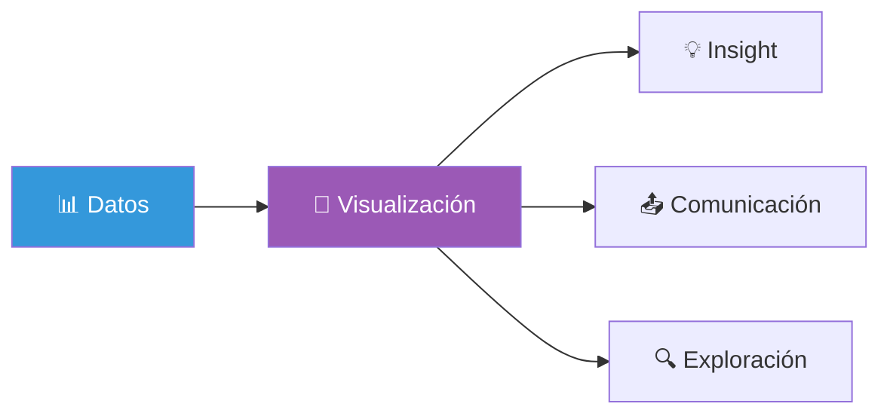
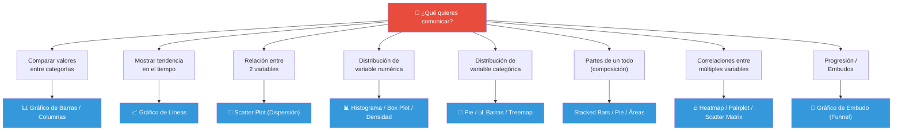
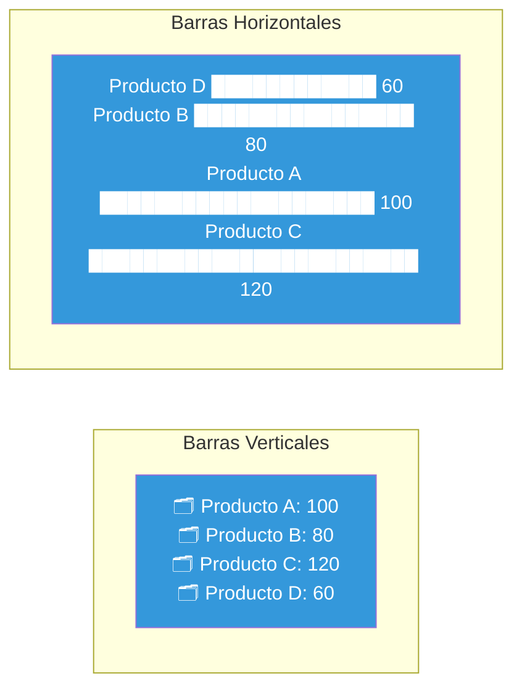
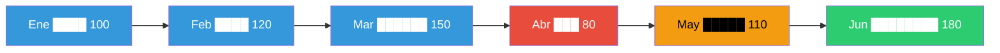
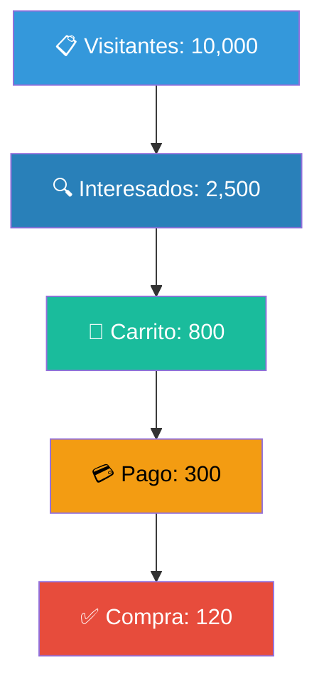
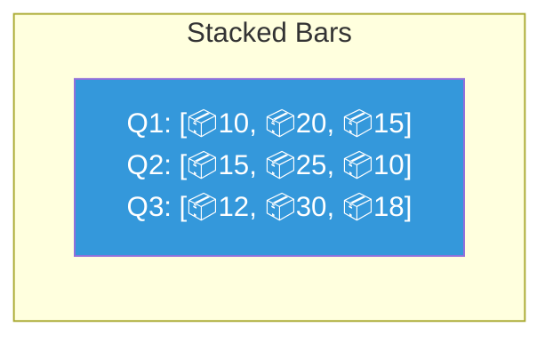
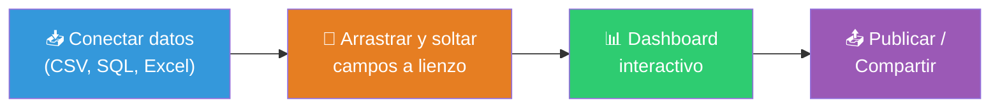
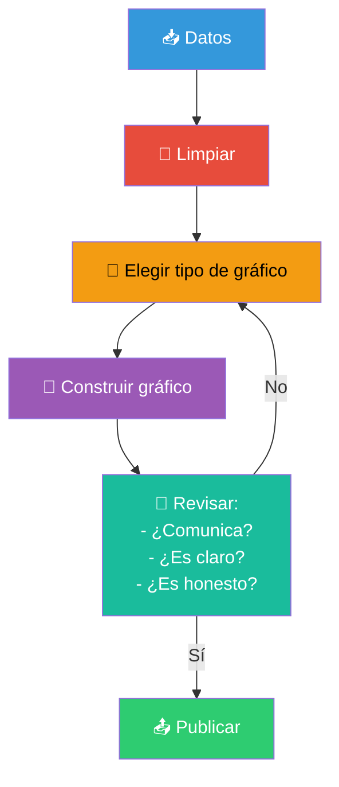

# Visualización de datos

La visualización de datos es el arte y la ciencia de **comunicar información a través de gráficos**. Un buen gráfico puede revelar patrones, tendencias y anomalías que pasan desapercibidos en tablas de números.

> "Un gráfico vale más que mil tablas" — y una tabla bien hecha vale más que mil datos crudos.



---

## ¿Qué gráfico usar?

La regla más importante: **el gráfico debe responder a una pregunta**, no al revés.



---

## Charting (Tipos de gráficos)

Cada tipo de gráfico tiene un **propósito específico**. Usar el incorrecto puede confundir o engañar a tu audiencia.

---

### Gráfico de Barras / Columnas

**Propósito**: Comparar valores entre categorías discretas.



| Regla | Recomendación |
|-------|--------------|
| **Barras verticales** | 3–10 categorías, nombres cortos |
| **Barras horizontales** | Más de 10 categorías, nombres largos |
| **Ordenar** | Siempre ordena de mayor a menor (o viceversa) |
| **Base en cero** | El eje Y debe comenzar en 0 (si no, distorsiona) |

```python
import matplotlib.pyplot as plt
import seaborn as sns

# Barras
sns.barplot(data=df, x="categoria", y="valor")
plt.title("Ventas por Categoría")
plt.show()

# Barras horizontales
sns.barplot(data=df, y="categoria", x="valor")  # intercambiar x/y
plt.title("Ventas por Categoría")
plt.show()
```

```r
library(ggplot2)

ggplot(df, aes(x = categoria, y = valor)) +
  geom_bar(stat = "identity", fill = "steelblue") +
  labs(title = "Ventas por Categoría")
```

---

### Gráfico de Líneas

**Propósito**: Mostrar **tendencias en el tiempo** (series de tiempo).



| Regla | Recomendación |
|-------|--------------|
| **Eje X** | Siempre tiempo (fechas) |
| **Eje Y** | Debe comenzar en 0 o cerca, o indicarlo |
| **Múltiples líneas** | Máximo 4–5, usar colores distintos + marcadores |
| **Puntos** | Marcar los datos reales (no solo la línea) |

```python
# Líneas
plt.plot(df["fecha"], df["ventas"], marker="o")
plt.title("Ventas por Mes")
plt.xlabel("Fecha")
plt.ylabel("Ventas ($)")
plt.xticks(rotation=45)
plt.show()

# Múltiples líneas
for producto in df["producto"].unique():
    subset = df[df["producto"] == producto]
    plt.plot(subset["fecha"], subset["ventas"], label=producto, marker="o")
plt.legend()
plt.show()
```

```r
ggplot(df, aes(x = fecha, y = ventas, group = producto, color = producto)) +
  geom_line(linewidth = 1) +
  geom_point() +
  labs(title = "Ventas por Mes y Producto")
```

---

### Scatter Plot (Dispersión)

**Propósito**: Mostrar la **relación entre dos variables numéricas**.

```python
# Scatter plot simple
sns.scatterplot(data=df, x="ingreso", y="gasto")
plt.title("Ingreso vs Gasto")
plt.show()

# Con línea de tendencia
sns.regplot(data=df, x="ingreso", y="gasto")  # incluye regresión
plt.show()

# Por categoría
sns.scatterplot(data=df, x="ingreso", y="gasto", hue="region", size="poblacion")
plt.title("Ingreso vs Gasto por Región")
plt.show()
```

```r
ggplot(df, aes(x = ingreso, y = gasto, color = region, size = poblacion)) +
  geom_point(alpha = 0.7) +
  geom_smooth(method = "lm", se = FALSE) +
  labs(title = "Ingreso vs Gasto por Región")
```

> ⚠️ **Cuidado con las escalas**: Si las variables tienen magnitudes muy distintas, el gráfico puede ser engañoso. Considera escalar o usar escalas logarítmicas.

---

### Gráfico de Embudo (Funnel)

**Propósito**: Mostrar la **progresión** o **pérdida** a través de etapas (ventas, conversiones, procesos).



```python
# Simular datos de embudo
etapas = ["Visitantes", "Interesados", "Carrito", "Pago", "Compra"]
valores = [10000, 2500, 800, 300, 120]

# Embar left: invertir orden para que el más grande esté arriba
plt.barh(etapas[::-1], valores[::-1])
plt.title("Embudo de Conversión")
plt.xlabel("Cantidad")
plt.show()
```

---

### Histograma

**Propósito**: Mostrar la **distribución** de una variable numérica (frecuencia por intervalos).

```python
# Histograma
df["edad"].hist(bins=30, edgecolor="black")
plt.title("Distribución de Edad")
plt.xlabel("Edad")
plt.ylabel("Frecuencia")
plt.show()

# Histograma + curva de densidad
sns.histplot(data=df, x="edad", bins=30, kde=True)
plt.show()
```

```r
ggplot(df, aes(x = edad)) +
  geom_histogram(aes(y = after_stat(density)), bins = 30, fill = "steelblue") +
  geom_density(color = "red", linewidth = 1) +
  labs(title = "Distribución de Edad")
```

> **Consejo**: Prueba con diferentes números de `bins` — muy pocos ocultan detalles, muchos generan ruido.

---

### Gráficos Apilados (Stacked Charts)

**Propósito**: Mostrar la **composición** y cómo cambia a través del tiempo o categorías.



```python
# Stacked bar (barras apiladas)
df_pivot = df.pivot_table(index="trimestre", columns="producto", values="ventas")
df_pivot.plot(kind="bar", stacked=True)
plt.title("Ventas por Trimestre y Producto")
plt.ylabel("Ventas ($)")
plt.show()

# Stacked area (áreas apiladas)
df_pivot.plot(kind="area", stacked=True)
plt.title("Composición de Ventas por Trimestre")
plt.show()
```

```r
ggplot(df, aes(x = trimestre, y = ventas, fill = producto)) +
  geom_bar(stat = "identity", position = "stack") +
  labs(title = "Ventas por Trimestre y Producto")
```

---

### Mapas de Calor (Heatmap)

**Propósito**: Visualizar **matrices de datos** — ideal para correlaciones o datos en cuadrícula.

```python
import seaborn as sns

# Matriz de correlación
corr = df.corr()
sns.heatmap(corr, annot=True, cmap="coolwarm", center=0)
plt.title("Matriz de Correlación")
plt.show()

# Heatmap personalizado
sns.heatmap(corr, annot=True, cmap="RdYlGn", center=0,
            linewidths=0.5, fmt=".2f")
plt.show()
```

```r
library(reshape2)

corr <- cor(df %>% select(where(is.numeric)))
melted_corr <- melt(corr)

ggplot(melted_corr, aes(x = Var1, y = Var2, fill = value)) +
  geom_tile() +
  scale_fill_gradient2(low = "red", mid = "white", high = "green") +
  geom_text(aes(label = round(value, 2))) +
  labs(title = "Matriz de Correlación")
```

---

### Gráfico de Torta (Pie Chart)

**Propósito**: Mostrar **partes de un todo** (proporciones). Úsalo con **mucha precaución**.

```python
# Pie chart
df.groupby("categoria")["ventas"].sum().plot(kind="pie", autopct="%1.1f%%")
plt.title("Distribución de Ventas por Categoría")
plt.ylabel("")  # Ocultar label
plt.show()
```

```r
df %>%
  group_by(categoria) %>%
  summarise(ventas = sum(ventas)) %>%
  ggplot(aes(x = "", y = ventas, fill = categoria)) +
  geom_bar(stat = "identity", width = 1) +
  coord_polar("y") +
  labs(title = "Distribución de Ventas por Categoría")
```

#### ⚠️ Reglas de oro para pie charts

| ✅ Haz esto | ❌ No hagas esto |
|------------|-----------------|
| Máximo 5 segmentos | Más de 5 categorías |
| Etiquetas directas (con % ) | Leyenda separada confunde |
| Segmentos claramente diferentes | Colores muy similares |
| Usar solo para proporciones | Para comparar, usa barras |

> 🚫 **Los pie charts son controversiales**: el ojo humano no compara ángulos fácilmente. Para comparar proporciones, prefiere barras o barras apiladas.

---

### Tabla de decisión rápida

| Quieres mostrar... | Usa... |
|--------------------|--------|
| Comparación entre categorías | **Barras** |
| Tendencia en el tiempo | **Líneas** |
| Relación entre 2 variables | **Scatter** |
| Distribución de 1 variable | **Histograma / Box Plot** |
| Partes de un todo | **Pie** (pocas) o **Barras apiladas** (muchas) |
| Progresión de etapas | **Embudo (Funnel)** |
| Correlación entre muchas variables | **Heatmap** |
| Cambio en composición | **Áreas apiladas** |

---

## Herramientas de visualización

Existen dos grandes categorías: **herramientas visuales** (sin código) y **librerías de código**.

### Tableau

Tableau es la herramienta **#1 del mercado** para visualización de datos empresarial. Su fortaleza es la facilidad para crear dashboards interactivos sin escribir código.



**Fortalezas:**
- Interfaz drag & drop intuitiva
- Dashboards interactivos sin código
- Conexión a múltiples fuentes
- Comunidad y recursos enormes (Tableau Public)

**Debilidades:**
- Costoso (licencias)
- Limitado en transformaciones complejas
- Curva de aprendizaje para funciones avanzadas

### Power BI

Power BI es la herramienta de **Microsoft** para business intelligence. Se integra perfectamente con el ecosistema Microsoft (Excel, Azure, SQL Server).

**Fortalezas:**
- Integración nativa con Excel y SQL Server
- Modelo de datos robusto (DAX, Power Query)
- Precio accesible (incluso versión gratuita)
- Publicación en web fácil

**Debilidades:**
- Solo Windows (aunque hay versión web limitada)
- Visualizaciones por defecto limitadas (hay marketplace)
- Requiere aprender DAX para cálculos complejos

### ¿Tableau o Power BI?

| Aspecto | Tableau | Power BI |
|---------|---------|----------|
| **Facilidad de uso** | ⭐⭐⭐⭐⭐ | ⭐⭐⭐⭐ |
| **Integración Microsoft** | ⭐⭐ | ⭐⭐⭐⭐⭐ |
| **Precio** | 💰💰💰💰 | 💰💰 |
| **Dashboards interactivos** | ⭐⭐⭐⭐⭐ | ⭐⭐⭐⭐ |
| **Modelado de datos** | ⭐⭐⭐ | ⭐⭐⭐⭐⭐ |
| **Comunidad** | ⭐⭐⭐⭐⭐ | ⭐⭐⭐⭐ |

> 💡 **Recomendación**: Si tu empresa usa Microsoft, elige **Power BI**. Si buscas lo mejor en visualización, elige **Tableau**. Cualquiera de las dos es una habilidad valiosa en el mercado.

---

## Librerías de visualización (programación)

### Matplotlib (Python)

La librería **fundacional** de visualización en Python. Ofrece control total pero requiere más código.

```python
import matplotlib.pyplot as plt

# Figura y ejes explícitos
fig, axes = plt.subplots(2, 2, figsize=(10, 8))

# Subplot 1: Líneas
axes[0, 0].plot(df["fecha"], df["ventas"])
axes[0, 0].set_title("Ventas")

# Subplot 2: Barras
axes[0, 1].bar(df["categoria"], df["valor"])
axes[0, 1].set_title("Barras")

# Subplot 3: Dispersión
axes[1, 0].scatter(df["x"], df["y"])
axes[1, 0].set_title("Scatter")

# Subplot 4: Histograma
axes[1, 1].hist(df["edad"], bins=20)
axes[1, 1].set_title("Histograma")

plt.tight_layout()
plt.show()
```

**Cuándo usarla:** Necesitas control total sobre cada elemento del gráfico.

---

### Seaborn (Python)

Construida **sobre matplotlib**, ofrece gráficos estadísticos con mejor estilo por defecto y menos código.

```python
import seaborn as sns

# Estilo
sns.set_theme(style="whitegrid")

# Gráficos estadísticos listos para usar
sns.boxplot(data=df, x="categoria", y="valor")
sns.violinplot(data=df, x="categoria", y="valor")
sns.pairplot(df, hue="categoria")
sns.heatmap(df.corr(), annot=True, cmap="coolwarm")
```

**Cuándo usarla:** Análisis exploratorio (EDA) y gráficos estadísticos **rápidos y bonitos**.

---

### ggplot2 (R)

El **estándar de oro** de la visualización. Se basa en la **Gramática de Gráficos** (The Grammar of Graphics): construyes capa por capa.

```r
library(ggplot2)

# La estructura base
ggplot(data = df, aes(x = categoria, y = valor)) +  # Datos + estética
  geom_boxplot() +                                     # Capa geométrica
  labs(title = "Distribución por Categoría") +         # Etiquetas
  theme_minimal()                                      # Tema
```

**Concepto clave — Capas:**
```r
ggplot(df, aes(x = fecha, y = ventas, color = producto)) +
  geom_line() +           # Capa 1: líneas
  geom_point() +          # Capa 2: puntos
  geom_smooth(method = "lm") +  # Capa 3: regresión
  facet_wrap(~region) +   # Capa 4: facetas por región
  theme_bw() +            # Capa 5: tema
  labs(title = "Ventas por Producto y Región")  # Capa 6: títulos
```

**Cuándo usarla:** Siempre que uses R. Es la librería **definitiva** para visualización estática.

---

### Comparativa: matplotlib vs seaborn vs ggplot2

| Aspecto | matplotlib | seaborn | ggplot2 |
|---------|-----------|---------|---------|
| **Lenguaje** | Python | Python | R |
| **Curva de aprendizaje** | ⭐⭐⭐ | ⭐⭐ | ⭐⭐ |
| **Control** | ⭐⭐⭐⭐⭐ | ⭐⭐⭐ | ⭐⭐⭐⭐ |
| **Estética por defecto** | ⭐⭐ | ⭐⭐⭐⭐ | ⭐⭐⭐⭐⭐ |
| **Gráficos estadísticos** | ⭐⭐ | ⭐⭐⭐⭐⭐ | ⭐⭐⭐⭐⭐ |
| **Flexibilidad** | ⭐⭐⭐⭐⭐ | ⭐⭐⭐ | ⭐⭐⭐⭐ |

---

## Buenas prácticas de visualización

### Reglas de oro

1. **Elige el gráfico correcto** para tu pregunta (usa el diagrama de arriba)
2. **Simplifica** — elimina todo lo que no aporte (gridlines excesivos, leyendas innecesarias, 3D)
3. **Usa color con propósito** — no decores, comunica
4. **Etiqueta directamente** — mejor una etiqueta al lado que una leyenda separada
5. **Ordena los datos** — del más al menos relevante
6. **Cuenta una historia** — tu gráfico debe tener un título que resuma el hallazgo

### Errores comunes

| ❌ Error | ✅ Solución |
|---------|------------|
| Eje Y que no empieza en 0 (exagera diferencias) | Empieza en 0 o indica claramente |
| 3D innecesario (distorsiona percepciones) | Usa 2D |
| Demasiados colores | Paleta de 3–5 colores máx. |
| Pie chart con 10 categorías | Usa barras |
| Leyenda en vez de etiquetas directas | Etiqueta directamente en el gráfico |
| Gráfico sin título | Siempre incluye título |
| Escala engañosa | Usa escalas consistentes |



---

> 📁 **Ver también**: [[analisis-descriptivo]], [[ganar-habilidades-de-programacion]], [[analisis-reportando-con-excel]]

## Relacionados:
- [[analisis-descriptivo]] #anterior 
- [[analisis-estadistico]] #siguiente 