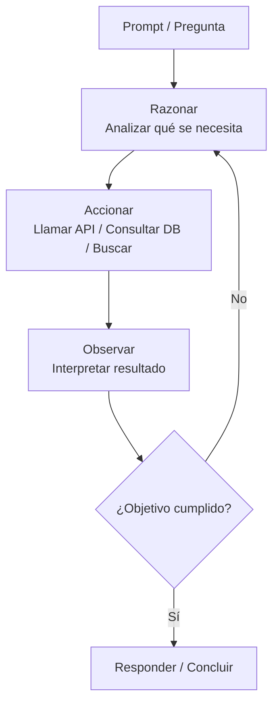

# 🧠 Conceptos Avanzados de Prompting y Agentes

TL;DR: Guía técnica sobre estrategias avanzadas de interacción con LLMs, incluyendo técnicas de razonamiento CoT, patrones ReAct y el ecosistema de orquestación de agentes autónomos.

## 🏗️ Arquitectura de Mensajes y Control de Contexto

### Uso de Delimitadores para Claridad Estructural
Usa delimitadores para ayudar a la IA a distinguir entre instrucciones, datos de entrada y formatos de salida, reduciendo la confusión del modelo.
- `"""` Comillas triples (estándar para bloques de texto).
- `---` Triple guion (separación de secciones).
- `< >` Corchetes angulares (XML - altamente recomendado para modelos como Claude).
- `===` Triple igual (separación de contextos fuertes).

### Aprendizaje en Contexto (In-Context Learning)
Proporcionar ejemplos mejora drásticamente el desempeño en tareas de clasificación, extracción y generación:
- **Zero-Shot:** Sin ejemplos (confía plenamente en el pre-entrenamiento).
- **One-Shot:** Un solo ejemplo de referencia para establecer el formato.
- **Few-Shot:** Varios ejemplos para establecer un patrón lógico y estilístico claro.

### Formatos de Salida y Manejo de Excepciones (Output Control)
Fuerza a la IA a responder en formatos procesables por código para integraciones fluidas:
- **Específicos:** JSON, XML, HTML, CSV.
- **Lógica Condicional:** Instruye a la IA sobre qué hacer si no puede cumplir la tarea. 
  - *Ejemplo:* "Si el mensaje no es una consulta técnica, responde con `{ "error": "tipo_invalido" }`".

---

## 🧠 Técnicas de Razonamiento y Procesamiento Lógico

### Cadena de Pensamiento (Chain of Thought - CoT)
- Pide a la IA que "piense en voz alta" o deslose los pasos antes de concluir. Esto mejora la precisión en problemas matemáticos y lógicos complejos.
- **Reflexión Interna:** Instruye a la IA a generar una solución inicial, criticarla internamente en busca de fallos y proponer una mejora antes de entregar la respuesta final.

### ReAct (Reasoning + Action)
Patrón avanzado basado en el ciclo iterativo: **Razonar -> Accionar -> Concluir**.
- Es el núcleo de los agentes que interactúan con herramientas externas (APIs, bases de datos, navegación web).

### Guided Prompting (Prompting Guiado)
Divide la tarea en una secuencia obligatoria de pasos para asegurar que no se omitan partes críticas.
- *Ejemplo:* "1. Investiga quejas -> 2. Crea tabla de pesos -> 3. Propón soluciones."

---

## 🤖 Casos de Uso Empresarial y Plataformas de Orquestación

| Área | Aplicaciones Prácticas de Agentes |
| :--- | :--- |
| **Gestión de Proyectos** | Automatización de minutas, detección de hitos y redacción de agendas. |
| **Atención al Cliente** | Agentes RAG conectados a bases de conocimiento y personalización de respuestas. |
| **Investigación (I+D)** | Recopilación masiva de datos, informes comparativos y vigilancia tecnológica. |
| **Marketing Digital** | Análisis de sentimientos, generación de copy multicanal y segmentación. |
| **Recursos Humanos** | Cribado de CVs, actualización de políticas y procesos de onboarding. |

### Ecosistema de Herramientas y Frameworks
- **Orquestadores Locales/Código:** Relevance AI, CrewAI, LangGraph, Lindy.ai.
- **Plataformas Enterprise:** Salesforce Agentforce, Microsoft Copilot Agents, Claude Computer Use.

---

## 🔗 Vínculos y Referencias Técnicas
- **Índice Maestro:** [[indice-desarrollo-ia]] #parent
- **Estrategias Anthropic:** [[guia-de-prompts-de-anthropic]] #related
- **Biblioteca de Prompts:** [[biblioteca-200-prompts-programacion]] #related

## 🏁 Checklist de Calidad RAG
- [x] Frontmatter completo con metadatos de navegación.
- [x] TL;DR presente y conciso.
- [x] Títulos descriptivos para cada sección.
- [x] Enlaces semánticos con etiquetas de relación.
- [x] Estructura jerárquica clara y secciones autónomas.
