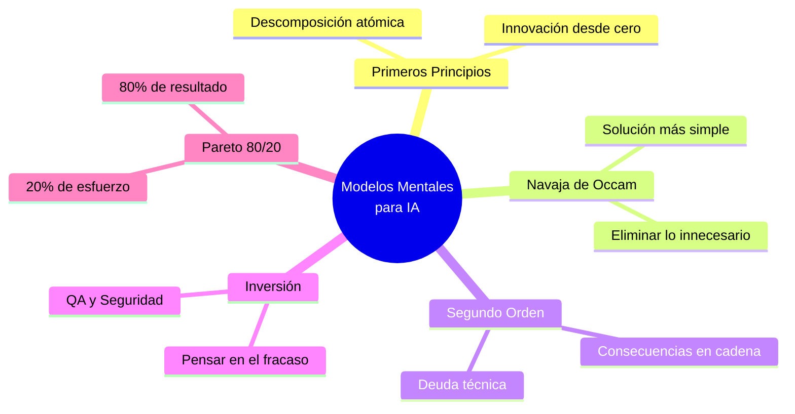

# Guía de Modelos Mentales para la Era de la IA

> **TL;DR:** Los modelos mentales actúan como un sistema operativo lógico para los prompts, forzando a los LLMs a abandonar respuestas genéricas en favor de razonamientos críticos y estructurados.

## Fundamentos de Modelos Mentales en Prompting
La IA es una máquina probabilística que tiende al "promedio" del conocimiento. Al inyectar modelos mentales en el contexto, se delimita el espacio de búsqueda del modelo hacia marcos de pensamiento específicos que han demostrado eficacia en la resolución de problemas humanos complejos.

---

## Modelos Mentales Clave y sus Prompts de Aplicación

### 1. Pensamiento de Primeros Principios (First Principles)
**Concepto:** Descomponer un sistema en sus verdades fundamentales e irreductibles para construir una solución desde la base.
- **Uso IA:** Innovación radical, arquitectura de software limpia.
- **Prompt:** *"Analiza el problema de [X] usando Primeros Principios. Ignora analogías existentes. Descompón el sistema en sus verdades lógicas básicas y propón una solución desde cero."*

### 2. La Navaja de Occam (Occam's Razor)
**Concepto:** La explicación o solución más simple suele ser la correcta.
- **Uso IA:** Simplificación de código legacy, optimización de procesos.
- **Prompt:** *"Aplica la Navaja de Occam a este diseño: identifica componentes innecesarios y propón la implementación más minimalista posible."*

### 3. Pensamiento de Segundo Orden (Second-Order Thinking)
**Concepto:** Considerar las consecuencias de las consecuencias en el tiempo.
- **Uso IA:** Evaluación de deuda técnica y riesgos de negocio.
- **Prompt:** *"Si implementamos [X], ¿cuáles son los efectos de segundo y tercer orden en la escalabilidad y mantenimiento a largo plazo?"*

### 4. Técnica de Inversión (Inversion)
**Concepto:** Pensar en cómo garantizar el fracaso para identificar puntos ciegos y evitarlos.
- **Uso IA:** QA agresivo, ciberseguridad, análisis de robustez.
- **Prompt:** *"Enumera todas las formas posibles en las que este código podría fallar catastróficamente en producción. Luego, genera soluciones preventivas."*

### 5. El Principio de Pareto (80/20)
**Concepto:** El 80% de los resultados provienen del 20% de las causas.
- **Uso IA:** Aprendizaje acelerado de nuevas tecnologías.
- **Prompt:** *"Identifica el 20% de los conceptos de [Tecnología] que me darán el 80% de la capacidad práctica para construir proyectos reales hoy."*

---

## Estrategias de Integración en el Flujo de Trabajo
Para maximizar la señal del LLM, integra estos modelos de forma recurrente:
1.  **Asignación de Rol:** *"Actúa como un arquitecto senior usando Inversión..."*
2.  **Validación Cruzada:** Pide a la IA analizar una misma idea bajo dos modelos mentales opuestos.
3.  **Refactorización Lógica:** Usa *Primeros Principios* para limpiar la lógica de negocio antes de generar el código.

---

## Relaciones Semánticas y Contexto
- [[indice-desarrollo-ia]] #parent
- [[conceptos-avanzados-prompting]] #related
- [[guia-gemini-cli]] #related
- [[harness-engineering-guia]] #related

---

## Checklist de Calidad RAG (Auto-Evaluación)
- [x] ¿El YAML tiene `id`, `domain` y `up`?
- [x] ¿Cada H2 describe el contenido sin ambigüedad?
- [x] ¿El TL;DR resume la nota en una frase?
- [x] ¿Se usan tags de relación (#related, #parent)?
