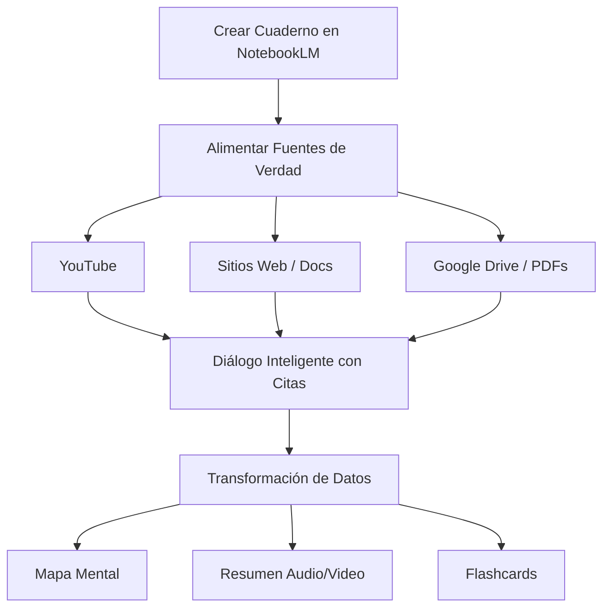

# Apuntes Curso de Desarrollo con IA - Día 1

TL;DR: Primer día de formación enfocado en el aprendizaje acelerado mediante NotebookLM y los fundamentos estratégicos de la ingeniería de prompts para la eficiencia técnica.

## 🔗 Vínculos de Continuidad
- **Siguiente Sesión:** [[sesion-02-arquitecto-orquestacion-agentes]] #child - El Desarrollador como Arquitecto.
- **Referencia de Formato:** [[guia-rapida-markdown]] #requires - Guía de Markdown.
- **Índice Maestro:** [[indice-desarrollo-ia]] #parent

## 📈 Impacto y Estadísticas de la IA en la Programación Actual
La IA se ha integrado plenamente en el desarrollo de software. No es una promesa futura, sino una realidad que acelera el proceso creativo y técnico.

**Las Cifras de la Revolución:**
- **45%** del código ya es escrito por IA (colaboración como estándar).
- **55%** de aceleración en el proceso de desarrollo.
- **90%** de incremento en la satisfacción laboral al delegar tareas tediosas.

---

## ✈️ El Rol del Programador como Supervisor Experto (Copiloto)
El programador sigue siendo el **piloto**. La IA es un asistente capaz, pero necesita dirección experta y visión de proyecto.

### El Peligro del "Vibe Coding"
Consiste en lanzar prompts y aceptar el resultado sin auditarlo. Un profesional debe:
- Guiar a la IA con conocimiento técnico sólido.
- Auditar cada línea de código sugerida por el modelo.
- Asegurarse de que la solución sea robusta, escalable y eficiente.

---

## 📚 Metodología de Aprendizaje Acelerado con NotebookLM
Para combatir las "alucinaciones" de las IA genéricas, se utiliza **NotebookLM** de Google, que permite acotar el conocimiento a fuentes confiables y verificadas.

### Guía Paso a Paso de Implementación:
1. **Crear Cuaderno:** Un lienzo en blanco donde tú tienes el control total del contexto.
2. **Alimentar con Fuentes de Verdad:**
   - Vídeos de YouTube (la IA procesa la transcripción).
   - Sitios Web y documentación oficial (ej. MDN, Python.org).
   - Documentos de Google Drive o PDF locales.
3. **Diálogo Inteligente:** Realizar preguntas sobre las fuentes cargadas. NotebookLM utiliza **citas numeradas [1]** que enlazan directamente al punto exacto de la fuente original.
4. **Herramientas de Transformación de Datos:**
   - **Mapa Mental:** Organiza visualmente conceptos clave.
   - **Resumen de Audio/Video:** Genera un resumen rápido para repasar.
   - **Flashcards:** Crea tarjetas para reforzar el aprendizaje activo.

---

## 🏗️ Estrategias de Ingeniería de Prompts para Análisis Técnico
La ingeniería de prompts ha pasado de buscar el "prompt perfecto" a un proceso iterativo y estratégico basado en el razonamiento.

### Caso Práctico: Análisis Profundo de Repositorios en GitHub
Se recomienda un enfoque escalonado para entender bases de código desconocidas:
1. **Análisis Básico:** Obtener una visión general de la funcionalidad principal.
2. **Razonamiento Profundo:** Usar modelos de razonamiento (ej. ChatGPT Thinking) para entender la arquitectura subyacente.
3. **Prompt Refinado de Estructura:** Solicitar un mapa de carpetas, flujo de ejecución, dependencias y puntos críticos (hotspots).
4. **Deep Research:** Usar herramientas de investigación para generar informes técnicos exhaustivos de arquitectura.

---

## 🎨 Flujos de Prototipado Rápido con Firebase Studio
La IA permite eliminar el "síndrome de la hoja en blanco" mediante flujos de trabajo visuales que conectan diseño y código.

### Flujo de Trabajo desde la Idea:
- **Conceptualización Visual:** Crear un boceto en Excalidraw o papel.
- **Creación de Contenido:** Usar un LLM para generar el "copy" (textos optimizados para SEO y conversión).
- **Firebase Studio:** Subir la imagen del boceto y el texto. La IA genera la arquitectura completa (React, Tailwind, etc.) y permite el despliegue inmediato.

---

## 🏁 Síntesis del Valor Estratégico de la IA
La IA no es una amenaza, sino un potenciador que permite a los desarrolladores ser más productivos, creativos y centrarse en la arquitectura de alto nivel en lugar de la sintaxis repetitiva.

## 🏁 Checklist de Calidad RAG
- [x] Frontmatter completo con metadatos de navegación.
- [x] TL;DR presente y conciso.
- [x] Títulos descriptivos para cada sección.
- [x] Enlaces semánticos con etiquetas de relación.
- [x] Estructura jerárquica clara y secciones autónomas.
