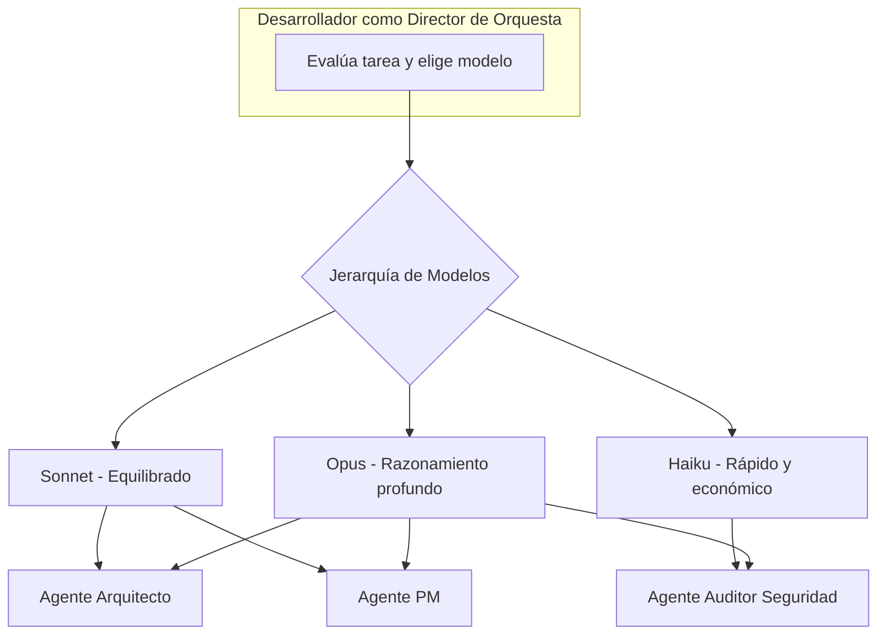

# Apuntes Curso de Desarrollo con IA - Día 2

TL;DR: Exploración del rol del desarrollador como arquitecto de sistemas IA, centrándose en la gestión de requisitos, orquestación de agentes y seguridad del código.

## 🔗 Vínculos de Continuidad
- **Sesión Anterior:** [[sesion-01-aprendizaje-notebooklm-prompts]] #parent - Aprendizaje Acelerado e Ingeniería de Prompts.
- **Siguiente Sesión:** [[sesion-03-automatizacion-n8n-workflows]] #child - Automatización con n8n.
- **Referencia Técnica:** [[biblioteca-200-prompts-programacion]] #requires - Guía Maestra de Prompts.
- **Índice Maestro:** [[indice-desarrollo-ia]] #parent

## 🏛️ Evolución del Rol: De Codificador a Arquitecto
La IA no llega para reemplazar a los desarrolladores, sino para potenciar sus habilidades. El rol está evolucionando de ser un "picacódigo" enfocado en la escritura manual, a convertirse en un **arquitecto, estratega y supervisor** de sistemas inteligentes.

---

## 📋 Automatización de Requisitos y Gestión de Ciclo de Vida
Optimizar la gestión de requisitos es un pilar estratégico. La IA permite convertir un flujo fragmentado en uno ágil y automatizado.

### Fases del Proceso Moderno:
1. **Fase 1: Extracción de Notas de Reunión**
   - Uso de herramientas como Gemini para transcribir y resumir videollamadas técnicas.
2. **Fase 2: Generación de Historias de Usuario (User Stories)**
   - Estructura: `Como [rol], quiero [qué], para que [beneficio]`.
   - **Ejemplo de Prompt:** "Genérame historias de usuario en el formato COMO/QUIERO/PARA basándote en estas notas de negocio..."
3. **Fase 3: Definición de Criterios de Aceptación (Gherkin)**
   - Se utiliza el lenguaje **Gherkin** (`Given-When-Then`) para definir escenarios de prueba claros y medibles.
4. **Fase 4: Sincronización con Herramientas de Gestión**
   - Uso de **Claude Code** y servidores **MCP** (Model Context Protocol) para conectar la IA con **Linear**, Asana o Jira.
5. **Fase 5: Desarrollo Guiado por TDD (Test-Driven Development)**
   - Ciclo: Crear prueba -> IA genera código que falla (rojo) -> IA implementa lógica para pasar la prueba (verde).

---

## 🧠 Gestión de Contexto y Reducción de Alucinaciones
El mayor problema de una IA genérica es la falta de contexto específico del proyecto.

### La Solución: Preparación Estructural del Terreno
- **Carpeta `context/`:** Añadir archivos clave como esquemas SQL para que la IA entienda la estructura de la base de datos de forma autónoma.
- **Archivo `agents.md` o `GEMINI.md`:** Un estándar para guiar a los agentes de IA:
  - **Definir Reglas de Código:** (ej. "usar snake_case para variables").
  - **Establecer Fuentes de Verdad:** Dónde encontrar la información clave del sistema.
  - **Documentar la Misión:** Propósito general y arquitectura del software.

---

## 🎭 Orquestación de Agentes Especializados
El desarrollador actúa como un **Director de Orquesta** coordinando diferentes modelos según su capacidad.

### Jerarquía de Modelos (Caso Anthropic):
- **Opus:** El "modelo de razonamiento", ideal para tareas de arquitectura profunda.
- **Sonnet:** El modelo de referencia, equilibrado para la mayoría de tareas de desarrollo.
- **Haiku:** Rápido y económico, para tareas sencillas, scripts y depuración rápida.

### Tipos de Agentes Especializados:
- **Agente Arquitecto:** Analiza repositorios y genera diagramas (ej. Mermaid).
- **Agente Project Manager (PM):** Estima perfiles necesarios y crea hitos de proyecto.
- **Agente Auditor de Seguridad:** Revisa el código en busca de vulnerabilidades (OWASP).

---

## 🛡️ Principios de Seguridad y Auditoría en Código Generado
Principios fundamentales: **Security by Design** y **Security by Default**.

### Riesgos Inherentes a la Generación por IA:
- **Vulnerabilidades por Defecto:** La IA puede sugerir credenciales débiles o controles de acceso insuficientes si no se le restringe.
- **Responsabilidad del Arquitecto:** Auditar activamente el código implementando:
  - Prevención de ataques de fuerza bruta.
  - Almacenamiento seguro de secretos y hashing de contraseñas.
  - Control de acceso riguroso (RBAC) en el lado del servidor.

---

## 🏁 Síntesis del Rol del Desarrollador Moderno
La IA es la herramienta más avanzada para construir el futuro, pero el verdadero valor reside en el desarrollador que sabe **guiarla, cuestionarla y asegurar la integridad de su trabajo**.

## 🏁 Checklist de Calidad RAG
- [x] Frontmatter completo con metadatos de navegación.
- [x] TL;DR presente y conciso.
- [x] Títulos descriptivos para cada sección.
- [x] Enlaces semánticos con etiquetas de relación.
- [x] Estructura jerárquica clara y secciones autónomas.
