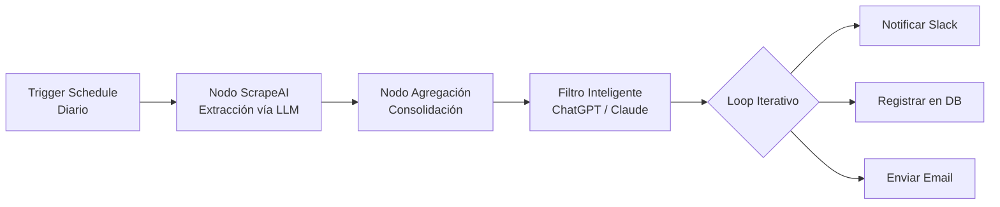

# Apuntes Curso de Desarrollo con IA - Día 3

TL;DR: Sesión práctica sobre la automatización de flujos de trabajo utilizando n8n, integrando IA para tareas de scraping, procesamiento de datos y orquestación de servicios.

## 🔗 Vínculos de Continuidad
- **Sesión Anterior:** [[sesion-02-arquitecto-orquestacion-agentes]] #parent - El Desarrollador como Arquitecto y Estratega.
- **Referencia de Prompts:** [[biblioteca-200-prompts-programacion]] #requires - Ebook de Prompts para Devs.
- **Índice Maestro:** [[indice-desarrollo-ia]] #parent

## 🤖 Fundamentos de n8n para el Ecosistema del Desarrollador
La automatización se ha convertido en una herramienta fundamental para agilizar procesos, obtener datos de formas creativas y permitir que el desarrollador se enfoque en tareas de alto valor.

### ¿Qué es n8n y por qué es la elección profesional?
n8n es una herramienta de automatización "fair-code" (auto-hospedable) que permite conectar aplicaciones mediante una interfaz visual basada en nodos.

**Beneficios Estratégicos:**
- **Soberanía de Datos:** Libertad de auto-hospedarlo en servidores propios (Docker).
- **Extensibilidad:** Permite añadir nodos de código (JavaScript o Python) y realizar llamadas a cualquier API REST.
- **Ecosistema:** Acceso a miles de plantillas de flujos de trabajo profesionales.

---

## 🏗️ Anatomía de los Workflows: Triggers, Nodos y Lógica

| Elemento | Definición Técnica | Caso de Uso |
| :--- | :--- | :--- |
| **Trigger (Lanzador)** | Evento que inicia el flujo de trabajo. | Webhook, nuevo commit en GitHub, o un cron job programado. |
| **Node (Nodo)** | Unidad de procesamiento o acción individual. | Llamada a la API de OpenAI, envío de email o consulta a SQL. |
| **Workflow (Flujo)** | Secuencia lógica de nodos conectados. | Proceso completo desde la captura de un lead hasta su registro en CRM. |

---

## 📝 Implementación de Formularios Inteligentes con Google Sheets
**Objetivo:** Crear una interfaz de captura que procese y normalice datos automáticamente.

### Flujo de Implementación:
1. **Trigger de Formulario:** Se configura un nodo de tipo "Form" que genera una URL pública para la captura de datos (ej. email y nombre).
2. **Nodo de Acción Google Sheets:** Conexión mediante OAuth/Service Account.
3. **Lógica de Deduplicación:** Uso de la opción `Append or update row` utilizando el email como clave de coincidencia para evitar registros redundantes.
4. **Mapeo de Atributos:** Sincronización precisa entre los campos del formulario y las columnas de la hoja de cálculo.

---

## 🔍 Monitoreo y Web Scraping mediante IA Filtrada
**Objetivo:** Vigilancia tecnológica automatizada para detectar novedades en sitios específicos.

### Arquitectura del Flujo:
- **Trigger Programado (Schedule):** Ejecución diaria automatizada.
- **Nodo de Extracción (ScrapeAI):** Utiliza LLMs para extraer datos específicos de una web mediante lenguaje natural, evitando el mantenimiento de selectores CSS frágiles.
- **Nodo de Agregación:** Consolida múltiples entradas en un único objeto de procesamiento.
- **Filtro Inteligente (ChatGPT/Claude):** Actúa como capa de razonamiento para descartar ruido y seleccionar solo la información que cumple con los criterios técnicos predefinidos.
- **Procesamiento Iterativo (Loops):** Recorre la lista filtrada para realizar acciones individuales (ej. notificar por Slack).

---

## 📌 Optimización del Desarrollo con la Persistencia de Datos (Pinning)
La función **"Pin"** es una característica crítica para la eficiencia en la creación de automatizaciones.

### Ventajas del Pinning:
- **Ahorro de Tokens y Costos:** Evita re-ejecutar llamadas costosas a APIs de IA durante la fase de depuración.
- **Velocidad de Desarrollo:** Permite trabajar en nodos intermedios o finales utilizando una "foto" de los datos reales capturados previamente.
- **Aislamiento de Errores:** Facilita la identificación de fallos lógicos sin depender de la volatilidad de los triggers externos.

---

## 🏁 Conclusiones y Próximos Pasos
La combinación de **n8n** y **LLMs** democratiza la creación de micro-servicios y automatizaciones complejas, permitiendo prototipar soluciones de negocio en cuestión de minutos.

> "El límite lo pone tu imaginación. Es hora de inventar, cacharrear y darle duro."

## 🏁 Checklist de Calidad RAG
- [x] Frontmatter completo con metadatos de navegación.
- [x] TL;DR presente y conciso.
- [x] Títulos descriptivos para cada sección.
- [x] Enlaces semánticos con etiquetas de relación.
- [x] Estructura jerárquica clara y secciones autónomas.
