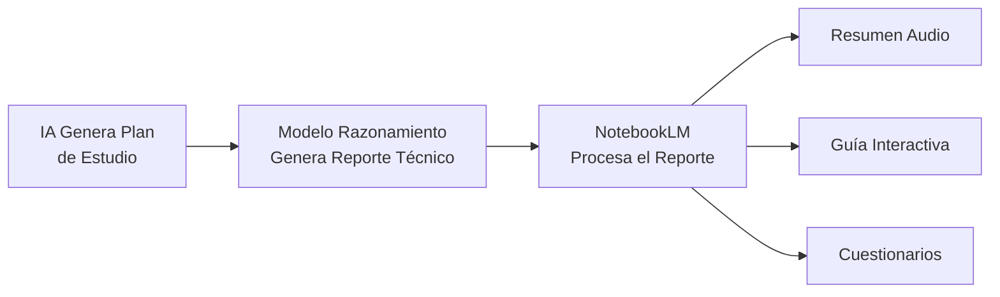

# 🧠 Estrategias y Trucos de Productividad con IA

> **TL;DR:** Maximiza el rendimiento de la IA mediante la selección de herramientas especializadas, estructuración de contexto de alta señal y flujos de aprendizaje híbridos.

## Selección de Herramientas y Modelos según el Caso de Uso
No todos los modelos son iguales; cada uno destaca en un dominio específico.

### Entornos de Desarrollo (IDEs)
- **Windsurf:** Optimizado para flujos con reglas estrictas y prompts personalizados persistentes.
- **Cursor:** El estándar actual para codificación asistida con contexto profundo de repositorio.

### Capacidades de los Modelos LLM
- **Claude (Anthropic):** El referente para razonamiento lógico, código limpio y documentación técnica.
- **Gemini (Google):** Ideal para procesar volúmenes masivos de archivos gracias a su ventana de contexto millonaria.
- **DeepSeek:** Alternativa de alto rendimiento y bajo coste con capacidades de razonamiento avanzado.

---

## Construcción de Conocimiento para Agentes de IA
Un agente es tan bueno como el contexto que recibe. Estructura tus requerimientos así:

1.  **Definición de Objetivo:** Qué debe hacer el sistema exactamente.
2.  **Contexto del Entorno:** Restricciones, tecnologías existentes y propósito.
3.  **Stack Tecnológico:** Especificar versiones y librerías preferidas.
4.  **Descomposición en Tareas:** Lista de pasos atómicos para guiar la ejecución.

---

## El Flujo de "Vibe Coding" Eficiente
Programar por sensaciones e iteración rápida requiere disciplina:
- ✅ **Reglas Claras:** Define comportamientos base (ej. "Siempre usa typing en Python").
- ✅ **Iteración Corta:** Si el modelo no resuelve el problema en 3 turnos, reinicia el hilo con un prompt refinado.
- ✅ **Validación Continua:** Crea tests automáticos para cada funcionalidad entregada por la IA.
- ✅ **Control de Versiones:** Haz commits granulares para poder revertir "alucinaciones" de código.

---

## Metodología de Aprendizaje Acelerado (IA-Stacking)
Combina múltiples herramientas para dominar temas complejos en tiempo récord:

1.  **Generación de Prompt:** Pide a una IA que diseñe un plan de estudio y te haga preguntas de validación.
2.  **Investigación Profunda:** Usa modelos de razonamiento (ej. Qwen-DeepSeek) para generar un reporte técnico detallado.
3.  **Conversión a Multimedia:** Sube el reporte a **NotebookLM** para generar:
    - Resúmenes de audio (tipo podcast).
    - Guías de estudio interactivas.
    - Cuestionarios de autoevaluación.

---

## Relaciones Semánticas y Contexto
- [[indice-desarrollo-ia]] #parent
- [[modelos-mentales-ia]] #related
- [[ia-agentes-herramientas]] #related
- [[harness-engineering-guia]] #related

---

## Checklist de Calidad RAG (Auto-Evaluación)
- [x] ¿El YAML tiene `id`, `domain` y `up`?
- [x] ¿Cada H2 describe el contenido sin ambigüedad?
- [x] ¿El TL;DR resume la nota en una frase?
- [x] ¿Se usan tags de relación (#related, #parent)?
