# APIs Gráficas

## ¿Qué es una API gráfica?

Una **API gráfica** (Application Programming Interface) es la capa de software que permite comunicarse con la **GPU**. Es el puente entre tu juego y el hardware gráfico.

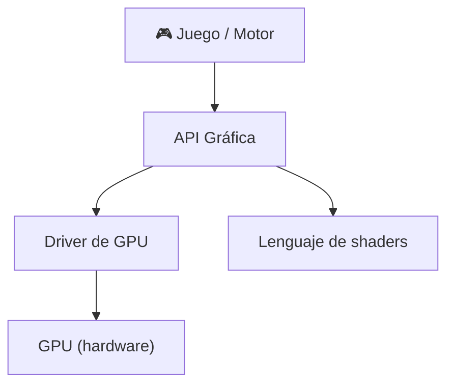

### Clasificación

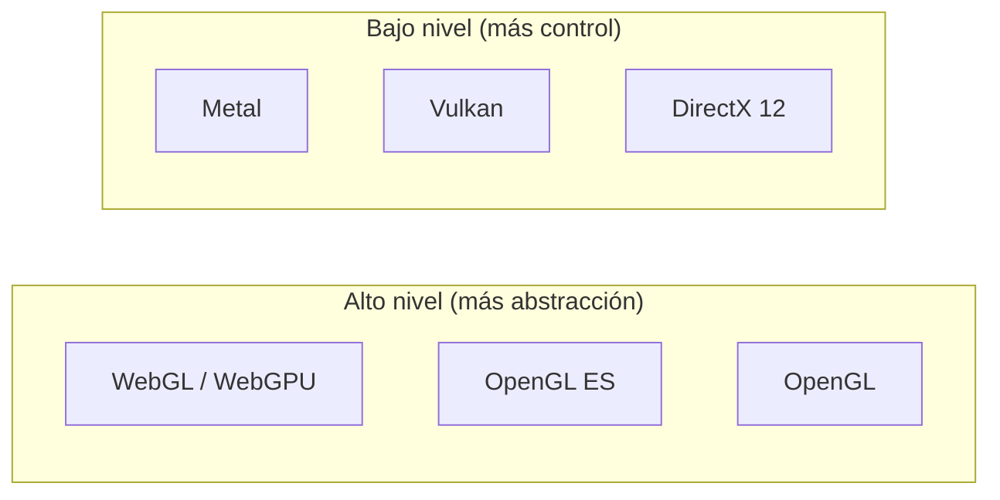

| API | Plataforma | Nivel | Lenguaje shader |
|---|---|---|---|
| **OpenGL** | Multiplataforma | Alto (obsoleto) | GLSL |
| **OpenGL ES** | Móvil / Web | Alto | GLSL ES |
| **WebGL** | Navegador | Alto | GLSL ES |
| **DirectX 11** | Windows / Xbox | Medio | HLSL |
| **DirectX 12** | Windows / Xbox | Bajo | HLSL |
| **Vulkan** | Multiplataforma | Bajo | GLSL / SPIR-V |
| **Metal** | Apple (macOS/iOS) | Bajo | MSL |
| **WebGPU** | Navegador (futuro) | Medio | WGSL |

---

## 1. OpenGL / GLSL

**OpenGL** (Open Graphics Library) fue el estándar multiplataforma por décadas. Hoy está **obsoleto** frente a Vulkan, pero sigue siendo la forma más fácil de aprender.

### 1.1. Filosofía

Máquina de estados global: configuras estado, dibujas, cambias estado, dibujas...

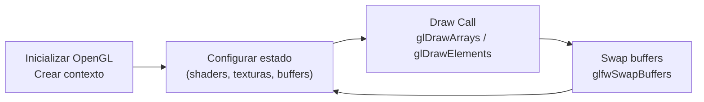

### 1.2. Pipeline clásica

```
// Ejemplo mínimo OpenGL
// 1. Compilar shaders
GLuint vs = glCreateShader(GL_VERTEX_SHADER);
glShaderSource(vs, 1, &vertexSrc, NULL);
glCompileShader(vs);

GLuint fs = glCreateShader(GL_FRAGMENT_SHADER);
glShaderSource(fs, 1, &fragmentSrc, NULL);
glCompileShader(fs);

// 2. Linkear programa
GLuint program = glCreateProgram();
glAttachShader(program, vs);
glAttachShader(program, fs);
glLinkProgram(program);

// 3. Crear buffers
GLuint VAO, VBO;
glGenVertexArrays(1, &VAO);
glGenBuffers(1, &VBO);
glBindVertexArray(VAO);
glBindBuffer(GL_ARRAY_BUFFER, VBO);
glBufferData(GL_ARRAY_BUFFER, sizeof(vertices), vertices, GL_STATIC_DRAW);

// 4. Draw loop
while (!glfwWindowShouldClose(window)) {
    glClear(GL_COLOR_BUFFER_BIT | GL_DEPTH_BUFFER_BIT);
    glUseProgram(program);
    glBindVertexArray(VAO);
    glDrawArrays(GL_TRIANGLES, 0, 3);
    glfwSwapBuffers(window);
}
```

### 1.3. Pros y Contras

| ✅ Ventajas | ❌ Desventajas |
|---|---|
| Fácil de aprender | Obsoleto (última versión: 4.6, 2017) |
| Multiplataforma real | Estado global → difícil de paralelizar |
| Gran documentación | Rendimiento inferior a Vulkan/DX12 |
| Perfecto para aprender | Control limitado sobre la GPU |

**¿Cuándo usarlo?** Aprender gráficos por computadora, prototipos educativos, herramientas simples.

---

## 2. DirectX / HLSL

**DirectX** es el conjunto de APIs de Microsoft para Windows y Xbox. **Direct3D** es la API gráfica (lo que llamamos "DirectX" a secas).

### 2.1. Filosofía

Interfaz COM (Component Object Model). Más estructurado que OpenGL.

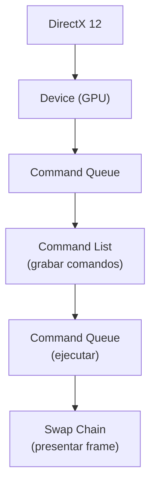

### 2.2. HLSL (High-Level Shader Language)

```
// Vertex Shader HLSL
struct VSInput {
    float3 position : POSITION;
    float3 normal   : NORMAL;
    float2 uv       : TEXCOORD;
};

struct VSOutput {
    float4 position : SV_POSITION;
    float3 normal   : NORMAL;
    float2 uv       : TEXCOORD;
};

VSOutput vs_main(VSInput input) {
    VSOutput output;
    output.position = mul(float4(input.position, 1.0), modelViewProj);
    output.normal = mul(input.normal, (float3x3)model);
    output.uv = input.uv;
    return output;
}

// Fragment Shader HLSL
float4 ps_main(VSOutput input) : SV_TARGET {
    float3 lightDir = normalize(float3(1, 1, 0));
    float diff = max(dot(normalize(input.normal), lightDir), 0.0);
    float4 albedo = texture2D(albedoMap, input.uv);
    return albedo * diff;
}
```

### 2.3. Pros y Contras

| ✅ Ventajas | ❌ Desventajas |
|---|---|
| Rendimiento excelente | Solo Windows/Xbox |
| Herramientas (PIX, Visual Studio) | HLSL solo DirectX |
| DX12: control total GPU | DX12: muy complejo |
| Estándar en PC gaming | D3D11 → en camino a obsoleto |

**¿Cuándo usarlo?** Desarrollo para Windows/Xbox, juegos comerciales para PC.

---

## 3. Vulkan / SPIR-V

**Vulkan** es la API de **bajo nivel** multiplataforma moderna (sucesora de OpenGL). Creada por Khronos (2016).

### 3.1. Filosofía

**Control explícito.** Tú manejas TODOS los recursos. Sin estado global. Sin sorpresas del driver.

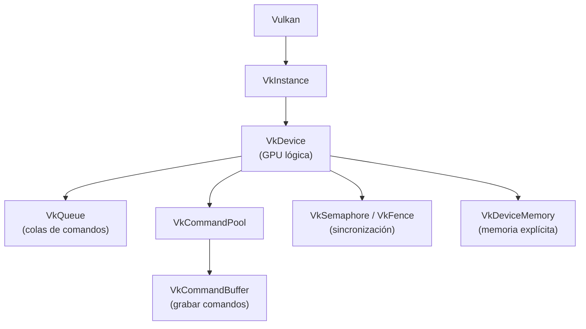

### 3.2. Pipeline vs OpenGL

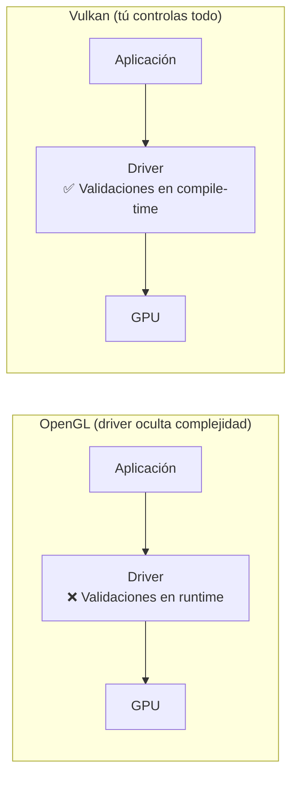

### 3.3. SPIR-V

Lenguaje intermedio binario. Los shaders se compilan a SPIR-V offline y se cargan en runtime.

```
Shader fuente (GLSL/HLSL) → SPIR-V (binario) → GPU

Ventajas:
- No necesitas compilar shaders en runtime
- Multi-lenguaje: GLSL, HLSL, Slang → SPIR-V
- Portabilidad entre APIs (Vulkan, OpenGL)
```

### 3.4. Ejemplo conceptual (lo que hay que configurar)

```cpp
// Aprox 500-1000 líneas de setup para renderizar un triángulo
// Cosas que hay que crear explícitamente:

VkInstance           // Conexión con Vulkan
VkPhysicalDevice     // GPU física
VkDevice             // GPU lógica
VkQueue              // Cola de comandos
VkCommandPool        // Pool de comandos
VkCommandBuffer      // Buffer de comandos
VkSwapchain          // Swap de frames
VkRenderPass         // Config de renderizado
VkPipeline           // Pipeline completa
VkPipelineLayout     // Layout de uniforms
VkBuffer             // Buffers de vértices
VkDeviceMemory       // Memoria explícita
VkDescriptorPool     // Pool de descriptores
VkDescriptorSet      // Binding de recursos
VkSemaphore          // Sincronización
VkFence              // Sincronización
```

### 3.5. Pros y Contras

| ✅ Ventajas | ❌ Desventajas |
|---|---|
| Rendimiento máximo | Curva de aprendizaje ENORME |
| Control total GPU | Código verbosísimo (setup enorme) |
| Multiplataforma (Win, Linux, Android) | Fácil cometer errores |
| Sin overhead del driver | Validación con capas extras |
| Ideal para motores profesionales | Overkill para proyectos pequeños |

**¿Cuándo usarlo?** Motores de juegos profesionales, renderizado de alto rendimiento, cuando OpenGL/DX11 se quedan cortos.

---

## 4. OpenGL ES

**OpenGL for Embedded Systems.** Subconjunto de OpenGL para dispositivos móviles y embedded.

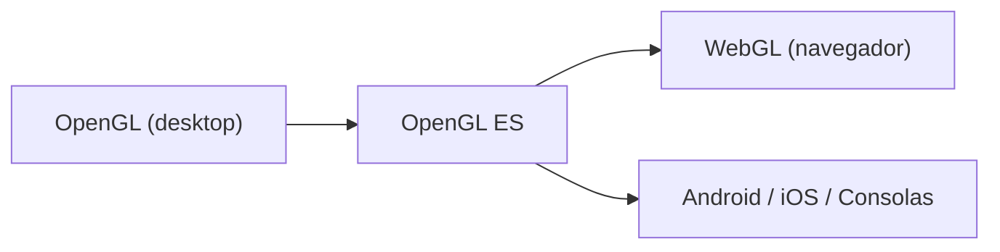

**Diferencias con OpenGL desktop:**
- Elimina funciones obsoletas (glBegin/glEnd, display lists)
- Precisiones explícitas en shaders (`lowp`, `mediump`, `highp`)
- Soporte limitado de geometrías (solo puntos, líneas, triángulos)
- ETC1/ETC2 como formato de textura estándar

```
// GLSL ES (OpenGL ES Shading Language)
precision mediump float;

uniform sampler2D texture;
varying vec2 vUV;

void main() {
    gl_FragColor = texture2D(texture, vUV);
}
```

---

## 5. WebGL

**WebGL** permite renderizado 3D en el navegador. Basado en OpenGL ES.

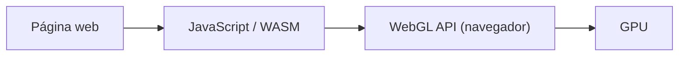

### 5.1. Ejemplo (JavaScript)

```javascript
// Vertex shader
const vsSource = `
    attribute vec4 aPosition;
    uniform mat4 uModelViewProj;
    void main() {
        gl_Position = uModelViewProj * aPosition;
    }
`;

// Fragment shader
const fsSource = `
    precision mediump float;
    uniform vec4 uColor;
    void main() {
        gl_FragColor = uColor;
    }
`;

// Crear shaders y programa
const vs = gl.createShader(gl.VERTEX_SHADER);
gl.shaderSource(vs, vsSource);
gl.compileShader(vs);

const program = gl.createProgram();
gl.attachShader(program, vs);
gl.attachShader(program, fs);
gl.linkProgram(program);

// Dibujar
gl.useProgram(program);
gl.drawArrays(gl.TRIANGLES, 0, 3);
```

### 5.2. WebGPU (el futuro)

Sucesora de WebGL. Modelo similar a Vulkan/DX12/Metal.

```
WebGL  → basado en OpenGL ES (modelo antiguo)
WebGPU → basado en Vulkan/Metal/DX12 (modelo moderno)

Ventajas de WebGPU:
- Menos overhead que WebGL
- Compute shaders en el navegador
- Mejor rendimiento
- Lenguaje: WGSL (WebGPU Shading Language)
```

---

## 6. Metal

API de **bajo nivel** de Apple para sus dispositivos (macOS, iOS, iPadOS, tvOS).

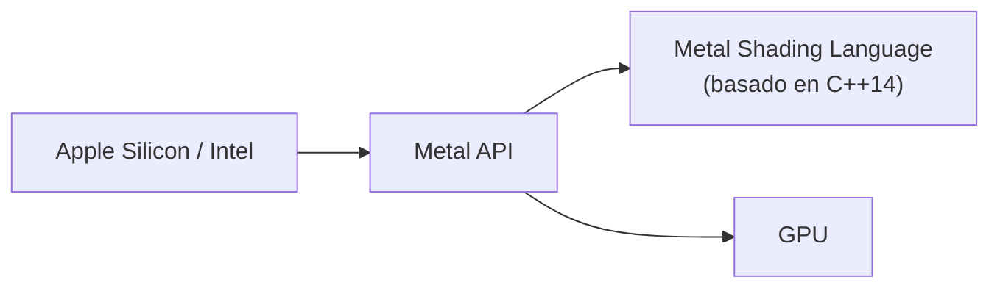

### 6.1. Filosofía

Similar a Vulkan/DX12: control explícito, pre-compilación de pipelines, sincronización manual.

```
// Metal Shading Language (MSL)
#include <metal_stdlib>
using namespace metal;

struct VertexIn {
    float3 position [[attribute(0)]];
    float3 normal   [[attribute(1)]];
    float2 uv       [[attribute(2)]];
};

struct VertexOut {
    float4 position [[position]];
    float2 uv;
};

vertex VertexOut vertex_main(VertexIn in [[stage_in]],
                             constant float4x4 &mvp [[buffer(1)]]) {
    VertexOut out;
    out.position = mvp * float4(in.position, 1.0);
    out.uv = in.uv;
    return out;
}

fragment float4 fragment_main(VertexOut in [[stage_in]],
                              texture2d<float> albedo [[texture(0)]]) {
    constexpr sampler s;
    float4 color = albedo.sample(s, in.uv);
    return color;
}
```

### 6.2. Metal vs Vulkan

| Aspecto | Metal | Vulkan |
|---|---|---|
| **Plataforma** | Apple | Multiplataforma |
| **Lenguaje shader** | MSL (C++14) | GLSL/SPIR-V |
| **Complejidad** | Media-alta | Alta |
| **Herramientas** | Xcode GPU Debugger | RenderDoc, GAPID |
| **Ecosistema** | Cerrado (Apple) | Abierto |

### 6.3. Pros y Contras

| ✅ Ventajas | ❌ Desventajas |
|---|---|
| Rendimiento excelente en Apple | Solo Apple |
| MSL más limpio que HLSL | No portable |
| Herramientas Xcode muy buenas | Curva alta |
| Bajo overhead | Pocos recursos de aprendizaje |

**¿Cuándo usarlo?** Desarrollo exclusivo para ecosistema Apple (macOS/iOS gaming).

---

## 7. Comparativa general

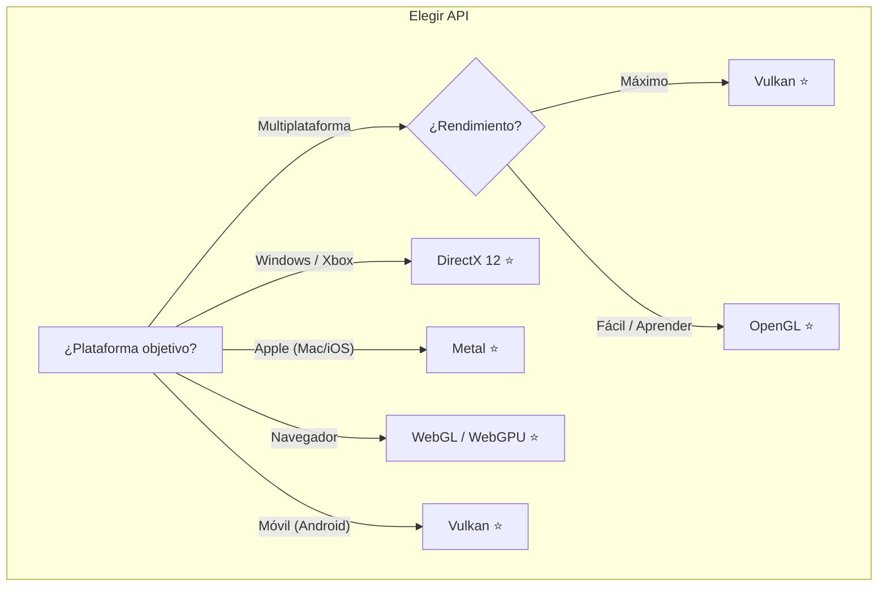

| API | Rendimiento | Curva | Portabilidad | Ecosistema |
|---|---|---|---|---|
| **OpenGL** | ⭐⭐⭐ | Baja | ⭐⭐⭐⭐⭐ | Maduro |
| **DirectX 11** | ⭐⭐⭐⭐ | Media | ⭐ | Maduro |
| **DirectX 12** | ⭐⭐⭐⭐⭐ | Muy alta | ⭐ | Maduro |
| **Vulkan** | ⭐⭐⭐⭐⭐ | Muy alta | ⭐⭐⭐⭐ | Creciendo |
| **Metal** | ⭐⭐⭐⭐⭐ | Alta | ⭐ | Maduro (Apple) |
| **WebGL** | ⭐⭐ | Baja | ⭐⭐⭐⭐⭐ (web) | Maduro |
| **WebGPU** | ⭐⭐⭐⭐ | Media | ⭐⭐⭐⭐⭐ (web) | Emergente |
| **OpenGL ES** | ⭐⭐⭐ | Baja | ⭐⭐⭐⭐ | Maduro |

### Línea de tiempo

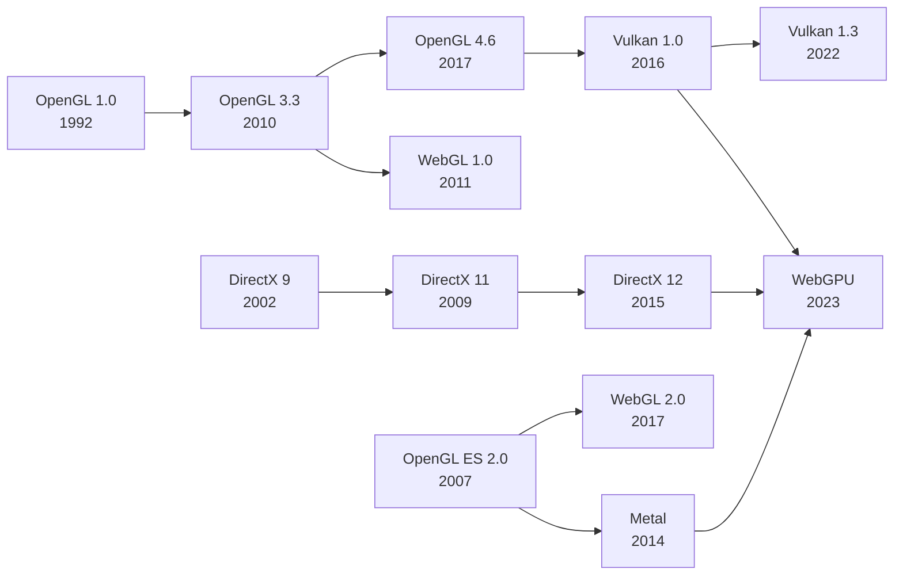

> 💡 **Regla de oro:** OpenGL para aprender los fundamentos (es el más simple), Vulkan o DirectX 12 para motores profesionales (máximo control y rendimiento), WebGL/WebGPU para juegos en el navegador, Metal si estás en el ecosistema Apple.

## Relacionados:
- [[shader]] #anterior 
- [[renderizado-avanzado]] #extra 
- [[ia-para-juegos]] #siguiente 