# Aprendizaje de IA para juegos

## ¿Por qué aprendizaje en juegos?

La IA tradicional (FSM, Behavior Trees) se programa **a mano**. La IA de aprendizaje **encuentra patrones por sí misma** a partir de datos o experiencia.

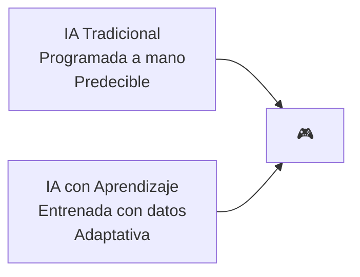

**¿Dónde se usa aprendizaje en juegos?**

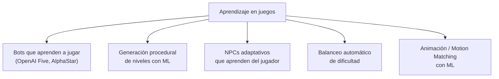

---

## 1. Red de Neuronas Artificiales (RNA)

### 1.1. La neurona artificial

Inspirada en la neurona biológica:

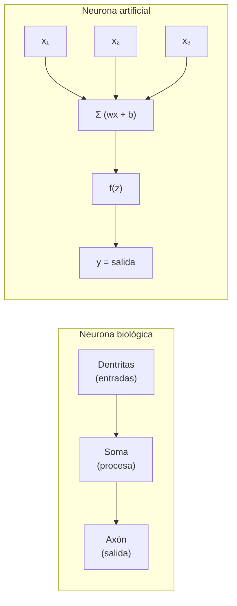

**Fórmula:**

```
z = w₁·x₁ + w₂·x₂ + ... + wₙ·xₙ + b
y = f(z)

f = función de activación
w = pesos
b = bias (sesgo)
```

### 1.2. Funciones de activación

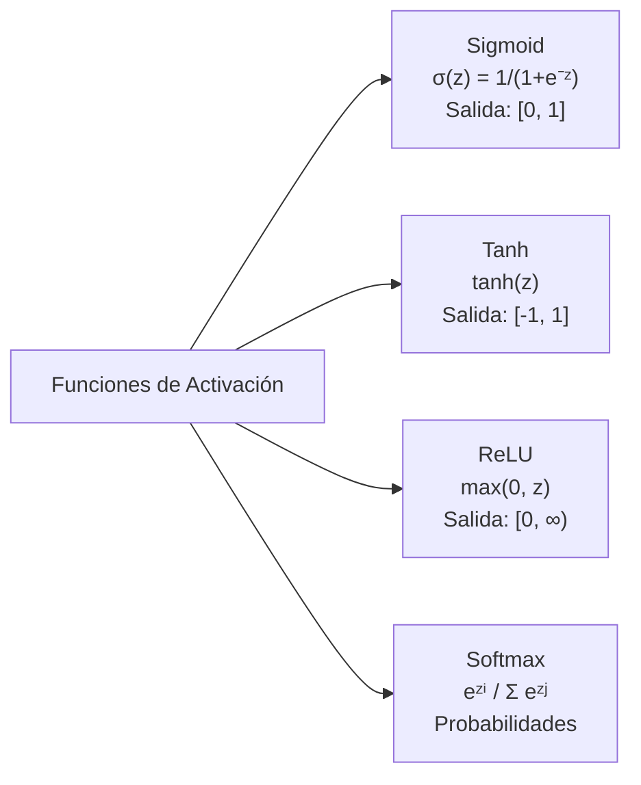

### 1.3. Arquitectura de una red

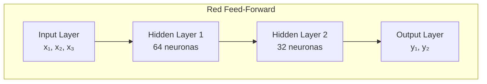

**Ejemplo:** Clasificar si un enemigo debe atacar o huir.

```
Input:  [distancia_al_jugador, salud_propia, salud_jugador, municion]
Output: [atacar_prob, huir_prob, patrullar_prob]
```

### 1.4. Forward pass (inferencia)

```
float[] forward(float[] input, Network net) {
    float[] current = input;
    
    for (Layer layer : net.layers) {
        float[] next = new float[layer.size];
        
        for (int j = 0; j < layer.size; j++) {
            float sum = layer.biases[j];
            for (int i = 0; i < current.length; i++) {
                sum += current[i] * layer.weights[i][j];
            }
            next[j] = activation(sum);  // ReLU, sigmoid, etc.
        }
        current = next;
    }
    
    return current;  // Output
}
```

### 1.5. Backpropagation (entrenamiento)

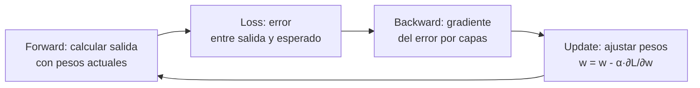

---

## 2. Aprendizaje Profundo (Deep Learning)

### 2.1. ¿Qué lo hace "profundo"?

Múltiples **capas ocultas** (hidden layers) que aprenden representaciones jerárquicas:

```
Capa 1: bordes y texturas simples
Capa 2: formas (círculos, rectángulos)
Capa 3: partes de objetos (ojos, ruedas)
Capa 4: objetos completos (coche, persona)
```

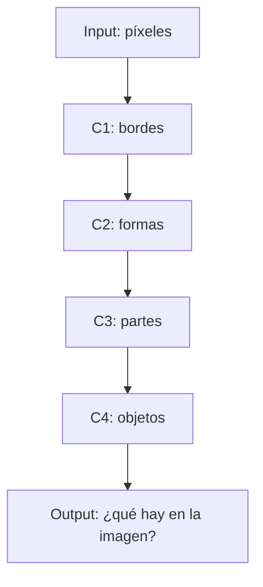

### 2.2. Arquitecturas clave para juegos

| Arquitectura | Para qué |
|---|---|
| **CNN** (Convolucional) | Visión por computadora, juegos desde píxeles |
| **RNN / LSTM** | Secuencias, comportamiento temporal, diálogos |
| **Transformer** | Modelos grandes, decisiones complejas |
| **GAN** | Generación de texturas, niveles, assets |

### 2.3. Ejemplo: CNN para jugar desde píxeles

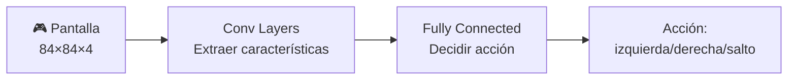

---

## 3. Aprendizaje de Refuerzo (Reinforcement Learning)

### 3.1. El paradigma

Un **agente** aprende a través de **prueba y error**, maximizando una **recompensa**.

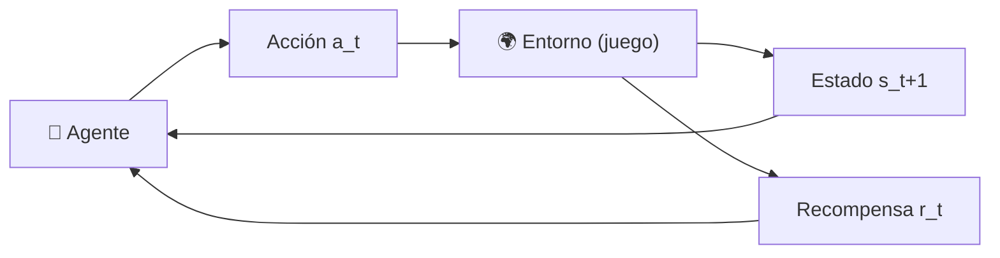

**Componentes:**
```
Estado (s)    → la situación actual del juego (posición, salud, puntuación)
Acción (a)    → lo que el agente puede hacer (saltar, disparar, moverse)
Recompensa (r)→ feedback: +1 por matar enemigo, -1 por recibir daño
Política (π)  → la estrategia: π(s) → a (qué acción tomar en cada estado)
```

### 3.2. Q-Learning (aprender valores de acción)

```
Q(s, a) = valor esperado de tomar acción a en estado s

Actualización:
Q(s, a) ← Q(s, a) + α·[r + γ·max Q(s', a') - Q(s, a)]

α = learning rate (qué tan rápido aprende)
γ = discount factor (qué tanto valora recompensas futuras)
```

### 3.3. Deep Q-Network (DQN)

Usa una **red neuronal** para aproximar Q(s, a). Famoso por jugar juegos de Atari solo viendo los píxeles.

```
// DQN simplificado
Input:  state (4 frames del juego, 84×84×4)
Output: Q-values para cada acción (disparar, saltar, mover...)

Loss = (r + γ·max Q(s', a') - Q(s, a))²  // Diferencia al cuadrado
```

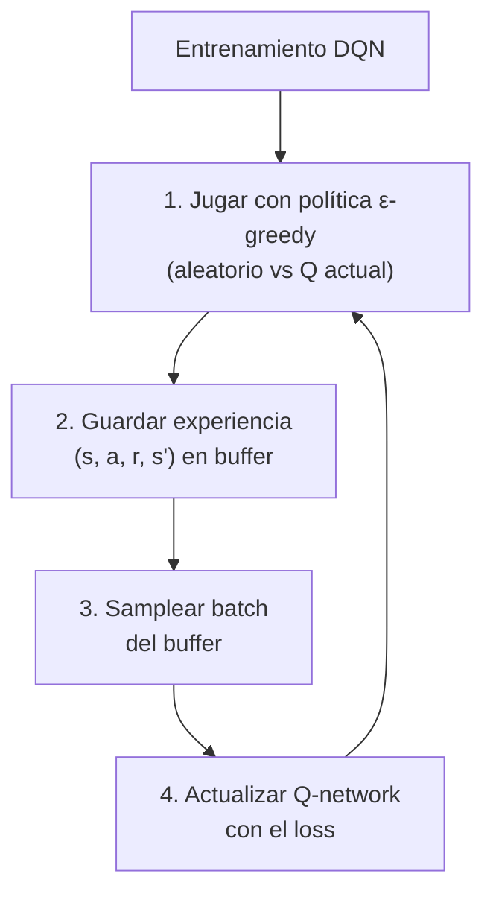

### 3.4. Policy Gradients (PPO, A3C)

En lugar de aprender Q(s,a), aprenden directamente la **política π(s) → a**.

```
Ventajas de Policy Gradients:
- Acciones continuas (ángulo de giro, fuerza)
- Políticas estocásticas (exploración natural)
- Mejor convergencia en problemas complejos

PPO (Proximal Policy Optimization): el estándar moderno
Estable, eficiente, usado en OpenAI Five, etc.
```

### 3.5. Aplicaciones en juegos

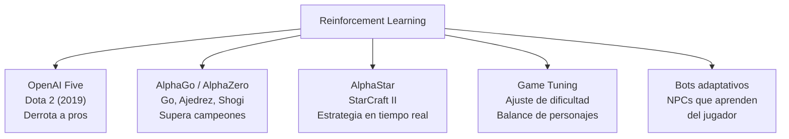

---

## 4. Aprendizaje por Árboles de Decisión

### 4.1. Concepto

El árbol se **construye automáticamente** a partir de datos de entrenamiento, dividiendo el espacio en regiones.

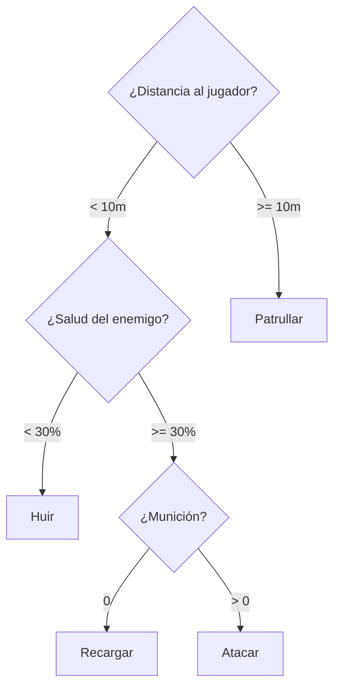

### 4.2. Cómo se construye

```
Algoritmo ID3 / C4.5 / CART:

1. Empezar con todos los datos en la raíz
2. Para cada atributo:
   - Calcular "ganancia de información" (entropía)
3. Elegir el atributo con mayor ganancia
4. Dividir los datos según ese atributo
5. Repetir recursivamente para cada subconjunto
6. Parar cuando todos los ejemplos son de la misma clase
```

**Entropía:** mide el desorden/incerteza:

```
Entropía(S) = -Σ pᵢ · log₂(pᵢ)

Ejemplo: si hay 50% atacar, 50% huir → entropía = 1 (máxima incerteza)
         si hay 100% atacar → entropía = 0 (certeza total)
```

### 4.3. Random Forest

No un árbol, sino un **bosque** de árboles entrenados con variaciones aleatorias:

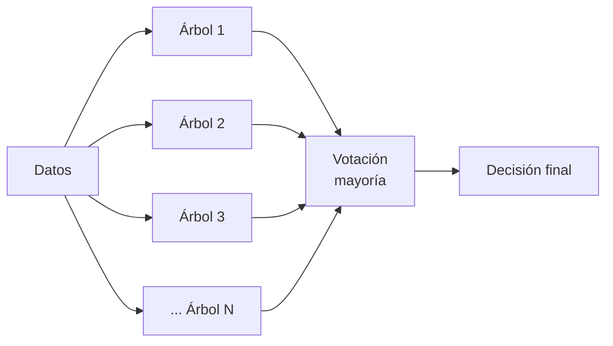

**Ventaja:** Mucho más preciso que un solo árbol. Menos overfitting.

---

## 5. Clasificador Naive Bayes

### 5.1. Concepto

Clasificador **probabilístico** basado en el Teorema de Bayes. Asume que todas las características son **independientes** (naive = ingenuo).

```
Teorema de Bayes:
P(Clase | Evidencia) = P(Evidencia | Clase) · P(Clase) / P(Evidencia)

En clasificación:
P(y | x₁, x₂, ..., xₙ) ∝ P(y) · Π P(xᵢ | y)

y = clase a predecir
xᵢ = características
```

### 5.2. Ejemplo: Predecir comportamiento enemigo

```
Clases: {Atacar, Huir, Patrullar}
Características: {Distancia, Salud, Munición}

Datos de entrenamiento:
┌──────────┬────────┬───────┬───────────┐
│ Distancia │ Salud │ Munic │ Comportam │
├──────────┼────────┼───────┼───────────┤
│ Cerca    │ Alta   │ Sí    │ Atacar    │
│ Lejos    │ Baja   │ No    │ Huir      │
│ Media    │ Media  │ Sí    │ Patrullar │
│ Cerca    │ Baja   │ Sí    │ Huir      │
│ ...      │ ...    │ ...   │ ...       │
└──────────┴────────┴───────┴───────────┘

Nuevo caso: Distancia=Cerca, Salud=Baja, Munición=Sí
¿Qué comportamiento?

P(Atacar | Cerca, Baja, Sí) ∝ P(Atacar) · P(Cerca|Atacar) · P(Baja|Atacar) · P(Sí|Atacar)
P(Huir | Cerca, Baja, Sí)   ∝ P(Huir) · P(Cerca|Huir) · P(Baja|Huir) · P(Sí|Huir)
P(Patrullar | Cerca, Baja, Sí) ∝ P(Patrullar) · P(Cerca|Pat) · P(Baja|Pat) · P(Sí|Pat)

La clase con mayor probabilidad → comportamiento elegido
```

### 5.3. Aplicaciones

| Aplicación | Características | Clases |
|---|---|---|
| **Detección de tramposos** | Tasa de acierto, tiempo de reacción, movimientos | {Tramposo, Legítimo} |
| **Predicción de abandono** | Tiempo jugado, nivel, compras | {Abandona, Sigue} |
| **Matchmaking** | Habilidad, región, idioma | {Buena partida, Mala partida} |
| **Clasificación de jugadores** | Estilo de juego, acciones | {Agresivo, Defensivo, Explorador} |

### 5.4. Pros y Contras

| ✅ | ❌ |
|---|---|
| Muy rápido (lineal en características) | Asume independencia (rara vez cierta) |
| Funciona con pocos datos | Sensible a características irrelevantes |
| Probabilístico (da confianza) | No captura interacciones |
| Fácil de implementar | Datos continuos requieren discretización |

---

## 6. Aprendizaje de Decisiones

### 6.1. Concepto general

**Aprendizaje de decisiones** es el campo que estudia cómo los agentes pueden aprender a tomar decisiones óptimas a partir de experiencia. Engloba todas las técnicas anteriores.

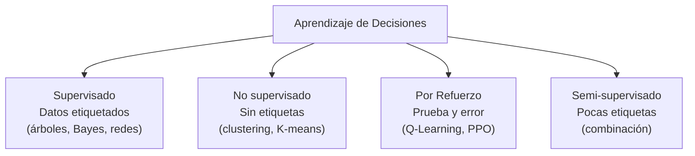

### 6.2. Enfoque supervisado para decisiones

```
Datos: (estado, acción_óptima) → el agente aprende a imitar

Fuentes de datos:
- Demos de jugadores humanos
- Registros de partidas
- Expertos jugando

El modelo aprende: dado este estado → ¿qué haría un experto?
```

### 6.3. Behavioral Cloning

Forma más simple: grabar a un humano jugando y entrenar una red para imitarlo.

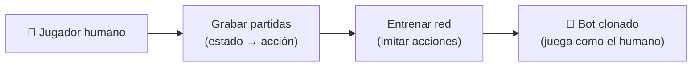

**Problema:** El bot comete errores que el humano nunca cometió (distribución shift). Solución: **DAgger** (Dataset Aggregation) o RL fine-tuning.

---

## 7. Tabla comparativa

| Técnica | Tipo | Datos necesarios | Velocidad runtime | Uso en juegos |
|---|---|---|---|---|
| **Red Neuronal (MLP)** | Supervisado | Muchos | Rápida (inferencia) | Clasificación, control |
| **Deep Learning (CNN/RNN)** | Supervisado | Muchísimos | Media (GPU) | Visión, secuencias |
| **Q-Learning / DQN** | Refuerzo | Experiencia | Rápida | Bots que aprenden |
| **PPO (Policy Gradient)** | Refuerzo | Experiencia | Rápida | Bots complejos (Dota, Starcraft) |
| **Árboles Decisión** | Supervisado | Pocos/Medios | Muy rápida | Clasificación simple |
| **Random Forest** | Supervisado | Medios | Rápida | Clasificación robusta |
| **Naive Bayes** | Supervisado | Pocos | Muy rápida | Clasificación probabilística |
| **Behavioral Cloning** | Imitativo | Demos | Rápida | Clonar estilo humano |

### ¿Cuándo usar qué?

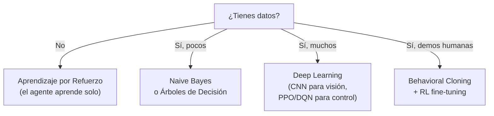

> 💡 **Regla de oro:** Si puedes programar la decisión a mano, hazlo (FSM, Behavior Tree). El aprendizaje es para cuando **no sabes la regla exacta** o quieres que la IA se **adapte** al jugador. Para la mayoría de juegos, RL + Behavioral Cloning es el combo más práctico.

## Relacionados:
- [[ia-para-juegos]] #anterior 