# Color y Animación

## 1. Color

### 1.1. Naturaleza del color

El color **no existe** en la naturaleza. Es una interpretación de nuestro cerebro de diferentes longitudes de onda de luz.

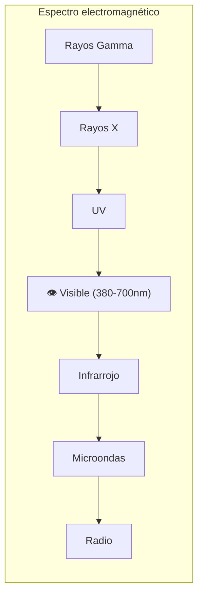

**El ojo humano tiene 3 tipos de conos:**
- **S** (Short) → azul (~420nm)
- **M** (Medium) → verde (~534nm)
- **L** (Long) → rojo (~564nm)

Todo color que vemos es una combinación de la respuesta de estos 3 conos.

### 1.2. Modelos de color

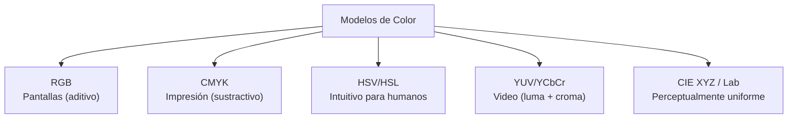

#### RGB (Aditivo)

Las pantallas **emiten** luz. Rojo + Verde + Azul = Blanco.

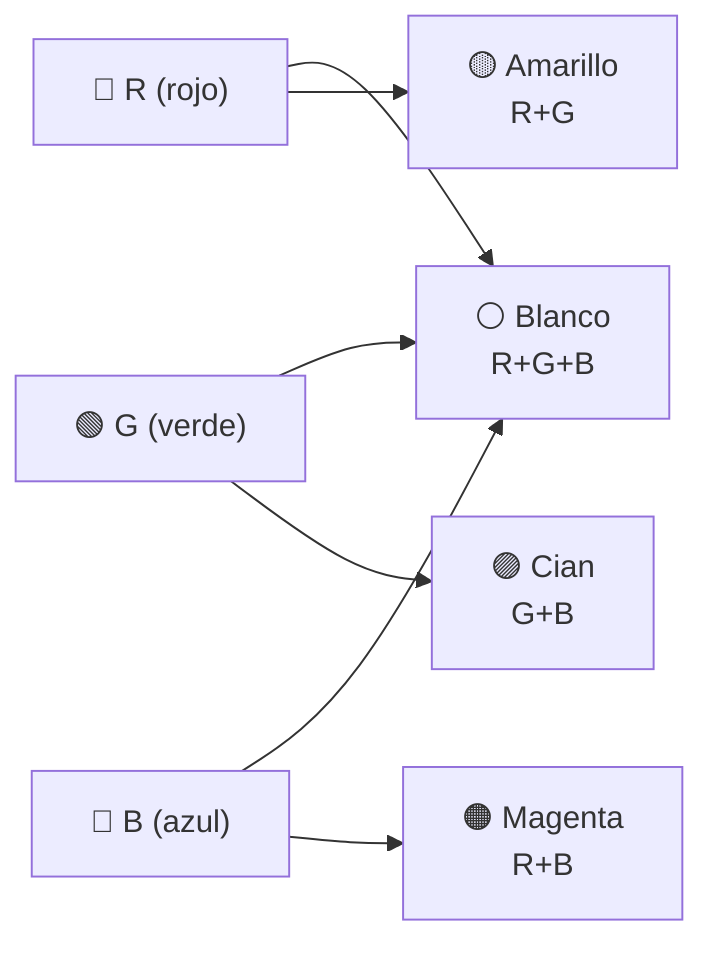

#### HSV (Matiz, Saturación, Valor)

Más intuitivo para humanos: "quiero un rojo oscuro y apagado".

```
HSV:
  H (Hue)        = tono puro           (0° - 360°)
  S (Saturation) = intensidad del color (0% = gris, 100% = puro)
  V (Value)      = brillo              (0% = negro, 100% = máximo)
```

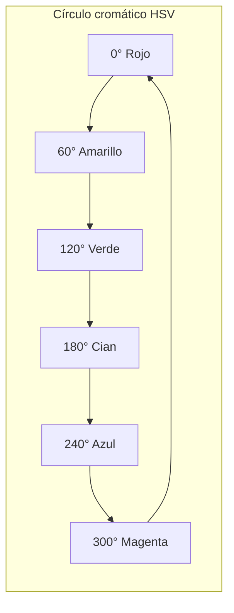

```glsl
// RGB ↔ HSV
vec3 rgb2hsv(vec3 c) {
    float max = max(max(c.r, c.g), c.b);
    float min = min(min(c.r, c.g), c.b);
    float h = 0.0;
    
    if (max == c.r) h = 60.0 * (c.g - c.b) / (max - min);
    else if (max == c.g) h = 60.0 * (2.0 + (c.b - c.r) / (max - min));
    else h = 60.0 * (4.0 + (c.r - c.g) / (max - min));
    
    if (h < 0.0) h += 360.0;
    
    float s = (max == 0.0) ? 0.0 : (max - min) / max;
    return vec3(h, s, max);
}
```

#### YUV / YCbCr (Video)

Separa **luminancia** (brillo) de **crominancia** (color). Útil para compresión: el ojo nota más cambios de brillo que de color.

```
Y = 0.299·R + 0.587·G + 0.114·B    (luminancia)
U = -0.147·R - 0.289·G + 0.436·B   (azul - amarillo)
V = 0.615·R - 0.515·G - 0.100·B    (rojo - cian)
```

### 1.3. Espacio de color vs Gamut

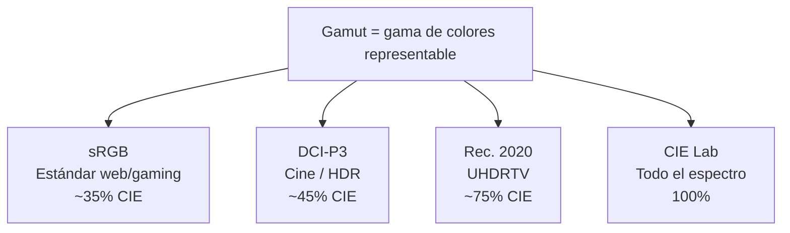

---

## 2. Percepción Visual

### 2.1. Cómo procesa el ojo

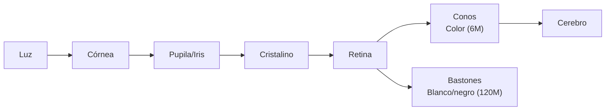

**Conos** → visión fotópica (color, mucha luz)
**Bastones** → visión escotópica (monocromática, poca luz)

### 2.2. Fenómenos perceptuales clave

| Fenómeno | Descripción | Ejemplo |
|---|---|---|
| **Metamerismo** | 2 estímulos distintos se ven igual | Monitor vs objeto real |
| **Contraste simultáneo** | El mismo color se ve diferente según fondo | Gris sobre blanco vs negro |
| **Persistencia retiniana** | La imagen persiste ~1/24s | Base del cine (24fps) |
| **Ley de Weber-Fechner** | Percepción logarítmica, no lineal | Gamma correction |

### 2.3. Contraste simultáneo

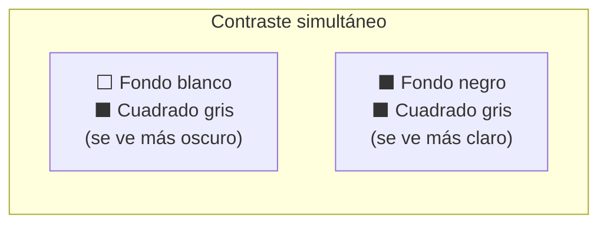

### 2.4. Sensibilidad del ojo

El ojo es más sensible a:
1. **Movimiento** (visión periférica)
2. **Contraste** (diferencias de brillo)
3. **Verde** (más conos M que L o S)

```
Sensibilidad relativa:
Verde  (555nm) → 100%
Rojo   (610nm) → 50%
Azul   (450nm) → 5%
```

---

## 3. Reproducción de Tonos

### 3.1. Gamma

Las pantallas tienen una respuesta **no lineal**:

```
Luminancia_salida = Voltaje_entrada ^ gamma

gamma típica de pantalla: ~2.2
```

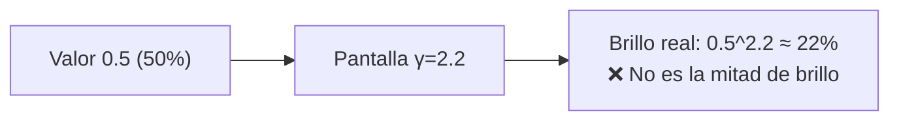

Para compensar, se aplica **gamma correction**:

```
Valor_correcto = valor_original ^ (1/2.2)
```

```
// Gamma correction en shader
vec3 color = texture(albedoMap, uv).rgb;
color = pow(color, vec3(1.0/2.2));  // lineal → sRGB
FragColor = vec4(color, 1.0);
```

### 3.2. Pipeline de color (Linear vs sRGB)

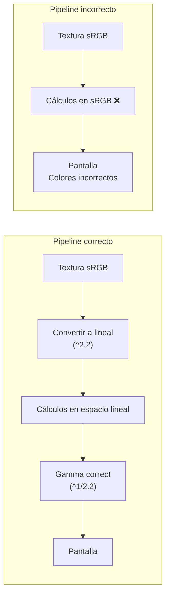

**Regla:** Todos los cálculos de iluminación deben hacerse en **espacio lineal**. La corrección gamma se aplica al final.

### 3.3. HDR (High Dynamic Range)

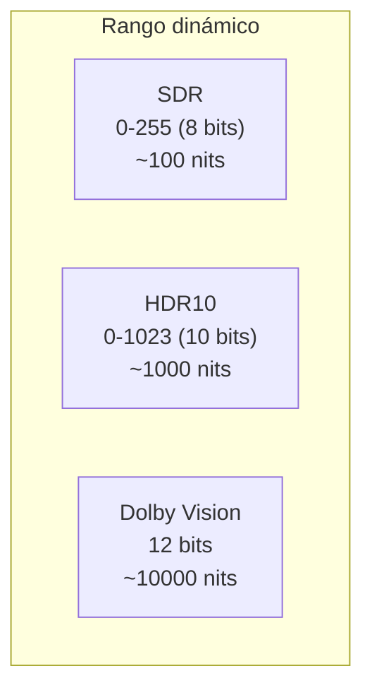

**HDR en juegos:**
1. Renderizar en espacio HDR (float16)
2. Tone mapping (mapear HDR → SDR para la pantalla)
3. Output

```
// Tone mapping simple (Reinhard)
vec3 tonemap(vec3 hdrColor) {
    return hdrColor / (hdrColor + vec3(1.0));
}

// Tone mapping ACES (estándar cinematográfico)
vec3 tonemap_ACES(vec3 x) {
    float a = 2.51;
    float b = 0.03;
    float c = 2.43;
    float d = 0.59;
    float e = 0.14;
    return clamp((x * (a * x + b)) / (x * (c * x + d) + e), 0.0, 1.0);
}
```

---

## 4. Animación por Computadora

### 4.1. Principios de animación (Disney)

Originalmente 12 principios desarrollados por Ollie Johnston y Frank Thomas (1989). Adaptados a 3D:

```mermaid
flowchart TD
    ANIM[12 Principios] --> S["1. Squash & Stretch<br/>Estirar/comprimir para dar peso"]
    ANIM --> A["2. Anticipation<br/>Preparación antes de la acción"]
    ANIM --> ST["3. Staging<br/>Puesta en escena clara"]
    ANIM --> SA["4. Straight Ahead / Pose to Pose"]
    ANIM --> FO["5. Follow Through & Overlap<br/>Partes que siguen al cuerpo"]
    ANIM --> EA["6. Slow In & Out<br/>Acelerar y frenar suave"]
    ANIM --> AR["7. Arcs<br/>Movimientos curvos, no rectos"]
    ANIM --> SE["8. Secondary Action<br/>Acciones que complementan"]
    ANIM --> TI["9. Timing<br/>Número de frames = peso/emoción"]
    ANIM --> EX["10. Exaggeration<br/>Exagerar para comunicar"]
    ANIM --> SP["11. Solid Drawing<br/>Volumen y peso 3D"]
    ANIM --> AP["12. Appeal<br/>Atractivo visual del personaje"]
```

### 4.2. Técnicas de animación

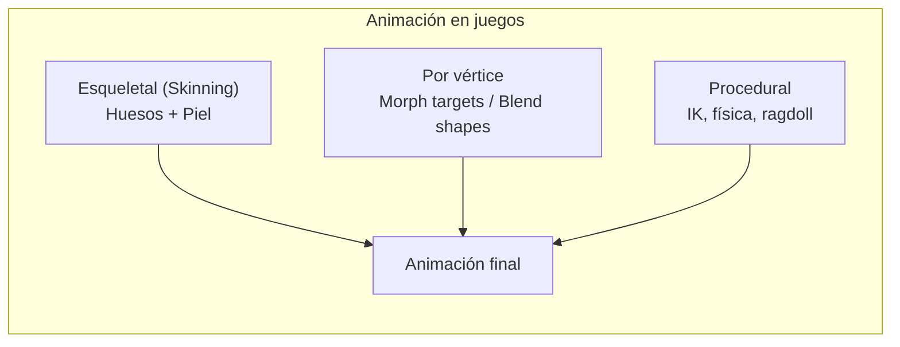

#### Animación Esqueletal

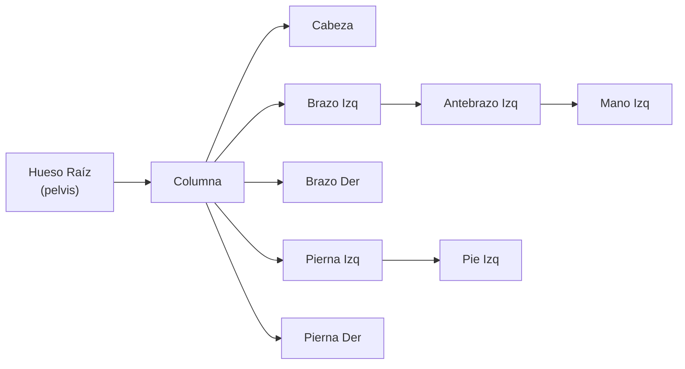

**Matriz final de cada vértice:**

```
Matriz_Vertex = Σ (peso_i × Matriz_Hueso_i × BindPose_i⁻¹)
```

Donde `BindPose` es la pose de referencia (T-pose).

### 4.3. Blending de animaciones

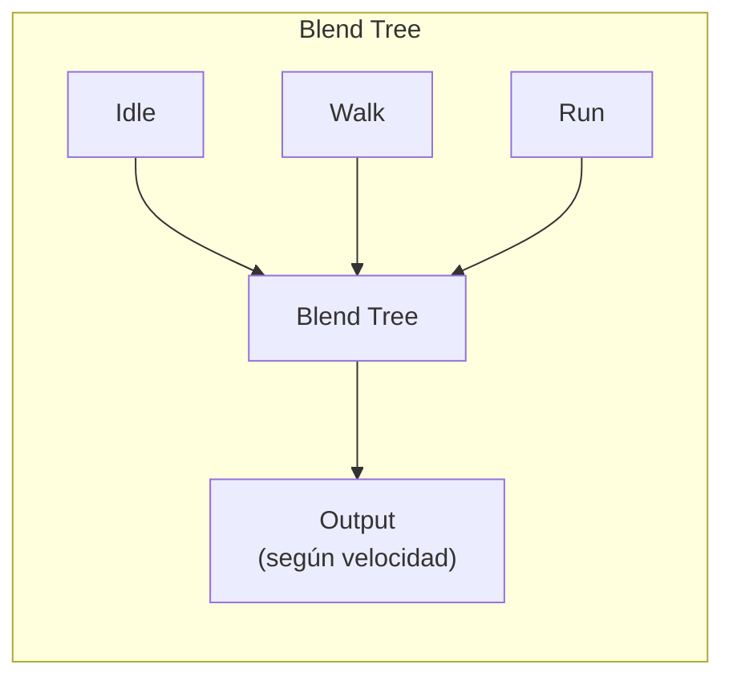

```
// Blend linear entre idle y walk
float speed = player.velocity.length();
float t = clamp(speed / maxSpeed, 0.0, 1.0);

Vec3 finalPos = lerp(idlePos, walkPos, t);
Quat finalRot = slerp(idleRot, walkRot, t);
```

### 4.4. Inverse Kinematics (IK)

**FK (Forward Kinematics):** Rotas el hombro → se mueve la mano.
**IK (Inverse Kinematics):** Pones la mano donde quieres → se calculan las rotaciones.

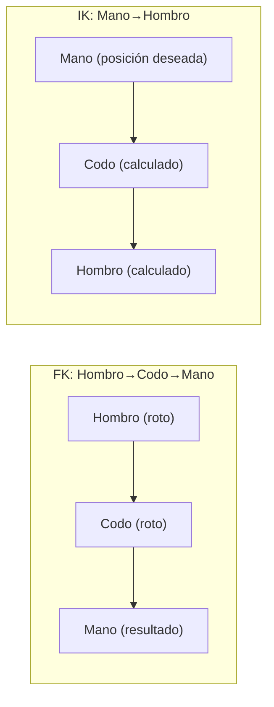

**Usos:** Pies en el suelo, manos en objetos, cabezas mirando al objetivo.

### 4.5. Curvas de animación (F-curves)

Cada hueso tiene curvas para cada eje de transformación:

```
Hueso: Hombro_Izq
  ├── translate.x : [curva 1]
  ├── translate.y : [curva 2]
  ├── translate.z : [curva 3]
  ├── rotate.x    : [curva 4]
  ├── rotate.y    : [curva 5]
  ├── rotate.z    : [curva 6]
  └── rotate.w    : [curva 7] (cuaternión)
```

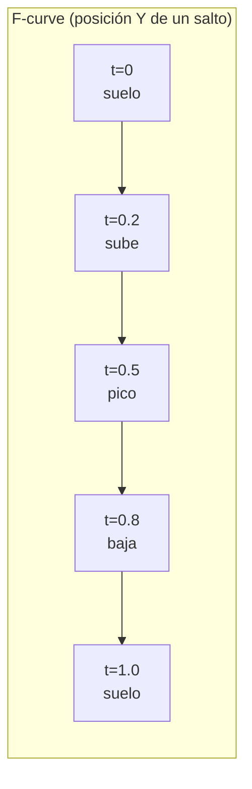

### 4.6. State Machine de Animación

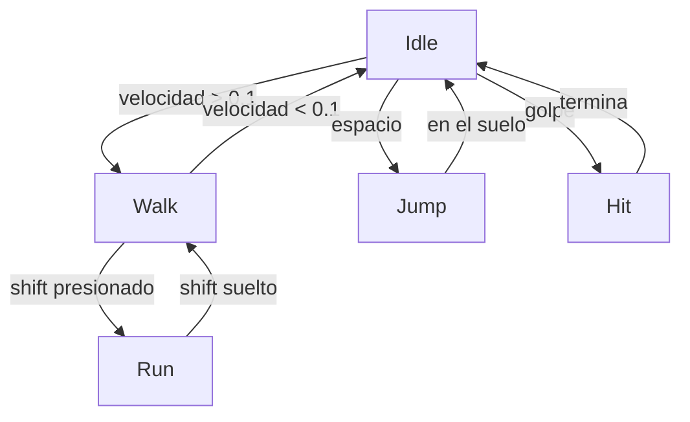

### 4.7. Compresión de animaciones

Las animaciones en disco pueden ser enormes. Técnicas de compresión:

| Técnica | Ratio | Calidad |
|---|---|---|
| **Wavelet compresión** | 10:1 | Alta |
| **Cuaterniones de 16 bits** | 2:1 | Alta |
| **Keyframe reduction** | Variable | Ajustable |
| **Animation retargeting** | N/A | Reutiliza animaciones |

> 💡 **Reglas de oro:**
> - **Color:** Siempre cálculos en espacio lineal; gamma correction al final
> - **Percepción:** El ojo no es lineal → aprovecha gamma, usa dithering en bandas
> - **Animación:** Los 12 principios de Disney funcionan TAMBIÉN en 3D. No los ignores
> - **IK vs FK:** FK para animaciones predefinidas, IK para adaptación al entorno

## Relacionados:
- [[iluminación-y-sombras]] #anterior 
- [[visivilidad-y-oclusion]] #extra 
- [[mapping-reflexion]] #extra 
- [[shader]] #siguiente 