# Curvas

## ¿Por qué curvas en videojuegos?

Las curvas son omnipresentes en el desarrollo de juegos. Permiten definir trayectorias suaves, animaciones, y movimientos sin los saltos bruscos de la interpolación lineal.

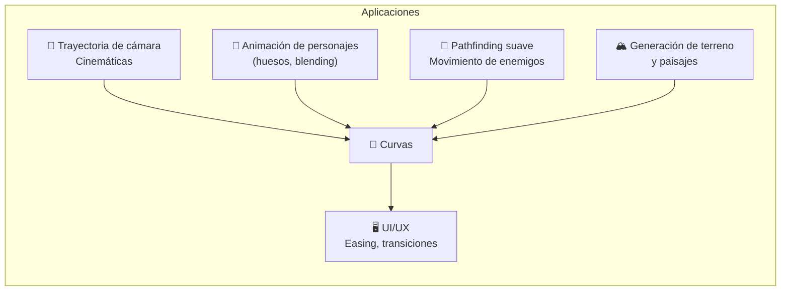

**Problema que resuelven:** La interpolación lineal entre dos puntos produce un movimiento rígido y robótico.

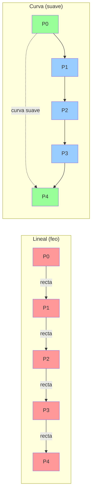

---

## 1. Spline

Un **spline** es una curva definida por segmentos polinomiales unidos entre sí. Es la "curva general" de la que los demás tipos son casos particulares.

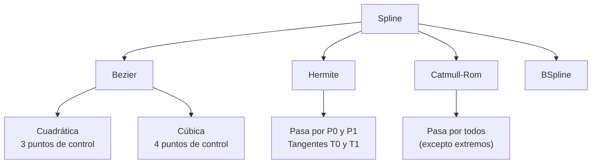

### Características clave

| Propiedad | Significado |
|---|---|
| **Continuidad C⁰** | Los segmentos se tocan (unión) |
| **Continuidad C¹** | Tangentes iguales en la unión (suavidad) |
| **Continuidad C²** | Curvatura igual en la unión (máxima suavidad) |
| **Interpolante** | Pasa por los puntos de control |
| **Aproximante** | Se acerca a los puntos sin pasar por ellos |

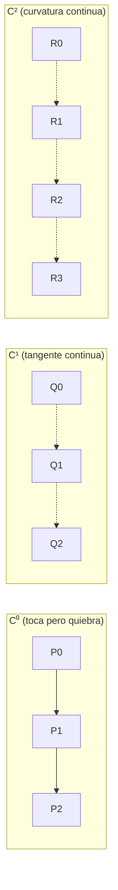

---

## 2. Bezier

Las curvas de **Bezier** son las más famosas en gráficos por computadora. Usan **puntos de control** que "atraen" la curva sin necesariamente pasar por ellos.

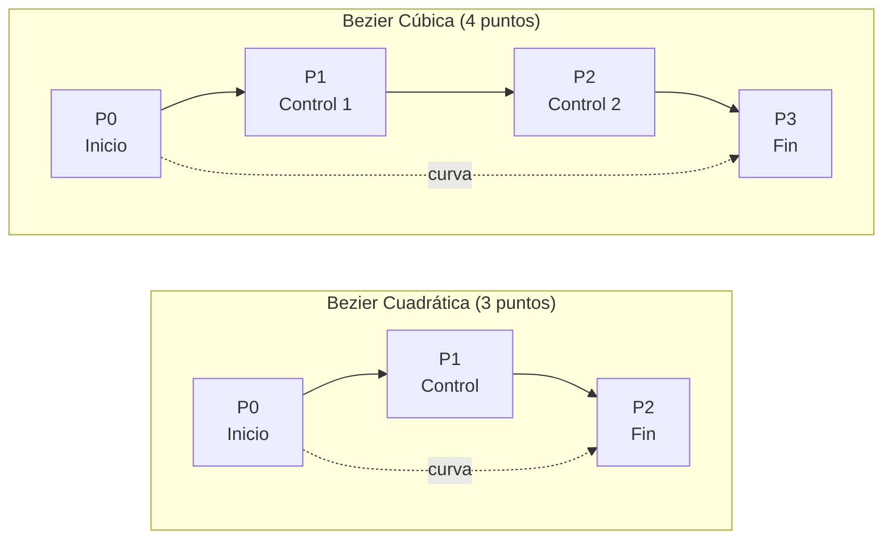

### 2.1. Algoritmo de De Casteljau (geométrico)

La forma más intuitiva de entender Bezier: **interpolación lineal repetida**.

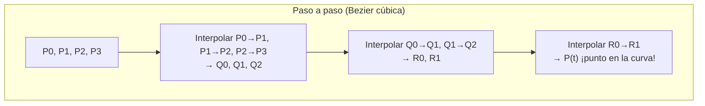

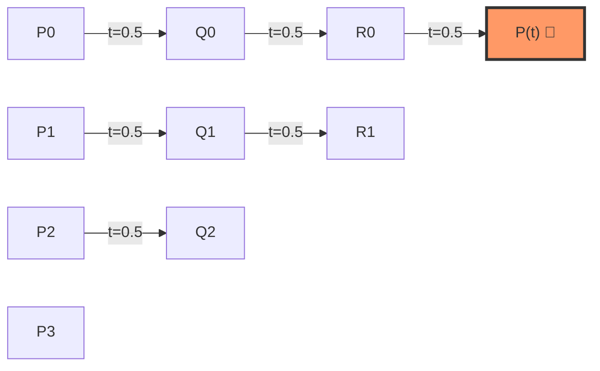

```
function bezierCubica(P0, P1, P2, P3, t):
    // Algoritmo de De Casteljau
    Q0 = lerp(P0, P1, t)
    Q1 = lerp(P1, P2, t)
    Q2 = lerp(P2, P3, t)
    
    R0 = lerp(Q0, Q1, t)
    R1 = lerp(Q1, Q2, t)
    
    return lerp(R0, R1, t)  // Punto en la curva en t
```

### 2.2. Fórmula matemática (forma polinomial)

```
Bezier cúbica:
P(t) = (1-t)³·P0 + 3·(1-t)²·t·P1 + 3·(1-t)·t²·P2 + t³·P3

donde t ∈ [0, 1]
```

Los coeficientes se llaman **polinomios de Bernstein**:

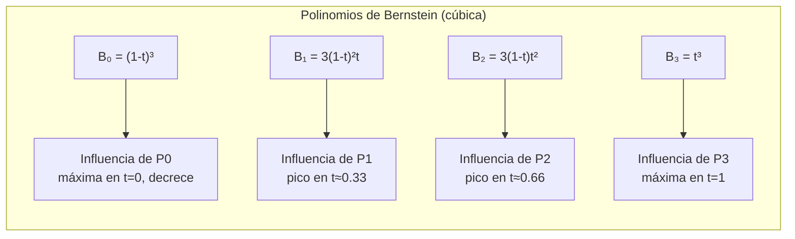

### 2.3. Propiedades importantes

| Propiedad | Descripción |
|---|---|
| **Pasa por P₀ y Pₙ** | El primer y último punto sí están en la curva |
| **Tangente en P₀** | Dirección = P₁ − P₀ |
| **Tangente en Pₙ** | Dirección = Pₙ − Pₙ₋₁ |
| **Envoltura convexa** | La curva está dentro del polígono de control |
| **Invarianza afín** | Transformar la curva = transformar los puntos de control |

```
// Ejemplo: trayectoria de cámara cinemática
puntos = [
    Vector3(0, 0, 0),     // P0 - inicio
    Vector3(5, 3, 0),     // P1 - control 1
    Vector3(10, -1, 0),   // P2 - control 2
    Vector3(15, 2, 0)     // P3 - fin
]

for t in 0..1 step 0.01:
    pos = bezierCubica(puntos[0], puntos[1], puntos[2], puntos[3], t)
    camera.position = pos
```

---

## 3. Hermite

La curva de **Hermite** define la curva a partir de **dos puntos y dos tangentes**. A diferencia de Bezier, el control es sobre la **dirección de entrada/salida**.

```
Hermite cúbica:
P(t) = h00(t)·P0 + h10(t)·T0 + h01(t)·P1 + h11(t)·T1

donde:
h00(t) =  2t³ - 3t² + 1     // peso de P0
h10(t) =   t³ - 2t² + t     // peso de T0 (tangente en P0)
h01(t) = -2t³ + 3t²         // peso de P1
h11(t) =   t³ -  t²         // peso de T1 (tangente en P1)
```

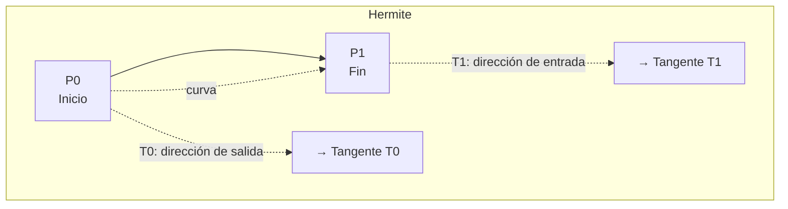

### Comparativa Bezier vs Hermite

| Aspecto | Bezier | Hermite |
|---|---|---|
| Control | Puntos de control (posición) | Tangentes (velocidad) |
| Intuitivo para forma | ✅ Muy intuitivo | ❌ Tangentes no son intuitivas |
| Unión de segmentos | ❌ No garantiza C¹ automático | ✅ Tangentes compartidas → C¹ |

**Aplicación Hermite:** Útil cuando conoces la velocidad (tangente) en los puntos clave, por ejemplo, en **animación por huesos** donde los keyframes tienen velocidad definida.

---

## 4. Catmull-Rom

Catmull-Rom es un spline **interpolante** (pasa por todos los puntos de control). Es especialmente útil porque **no necesita tangentes explícitas**: las calcula automáticamente a partir de los puntos vecinos.

### 4.1. Cálculo de tangentes

```
Tangente en Pi = (Pi+1 - Pi-1) / 2
```

```mermaid
flowchart LR
    subgraph "Catmull-Rom: tangentes automáticas"
        PM1["Pᵢ₋₁"] --> PI["Pᵢ (punto actual)"]
        PI --> PP1["Pᵢ₊₁"]
        PM1 -.->|Tᵢ = (Pᵢ₊₁ - Pᵢ₋₁)/2| TI["→ Tangente en Pᵢ"]
    end
```

### 4.2. Fórmula

Usa 4 puntos de control para definir un segmento entre P₁ y P₂:

```
P(t) = 0.5 · (
    (2·P1) +
    (-P0 + P2) · t +
    (2·P0 - 5·P1 + 4·P2 - P3) · t² +
    (-P0 + 3·P1 - 3·P2 + P3) · t³
)
```

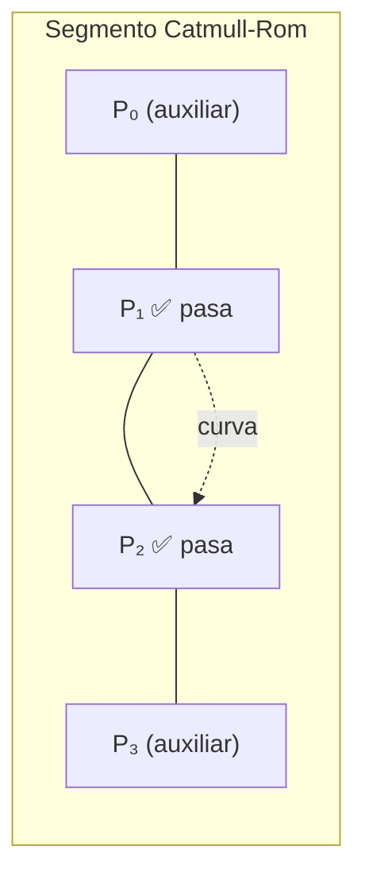

### 4.3. Propiedades

| Propiedad | Descripción |
|---|---|
| **C¹ continua** | Tangentes continuas en las uniones |
| **Interpolante** | Pasa por todos los puntos (excepto extremos) |
| **Sin tangentes explícitas** | Se calculan automáticamente |
| **Tensión** | Parámetro que controla "lo apretado" de la curva |

### 4.4. Tensión

El parámetro de **tensión** (τ, tau) controla la forma:

```
Tangente en Pi = (1-τ)·(Pi+1 - Pi-1) / 2

τ = 0   → Catmull-Rom estándar (suave)
τ = 0.5 → Curva más laxa (floja)
τ = -0.5 → Curva más tensa (apretada)
τ = 1   → Segmentos rectos (lineal)
```

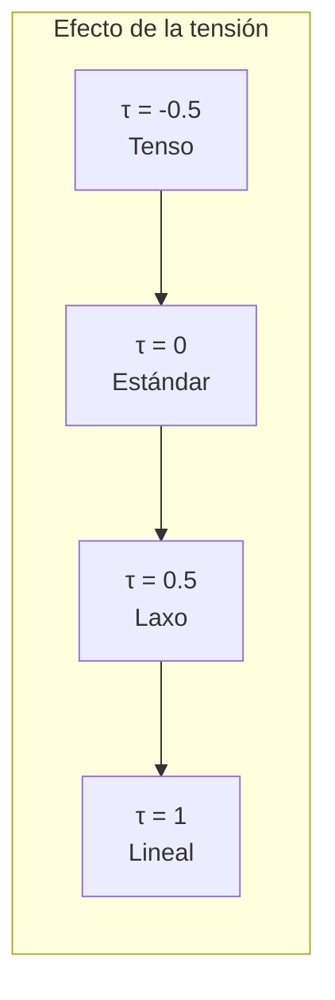

**Aplicaciones típicas:**
- **Trayectorias de cámara** en cinemáticas
- **Movimiento de enemigos** por waypoints
- **Animación de personajes** (curvas de motion)
- **Generación de carreteras** en juegos de carreras

```
// Trayectoria de enemigo por waypoints
waypoints = [
    Vector3(0, 0, 0),
    Vector3(5, 0, 3),
    Vector3(10, 0, 5),
    Vector3(15, 0, 2),
    Vector3(20, 0, 4)
]

// Catmull-Rom necesita 4 puntos por segmento
function catmullRom(P0, P1, P2, P3, t):
    t2 = t * t
    t3 = t2 * t
    return 0.5 * (
        (2*P1) +
        (-P0 + P2) * t +
        (2*P0 - 5*P1 + 4*P2 - P3) * t2 +
        (-P0 + 3*P1 - 3*P2 + P3) * t3
    )

// Recorrer la curva completa
for segmento = 0 to len(waypoints)-4:
    P0 = waypoints[segmento]
    P1 = waypoints[segmento+1]
    P2 = waypoints[segmento+2]
    P3 = waypoints[segmento+3]
    
    for t = 0 to 1 step 0.01:
        pos = catmullRom(P0, P1, P2, P3, t)
        enemigo.moverse_a(pos)
```

---

## 5. Comparativa de curvas

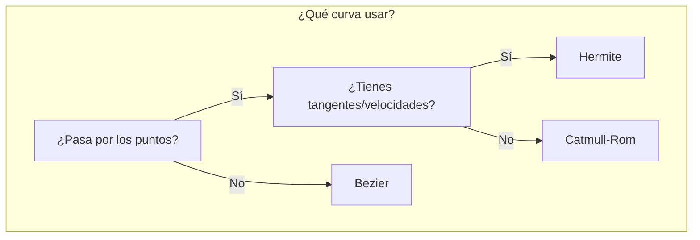

| Característica | Bezier | Hermite | Catmull-Rom |
|---|---|---|---|
| Pasa por los puntos | Solo extremos | Extremos | Todos (menos extremos) |
| Control | Puntos de control | Puntos + Tangentes | Puntos (tangentes automáticas) |
| Continuidad | Solo C⁰ si no se unen | C¹ si se comparten tangentes | C¹ automática |
| Fácil de usar | ✅✅ | ❌ | ✅✅✅ |
| Popularidad | Muy alta (editores, UI) | Media (animación) | Muy alta (trayectorias) |

---

## 6. Aplicaciones prácticas

### 6.1. Easing / Curvas de animación

Las curvas de easing son curvas 1D (tiempo → valor). Se usan en **animación, UI y transiciones**.

```
// Curva de easing cúbico (como una Bezier 1D)
easeInOutCubic(t) = t < 0.5 ? 4·t³ : 1 - (-2·t + 2)³ / 2
```

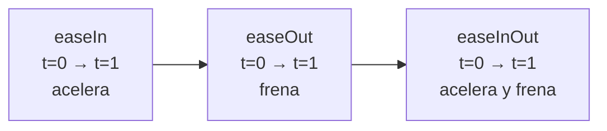

### 6.2. Interpolación de animaciones (blending)

Las curvas se usan para interpolar entre keyframes de animación:

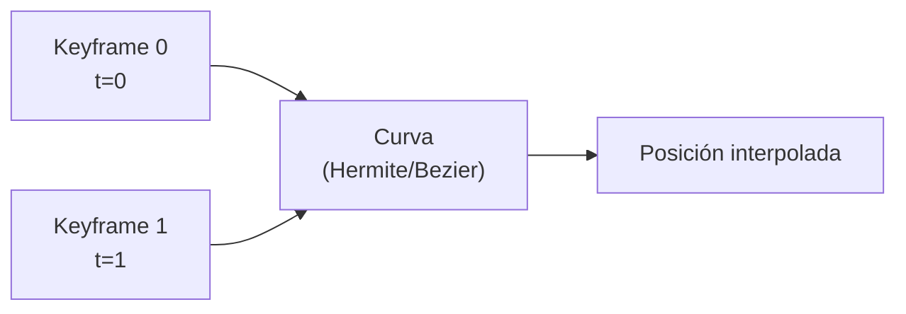

### 6.3. Suavizado de caminos

El pathfinding (A*, NavMesh) produce caminos con ángulos rectos. Las curvas **Catmull-Rom** los suavizan.

```
Pathfinding:  P0 ── P1 ── P2 ── P3  (rígido)
Catmull-Rom:  P0 ⌒ P1 ⌒ P2 ⌒ P3  (suave)
```

---

## 7. Resumen visual

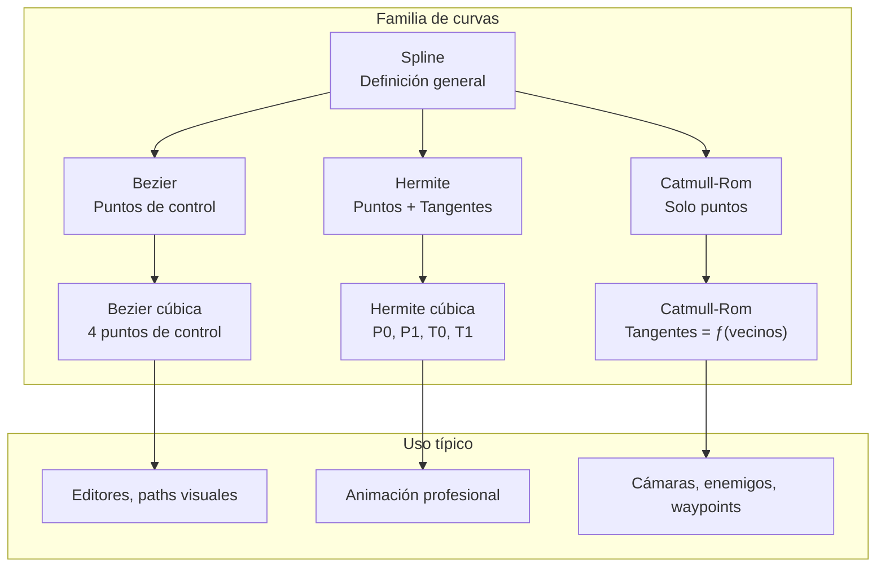

> 💡 **Regla de oro:** Catmull-Rom cuando quieras que la curva pase por los puntos sin especificar tangentes; Bezier cuando quieras controlar la forma con puntos de control; Hermite cuando tengas las velocidades definidas (animación).
