# Desarrollo del lado del cliente en videojuegos

## 1. ¿Qué es el "lado del cliente"?

En la arquitectura de un videojuego multiplayer, el **cliente** es el programa que ejecuta cada jugador en su máquina. Su responsabilidad principal es **proyectar la ilusión del mundo del juego** al usuario, mientras que el **servidor** es la autoridad final del estado del juego.

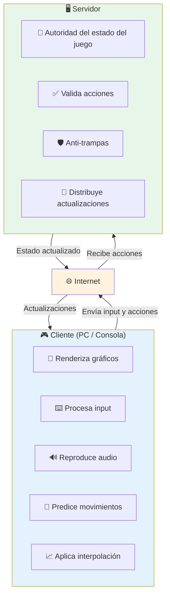

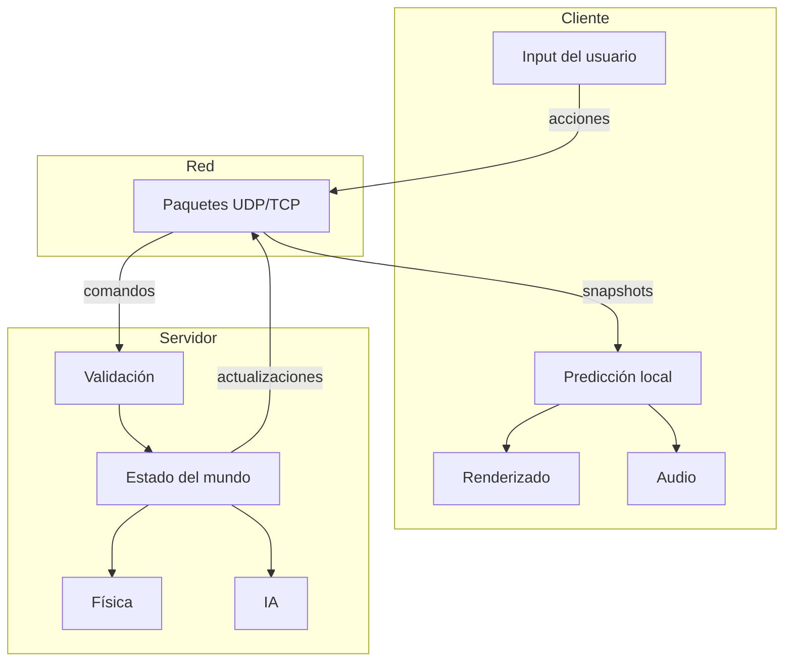

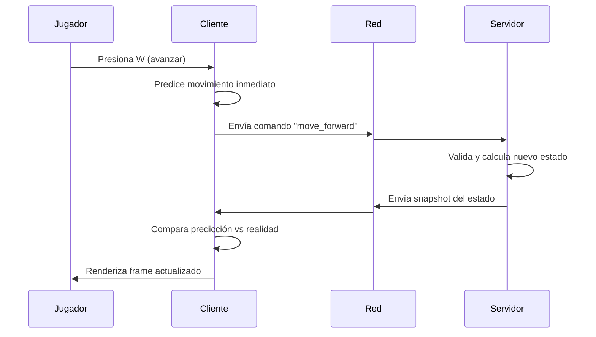

---

## 2. El Game Loop del Cliente

El **game loop** es el corazón de cualquier videojuego. Es un ciclo infinito que se ejecuta ~60 veces por segundo (60 FPS) y realiza tres tareas fundamentales:

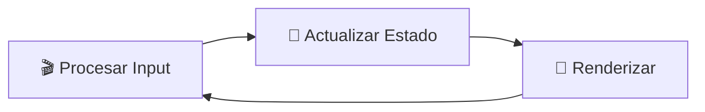

### 2.1. Estructura típica

```
while (juego_corriendo) {
    procesarInput();       // Leer teclado, ratón, mando
    actualizar(deltaTime); // Mover objetos, física, IA
    renderizar();          // Dibujar frame
}
```

### 2.2. Tipos de Game Loop

```mermaid
flowchart TD
    subgraph Fijo["🎯 Paso Fijo (Fixed Step)"]
        direction LR
        A1[Acumular deltaTime] --> A2[Actualizar en pasos fijos]
        A2 --> A3[Renderizar]
    end
    
    subgraph Variable["⏱️ Paso Variable (Variable Step)"]
        direction LR
        B1[Medir deltaTime real] --> B2[Pasar deltaTime a update]
        B2 --> B3[Renderizar]
    end
    
    subgraph Híbrido["🔄 Híbrido"]
        direction LR
        C1[Física a paso fijo] --> C2[Render a paso variable]
        C2 --> C3[Interpolar entre estados]
    end
```

**Recomendación:** Usar **paso fijo** para la física y la lógica del juego, y **paso variable** para el renderizado. Esto evita que la física dependa de la tasa de frames.

```
const FIXED_DT = 1.0 / 60.0; // 60 updates por segundo
float accumulator = 0.0;

while (running) {
    float frameTime = obtenerDeltaTime();
    accumulator += frameTime;
    
    while (accumulator >= FIXED_DT) {
        actualizarFisica(FIXED_DT);
        accumulator -= FIXED_DT;
    }
    
    float alpha = accumulator / FIXED_DT;
    renderizar(alpha); // interpolar con alpha
}
```

---

## 3. Predicción del Cliente

### 3.1. El problema de la latencia

Sin predicción, el jugador sentiría un **retraso** entre que pulsa una tecla y ve el resultado en pantalla. Con una latencia de 100ms, el juego se sentiría "flotante" o "gomoso".

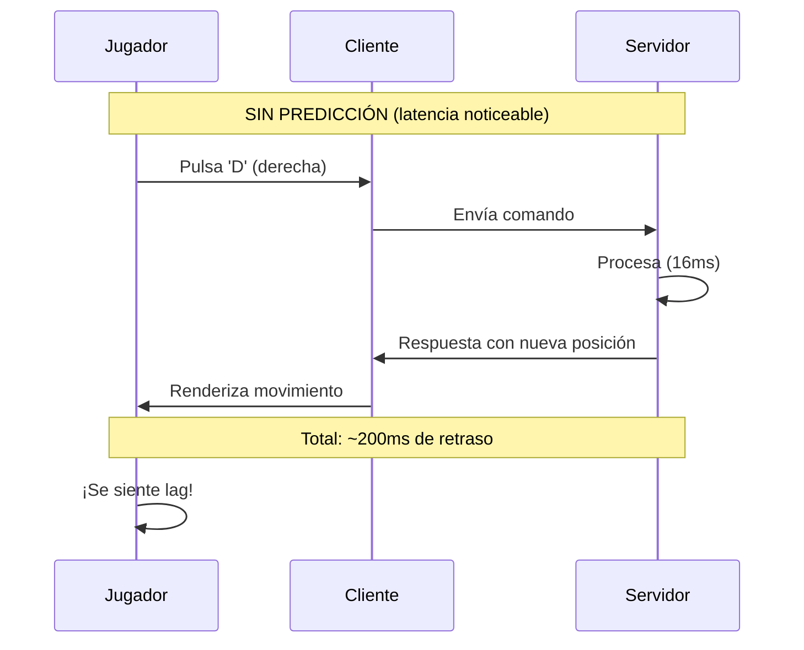

### 3.2. Solución: Predicción local

El cliente **no espera** la respuesta del servidor. Aplica el movimiento inmediatamente y luego corrige si el servidor responde con una posición diferente.

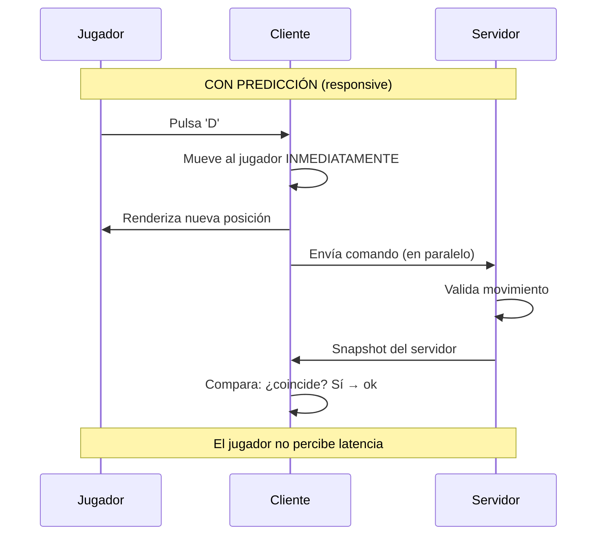

**Implementación conceptual:**

```js
clase Jugador:
    posicion: Vector3
    velocidad: Vector3
    historial_comandos: Lista<Comando>
    
    funcion procesarInput(input):
        comando = Comando(input, tiempo_local)
        historial_comandos.append(comando)
        aplicarMovimiento(comando)  // PREDICCIÓN INMEDIATA
    
    funcion recibirSnapshot(snapshot_servidor):
        // Buscar el comando que corresponde a este snapshot
        idx = historial_comandos.buscarPorTiempo(snapshot_servidor.tiempo)
        
        if not coinciden(posicion, snapshot_servidor.posicion):
            // RECONCILIACIÓN: corregir y re-aplicar comandos pendientes
            posicion = snapshot_servidor.posicion
            
            for comando in historial_comandos[idx:]:
                aplicarMovimiento(comando)
```

---

## 4. Interpolación y Extrapolación

### 4.1. Interpolación (para otros jugadores)

Cuando el servidor envía actualizaciones de otros jugadores, estas llegan en intervalos discretos (por ejemplo, cada 50ms). La interpolación **suaviza** el movimiento entre dos estados conocidos.

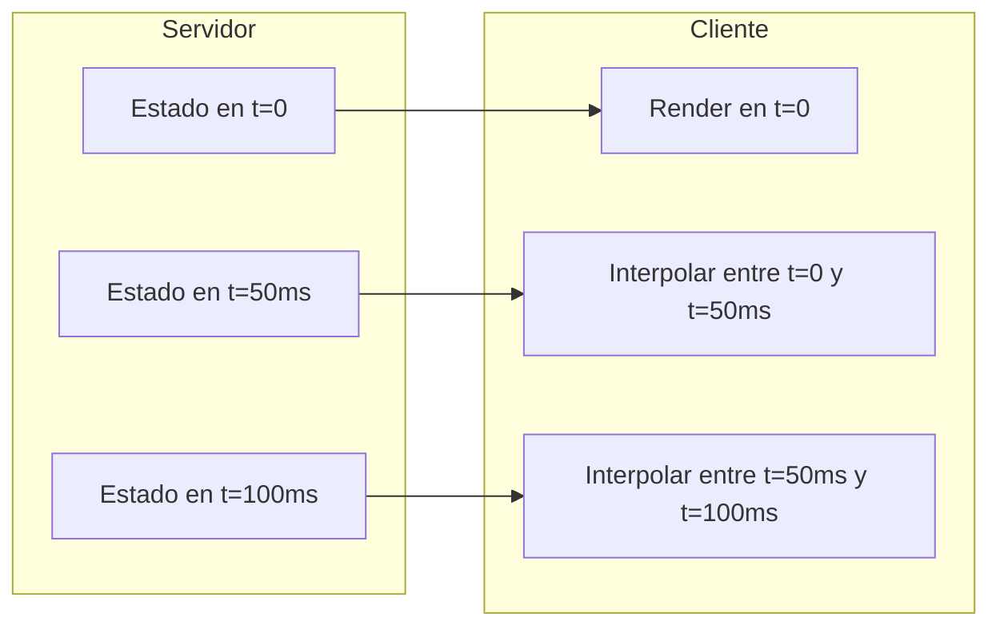

```
// Interpolación lineal entre dos posiciones
funcion interpolarPosicion(pos_anterior, pos_actual, alpha):
    // alpha va de 0.0 a 1.0
    return pos_anterior * (1 - alpha) + pos_actual * alpha
```

**Visualización:**

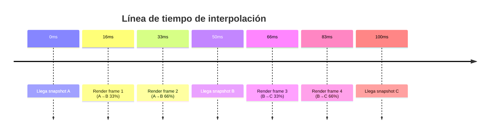

### 4.2. Extrapolación (Dead Reckoning)

Cuando no hay datos recientes, el cliente puede **predecir el futuro** basándose en el movimiento actual. Útil para cubrir pérdidas de paquetes.

```
funcion extrapolarPosicion(posicion, velocidad, deltaTime):
    return posicion + velocidad * deltaTime
```

**Advertencia:** La extrapolación puede causar "teleportaciones" cuando llega el siguiente snapshot y la posición real difiere mucho de la estimada.

---

## 5. Reconciliación con el Servidor

El servidor es la **autoridad**. Cuando el cliente predice incorrectamente, el servidor envía la corrección.

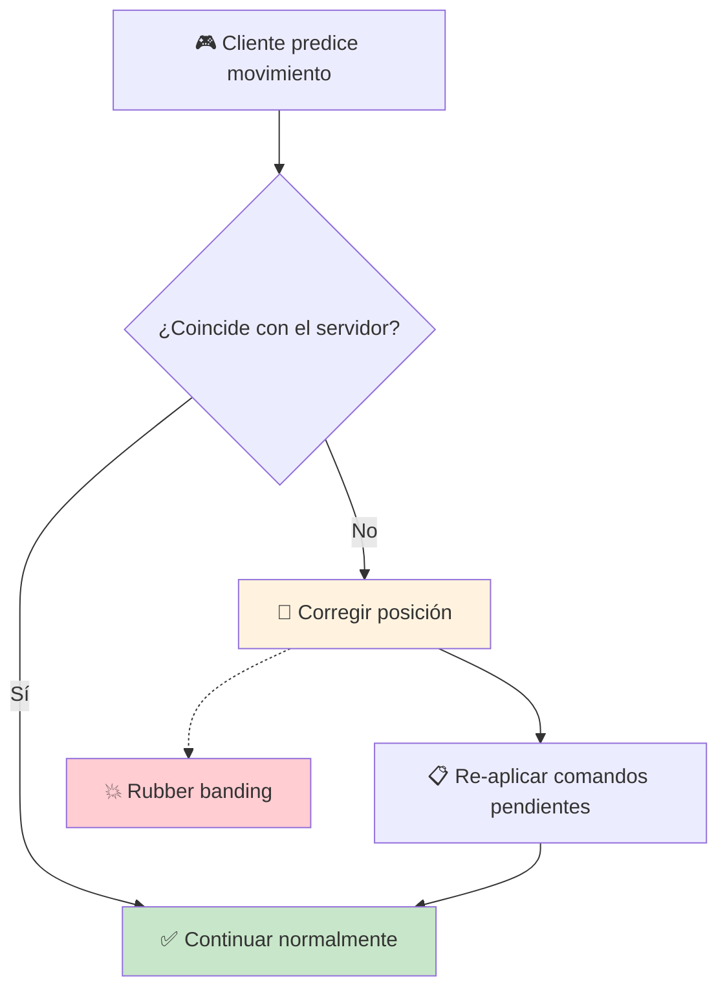

**Causas de reconciliación:**
- El servidor detectó una colisión que el cliente no predijo
- El jugador fue empujado por otro jugador/explosión
- El servidor tiene una física ligeramente diferente
- Anti-trampas detectó un movemente inválido

---

## 6. Manejo de Input del Lado del Cliente

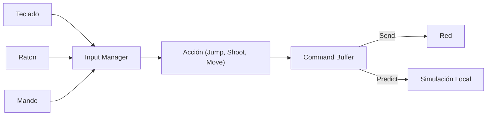

**Buffer de comandos:** almacena los últimos N comandos para:
1. Reenviar en caso de pérdida de paquetes
2. Re-aplicar durante reconciliación
3. Depuración y replays

---

## 7. Optimizaciones del Lado del Cliente

### 7.1. Frustum Culling

Solo renderizar objetos dentro del campo de visión de la cámara.

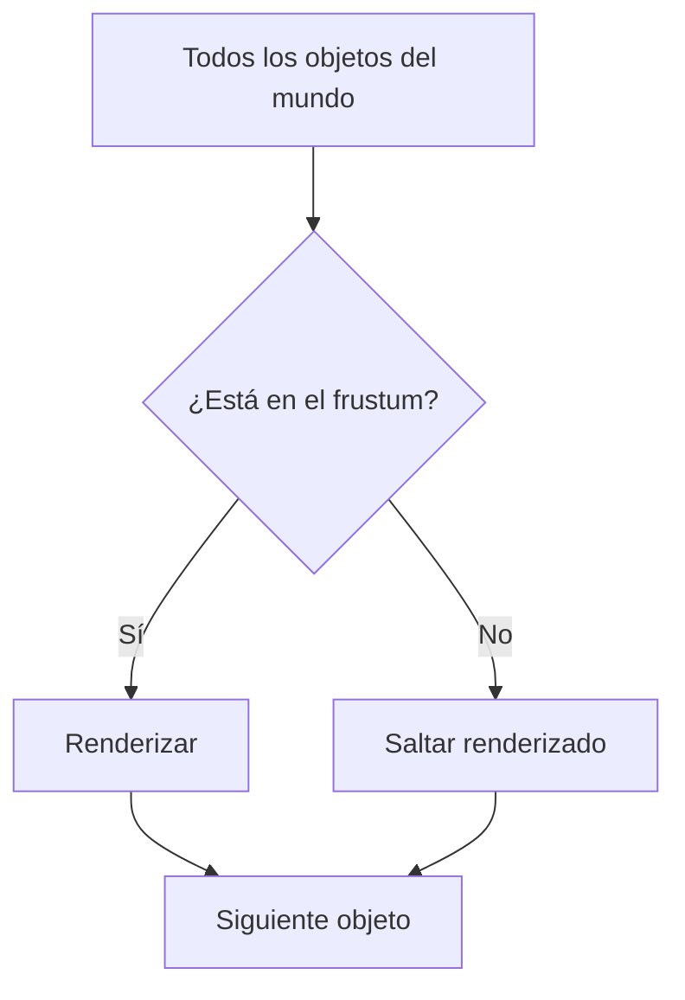

### 7.2. Level of Detail (LOD)

Usar modelos más simples cuando los objetos están lejos.

```
distancia < 10m  → Modelo de alta calidad (3000 triángulos)
10m < distancia < 50m → Modelo medio (1000 triángulos)
distancia > 50m  → Modelo bajo (200 triángulos)
```

### 7.3. Object Pooling

Reutilizar objetos en lugar de crearlos y destruirlos continuamente (reduce garbage collection).

```
clase ObjectPool:
    objetos_disponibles: Pila<GameObject>
    
    funcion obtener():
        if objetos_disponibles.isEmpty():
            return crearNuevo()
        else:
            return objetos_disponibles.pop()
    
    funcion liberar(objeto):
        objeto.reset()
        objetos_disponibles.push(objeto)
```

---

## 8. Comparativa de arquitecturas

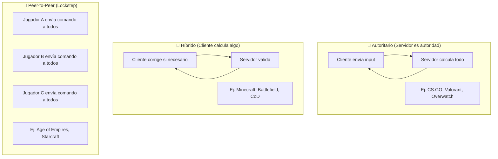

---

## 9. Resumen visual del flujo completo

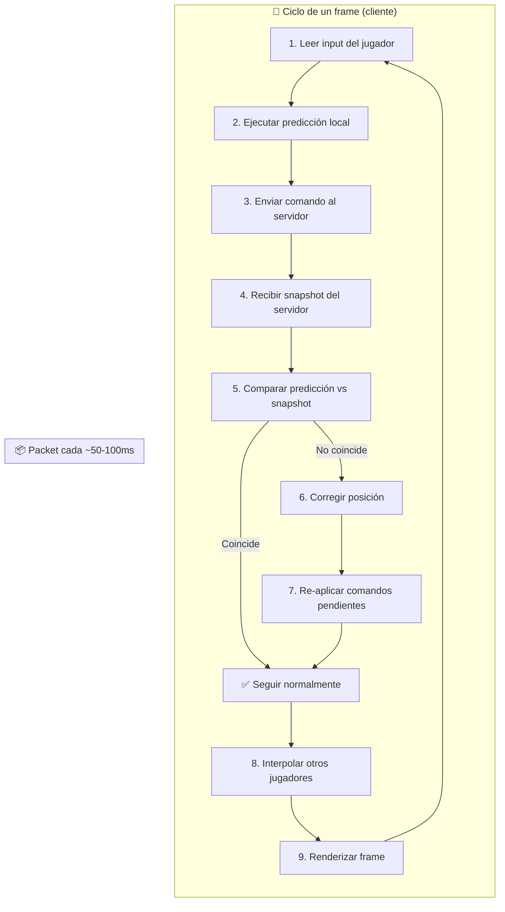

---

## 10. Consideraciones adicionales

| Concepto | Problema | Solución |
|---|---|---|
| **Latencia** | Retraso entre acción y reacción | Predicción del cliente + Interpolación |
| **Pérdida de paquetes** | Movimiento entrecortado | Buffer de comandos + Extrapolación |
| **Jitter** | Paquetes llegan a intervalos irregulares | Buffer de recepción (jitter buffer) |
| **Trampas** | Cliente modificado que envía estados falsos | Servidor autoritario + validaciones |
| **Desincronización** | Estado del cliente ≠ estado del servidor | Reconciliación periódica |

### Latencia aceptable por tipo de juego

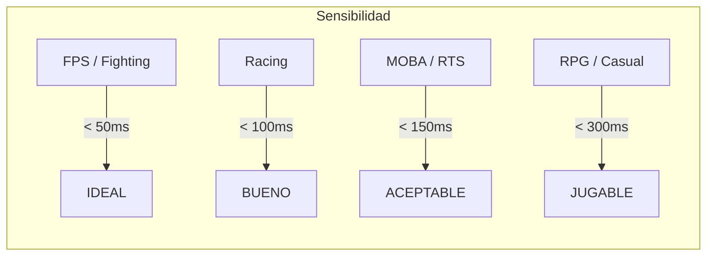

---

## 11. Ejemplo completo mínimo

```python
# Ejemplo conceptual de cliente de juego en Python

class GameClient:
    def __init__(self):
        self.player = Player()
        self.server = ServerConnection()
        self.input_buffer = []
        self.command_history = []
        self.other_players = {}
        self.prev_snapshots = []
        
    def update(self, delta_time):
        # 1. Procesar input
        inputs = self.input_buffer.pop_all()
        
        # 2. Predecir localmente
        for cmd in inputs:
            cmd.time = self.local_time
            self.command_history.append(cmd)
            self.player.apply_movement(cmd, delta_time)
        
        # 3. Enviar al servidor (si hay input nuevo)
        if inputs:
            self.server.send(inputs)
        
        # 4. Recibir snapshots del servidor
        snapshots = self.server.receive()
        for snap in snapshots:
            self.reconcile(snap)
        
        # 5. Interpolar otros jugadores
        for pid, player in self.other_players.items():
            self.interpolate_player(player, delta_time)
        
        # 6. Renderizar
        self.render()
    
    def reconcile(self, snapshot):
        if not self.command_history:
            return
            
        cmd = self.command_history[-1]
        predicted = self.player.position
        
        if distance(predicted, snapshot.player_pos) > 0.01:
            # Corregir posición
            self.player.position = snapshot.player_pos
            # Re-aplicar comandos pendientes
            for cmd in self.command_history:
                self.player.apply_movement(cmd, 1/60)
    
    def render(self):
        # Limpiar pantalla, dibujar jugadores, UI, etc.
        pass
```

---

> **Conclusión clave:** El desarrollo del lado del cliente en juegos multiplayer es un balance constante entre **capacidad de respuesta** (predicción) y **precisión** (autoridad del servidor). Cada decisión de diseño es un trade-off entre latencia percibida, consistencia del mundo y experiencia del jugador.

## Relacionados:
- [[matemáticas-para-juegos]] #siguiente 