# Detección de Colisiones

## ¿Por qué es crítica?

La detección de colisiones es el **cuello de botella** de la física en juegos. Cada frame, cientos de objetos deben verificar si chocan entre sí.

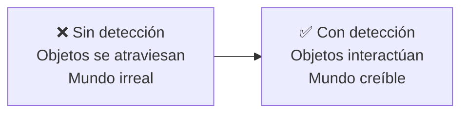

### Estructura general

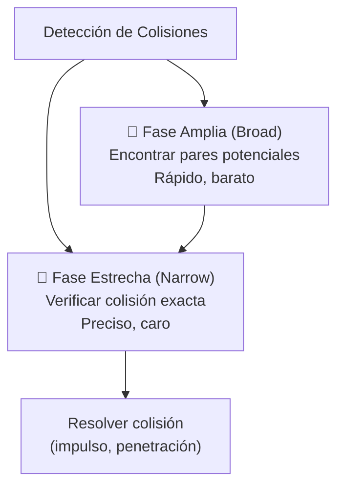

---

## 1. Fase Amplia (Broad Phase)

Objetivo: **descartar rápidamente** pares de objetos que **no** pueden colisionar.

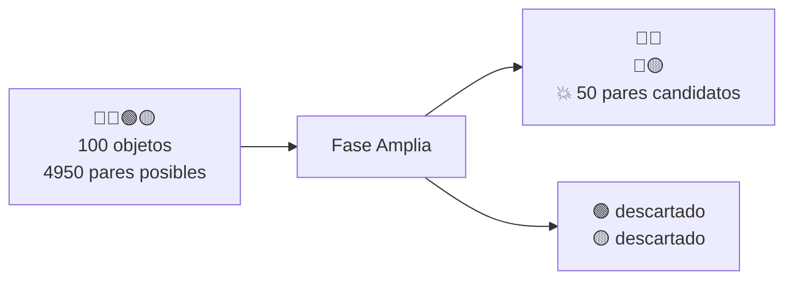

### 1.1. Bounding Volumes

Envoltura que aproxima la forma del objeto para pruebas rápidas.

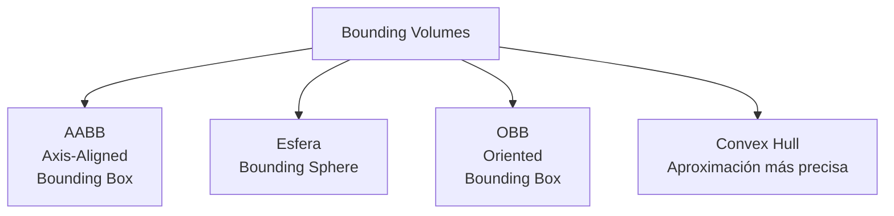

#### AABB (Axis-Aligned Bounding Box)

Caja alineada a los ejes del mundo. No rota con el objeto.

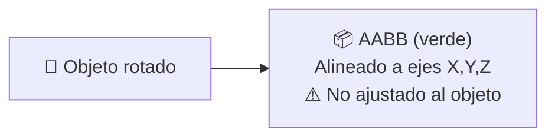

```
// Prueba de intersección AABB vs AABB
struct AABB {
    vec3 min;
    vec3 max;
};

bool intersectAABB(AABB a, AABB b) {
    return (a.min.x <= b.max.x && a.max.x >= b.min.x) &&
           (a.min.y <= b.max.y && a.max.y >= b.min.y) &&
           (a.min.z <= b.max.z && a.max.z >= b.min.z);
}
```

#### Bounding Sphere

Esfera que envuelve el objeto. La prueba más rápida.

```
// Prueba esfera vs esfera
bool intersectSphere(vec3 centerA, float radiusA, vec3 centerB, float radiusB) {
    float dist = length(centerA - centerB);
    return dist < radiusA + radiusB;
}
```

**Ventaja:** Solo 1 comparación (distancia). Ideal para broad phase.

#### OBB (Oriented Bounding Box)

Caja que **rota con el objeto**. Más precisa que AABB pero más cara.

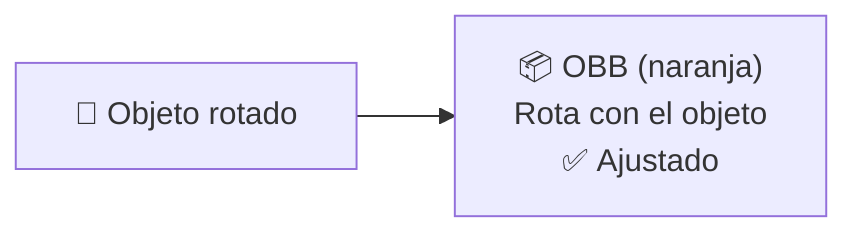

### 1.2. Ordenamiento y Barrido (Sweep and Prune)

Técnica clásica de broad phase para AABBs.

```
1. Proyectar todos los AABBs en el eje X
2. Ordenar por min.x
3. Barrer la lista: si max.x[i] > min.x[j] → posible colisión
4. Repetir para Y y Z (o solo X si es suficiente)
```

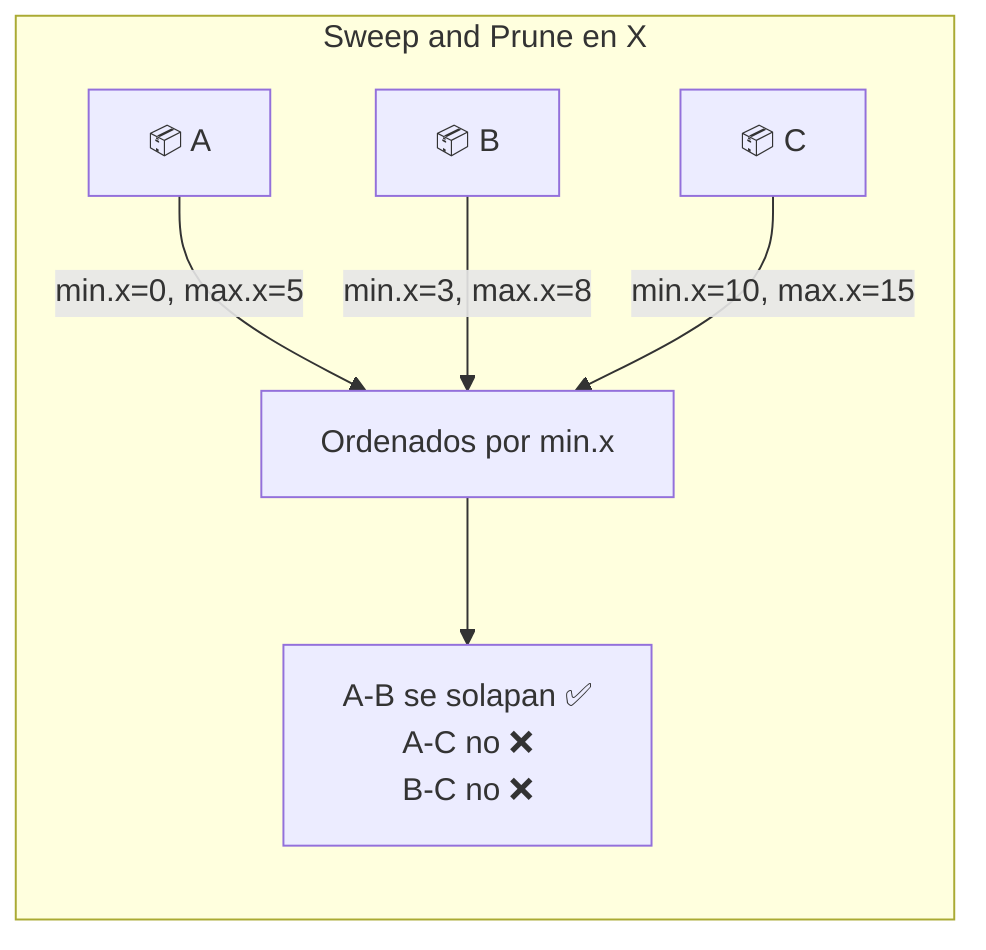

```
// Sweep and Prune simplificado
vector<Pair> sweepAndPrune(AABB[] boxes) {
    vector<Pair> candidates;
    
    sort(boxes, [](AABB a, AABB b) { return a.min.x < b.min.x; });
    
    for (int i = 0; i < boxes.length; i++) {
        for (int j = i + 1; j < boxes.length; j++) {
            if (boxes[i].max.x < boxes[j].min.x) break;  // No solapan en X
            if (intersectY(boxes[i], boxes[j]) && 
                intersectZ(boxes[i], boxes[j])) {
                candidates.push({i, j});
            }
        }
    }
    
    return candidates;
}
```

### 1.3. BVH (Bounding Volume Hierarchy)

Árbol jerárquico de bounding volumes. Los objetos se agrupan en una estructura de árbol.

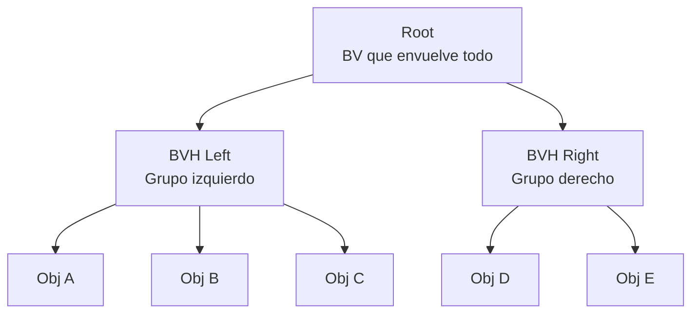

**Prueba de colisión con BVH:**

```
function testBVH(node, queryObject):
    if not intersect(node.BV, queryObject.BV):
        return []  // Descartar rama entera
    
    if node.isLeaf():
        return [node.object]  // Posible colisión
    
    // Probar hijos
    return testBVH(node.left, queryObject) + 
           testBVH(node.right, queryObject)
```

### 1.4. DBVT (Dynamic Bounding Volume Tree)

Variante de BVH optimizada para **objetos dinámicos** que se mueven cada frame. Usada en **Bullet Physics** y **Godot**.

```
Características:
- Árbol binario con AABB en cada nodo
- Refit rápido (actualizar AABBs de objetos móviles)
- Rebalanceo periódico
- Inserción/eliminación dinámica de objetos
```

### 1.5. Posicionamiento Espacial (Spatial Hashing)

Divide el mundo en una **cuadrícula** (grid). Solo se prueban objetos en la misma celda o adyacentes.

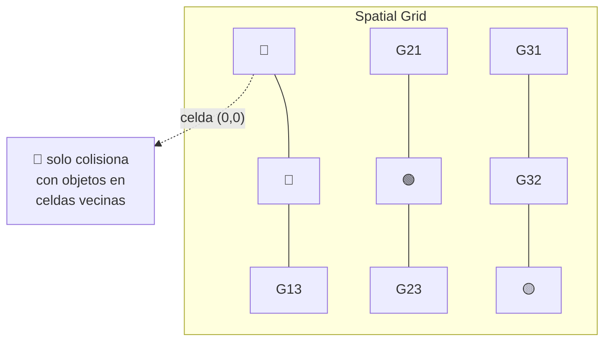

```
// Spatial hashing
int cellX = floor(position.x / cellSize);
int cellY = floor(position.y / cellSize);
int key = hash(cellX, cellY);

// Solo probar colisiones con objetos en la misma celda
```

---

## 2. Fase Estrecha (Narrow Phase)

Objetivo: determinar **exactamente** si dos formas colisionan y **dónde** (punto de contacto, normal, profundidad).

### 2.1. Convexividad

La convexidad determina qué algoritmos se pueden usar.

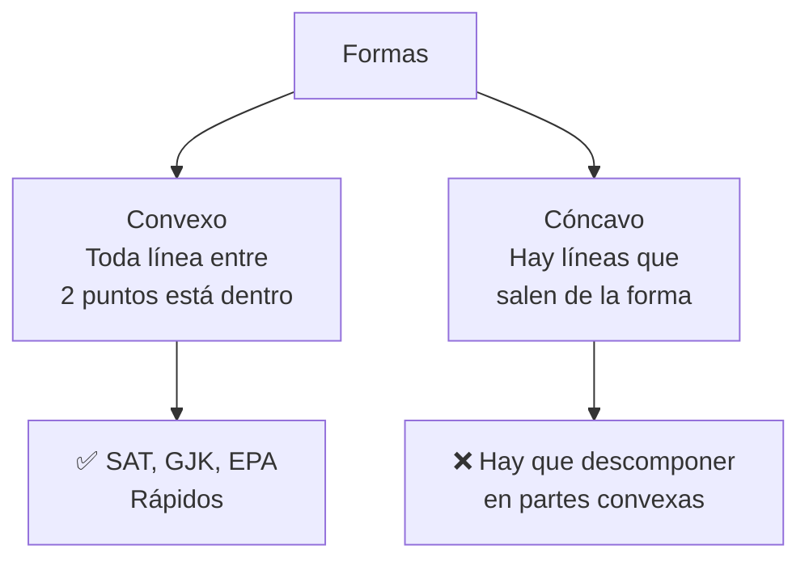

#### Convex Hull

La **envolvente convexa** más pequeña que contiene un conjunto de puntos.

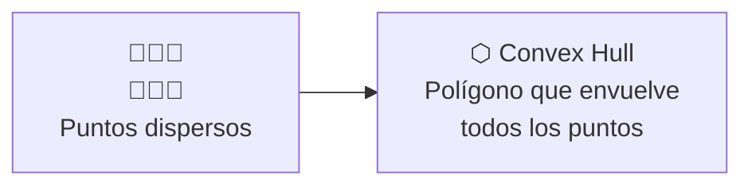

### 2.2. SAT (Separating Axis Theorem)

**Teorema:** Dos formas convexas NO colisionan si existe un eje en el que sus proyecciones no se solapan.

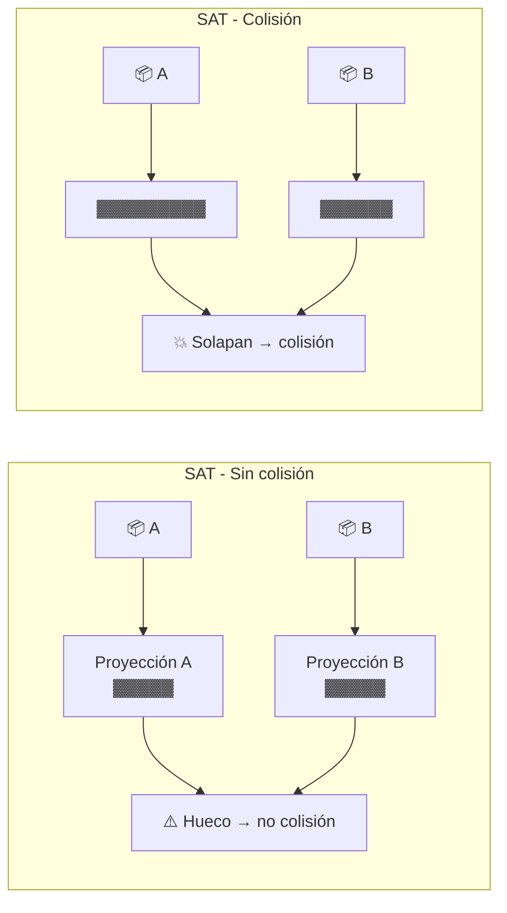

**Algoritmo:**

```
1. Obtener todos los ejes posibles de prueba:
   - Para AABB: ejes X, Y, Z (3 ejes)
   - Para OBB: las normales de las caras + productos cruz (15 ejes)
   
2. Para cada eje:
   - Proyectar ambas formas
   - Si las proyecciones NO se solapan → no hay colisión (salir)

3. Si todos los ejes muestran solapamiento → hay colisión
```

```
// SAT 2D simplificado (polígonos convexos)
bool SAT(Polygon a, Polygon b) {
    vector<vec2> axes = getAxes(a) + getAxes(b);
    
    for (vec2 axis : axes) {
        Projection pa = project(a, axis);
        Projection pb = project(b, axis);
        
        if (pa.max < pb.min || pb.max < pa.min)
            return false;  // Eje separador encontrado
    }
    
    return true;  // Colisión
}
```

| Formas | Ejes a probar | Complejidad |
|---|---|---|
| AABB vs AABB | 3 (X, Y, Z) | Muy rápida |
| OBB vs OBB | 15 | Rápida |
| Convexo 3D vs Convexo 3D | Muchos (caras + aristas) | Media |

### 2.3. GJK (Gilbert-Johnson-Keerthi)

Algoritmo más eficiente que SAT para formas convexas 3D. Usa **diferencias de Minkowski**.

**Diferencia de Minkowski:**

```
A ⊖ B = {a - b : a ∈ A, b ∈ B}

Si A y B colisionan → el origen (0,0,0) está dentro de A ⊖ B
```

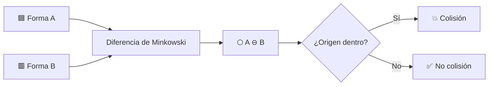

**Algoritmo GJK:**

```
1. Inicializar simplex (punto, línea, triángulo, tetraedro)
2. Elegir punto inicial en la diferencia de Minkowski
3. Buscar punto en dirección al origen
4. Si no se puede encontrar punto más cercano → no colisión
5. Si el simplex contiene el origen → colisión
```

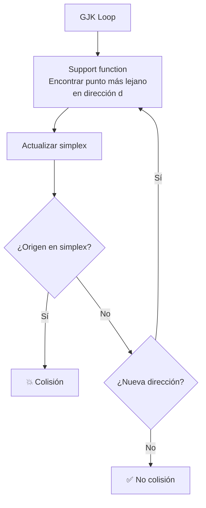

```
// Support function: punto más lejano en dirección d
vec3 support(Shape a, Shape b, vec3 d) {
    return a.getFarthestPoint(d) - b.getFarthestPoint(-d);
}

// GJK simplificado
bool GJK(Shape a, Shape b) {
    vec3 d = a.center - b.center;  // Dirección inicial
    Simplex simplex;
    simplex.add(support(a, b, d));
    d = -d;
    
    for (int i = 0; i < maxIterations; i++) {
        vec3 p = support(a, b, d);
        if (dot(p, d) < 0) return false;  // No colisión
        simplex.add(p);
        if (simplex.containsOrigin()) return true;  // Colisión
        d = simplex.getClosestEdge();  // Nueva dirección
    }
    return false;
}
```

**Ventajas de GJK sobre SAT:**
- Más eficiente para formas complejas
- Fácil de generalizar a cualquier forma convexa
- Solo necesita la **support function** (no necesita conocer las caras)

### 2.4. EPA (Expanding Polytope Algorithm)

**Extiende GJK** para obtener la **profundidad de penetración** y la **normal de contacto**.

```
1. Después de que GJK encuentra colisión, EPA expande el simplex
2. Busca el punto más cercano al origen en la frontera de A ⊖ B
3. La distancia del origen a la frontera = profundidad de penetración
4. La dirección desde el origen a ese punto = normal de contacto
```

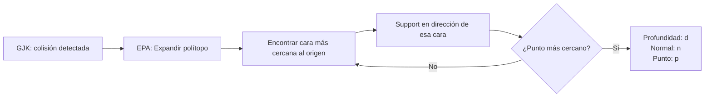

**Salida de Narrow Phase (para resolver colisión):**

```
Contact {
    point:    vec3    // Punto de contacto en el mundo
    normal:   vec3    // Normal de la colisión
    depth:    float   // Profundidad de penetración
}
```

---

## 3. CCD (Continuous Collision Detection)

### 3.1. El problema de la "tunelización"

Cuando un objeto se mueve rápido, en un frame puede estar **antes de una pared** y en el siguiente **después**, atravesándola.

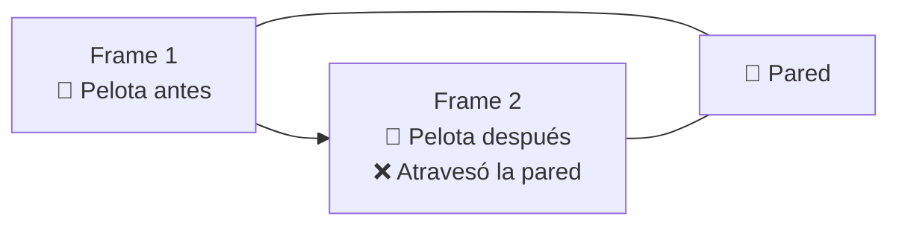

### 3.2. Solución CCD

En lugar de solo probar la posición final, CCD prueba el **volumen barrido** entre la posición anterior y la actual.

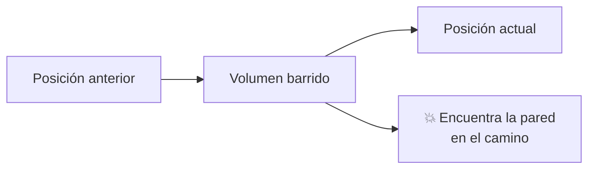

**Tipos de CCD:**

| Técnica | Cómo funciona |
|---|---|
| **Swept AABB** | Barrer AABB desde posición anterior a actual |
| **Ray Cast + expansion** | Disparar rayo desde centro + radio |
| **Speculative CCD** | Calcular TOI (Time of Impact) |
| **Subdivisión temporal** | Múltiples sub-pasos de física |

```
// CCD con ray cast
bool CCD(Sphere sphere, vec3 from, vec3 to, World world) {
    vec3 direction = to - from;
    float distance = length(direction);
    direction /= distance;
    
    Ray ray = {from, direction};
    Hit hit = world.raycast(ray);
    
    if (hit && hit.distance < distance + sphere.radius) {
        // Colisión en hit.distance
        return true;
    }
    return false;
}
```

---

## 4. Pipeline completo de detección

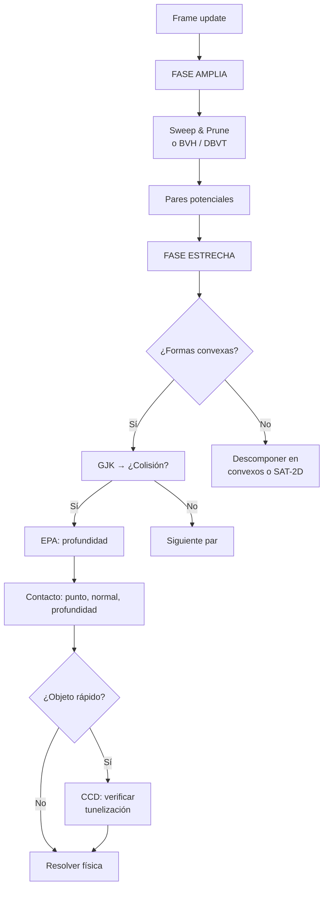

### Complejidad computacional

| Fase | Algoritmo | Complejidad |
|---|---|---|
| Broad | Sweep & Prune | O(n log n) |
| Broad | BVH/DBVT | O(log n) por objeto |
| Broad | Spatial Hashing | O(n) promedio |
| Narrow | SAT (AABB) | O(1) por par |
| Narrow | SAT (OBB) | O(1) por par |
| Narrow | GJK | O(log n) iteraciones |
| Narrow | EPA | O(n) iteraciones |
| CCD | Swept | O(n) por objeto |

> 💡 **Regla de oro:** Nunca pruebes todos los pares (O(n²)). Usa **Broad Phase** primero (Sweep & Prune o BVH). Para Narrow Phase, **GJK + EPA** es el estándar moderno para formas convexas. Activa **CCD** solo en objetos que se mueven rápido (balas, coches) para evitar tunelización.

## Relacionados:
- [[matemáticas-para-juegos]] #anterior 
- [[fisicas-dinamicas]] #siguiente 