# Físicas de Juegos: Dinámicas

## ¿Por qué física en juegos?

La física da **credibilidad** al mundo del juego. Una roca que cae, un coche que derrapa, un personaje que salta... sin física, todo parece flotar.

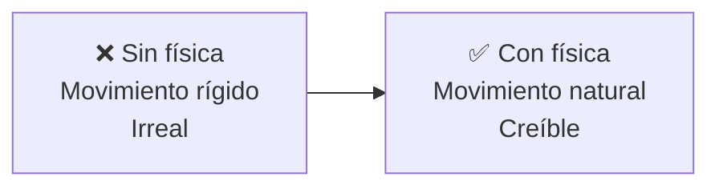

### Lo que simula una física de juegos

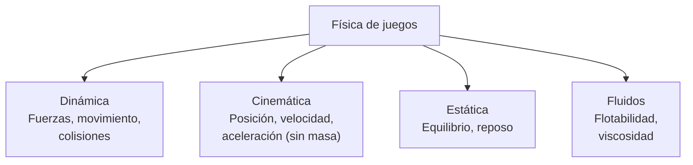

---

## 1. Velocidad Lineal

**Velocidad lineal** = tasa de cambio de la posición en el tiempo.

```
v = Δx / Δt

v = velocidad (m/s)
Δx = cambio de posición
Δt = cambio de tiempo
```

### En el game loop

```
// Velocidad constante
posicion += velocidad * deltaTime;

// Con aceleración
velocidad += aceleracion * deltaTime;
posicion += velocidad * deltaTime;
```

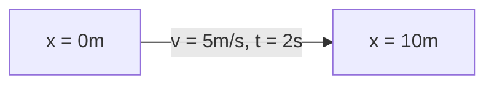

---

## 2. Aceleración

**Aceleración** = tasa de cambio de la velocidad en el tiempo.

```
a = Δv / Δt = F / m  (Segunda Ley de Newton)

a = aceleración (m/s²)
F = fuerza (N)
m = masa (kg)
```

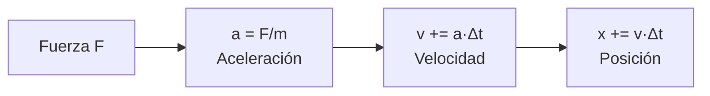

### Integración de Euler (la más simple)

```
// Euler explícito (usado en motores)
void update(float dt) {
    acceleration = force / mass;
    velocity += acceleration * dt;
    position += velocity * dt;
}
```

### Integración de Verlet (más estable)

```
// Verlet: usa posición anterior en lugar de velocidad
void update(float dt) {
    vec3 temp = position;
    position = 2 * position - prevPosition + acceleration * dt * dt;
    prevPosition = temp;
}
```

| Método | Precisión | Estabilidad | Uso |
|---|---|---|---|
| **Euler explícito** | Baja | Baja | Juegos casuales |
| **Semi-implicito Euler** | Media | Media | Estándar en juegos |
| **Verlet** | Alta | Alta | Simulaciones de partículas |
| **Runge-Kutta 4 (RK4)** | Muy alta | Muy alta | Simulación científica |

---

## 3. Fuerzas

**Segunda Ley de Newton:** `F = m · a`

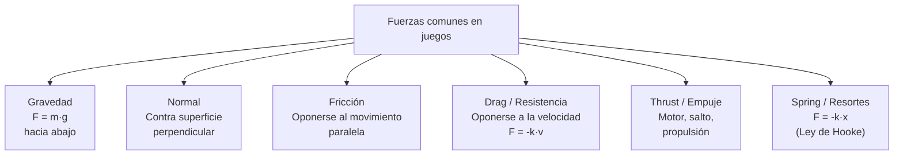

### 3.1. Gravedad

```
// La fuerza más común
vec3 gravity = vec3(0, -9.81, 0);  // m/s² en la Tierra
// En juegos: 9.81 se siente realista, 15-20 se siente "arcade"

// Aplicar gravedad
rigidbody.addForce(gravity * rigidbody.mass);
```


### 3.2. Fuerza de resorte (Hooke)

```
F = -k · (x - x₀)

k = constante del resorte
x = posición actual
x₀ = posición de equilibrio
```


### 3.3. Fuerza centrípeta (para órbitas/giros)

```
Fc = m · v² / r

v = velocidad tangencial
r = radio de curvatura
```

**Aplicación:** Coches girando, planetas orbitando, loopings.

---

## 4. Centro de Masa

El **centro de masa** (CM) es el punto donde se concentra toda la masa del objeto. Es el punto de aplicación de fuerzas como la gravedad.

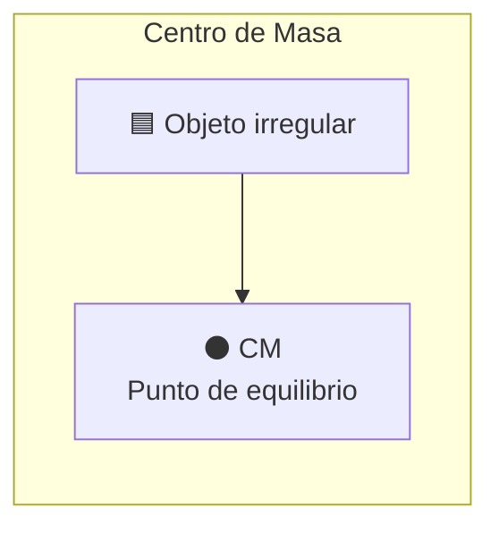

```
// Para un sistema de partículas:
CM = Σ(mᵢ · rᵢ) / Σ(mᵢ)

mᵢ = masa de la partícula i
rᵢ = posición de la partícula i

// Objeto uniforme:
CM = centro geométrico
```

**Importancia en juegos:**
- El objeto rota alrededor de su CM
- La gravedad actúa en el CM
- Las colisiones generan torque alrededor del CM

---

## 5. Momento de Inercia

**Momento de inercia (I)** = la "masa rotacional". Mide qué tan difícil es rotar un objeto.

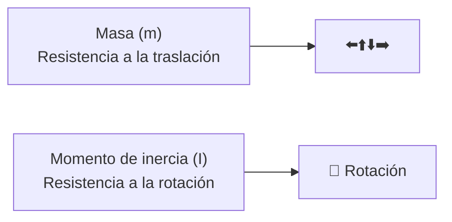

```
// Para un objeto puntual:
I = m · r²

// Cilindro sólido:
I = ½ · m · r²

// Esfera sólida:
I = ⅖ · m · r²

// La inercia determina cómo responde un objeto a torques:
τ = I · α    (análogo a F = m·a)
τ = torque
α = aceleración angular
```

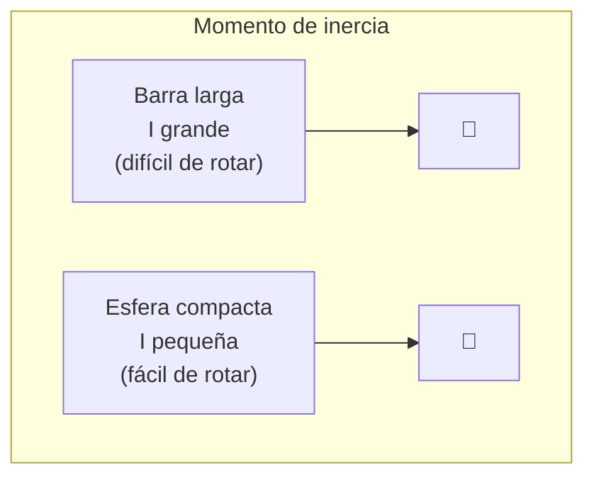

**En motores de juegos:** La inercia se calcula automáticamente a partir de la forma del collider.

---

## 6. Velocidad Angular

**Velocidad angular (ω)** = qué tan rápido rota un objeto (radianes/segundo o grados/segundo).

```
ω = Δθ / Δt

θ = ángulo de rotación
ω = velocidad angular

Relación con velocidad lineal:
v = ω × r   (producto cruz)
v = velocidad lineal en un punto a distancia r del eje
```

```
// Actualizar rotación
angularVelocity += angularAcceleration * dt;
rotation += angularVelocity * dt;

// Velocidad lineal de un punto en el cuerpo
vec3 pointVelocity = velocity + cross(angularVelocity, point - centerOfMass);
```

**Ejemplo rueda de coche:**

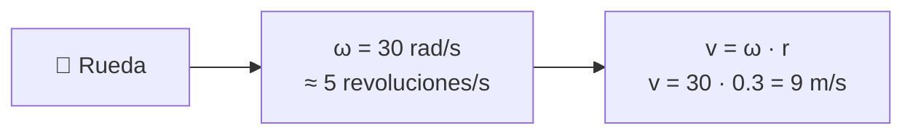

---

## 7. Momento Lineal (Momentum)

**Momento lineal (p)** = cantidad de movimiento.

```
p = m · v

Principio de conservación:
En un sistema cerrado, p_total se conserva.
```

**Colisiones:**

```
// Colisión elástica (conserva energía)
m₁·v₁ + m₂·v₂ = m₁·v₁' + m₂·v₂'

// Colisión inelástica (pierde energía, objetos se pegan)
v' = (m₁·v₁ + m₂·v₂) / (m₁ + m₂)
```

---

## 8. Restitución (Rebote)

**Coeficiente de restitución (e)** = qué tanto rebota un objeto.

```
e = velocidad_relativa_después / velocidad_relativa_antes

e = 1.0 → Colisión perfectamente elástica (rebota al 100%)
e = 0.0 → Colisión perfectamente inelástica (no rebota, se pega)
e = 0.5 → Rebota al 50%
```

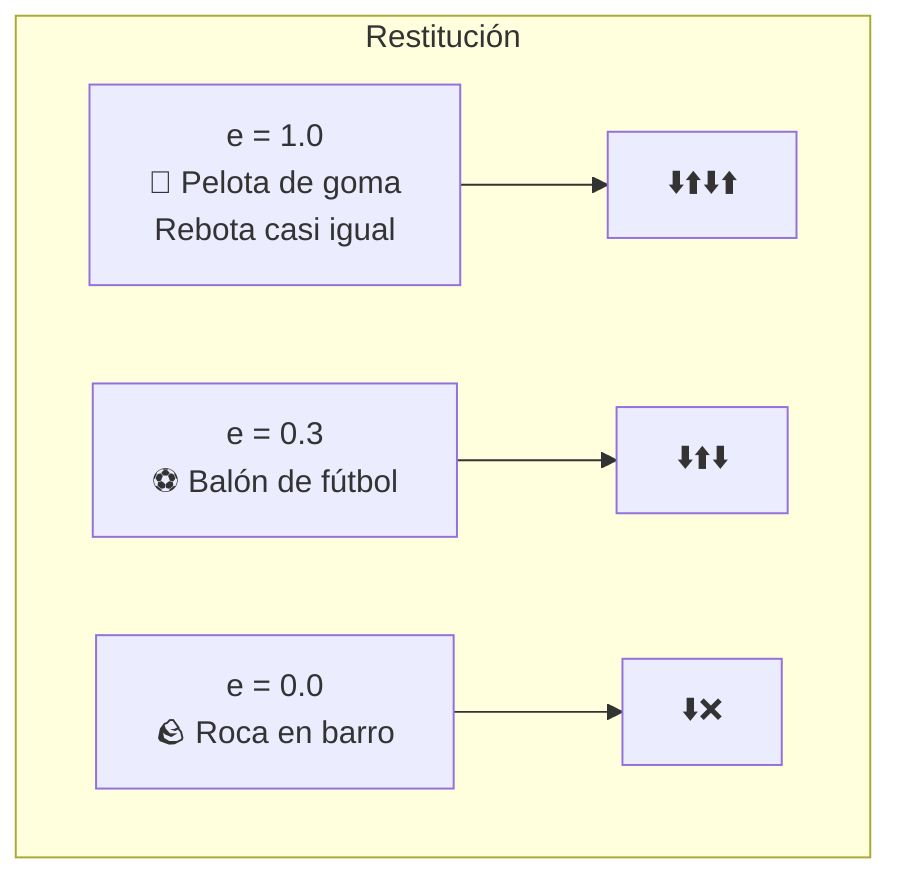

```
// Impulso en colisión
vec3 relativeVelocity = velocityA - velocityB;
float normalVelocity = dot(relativeVelocity, collisionNormal);

// Aplicar restitución
float j = -(1 + restitution) * normalVelocity;
j /= 1/massA + 1/massB;

velocityA += j * collisionNormal / massA;
velocityB -= j * collisionNormal / massB;
```

**Materiales comunes:**

| Material | Restitución |
|---|---|
| Goma dura | 0.95 |
| Acero | 0.90 |
| Madera | 0.50 |
| Plomo | 0.20 |
| Barro | 0.00 |

---

## 9. Fricción

**Fricción** = fuerza que se opone al movimiento entre dos superficies en contacto.

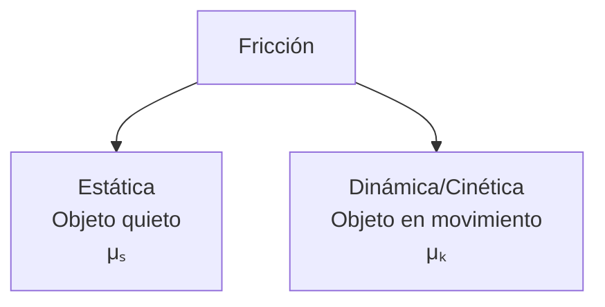

### Fricción Estática vs Dinámica

```
Fricción estática: mantiene el objeto quieto (μₛ > μₖ)
Fricción dinámica: se opone al movimiento (μₖ)

μₛ > μₖ  → Cuesta más empezar a mover que mantener el movimiento
```

**Leyes de Coulomb para fricción:**

```
F_fricción ≤ μ · N

μ = coeficiente de fricción
N = fuerza normal (perpendicular a la superficie)

// Fricción dinámica (se aplica cuando hay movimiento relativo)
F_friccion = μₖ · N · -v̂

// Fricción estática (se aplica cuando no hay movimiento)
Si |F_aplicada| ≤ μₛ·N → no se mueve
```

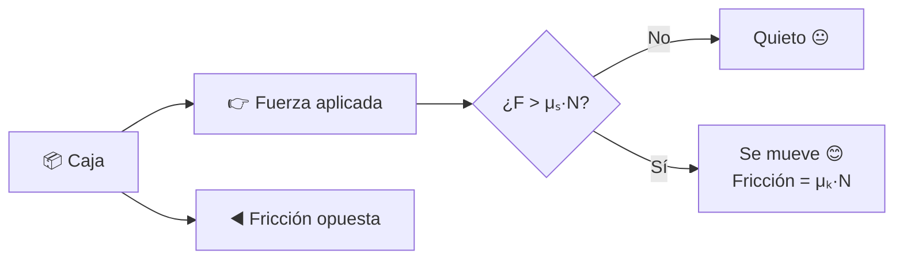

**Coeficientes típicos:**

| Superficies | μₛ | μₖ |
|---|---|---|
| Hielo-hielo | 0.1 | 0.03 |
| Madera-madera | 0.5 | 0.3 |
| Goma-asfalto | 1.0 | 0.8 |
| Metal-metal (seco) | 0.6 | 0.4 |

---

## 10. Juntas (Constraints/Joints)

Las **juntas** conectan dos cuerpos rígidos restringiendo su movimiento relativo.

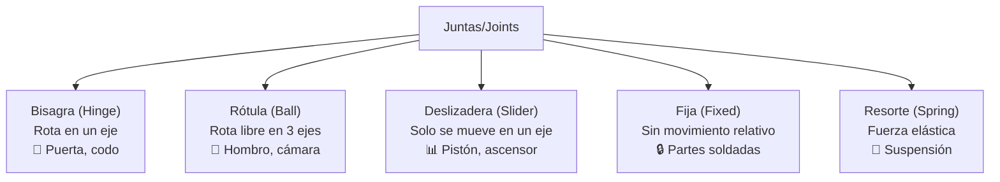

### 10.1. Hinge Joint (Bisagra)

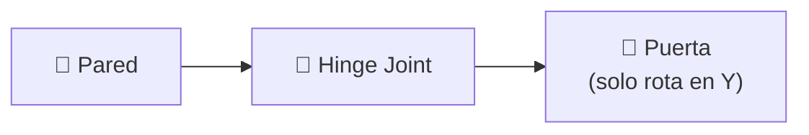

**Propiedades:** `anchor, axis, limits (min/max angle), motor (velocity, force)`

### 10.2. Ragdoll (combinación de joints)

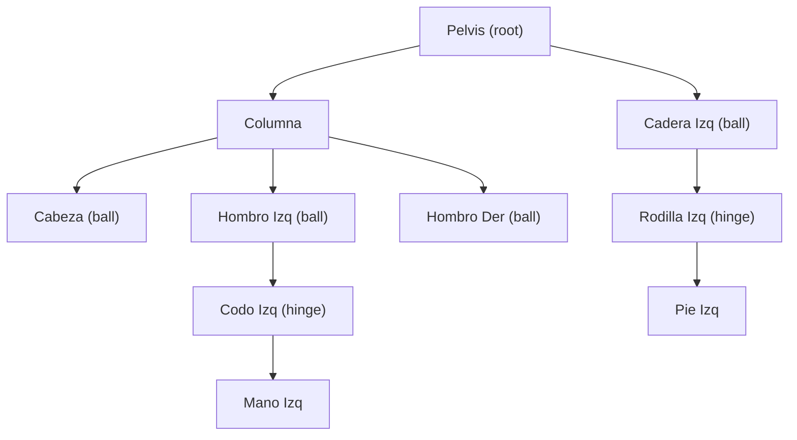

### 10.3. Ecuación de restricción (Constraint)

```
C(x) = 0   // Ecuación de restricción general

// Para un hinge: el ángulo relativo está limitado
C = (θ₂ - θ₁) - θ_limite = 0

// Para un punto fijo: los puntos deben coincidir
C = (p₁ + r₁) - (p₂ + r₂) = 0
```

Los motores resuelven estas restricciones con **Lagrange multipliers** o **sequential impulses**.

---

## 11. Flotabilidad (Buoyancy)

**Principio de Arquímedes:** Un cuerpo sumergido en un fluido experimenta un empuje hacia arriba igual al peso del fluido desalojado.

```
F_buoyancy = ρ · V · g

ρ = densidad del fluido (kg/m³)
V = volumen sumergido (m³)
g = gravedad (m/s²)

Si ρ_objeto < ρ_fluido → flota
Si ρ_objeto > ρ_fluido → se hunde
Si ρ_objeto = ρ_fluido → suspensión neutral
```

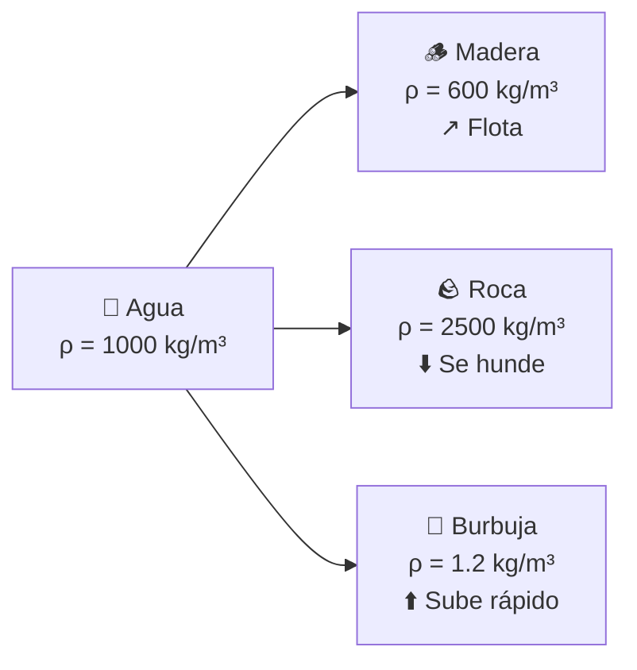

```
// Flotabilidad simplificada para juegos
vec3 buoyancyForce(vec3 position, float volume, float fluidDensity) {
    float submergedDepth = fluidSurface - position.y;
    if (submergedDepth <= 0) return vec3(0);  // Fuera del agua
    
    float submergedVolume = min(volume, volume * (submergedDepth / objectHeight));
    float buoyancyForce = fluidDensity * submergedVolume * gravity;
    
    return vec3(0, buoyancyForce, 0);
}

// Con amortiguación (drag en agua)
vec3 waterDrag = -velocity * dragCoefficient * submergedVolume;
```

**Parámetros en juegos:**
```
Agua dulce:   ρ = 1000 kg/m³
Agua salada:  ρ = 1025 kg/m³
Aceite:       ρ = 900 kg/m³
Miel:         ρ = 1400 kg/m³
```

---

## 12. Resumen visual del motor de física

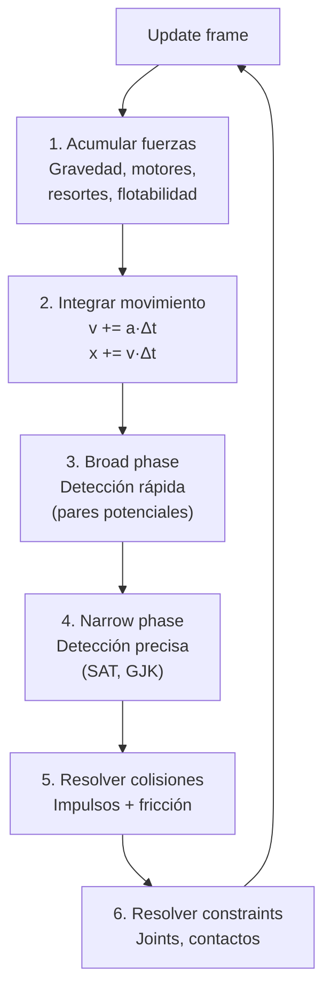

### Pipeline típico por frame

```
1. Aplicar fuerzas externas (gravedad, viento, motores)
2. Actualizar velocidades (a = F/m, v += a·dt)
3. Actualizar posiciones (x += v·dt) 
4. Detectar colisiones (Broad → Narrow)
5. Generar contactos (punto, normal, penetración)
6. Resolver contactos (impulsos secuenciales)
7. Resolver constraints (joints, motores)
8. Actualizar sleeping (objetos en reposo no se procesan)
```

> 💡 **Regla de oro:** Usa un motor de física existente (PhysX, Bullet, Jolt) a menos que quieras aprender. La física es **difícil** de hacer bien (estabilidad, stacking, sleeping, continuos collision). El game loop típico: fuerzas → integrar → detectar → resolver → repetir.

## Relacionados:
- [[fisica-deteccion de colisiones]] #anterior 
- [[motores-de-juegos]] #siguiente 