# IA para juegos

## ¿Qué hace única a la IA de juegos?

La IA en videojuegos **no busca ser inteligente**, busca ser **divertida**. Un enemigo perfecto sería frustrante. La IA de juegos es el arte de parecer inteligente con recursos limitados.

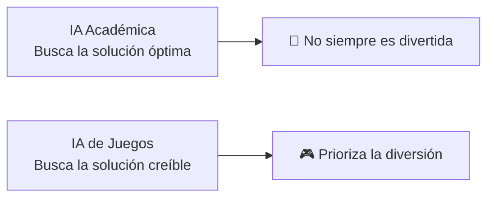

**Diferencias clave:**

| IA Académica | IA de Juegos |
|---|---|
| Solución óptima | Solución creíble |
| Sin límite de tiempo | 1-3ms por frame |
| Recursos infinitos | CPU compartida (física, audio, red) |
| Predecible | Debe ser impredecible pero justa |
| Sabe todo | Información limitada (niebla de guerra) |

---

## 2. Toma de Decisiones

### 2.1. Máquinas de Estado (FSM - Finite State Machines)

La técnica más clásica y usada. Un agente solo puede estar en **un estado a la vez**, y las **transiciones** lo mueven entre estados.

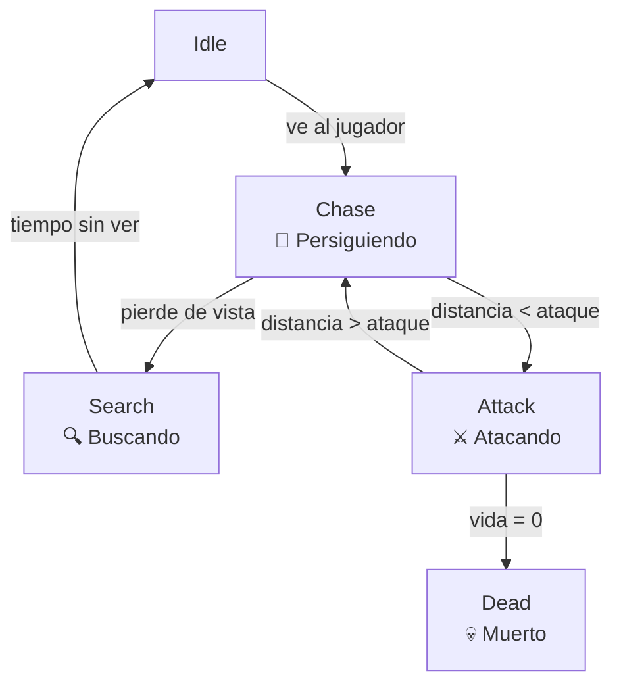

```
// FSM en código
enum State { IDLE, CHASE, ATTACK, DEAD };

State currentState = IDLE;

void update() {
    switch (currentState) {
        case IDLE:
            if (canSeePlayer())   currentState = CHASE;
            break;
        case CHASE:
            moveTowards(player);
            if (!canSeePlayer())  currentState = SEARCH;
            if (distance < 2.0f) currentState = ATTACK;
            break;
        case ATTACK:
            attack();
            if (distance > 2.5f) currentState = CHASE;
            if (health <= 0)     currentState = DEAD;
            break;
        case DEAD:
            playDeathAnimation();
            break;
    }
}
```

**Problemas de FSM:**
- Explosión de estados (cada comportamiento nuevo duplica transiciones)
- Dificultad para comportamientos paralelos (perseguir + esquivar)
- No recuerda el pasado (sin memoria)

---

### 2.2. Árboles de Comportamiento (Behavior Trees)

Evolución moderna de FSM. Usan **nodos** organizados en árbol que devuelven `Success`, `Failure` o `Running`.

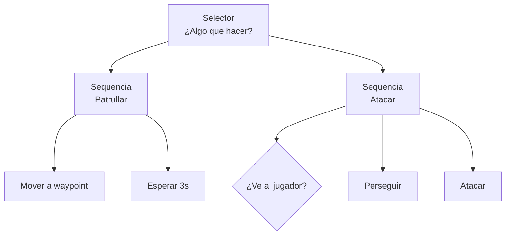

**Tipos de nodos:**

| Nodo | Comportamiento |
|---|---|
| **Selector (?)** | Prueba hijos en orden. Si uno falla, prueba el siguiente. |
| **Secuencia (→)** | Prueba hijos en orden. Si uno falla, toda la secuencia falla. |
| **Condición (❓)** | ¿Se cumple la condición? Sí/No |
| **Acción (⚡)** | Ejecuta una acción (correr, atacar, esperar) |
| **Decorador** | Modifica al hijo (invertir, repetir, timeout) |

```
// Behavior Tree en código (ejemplo simplificado)
class Selector : Node {
    Node[] children;
    
    Status execute() {
        for (child in children) {
            Status s = child.execute();
            if (s == RUNNING) return RUNNING;
            if (s == SUCCESS) return SUCCESS;
        }
        return FAILURE;
    }
}

class Sequence : Node {
    Node[] children;
    int current = 0;
    
    Status execute() {
        Status s = children[current].execute();
        if (s == RUNNING) return RUNNING;
        if (s == SUCCESS) current++;
        if (current >= children.length) {
            current = 0;
            return SUCCESS;
        }
        return RUNNING;
    }
}
```

**Ventajas sobre FSM:**
- Reutilización de sub-árboles
- Memoria implícita (Running mantiene estado)
- Composición jerárquica
- Más fácil de depurar visualmente

---

### 2.3. Árboles de Decisión

Caso particular: el árbol es **estático** y las condiciones determinan la ruta.

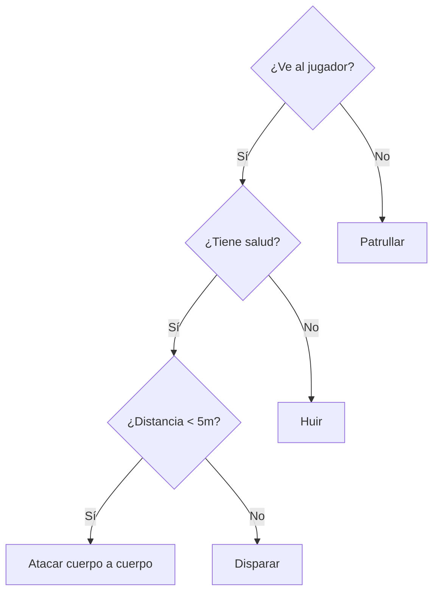

**Diferencia con Behavior Tree:** Los árboles de decisión son **puramente condicionales**, no tienen acciones continuas (Running). Son un snapshot de decisiones en un momento dado.

---

### 2.4. Lógica Difusa (Fuzzy Logic)

Reemplaza condiciones binarias (sí/no) por **grados de verdad** (0.0 a 1.0).

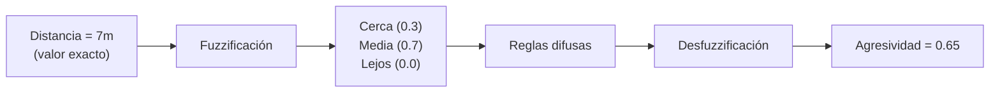

**Ejemplo:** Decidir agresividad de un enemigo.

```
// Variables difusas:
Distancia:  {Cerca, Media, Lejos}
Salud:      {Baja, Media, Alta}
Agresividad:{Huir, Cauto, Agresivo}

// Reglas difusas:
IF Distancia = Cerca AND Salud = Alta THEN Agresividad = Agresivo
IF Distancia = Lejos  OR  Salud = Baja THEN Agresividad = Huir
IF Salud = Media THEN Agresividad = Cauto
```

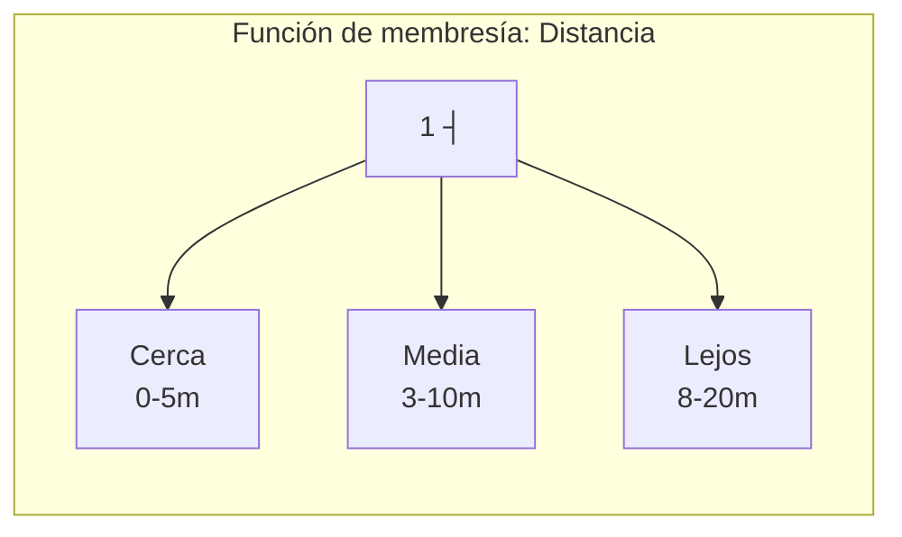

**Ventaja:** Decisiones más naturales y suaves (sin transiciones bruscas).

---

### 2.5. Comportamiento Orientado a Metas (GOAP)

Creado por **F.E.A.R.** (2005). El agente tiene **metas** y elige **acciones** para cumplirlas.

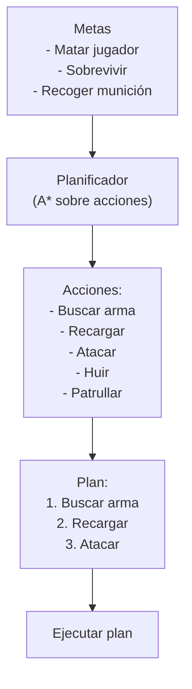

**Componentes del GOAP:**

```
// Cada acción tiene:
Accion {
    precondiciones: {tieneArma=true, municion>0}
    efecto: {jugadorMuerto=true}
    coste: 10
    
    ejecutar() { /* animación, daño */ }
}

// El planificador busca la secuencia de acciones
// que minimiza el coste total para alcanzar la meta
```

**Ventaja:** Comportamientos emergentes que el diseñador no programó explícitamente.

---

### 2.6. Sistemas de Markov (HMM)

Modelos probabilísticos. La IA no decide con certeza, sino con **probabilidades de transición**.

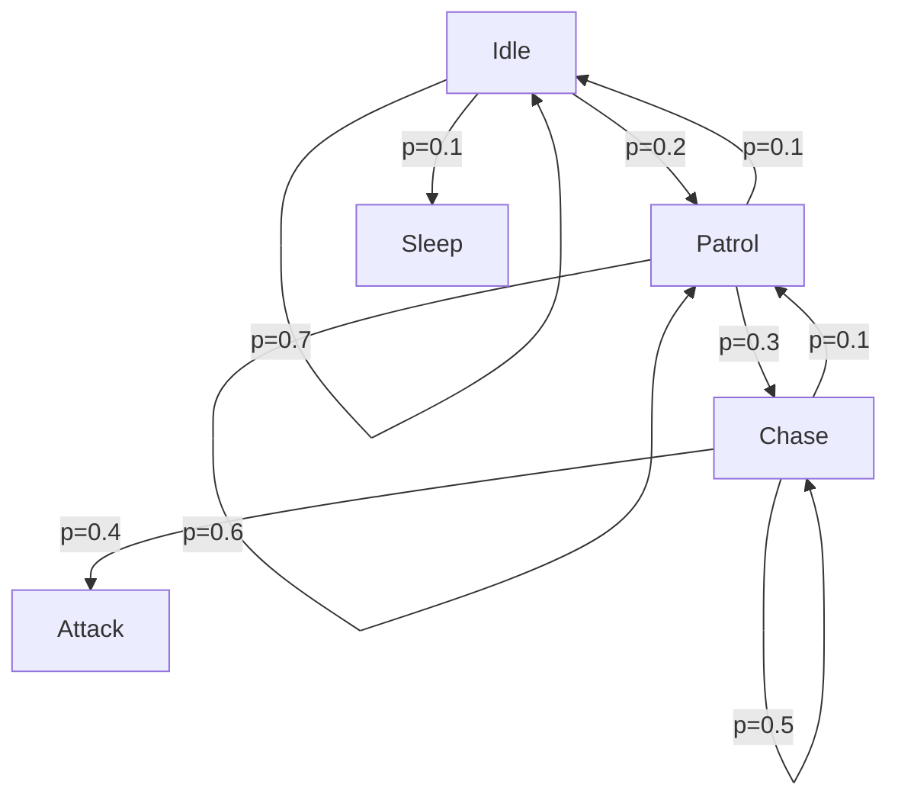

```
// Matriz de transición
float[][] transition = {
    {0.7, 0.2, 0.1, 0.0},  // Idle → {Idle, Patrol, Sleep, Chase}
    {0.1, 0.6, 0.0, 0.3},  // Patrol → {Idle, Patrol, Sleep, Chase}
    {0.0, 0.0, 0.9, 0.1},  // Sleep → {Idle, Patrol, Sleep, Chase}
    {0.0, 0.1, 0.0, 0.5},  // Chase → {Idle, Patrol, Sleep, Chase}
};
```

**Usos:** Comportamiento impredecible, economía de juegos, generación procedural de niveles, NPCs con "personalidad".

---

## 3. Movimiento

### 3.1. Steering Behaviors

Comportamientos de movimiento **local** desarrollados por Craig Reynolds. Cada comportamiento produce una **fuerza** que se suma al movimiento del agente.

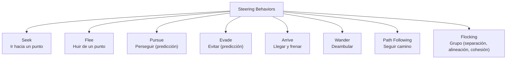

```
// Seek: fuerza hacia un objetivo
Vec3 seek(Vec3 position, Vec3 target, Vec3 velocity, float maxSpeed) {
    Vec3 desired = normalize(target - position) * maxSpeed;
    return desired - velocity;  // Fuerza de steering
}

// Arrive: frenar al acercarse
Vec3 arrive(Vec3 position, Vec3 target, Vec3 velocity, float slowRadius) {
    Vec3 toTarget = target - position;
    float dist = length(toTarget);
    float speed = (dist < slowRadius) ? maxSpeed * (dist / slowRadius) : maxSpeed;
    Vec3 desired = normalize(toTarget) * speed;
    return desired - velocity;
}

// Flocking: combinar 3 fuerzas
Vec3 flocking(Boid boid, Boid[] neighbors) {
    Vec3 sep = separation(neighbors) * SEP_WEIGHT;
    Vec3 ali = alignment(neighbors) * ALI_WEIGHT;
    Vec3 coh = cohesion(neighbors) * COH_WEIGHT;
    return sep + ali + coh;
}
```

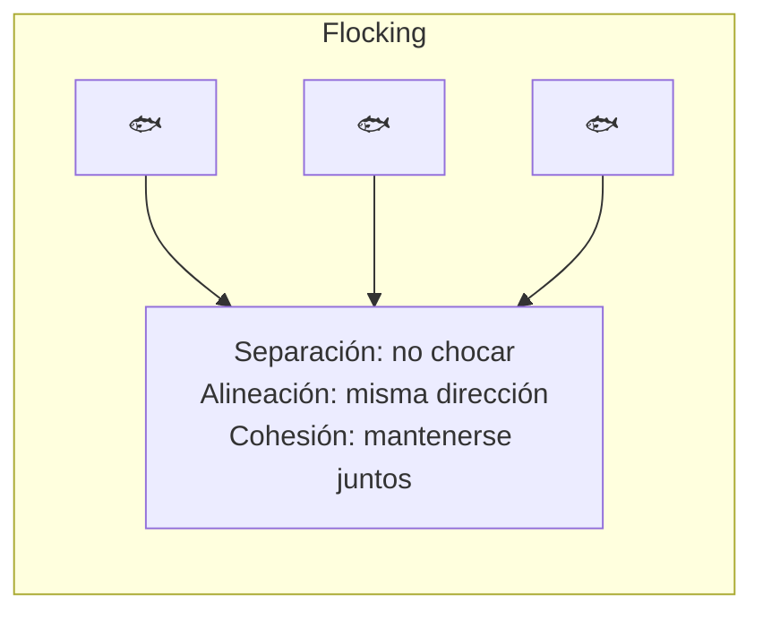

### 3.2. Pathfinding (A*)

El algoritmo de búsqueda de caminos más usado en juegos. Encuentra el camino más corto en un grafo.

```
A*: f(n) = g(n) + h(n)

g(n) = coste real desde el inicio hasta n
h(n) = heurística (coste estimado desde n hasta la meta)

Propiedades:
- Completo: encuentra solución si existe
- Óptimo: encuentra la solución más corta (si h es admisible)
```

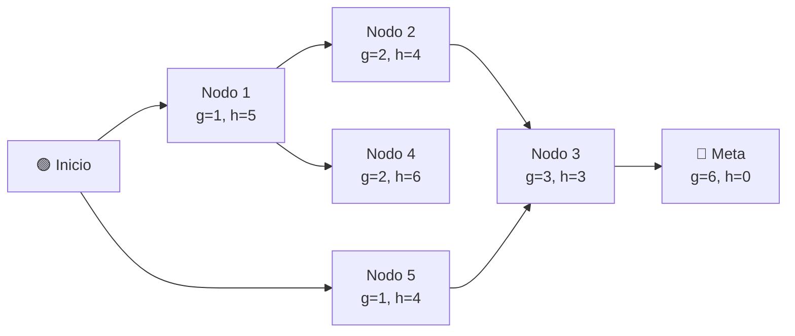

```
function AStar(inicio, meta, grafo):
    openSet = PriorityQueue()  // ordenado por f(n)
    openSet.add(inicio, f(inicio))
    cameFrom = Map()
    gScore = Map()  // g(n) por defecto = infinito
    gScore[inicio] = 0
    
    while openSet is not empty:
        current = openSet.pop()  // el de menor f(n)
        
        if current == meta:
            return reconstruirCamino(cameFrom, current)
        
        for neighbor in grafo.vecinos(current):
            tentative_g = gScore[current] + dist(current, neighbor)
            
            if tentative_g < gScore[neighbor]:
                cameFrom[neighbor] = current
                gScore[neighbor] = tentative_g
                fScore = gScore[neighbor] + heuristic(neighbor, meta)
                openSet.add(neighbor, fScore)
    
    return []  // No hay camino
```

**Heurísticas comunes:**
```
// Distancia Manhattan (grid 4 direcciones)
h = |dx| + |dy|

// Distancia Euclídea (cualquier dirección)
h = sqrt(dx² + dy²)

// Distancia Diagonal (grid 8 direcciones)
h = max(|dx|, |dy|) + (√2 - 1) * min(|dx|, |dy|)
```

---

## 4. Juegos de Tablero

### 4.1. Minimax

Algoritmo de decisión para juegos de **suma cero** (lo que un jugador gana, el otro pierde). Explora el árbol de juego.

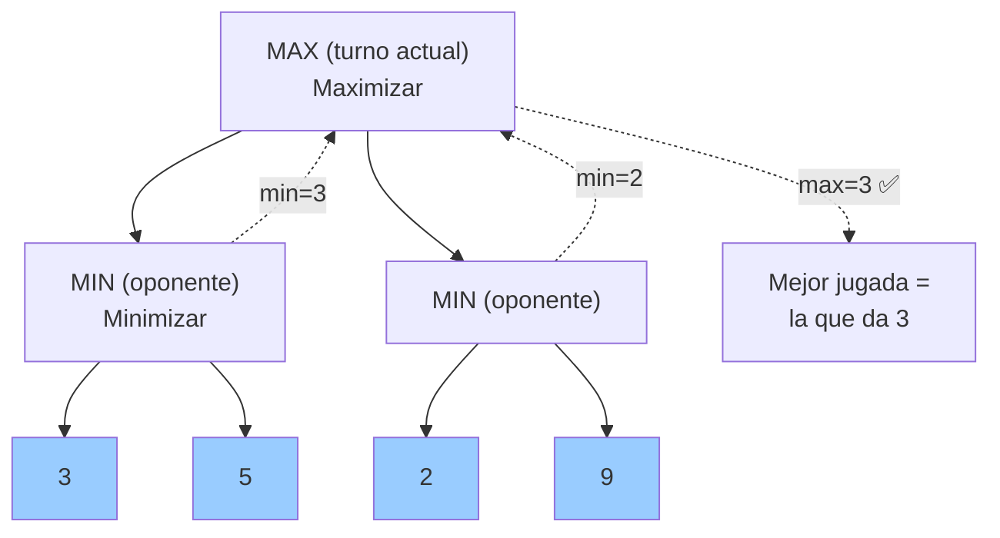

```
function minimax(nodo, depth, maximizingPlayer):
    if depth == 0 o nodo es terminal:
        return evaluar(nodo)  // +1 gana MAX, -1 gana MIN
    
    if maximizingPlayer:
        maxEval = -infinito
        for child in nodo.hijos():
            eval = minimax(child, depth - 1, false)
            maxEval = max(maxEval, eval)
        return maxEval
    else:
        minEval = +infinito
        for child in nodo.hijos():
            eval = minimax(child, depth - 1, true)
            minEval = min(minEval, eval)
        return minEval
```

### 4.2. Poda Alfa-Beta (AB Pruning)

Optimización de Minimax que **pod**a ramas que no se van a elegir.

```
α = mejor valor que MAX puede asegurar (inicia en -∞)
β = mejor valor que MIN puede asegurar (inicia en +∞)

Si en algún nodo: α ≥ β → se poda esa rama
```

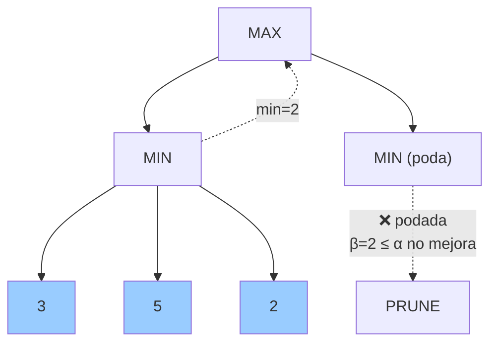

```
function alphabeta(nodo, depth, α, β, maximizingPlayer):
    if depth == 0 o nodo es terminal:
        return evaluar(nodo)
    
    if maximizingPlayer:
        for child in nodo.hijos():
            α = max(α, alphabeta(child, depth-1, α, β, false))
            if α >= β: break  // Poda β
        return α
    else:
        for child in nodo.hijos():
            β = min(β, alphabeta(child, depth-1, α, β, true))
            if α >= β: break  // Poda α
        return β
```

**Eficiencia:** Con una buena ordenación de jugadas, la poda alfa-beta puede **duplicar la profundidad** de búsqueda alcanzable.

---

### 4.3. MCTS (Monte Carlo Tree Search)

Técnica moderna (usada en AlphaGo, juegos complejos). No necesita función de evaluación heurística: **simula partidas aleatorias**.

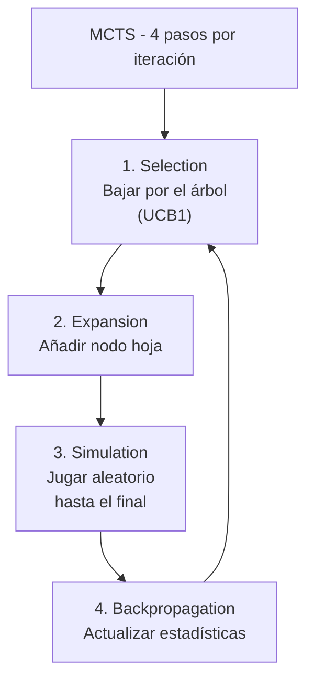

**Fórmula UCB1** (selección del mejor hijo):

```
UCB1 = w_i / n_i + C * sqrt(ln(N) / n_i)

w_i = victorias del hijo i
n_i = visitas al hijo i
N   = visitas totales al padre
C   = constante de exploración (√2 ≈ 1.414)
```

```
function MCTS(root, iterations):
    for i in 1..iterations:
        // 1. Selection (bajar por UCB1)
        node = root
        while node.hasChildren() and not node.isTerminal():
            node = selectBestChild(node)  // UCB1
        
        // 2. Expansion (crear hijo)
        if not node.isTerminal():
            node = expand(node)
        
        // 3. Simulation (jugar aleatorio)
        result = simulate(node)
        
        // 4. Backpropagation
        backpropagate(node, result)
    
    return bestChild(root)  // Jugada más visitada
```

**Ventajas sobre Minimax:**
- No necesita función heurística
- Escala a juegos enormes (Go, estrategia)
- Fácil de paralelizar
- Asimétrico: gasta más recursos en ramas prometedoras

**Desventajas:** Necesita muchas simulaciones para ser preciso, puede ser lento en juegos con branching factor pequeño (donde minimax es mejor).

---

## 5. Comparativa de técnicas de IA

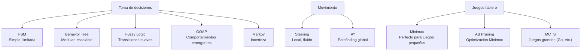

| Técnica | Complejidad | Uso principal |
|---|---|---|
| **FSM** | Baja | Enemigos simples, NPCs básicos |
| **Behavior Tree** | Media | Estándar moderno (Halo, BioShock) |
| **GOAP** | Alta | IA emergente (F.E.A.R., Alien Isolation) |
| **Fuzzy Logic** | Media | Decisiones suaves, simulación |
| **A*** | Media | Pathfinding (prácticamente todos los juegos) |
| **Steering** | Baja | Movimiento local, grupos, multitudes |
| **Minimax** | Baja | Juegos de tablero pequeños (Tic-tac-toe) |
| **Minimax + AB** | Media | Ajedrez, damas |
| **MCTS** | Alta | Go, juegos complejos, AlphaGo |

> 💡 **Regla de oro:** El 90% de la IA de juegos se hace con **Behavior Trees + A***. Aprende eso primero. Las FSM son para lo simple, GOAP para lo complejo, y MCTS/Minimax solo si haces juegos de tablero o estrategia.

## Relacionados:
- [[apis-graficas]] #anterior 
- [[aprendizaje-de-ia-para-juegos]] #siguiente 