# Computación Gráfica: Iluminación y Sombras

## ¿Por qué importa la iluminación?

Sin iluminación, un modelo 3D es solo un montón de triángulos planos. La luz es lo que da **volumen, profundidad y realismo** a la escena.

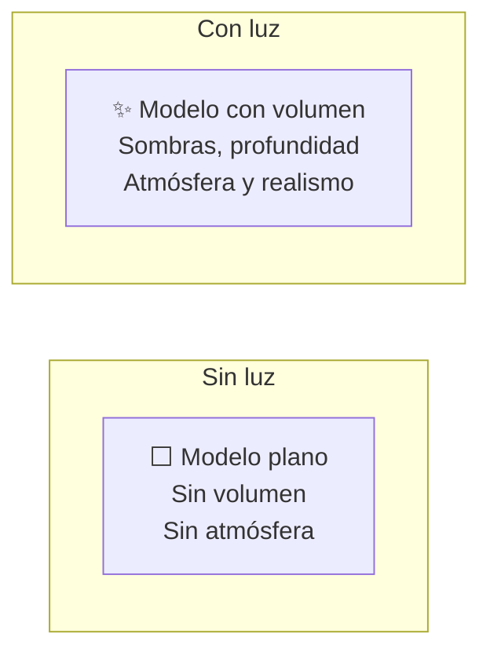

### Componentes de la iluminación

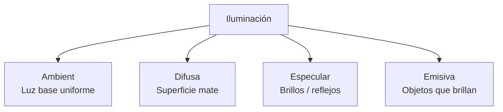

---

## 1. Modelos de iluminación

### 1.1. Iluminación por vértice (Gouraud)

Se calcula la luz en cada **vértice** y se interpola entre ellos.

```
Color(vértice) = Ambient + Difusa + Especular
                      ↓
         Se interpola linealmente entre vértices
                      ↓
              Color final del píxel
```

**Problema:** Los highlights especulares se ven mal si caen en medio de un triángulo.

### 1.2. Iluminación por píxel (Phong)

Se calcula la luz en **cada píxel** interpolando las normales. Es el estándar moderno.

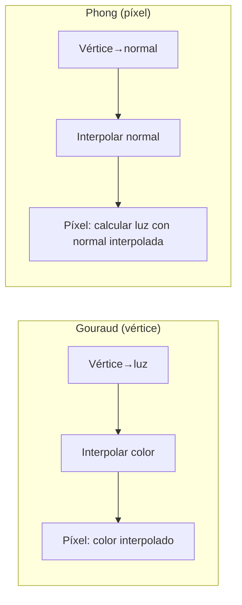

### 1.3. Fórmula de iluminación de Phong

```
Iluminación = Ambient + Difusa + Especular

Ambient = k_a * luz_ambient
Difusa  = k_d * luz * max(0, N·L)
Especular = k_s * luz * max(0, R·V)^α

donde:
N = normal de la superficie
L = dirección a la luz
R = reflexión de L respecto a N (R = 2(N·L)N - L)
V = dirección a la cámara
α = brillo especular (shininess)
```

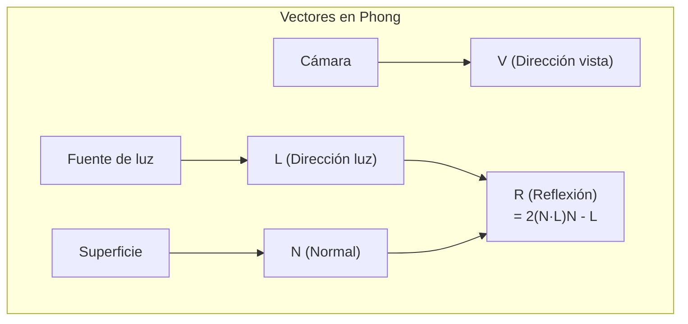

```
// Shader de fragmento (GLSL) - Phong básico
uniform vec3 lightPos;
uniform vec3 viewPos;
uniform vec3 lightColor;
uniform vec3 objectColor;

in vec3 FragPos;   // Posición del fragmento (interpolada)
in vec3 Normal;    // Normal (interpolada)

void main() {
    // Ambient
    float ambientStrength = 0.1;
    vec3 ambient = ambientStrength * lightColor;

    // Difusa
    vec3 norm = normalize(Normal);
    vec3 lightDir = normalize(lightPos - FragPos);
    float diff = max(dot(norm, lightDir), 0.0);
    vec3 diffuse = diff * lightColor;

    // Especular
    float specularStrength = 0.5;
    vec3 viewDir = normalize(viewPos - FragPos);
    vec3 reflectDir = reflect(-lightDir, norm);
    float spec = pow(max(dot(viewDir, reflectDir), 0.0), 32);
    vec3 specular = specularStrength * spec * lightColor;

    vec3 result = (ambient + diffuse + specular) * objectColor;
    FragColor = vec4(result, 1.0);
}
```

---

## 2. Fuentes de luz

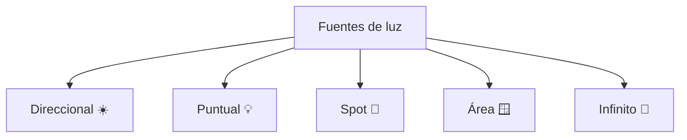

### 2.1. Direccional (Sun light)

Simula el sol: **rayos paralelos** desde el infinito. Todos los rayos van en la misma dirección.

```
Posición: (infinito)
Dirección: fija (ej: (-1, -3, -2))
Atenuación: ninguna (no se debilita con distancia)
Sombras: sí (mapa de sombras ortogonal)
```

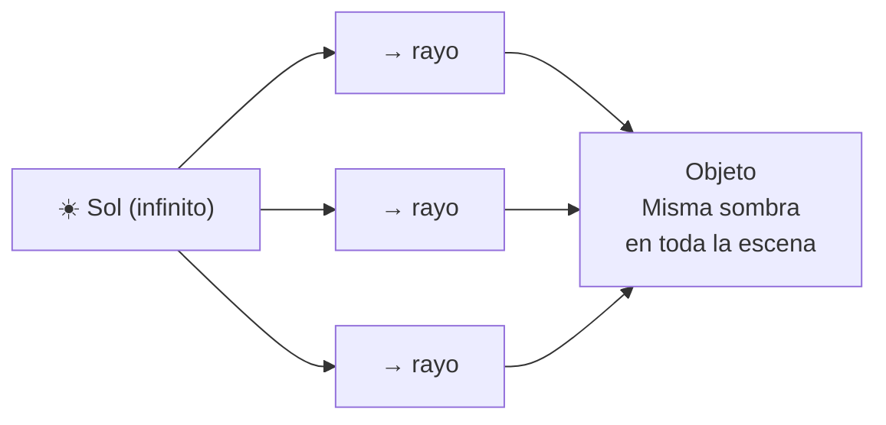

### 2.2. Puntual (Point light)

Simula una **bombilla**: luz desde un punto en todas direcciones.

```
Posición: (x, y, z)
Dirección: todas
Atenuación: 1 / (d²) (se debilita con distancia)
Sombras: sí (mapa de cubo)
```

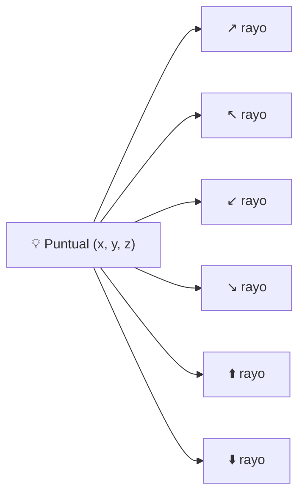

**Fórmula de atenuación:**

```
Atenuación = 1.0 / (Kc + Kl·d + Kq·d²)

Kc = constante (1.0)
Kl = lineal (0.09)
Kq = cuadrática (0.032)
d = distancia a la luz
```

### 2.3. Spot (Spotlight)

Simula un **foco**: luz en forma de cono.

```
Posición: (x, y, z)
Dirección: (dx, dy, dz)
Ángulo interno (θ): zona de luz intensa
Ángulo externo (φ): zona de desvanecimiento
Atenuación: sí (distancia + ángulo)
Sombras: sí (mapa de sombras en perspectiva)
```

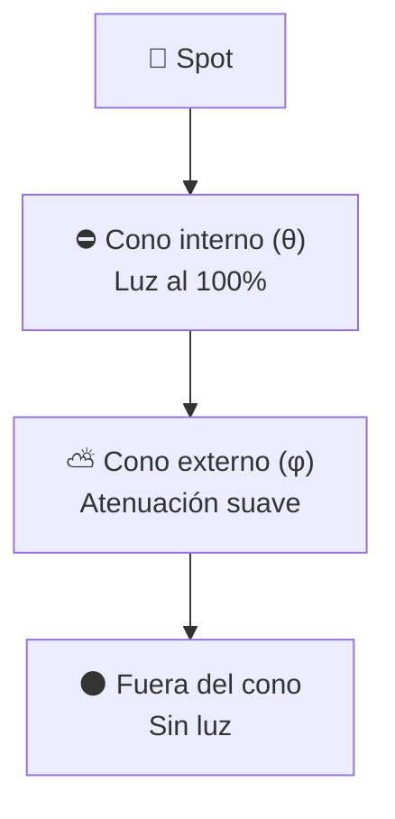

```
// Atenuación por ángulo del spot
float theta = dot(lightDir, normalize(spotDirection));
float epsilon = innerCone - outerCone;
float intensity = clamp((theta - outerCone) / epsilon, 0.0, 1.0);
```

### 2.4. Infinito (Ambient / Infinite light)

Luz que viene de **todas partes**. No tiene origen ni dirección.

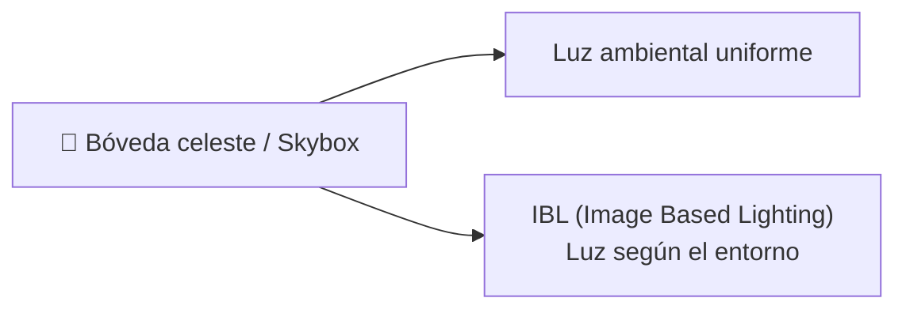

**Tipos:**
- **Ambient plana:** mismo color en toda la escena (barato, poco realista)
- **IBL (Image Based Lighting):** usa un HDR environment map para iluminar (realista, caro)
- **GI (Global Illumination):** simula rebotes de luz (Lightmass, Enlighten, Voxel GI)

---

## 3. Mapa de Sombras (Shadow Mapping)

### 3.1. Concepto general

El **shadow mapping** es la técnica de sombras más usada en tiempo real. Consiste en dos pasos:

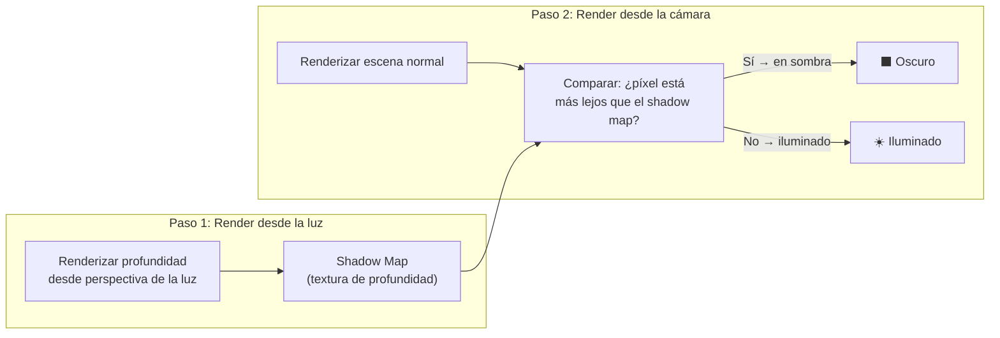

```
// Fragment shader - prueba de sombra
float shadowCalculation(vec4 fragPosLightSpace) {
    vec3 projCoords = fragPosLightSpace.xyz / fragPosLightSpace.w;
    projCoords = projCoords * 0.5 + 0.5;  // [-1,1] → [0,1]
    
    float closestDepth = texture(shadowMap, projCoords.xy).r;
    float currentDepth = projCoords.z;
    
    float bias = 0.005;  // Evitar shadow acne
    return currentDepth - bias > closestDepth ? 1.0 : 0.0;
}
```

### 3.2. Shadow Acne y Peter Panning

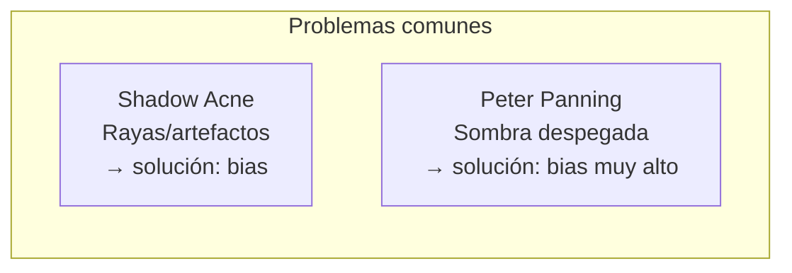

### 3.3. Tipos de Shadow Map

#### Mapa de Sombras 2D (estándar)

Para **luces direccionales**. Un solo shadow map ortogonal.

```
Resolución típica: 1024×1024 a 4096×4096
Proyección: Ortogonal (rayos paralelos)
Problema: Una sola vista → sombras de baja calidad lejos
```

#### Mapa de Cubo (Cube Shadow Map)

Para **luces puntuales**. Se renderiza la escena 6 veces (una por cara del cubo).

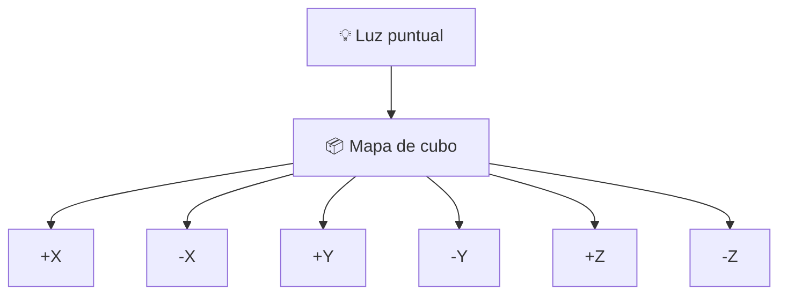

```
// Cube shadow map en el fragment shader
float depth = texture(shadowCubeMap, fragToLight).r;
// fragToLight = vector desde el fragmento a la luz
// depth = distancia al primer obstáculo en esa dirección
```

#### Mapas en Cascada (CSM - Cascaded Shadow Maps)

Para **luces direccionales en escenas grandes**. Divide el frustum en cascadas, cada una con su propio shadow map.

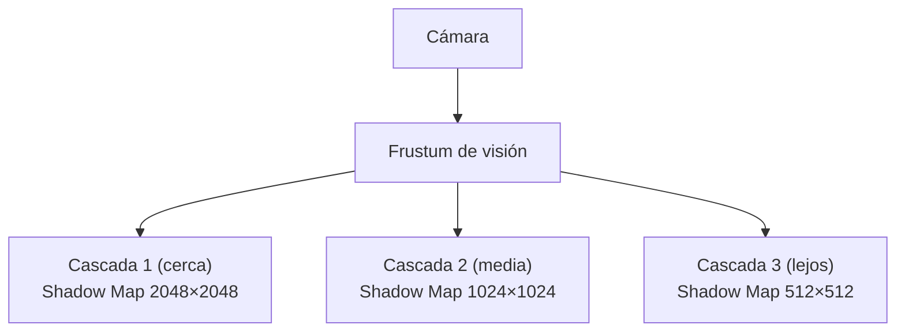

**Ventaja:** Alta calidad cerca de la cámara, menor calidad donde no se nota.

```
// CSM - seleccionar cascada según profundidad
int getCascadeIndex(float depth) {
    if (depth < cascadePlanes[0]) return 0;
    if (depth < cascadePlanes[1]) return 1;
    return 2;
}

float shadow = 0.0;
int cascade = getCascadeIndex(depth);
shadow = calculateShadow(cascade, fragPosLightSpace[cascade]);
```

---

## 4. Stencil Shadow (Volumes)

Técnica anterior al shadow mapping (Doom 3, 2004). Usa el **stencil buffer** para recortar las áreas en sombra.

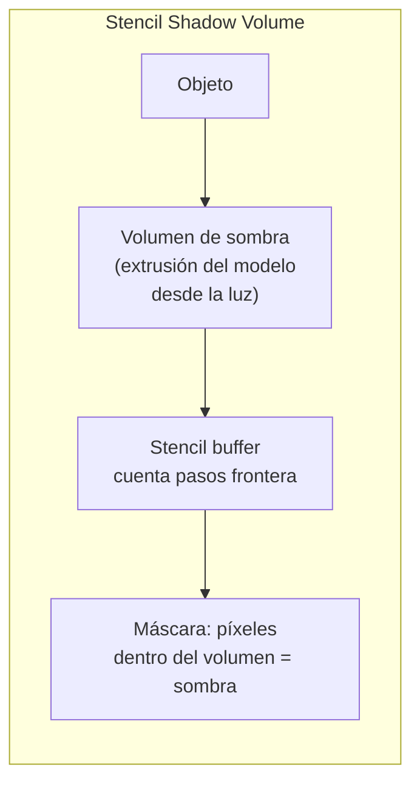

**Proceso:**
1. Renderizar escena sin luz (solo ambiente)
2. Renderizar volúmenes de sombra al stencil buffer
3. Renderizar escena iluminada donde **stencil = par**

| Técnica | Shadow Mapping | Stencil Shadows |
|---|---|---|
| Rendimiento | Escala con resolución | Escala con geometría |
| Calidad | Depende de resolución | Perfecta (píxel exacto) |
| Transparencia | Fácil | Difícil |
| Uso moderno | Estándar actual | Obsoleto |

---

## 5. Comparativa de técnicas de sombra

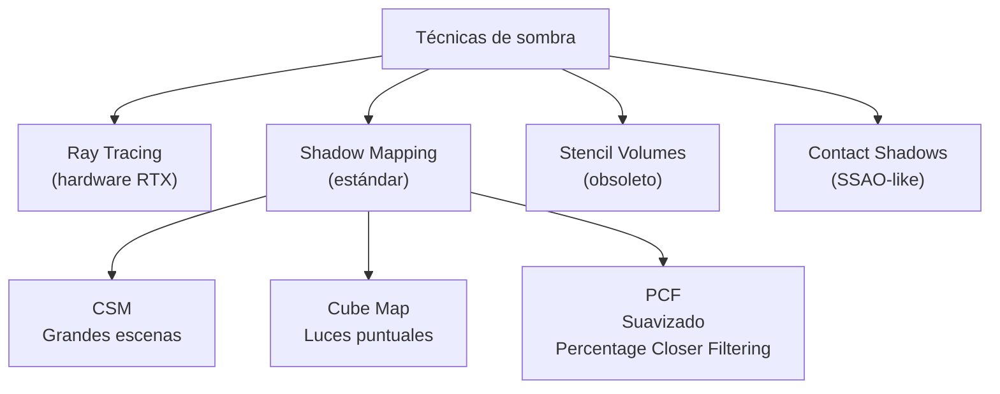

| Técnica | Calidad | Rendimiento | Complejidad |
|---|---|---|---|
| Shadow Map 2D | ⭐⭐⭐ | ⭐⭐⭐⭐ | Baja |
| CSM | ⭐⭐⭐⭐ | ⭐⭐⭐ | Media |
| Cube Shadow | ⭐⭐⭐ | ⭐⭐⭐ | Media |
| PCF (suavizado) | ⭐⭐⭐⭐ | ⭐⭐⭐ | Media |
| Ray Tracing | ⭐⭐⭐⭐⭐ | ⭐ (caro) | Alta |
| Stencil Volume | ⭐⭐⭐⭐ | ⭐⭐ (geometría) | Alta |

---

## 6. Pipeline completo de iluminación

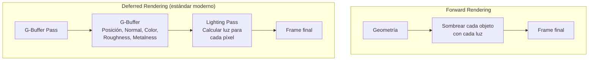

**Deferred Rendering** permite tener **muchas luces** sin penalización.

```
Forward:  Luces × Objetos visibles
Deferred: Luces × Píxeles en pantalla (independiente de objetos)
```

> 💡 **Regla de oro:** Shadow mapping es el estándar, CSM para mundos abiertos, cube maps para luces puntuales, y Ray Tracing para el futuro (cuando el hardware lo permita).

## Relacionados:
- [[lenguajes-de-programación-para-videojuegos]] #anterior 
- [[color-y-animacion]] #siguiente 