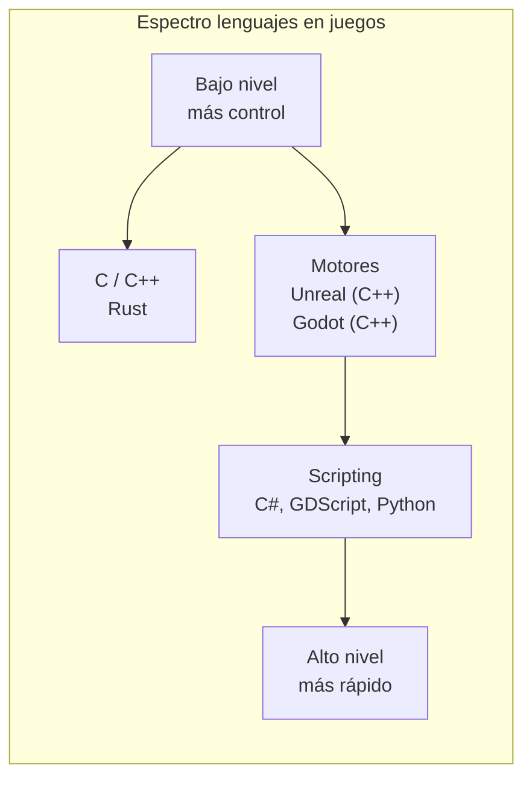
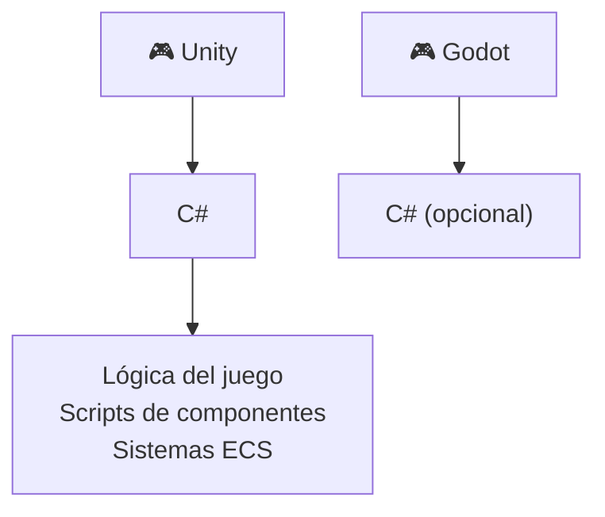
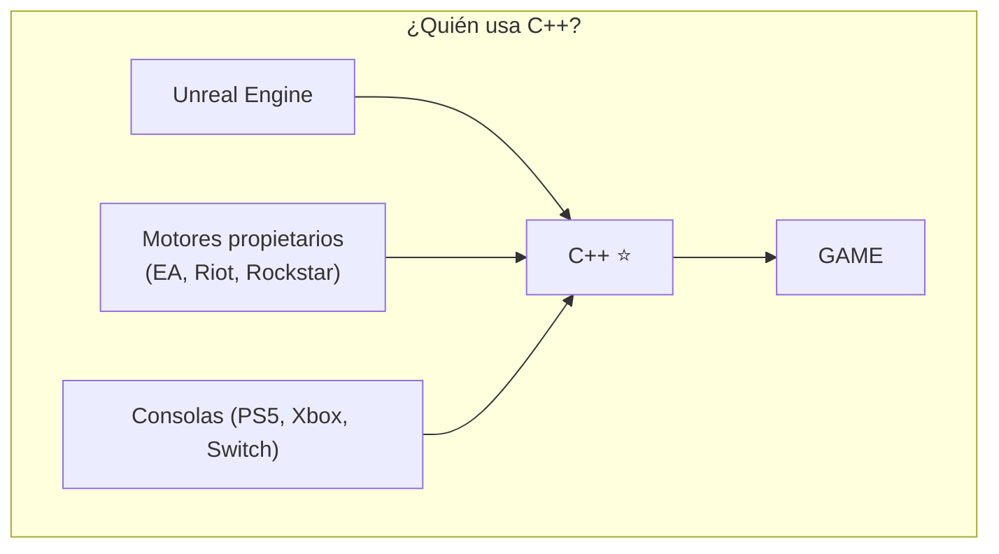
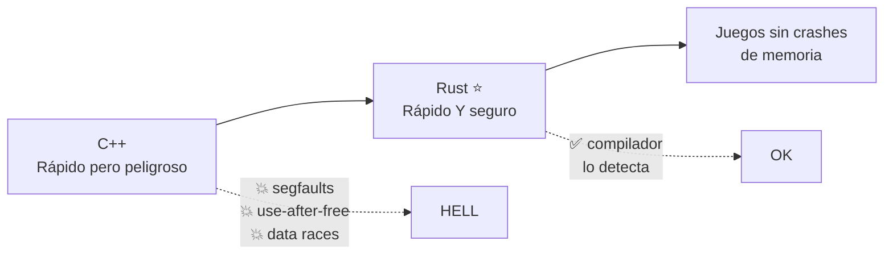
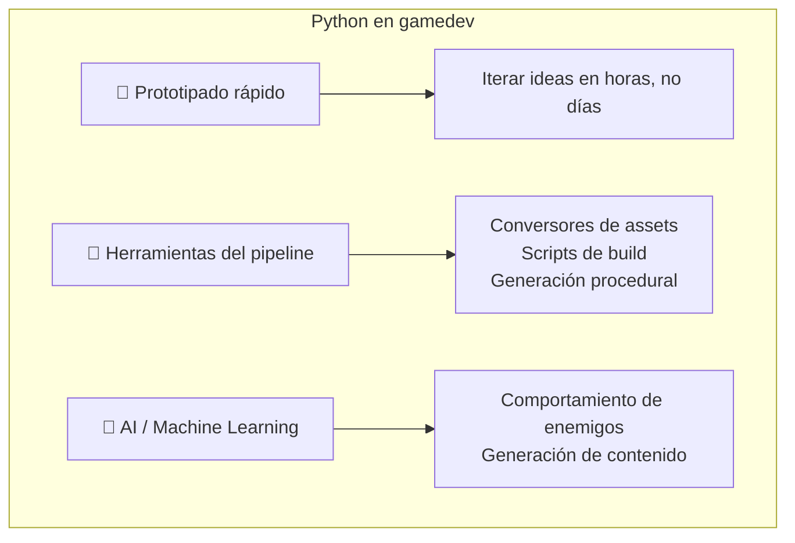
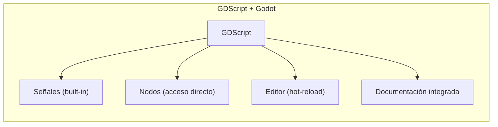
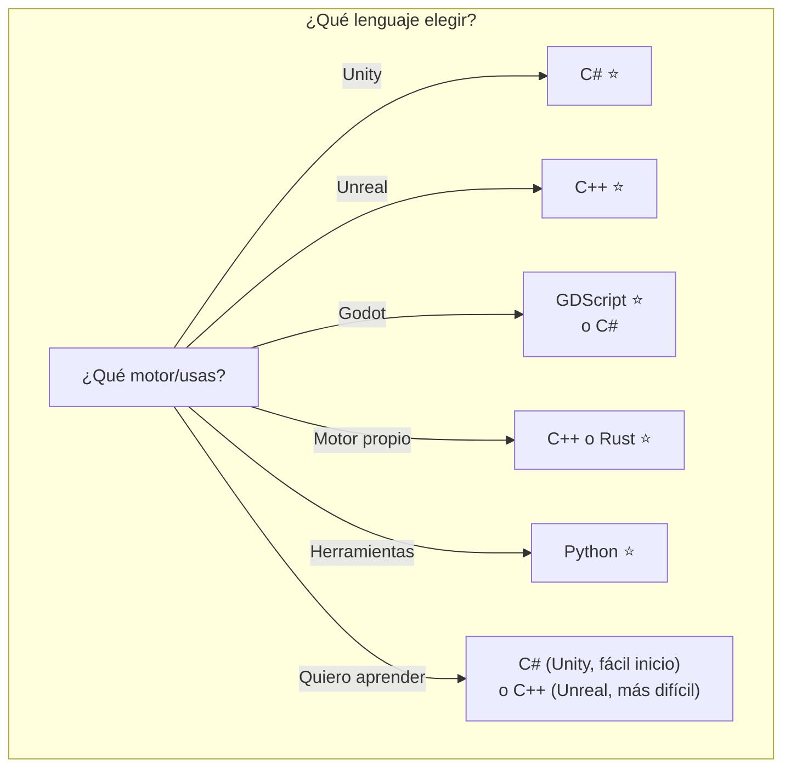
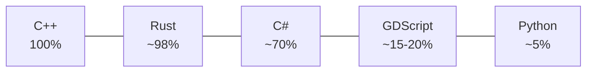
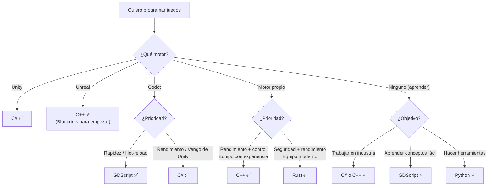

# Lenguajes de programación para videojuegos

## ¿Importa el lenguaje?

Sí, pero **menos de lo que crees**. Un mal programador en C++ hace juegos lentos. Un buen programador en Python puede hacer juegos exitosos.



**Lo que realmente importa:**

```
1. Conocimiento del motor/herramientas  >  Lenguaje
2. Optimización de algoritmos            >  Lenguaje
3. Experiencia del equipo                 >  Lenguaje
4. Tipo de proyecto                       >  Lenguaje
```

---

## 1. C#

**Creado por:** Microsoft (2000)
**Uso principal:** Unity, Godot (soporte parcial)
**Paradigma:** Orientado a objetos, funcional, imperativo

### 1.1. Por qué C# en juegos

C# es el lenguaje estrella de **Unity** (el motor más usado del mundo). También tiene soporte en **Godot**.



### 1.2. Características clave

| Característica | Por qué importa en juegos |
|---|---|
| **Garbage Collector (GC)** | Automático, pero causa pausas (stutters) → hay que optimizarlo |
| **Propiedades (get/set)** | Código más limpio que getX()/setX() |
| **Eventos / Delegados** | Perfecto para Game Events, UI, daño, etc. |
| **LINQ** | Consultas a colecciones, útil pero peligroso en update |
| **Async / Await** | Carga de assets, redes, operaciones asíncronas |
| **Struct vs Class** | Structs en el stack → menos GC pressure |

### 1.3. Ejemplo: MonoBehaviour típico

```
using UnityEngine;

public class PlayerShoot : MonoBehaviour
{
    [SerializeField] private GameObject bulletPrefab;
    [SerializeField] private float fireRate = 0.2f;
    private float lastFireTime;

    void Update()
    {
        if (Input.GetButton("Fire1") && Time.time > lastFireTime + fireRate)
        {
            Shoot();
            lastFireTime = Time.time;
        }
    }

    private void Shoot()
    {
        Instantiate(bulletPrefab, transform.position, transform.rotation);
    }
}
```

### 1.4. Pros y Contras

| ✅ Ventajas | ❌ Desventajas |
|---|---|
| Sintaxis limpia y moderna | Garbage Collector impredecible |
| Type-safe (menos bugs) | Atado a .NET / Mono |
| Excelente ecosistema Unity | No tan rápido como C++ nativo |
| Buen equilibrio velocidad/seguridad | Menos control de memoria que C++ |
| Grandes bibliotecas estándar | Verboso en comparación con GDScript |

**¿Cuándo usarlo?** Unity → sí o sí. Godot → si vienes de Unity o prefieres C# sobre GDScript.

---

## 2. C / C++

**Creado por:** Bjarne Stroustrup (C++, 1985) / Dennis Ritchie (C, 1972)
**Uso principal:** Unreal Engine, motores nativos, sistemas críticos
**Paradigma:** Multiparadigma (OO, procedural, genérico)

### 2.1. Por qué C++ en juegos

C++ es el **estándar de la industria AAA**. Proporciona el máximo control sobre el hardware sin sacrificar abstracciones de alto nivel.



### 2.2. El triángulo del poder en C++

```
Rendimiento ⚡
     ∧
    / \
   /   \
  /     \
 /       \
/─────────\
Control 🎛️     Abstracción 🧩
```

### 2.3. Características clave

| Característica | Por qué importa |
|---|---|
| **Memoria manual** | Sin GC → sin pausas. Tú controlas cada byte |
| **Punteros/referencias** | Acceso directo a memoria, GPU, periféricos |
| **Templates / Metaprogramación** | Código genérico sin overhead (policy-based design) |
| **Operator overloading** | `v1 + v2` en lugar de `v1.add(v2)` |
| **RAII** | Recursos liberados automáticamente al salir de scope |
| **Move semantics (C++11)** | Evita copias innecesarias |

### 2.4. Ejemplo: Vector 3D optimizado

```
struct Vec3 {
    float x, y, z;
    
    Vec3(float x, float y, float z) : x(x), y(y), z(z) {}
    
    Vec3 operator+(const Vec3& other) const {
        return Vec3(x + other.x, y + other.y, z + other.z);
    }
    
    float dot(const Vec3& other) const {
        return x*other.x + y*other.y + z*other.z;
    }
    
    Vec3 cross(const Vec3& other) const {
        return Vec3(
            y*other.z - z*other.y,
            z*other.x - x*other.z,
            x*other.y - y*other.x
        );
    }
};
```

### 2.5. Pros y Contras

| ✅ Ventajas | ❌ Desventajas |
|---|---|
| Rendimiento máximo | Curva de aprendizaje muy alta |
| Control total del hardware | Errores de memoria (segfaults, leaks) |
| Estándar AAA (empleo) | Compilación lenta |
| Sin GC → sin pausas | Sintaxis compleja |
| Portabilidad (casi cualquier plataforma) | Strings pobres (std::string mejora) |

**¿Cuándo usarlo?** Unreal Engine, motores propios, juegos AAA, sistemas de bajo nivel, cuando cada frame cuenta.

---

## 3. Rust

**Creado por:** Mozilla (2010)
**Uso principal:** Motores emergentes (Bevy, Fyrox), herramientas de juegos
**Paradigma:** Multiparadigma (funcional, imperativo, sistemas)

### 3.1. Por qué Rust en juegos

Rust promete lo mejor de C++ (rendimiento, control) **sin** los problemas de memoria. Su **borrow checker** elimina crashes de memoria en **tiempo de compilación**.



### 3.2. Sistema de ownership

Es la **característica revolucionaria** de Rust:

```
fn main() {                      // Cada valor tiene un DUEÑO
    let bala = Bala::new();      // 'bala' pertenece a main()
    
    disparar(bala);              // ownership se transfiere (move)
    
    // bala.impactar();          // ❌ ERROR: ya no es tuya
}

fn disparar(b: Bala) {          // 'b' es la nueva dueña
    b.volar();                   // ok
}                                // 'b' se destruye aquí (RAII)
```

### 3.3. ECS nativo (Bevy)

Rust brilla con el patrón **ECS (Entity Component System)**:

```
use bevy::prelude::*;

// Componentes (datos)
struct Position(Vec3);
struct Velocity(Vec3);

// Sistema (lógica)
fn movement_system(
    time: Res<Time>,
    mut query: Query<(&mut Position, &Velocity)>
) {
    for (mut pos, vel) in query.iter_mut() {
        pos.0 += vel.0 * time.delta_seconds();
    }
}

fn main() {
    App::new()
        .add_systems(Update, movement_system)
        .run();
}
```

### 3.4. Pros y Contras

| ✅ Ventajas | ❌ Desventajas |
|---|---|
| Seguridad de memoria GARANTIZADA | Curva de aprendizaje alta (borrow checker) |
| Rendimiento = C++ | Ecosistema de juegos joven (Bevy creciendo) |
| Sin GC, sin pausas | No hay motor AAA consolidado (aún) |
| Tipo algebraicos (Option, Result) | Compilación más lenta que C++ |
| Excelente para sistemas concurrentes | Menos ofertas laborales que C++ |
| EnTT → Bevy ECS muy elegante | Documentación gamedev limitada |

**¿Cuándo usarlo?** Experimentación, motores nuevos, cuando quieras seguridad + rendimiento sin usar C++. Prometedor para el futuro.

---

## 4. Python

**Creado por:** Guido van Rossum (1991)
**Uso principal:** Prototipado, herramientas, scripting en motores (Panda3D, Godot anteriormente)
**Paradigma:** Multiparadigma (OO, funcional, imperativo)

### 4.1. Por qué Python en juegos

Python no es un lenguaje para juegos **de producción** (excepto casos raros), pero es **excelente para herramientas** y prototipado.



### 4.2. Ejemplo: Herramienta de build

```
import os
import shutil

def build_game():
    print("🧹 Limpiando build anterior...")
    if os.path.exists("build/"):
        shutil.rmtree("build/")
    
    print("📦 Compilando assets...")
    os.system("python tools/compress_textures.py")
    
    print("🎮 Compilando juego...")
    os.system("python -m nuitka --standalone main.py")
    
    print("✅ Build completado en build/")

if __name__ == "__main__":
    build_game()
```

### 4.3. Pros y Contras

| ✅ Ventajas | ❌ Desventajas |
|---|---|
| Sintaxis más legible | LENTO (interpretado) |
| Prototipado inmediato | GIL (Global Interpreter Lock) |
| Bibliotecas infinitas | No apto para renderizado |
| Ideal para herramientas | Pocos motores lo usan en producción |
| Curva de aprendizaje mínima | Tipado dinámico → bugs en runtime |

**¿Cuándo usarlo?** Prototipos, herramientas del pipeline, AI/ML para juegos, generación procedural, scripting en editores.

---

## 5. GDScript

**Creado por:** Juan Linietsky (Godot, 2014)
**Uso principal:** Godot Engine
**Paradigma:** Orientado a objetos, imperativo, dinámico

### 5.1. Por qué GDScript

GDScript es el lenguaje **nativo de Godot**. Está diseñado específicamente para el flujo de trabajo del motor.

```
# GDScript: similar a Python pero adaptado a Godot
extends CharacterBody2D

@export var speed: float = 300.0
@export var jump_force: float = -500.0

func _physics_process(delta: float) -> void:
    var direction = Input.get_axis("ui_left", "ui_right")
    
    if direction:
        velocity.x = direction * speed
    else:
        velocity.x = move_toward(velocity.x, 0, speed * delta)
    
    if Input.is_action_just_pressed("ui_accept") and is_on_floor():
        velocity.y = jump_force
    
    move_and_slide()
```

### 5.2. Integración profunda con Godot



| Característica | GDScript | C# en Godot |
|---|---|---|
| **Hot-reload** | ✅ Instantáneo | ❌ Recompilar |
| **Sintaxis** | Python-like, mínimo boilerplate | Verbosa, clásica C# |
| **Rendimiento** | Menor (interpretado) | Mayor (compilado) |
| **Integración editor** | Completa | Buena |

### 5.3. Pros y Contras

| ✅ Ventajas | ❌ Desventajas |
|---|---|
| Sintaxis minimalista (pocas líneas) | Solo funciona en Godot |
| Hot-reload instantáneo | Interpretado → más lento |
| Diseñado para el flujo de Godot | Tipado dinámico (aunque tiene tipos opcionales) |
| Curva de aprendizaje bajísima | Sin uso fuera de Godot |
| Documentación en el editor | Python lovers lo prefieren, pero no es Python |

**¿Cuándo usarlo?** Siempre que uses **Godot**. Es el lenguaje recomendado por el motor.

---

## 6. Comparativa general



| Lenguaje | Velocidad | Seguridad | Curva | Empleo | Principal uso |
|---|---|---|---|---|---|
| **C++** | ⭐⭐⭐⭐⭐ | ⭐⭐ | Muy alta | Muy alto (AAA) | Unreal, motores propios |
| **C#** | ⭐⭐⭐⭐ | ⭐⭐⭐⭐ | Media | Muy alto (Unity) | Unity |
| **Rust** | ⭐⭐⭐⭐⭐ | ⭐⭐⭐⭐⭐ | Alta | Bajo (creciendo) | Motores emergentes |
| **Python** | ⭐⭐ | ⭐⭐⭐ | Baja | Bajo (herramientas) | Prototipos, tools |
| **GDScript** | ⭐⭐⭐ | ⭐⭐⭐ | Muy baja | Baja | Godot |

### Rendimiento relativo (operaciones/segundo)



---

## 7. Árbol de decisión completo



> 💡 **Regla de oro:** El lenguaje no hace al juego. C# no te hará mejor que C++, ni Rust más seguro que C++. La calidad del juego depende del **diseño, la optimización y la experiencia del equipo**. Dicho esto, elige el lenguaje de tu **motor objetivo**: Unity → C#, Unreal → C++, Godot → GDScript.

## Relacionados:
- [[motores-de-juegos]] #anterior 
- [[iluminación-y-sombras]] #siguiente 