# Mapping y Reflexión

## 1. Mapping

**Mapping** es el proceso de aplicar datos 2D (texturas, normales, alturas) sobre una superficie 3D para simular detalle sin añadir geometría.

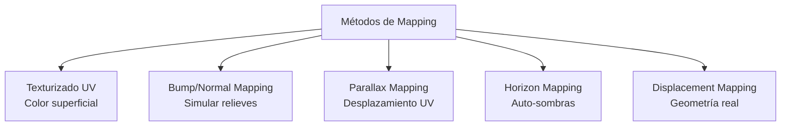

### 1.1. Texturas (UV Mapping)

Cada vértice del modelo 3D tiene coordenadas **UV** que mapean a un punto en la textura 2D.

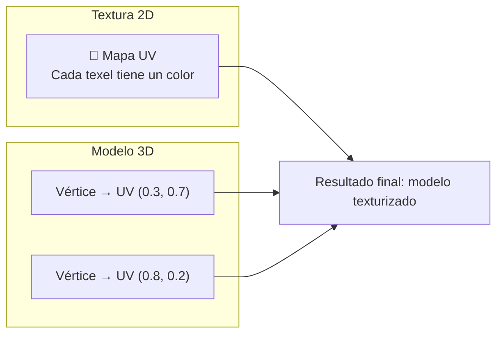

**Problema común: distorsión UV**

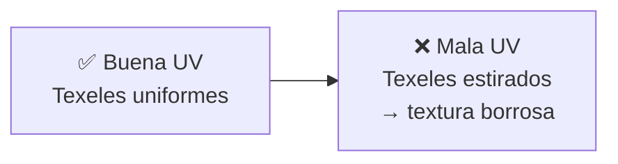

**Tipos de texturas:**

```
Albedo (diffuse)   → Color base del material
Normal Map         → Perturbación de normales (relieve)
Roughness          → Rugosidad (0=liso, 1=áspero)
Metalness          → Metal (0=dieléctrico, 1=metal)
Ambient Occlusion  → Sombras de contacto precalculadas
Displacement       → Desplazamiento de vértices (altura)
Emissive           → Color auto-iluminado
```

---

### 1.2. Bump Mapping

Simula **relieves** en una superficie plana modificando las normales antes de iluminar. No cambia la geometría.

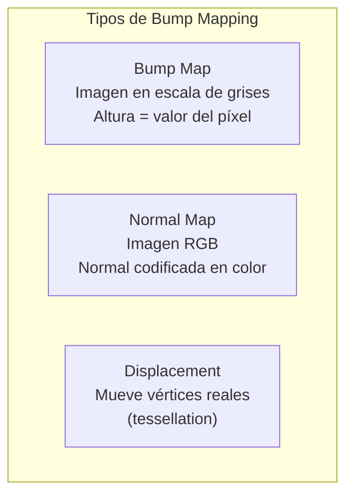

#### Normal Mapping (el más usado)

Cada texel RGB codifica una **normal**:

```
Normal = (2·R - 1, 2·G - 1, 2·B - 1)

R=128 → normal.x = 0
G=128 → normal.y = 0
B=255 → normal.z = 1 (hacia afuera)
```

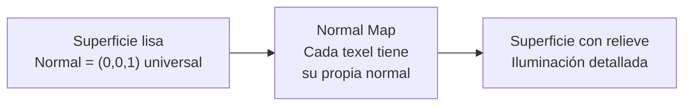

```
// Fragment shader: aplicar normal map
uniform sampler2D normalMap;

vec3 getNormal(vec2 uv, mat3 TBN) {
    vec3 normal = texture(normalMap, uv).rgb;
    normal = normal * 2.0 - 1.0;      // [0,1] → [-1,1]
    normal = normalize(TBN * normal); // Tangent → World space
    return normal;
}

// TBN matrix: transforma de tangent space a world space
vec3 T = normalize(model * vec3(tangent, 0.0));
vec3 B = normalize(model * vec3(bitangent, 0.0));
vec3 N = normalize(model * vec3(normal, 0.0));
mat3 TBN = mat3(T, B, N);
```

#### Bump Map (escala de grises)

Más simple que normal map: calcula la normal a partir de derivadas de la altura.

```
// Calcular normal desde bump map (height map)
float hL = texture(heightMap, uv - vec2(dx, 0)).r;
float hR = texture(heightMap, uv + vec2(dx, 0)).r;
float hD = texture(heightMap, uv - vec2(0, dy)).r;
float hU = texture(heightMap, uv + vec2(0, dy)).r;

vec3 normal = normalize(vec3(hL - hR, hD - hU, 1.0 / strength));
```

| Aspecto | Bump Map | Normal Map | Displacement |
|---|---|---|---|
| **Formato** | Gris (1 canal) | RGB (3 canales) | Gris o RGB |
| **Calidad** | Baja | Alta | Muy alta |
| **Geometría** | No cambia | No cambia | Sí (vértices) |
| **Silueta** | Plana ❌ | Plana ❌ | Real ✅ |
| **Coste** | Muy bajo | Bajo | Alto |

---

### 1.3. Parallax Mapping

Mejora el normal mapping desplazando las coordenadas UV según la **altura** y el **ángulo de vista**. Crea ilusión de profundidad real.

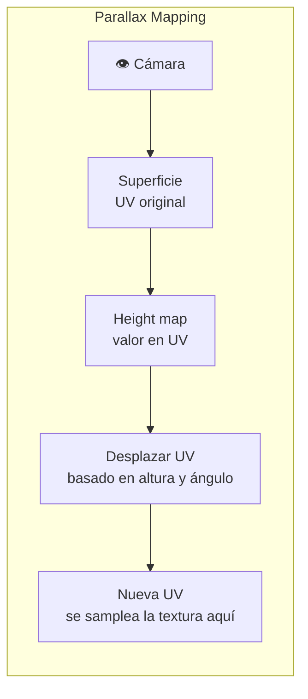

```
// Parallax mapping simple
vec2 parallaxMapping(sampler2D heightMap, vec2 uv, vec3 viewDir) {
    float height = texture(heightMap, uv).r;
    vec2 offset = viewDir.xy * (height * parallaxScale);
    return uv - offset;
}

// Parallax Occlusion Mapping (POM) - mejor calidad
// Samplea la altura en varios pasos y encuentra la intersección
float numLayers = mix(maxLayers, minLayers, abs(dot(viewDir, normal)));
float layerHeight = 1.0 / numLayers;
float currentLayerHeight = 0.0;
vec2 dUV = viewDir.xy * parallaxScale / numLayers;
vec2 currentUV = uv;
float heightFromMap = 1.0 - texture(heightMap, currentUV).r;

for (int i = 0; i < numLayers; i++) {
    if (currentLayerHeight > heightFromMap) break;
    currentLayerHeight += layerHeight;
    currentUV -= dUV;
    heightFromMap = 1.0 - texture(heightMap, currentUV).r;
}

// Interpolar entre capas para suavizar
return currentUV;
```

**Comparativa visual:**

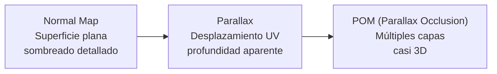

---

### 1.4. Horizon Mapping

Técnica para calcular **auto-sombras** a nivel de texel. Para cada punto, calcula el ángulo del horizonte en varias direcciones (como horizonte de una montaña).

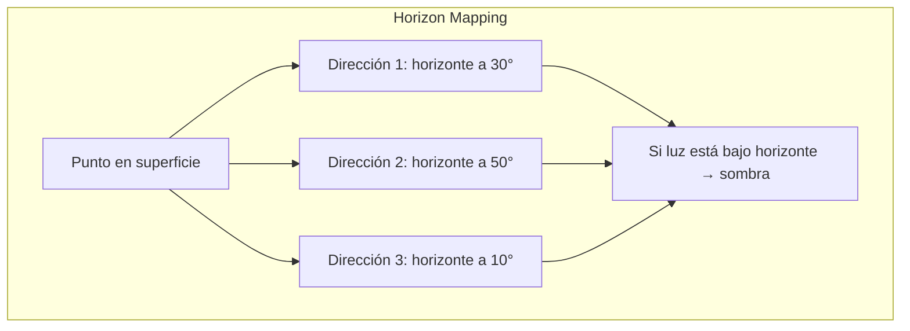

**Precomputación** (offline):
Para cada texel, almacena el ángulo del horizonte en N direcciones (típicamente 6 u 8).

```
// En runtime: para cada dirección de luz
float ao = 1.0;
for each direction i:
    float horizonAngle = horizonMap[i][uv];
    float lightAngle = calcularAnguloLuz(direccionLuz[i]);
    if (lightAngle < horizonAngle):
        ao -= (horizonAngle - lightAngle) / pi;
```

**Diferencia con AO (Ambient Occlusion):**
- **AO:** sombras precalculadas estáticas (bakeadas)
- **Horizon Mapping:** sombras dinámicas que responden a la dirección de la luz

---

## 2. Reflexión

**Reflexión** = la luz rebota en una superficie y vuelve al ojo. El comportamiento depende del material.

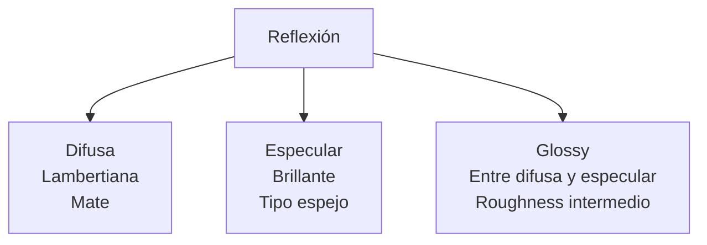

### 2.1. Reflexión Difusa

La luz se **dispersa** en todas direcciones al impactar. No importa desde dónde mires, el brillo es el mismo.

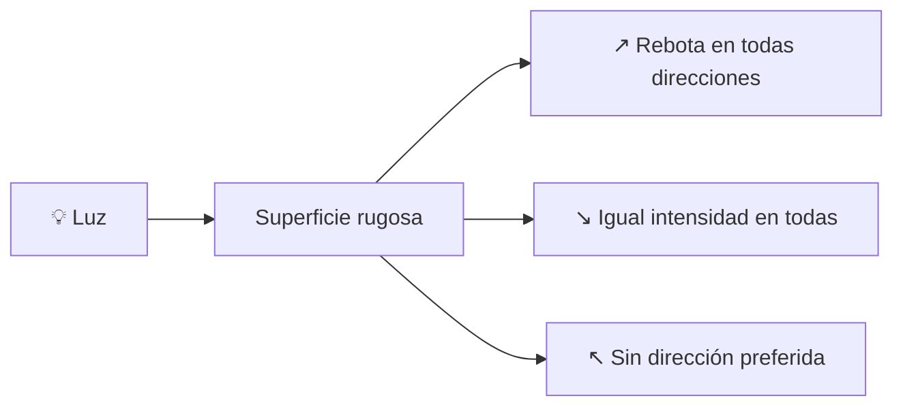

```
// Reflexión difusa (Lambert)
float NdotL = max(dot(normal, lightDir), 0.0);
vec3 diffuse = albedo * lightColor * NdotL;
```

**Materiales difusos:** papel, madera sin barnizar, tela, piedra, yeso.

### 2.2. Reflexión Especular

La luz rebota en una **dirección preferente** (como un espejo). Depende del ángulo de vista.

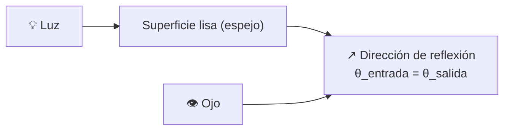

```
// Reflexión especular (Phong)
vec3 reflectDir = reflect(-lightDir, normal);
float spec = pow(max(dot(viewDir, reflectDir), 0.0), shininess);
vec3 specular = specularColor * lightColor * specStrength;

// Modelo Cook-Torrance (PBR moderno)
// Usa distribución de micro-facetas, Fresnel, y función geométrica
float D = distributionGGX(NdotH, roughness);
float G = geometrySmith(NdotV, NdotL, roughness);
vec3 F = fresnelSchlick(cosTheta, F0);

vec3 specular = (D * G * F) / (4 * NdotV * NdotL + 0.0001);
```

**Materiales especulares:** metal pulido, vidrio, agua, plástico brillante, espejos.

### 2.3. Modelo PBR (Physically Based Rendering)

Estándar moderno. Se basa en: **Roughness + Metalness**.

```mermaid
flowchart LR
    PBR[PBR] --> METAL[Metalness<br/>0 = dieléctrico<br/>1 = metal]
    PBR --> ROUGH[Roughness<br/>0 = liso (especular)<br/>1 = rugoso (difuso)]
    
    METAL --> F0["Fresnel F0<br/>Metal: color del metal<br/>Dieléctrico: 0.04"]
    ROUGH --> MICRO["Micro-facetas<br/>Roughness controla<br/>distribución de normales"]
```

```
// Ecuación de reflectancia PBR (Cook-Torrance)
Lo = (kD * albedo / pi + D * F * G / (4 * NdotV * NdotL)) * LdotV * lightColor;

// kD = 1 - F (difuso complementario)
// D = distribución de normales (GGX/Trowbridge-Reitz)
// F = Fresnel (Schlick approximation)
// G = función geométrica (Smith)
```

### 2.4. Environment Mapping (Reflejos del entorno)

Para reflejar el **entorno** (cielo, edificios) sin geometría real, se usan **environment maps**:

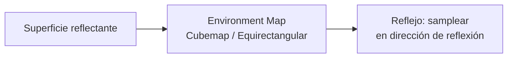

```
// Reflejo con cubemap
vec3 viewDir = normalize(viewPos - FragPos);
vec3 reflectDir = reflect(-viewDir, normal);
vec3 reflection = texture(envCubemap, reflectDir).rgb;

// Mezclar reflexión con color superficial
float fresnel = fresnelSchlick(max(dot(viewDir, normal), 0.0), F0);
vec3 finalColor = mix(albedo, reflection, fresnel);
```

### 2.5. Screen Space Reflections (SSR)

Técnica moderna que usa el **frame actual** como fuente de reflejos, sin necesidad de cubemaps.

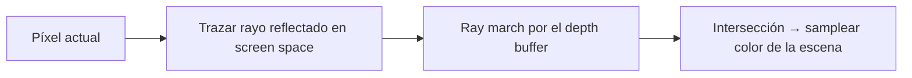

**Ventajas:** Reflejos dinámicos, cualquier objeto se refleja.
**Desventajas:** No refleja objetos fuera de pantalla, ruidoso.

---

## 3. Resumen visual completo

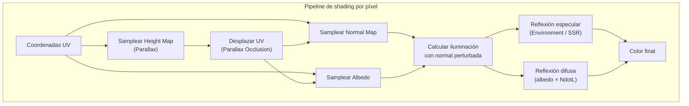

> 💡 **Regla de oro:** 
> - **Normal maps** para el 90% del detalle superficial (barato y efectivo)
> - **Parallax Occlusion Mapping** cuando necesitas profundidad realista (suelos, paredes de piedra)
> - **PBR** es el estándar moderno: usa Roughness + Metalness + Environment Map
> - **SSR** para reflejos dinámicos; **cubemaps** para reflejos estáticos de entorno
