# Matemáticas para juegos

## 1. Álgebra Lineal en videojuegos

El álgebra lineal es el lenguaje matemático de los gráficos por computadora. Cada píxel que ves en pantalla pasa por decenas de operaciones con **vectores** y **matrices**.

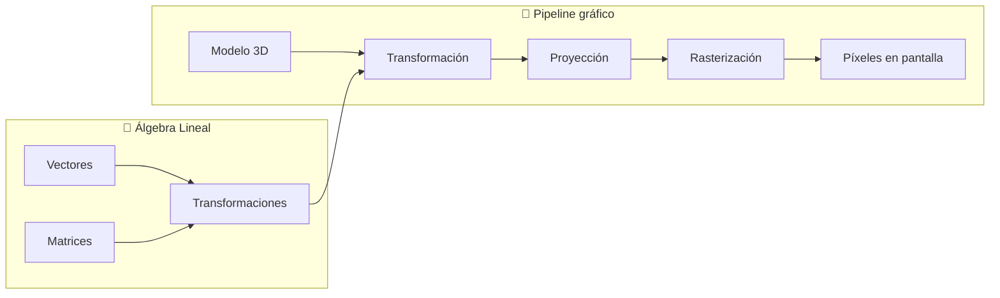

**¿Por qué es importante?**

| Área | Concepto matemático |
|---|---|
| Posición de objetos | Vectores en ℝ³ |
| Rotación de cámara | Matrices 4×4 |
| Iluminación | Producto punto (dot product) |
| Detección de colisiones | Producto cruz (cross product) |
| Animación por huesos | Interpolación de cuaterniones |
| Física (velocidad, aceleración) | Cálculo vectorial |

---

## 2. Vectores

### 2.1. Definición

Un **vector** es una magnitud con dirección y sentido. En juegos, representa: posición, velocidad, aceleración, fuerza, dirección de mirada, etc.

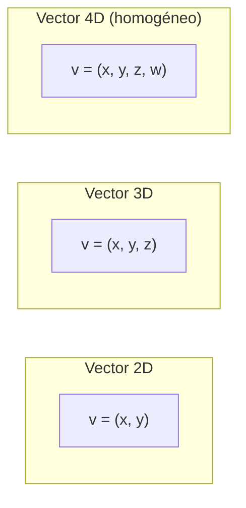

```
v = (3, 4, 0)   → Vector 3D
  ↑  ↑  ↑
  x  y  z
```

### 2.2. Operaciones fundamentales

| Operación | Fórmula | Gráfico | Uso en juegos |
|---|---|---|---|
| **Suma** | `a + b = (ax+bx, ay+by, az+bz)` | →➕→ = →→ | Mover un objeto |
| **Resta** | `a - b = (ax-bx, ay-by, az-bz)` | →➖→ = vector entre puntos | Dirección de A a B |
| **Escalado** | `k·v = (k·x, k·y, k·z)` | ⬆️ × 0.5 = ⬆️ (mitad) | Reducir velocidad |
| **Magnitud** | `|v| = √(x² + y² + z²)` | Largo del vector | Distancia, velocidad |
| **Normalizar** | `v̂ = v / |v|` | Vector unitario (longitud 1) | Dirección pura |

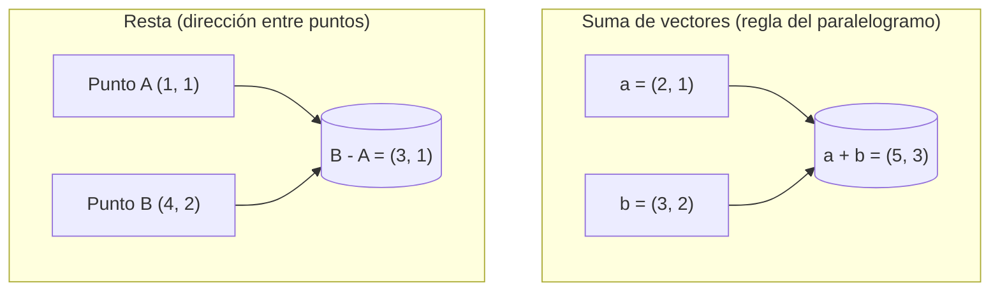

### 2.3. Producto punto (Dot Product)

```
a · b = |a|·|b|·cos(θ) = ax·bx + ay·by + az·bz
```

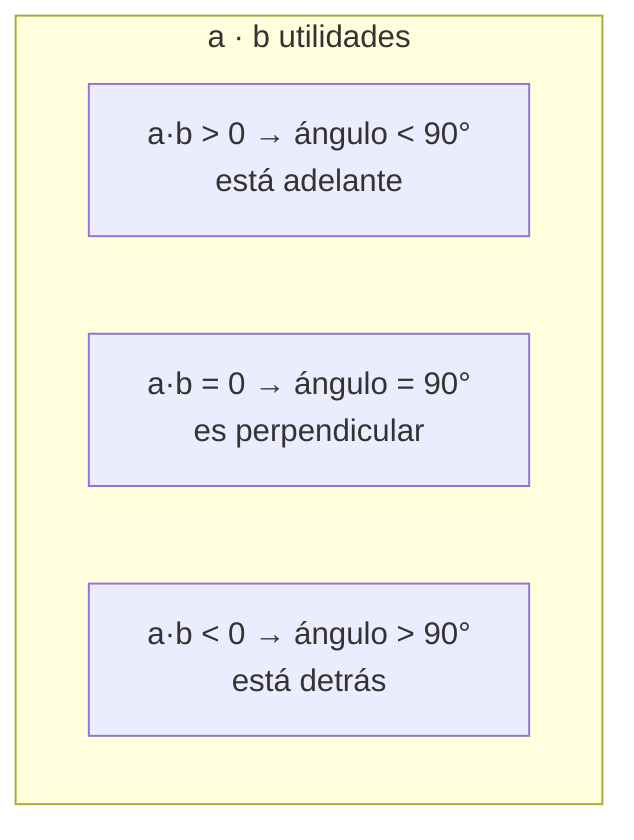

**Aplicaciones:**
- **Iluminación:** `N · L` (normal de superficie × dirección de luz) → qué tan iluminado está un punto
- **Visibilidad:** `forward · dirección_al_objeto` → si el objeto está frente a la cámara (frustum culling)
- **Proyección:** proyectar un vector sobre otro

### 2.4. Producto cruz (Cross Product)

```
a × b = (ay·bz - az·by, az·bx - ax·bz, ax·by - ay·bx)
```

Solo en **3D**. Resultado: un vector **perpendicular** a ambos.

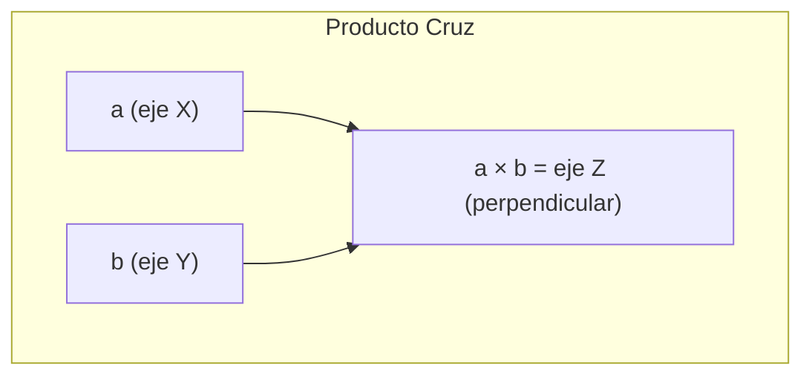

**Aplicaciones:**
- Calcular la **normal** de una superficie (esencial para iluminación)
- Calcular vectores de la cámara (right, up, forward)
- Detectar si un punto está a la izquierda o derecha de una línea (2D)

```
// Calcular la normal de un triángulo
v1 = P1 - P0
v2 = P2 - P0
normal = v1 × v2 // Producto cruz → vector perpendicular al triángulo

// Calcular vectores de cámara
forward = target - eye
right = up × forward   // Producto cruz
real_up = forward × right  // Producto cruz
```

---

## 3. Matrices

### 3.1. Definición

Una **matriz** es un arreglo rectangular de números. En juegos, las matrices 4×4 son las reinas: representan **transformaciones** (posición, rotación, escala) en espacio 3D.

```
Matriz 4×4 (típica en gráficos):
┌                ┐
| m00 m01 m02 m03 |  ← fila 0
| m10 m11 m12 m13 |  ← fila 1
| m20 m21 m22 m23 |  ← fila 2
| m30 m31 m32 m33 |  ← fila 3
└                ┘
```

### 3.2. Tipos especiales

| Matriz | Propiedad | Uso |
|---|---|---|
| **Identidad** I | `M·I = I·M = M` | Reset de transformación |
| **Transpuesta** Mᵀ | Intercambiar filas ↔ columnas | Calcular normales |
| **Inversa** M⁻¹ | `M·M⁻¹ = I` | Transformación inversa (cámara) |
| **Ortogonal** | `Mᵀ = M⁻¹` | Rotaciones (son ortogonales) |

```
Matriz identidad 4×4:
┌                ┐
| 1  0  0  0 |
| 0  1  0  0 |
| 0  0  1  0 |
| 0  0  0  1 |
└                ┘

Aplicar I a un vector: no cambia nada (como ×1)
```

---

## 4. Transformación Lineal

Una **transformación lineal** mapea vectores a otros vectores preservando: líneas rectas → líneas rectas, y el origen → el origen.

### 4.1. Tipos de transformaciones lineales

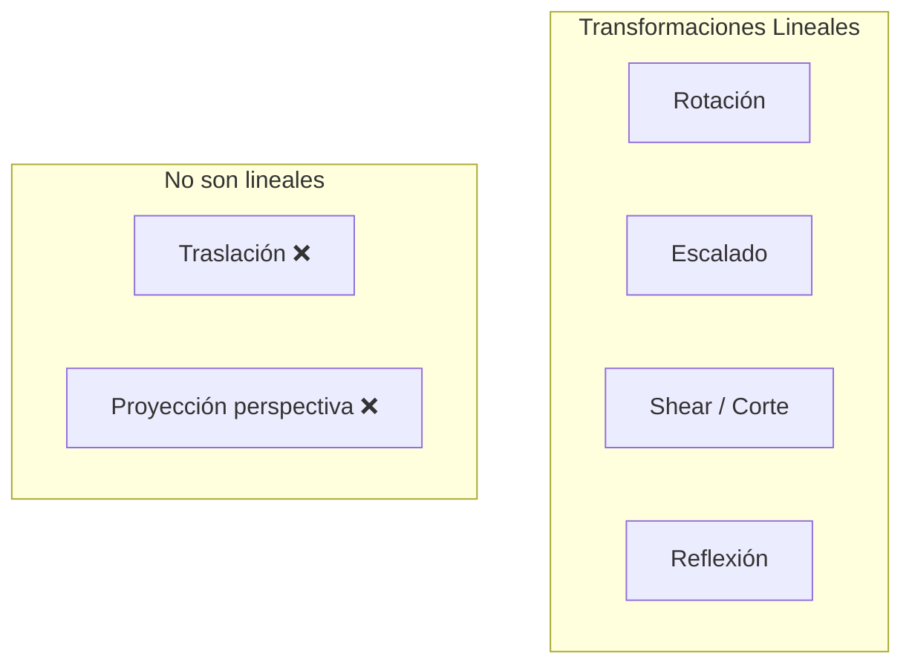

**¿Por qué la traslación no es lineal?** Porque mueve el origen. Para incluirla necesitamos **coordenadas homogéneas** (espacio afín).

---

## 5. Geometría

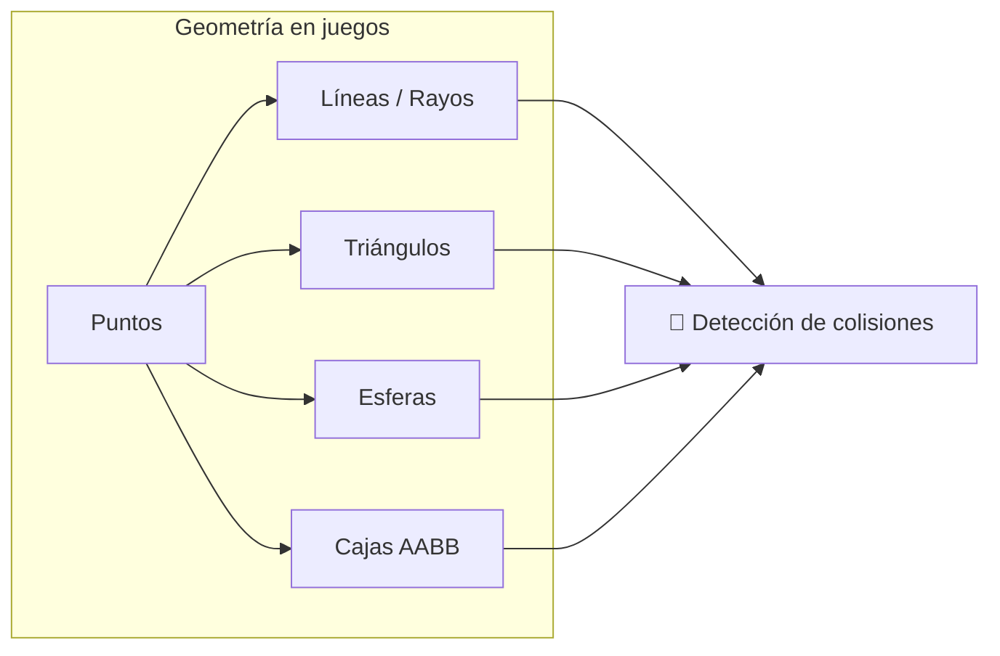

**Primitivas geométricas fundamentales:**

- **Punto:** `P = (x, y, z)`
- **Línea/Rayo:** `P(t) = origen + t·dirección`
- **Plano:** `N·P + d = 0` (N = normal, d = distancia al origen)
- **Esfera:** centro + radio
- **AABB (Axis-Aligned Bounding Box):** min/max en cada eje
- **Triángulo:** 3 puntos conectados (la primitiva de renderizado)

**Detección colisiones comunes:**

| Tipo | Prueba |
|---|---|
| Punto vs AABB | `min <= punto <= max` en cada eje |
| Esfera vs Esfera | Distancia entre centros < r1 + r2 |
| Rayo vs Plano | Resolver `P(t)·N + d = 0` |

---

## 6. Espacio Afín

### 6.1. Coordenadas homogéneas

Para poder **trasladar** usando matrices, añadimos una cuarta coordenada `w`:

```
Vector 3D normal:   (x, y, z, w=0)  → representa dirección
Punto 3D:           (x, y, z, w=1)  → representa posición
```

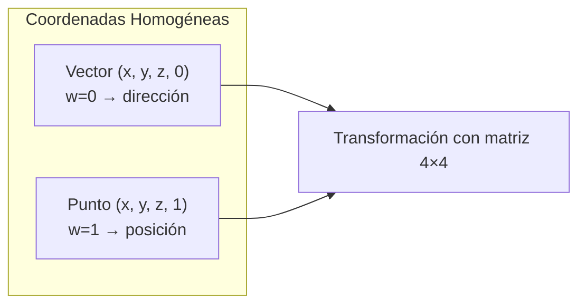

**¿Por qué w=0 para vectores?** Porque al aplicar una traslación, w=0 hace que la traslación **no afecte** al vector (tiene sentido: las direcciones no se "mueven").

```
Matriz de traslación:
┌                ┐┌   ┐   ┌         ┐
| 1  0  0  tx | | x |   | x + tx |
| 0  1  0  ty |·| y | = | y + ty |
| 0  0  1  tz | | z |   | z + tz |
| 0  0  0  1  | | 1 |   |   1    |
└                ┘└   ┘   └         ┘

Si w = 0 (dirección): el resultado es (x, y, z, 0) → ¡no se traslada!
```

---

## 7. Transformaciones Afines

Una **transformación afín** = transformación lineal + traslación. Es lo que normalmente llamamos "transformación" en un motor de juegos.

### 7.1. Matriz de transformación completa

```
Matriz 4×4 de transformación:
┌                ┐
|  Rxx Rxy Rxz  Tx |
|  Ryx Ryy Ryz  Ty |
|  Rzx Rzy Rzz  Tz |
|  0   0   0    1 |
└                ┘
 ↑ Rotación+Escala ↑ Traslación
```

### 7.2. Orden de las transformaciones

El **orden importa**. En la mayoría de motores:

```
MatrizFinal = Traslación × Rotación × Escala
```

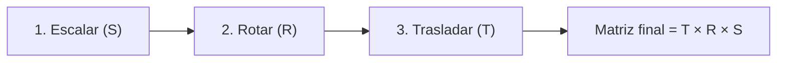

**¿Por qué este orden?**

1. Se escala alrededor del origen
2. Se rota alrededor del origen
3. Se traslada a la posición final

Si rotaras después de trasladar, el objeto orbitaría alrededor del origen en lugar de rotar sobre sí mismo.

```
// En la práctica (Unity/Unreal):
transform.position = (1, 2, 3)
transform.rotation = Quaternion.Euler(0, 90, 0)
transform.scale = (2, 2, 2)

// Internamente: M = T × R × S
```

### 7.3. Composición de transformaciones (jerarquías)

Cuando un objeto es hijo de otro, su matriz final se compone:

```
Matriz_Hijo = Matriz_Padre × Matriz_Local_Hijo
```

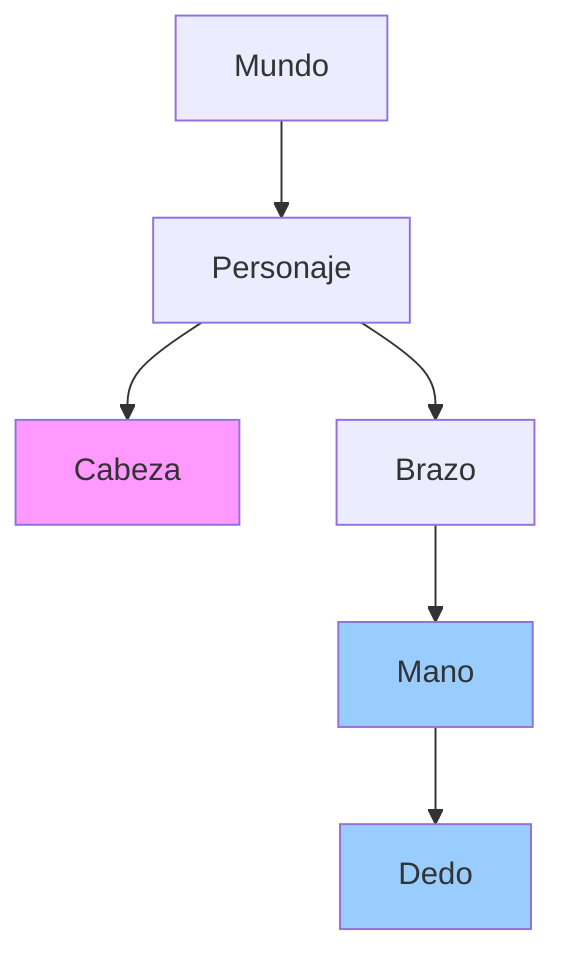

**Ejemplo:** Si el personaje camina, la mano se mueve con él. Si solo rotas el brazo, la mano rota localmente al brazo pero también se mueve con el personaje.

---

## 8. Proyección

La **proyección** transforma coordenadas 3D a 2D (pantalla). Es el paso final del pipeline gráfico.

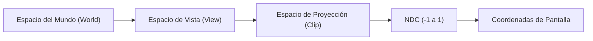

### 8.1. Perspectiva

Simula el ojo humano: objetos lejanos se ven más pequeños.

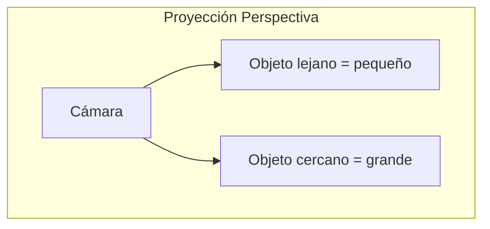

**Matriz de perspectiva:**

```
Matriz de perspectiva (FOV = field of view, aspect = ancho/alto):
┌                                     ┐
| f/aspect   0         0           0    |
|   0        f         0           0    |
|   0        0    (zF+zN)/(zN-zF)  ... |
|   0        0        -1           0    |
└                                     ┘

donde f = 1/tan(FOV/2)
```

**Componentes del frustum de visión:**

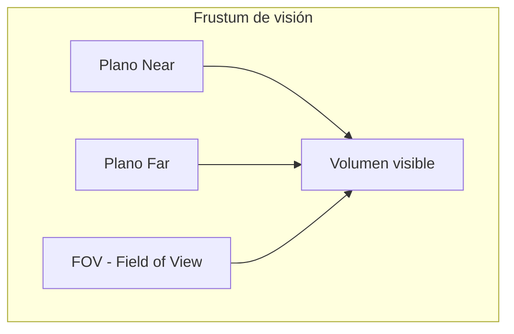

### 8.2. Ortogonal

Sin deformación por distancia: objetos del mismo tamaño se ven igual sin importar qué tan lejos están.

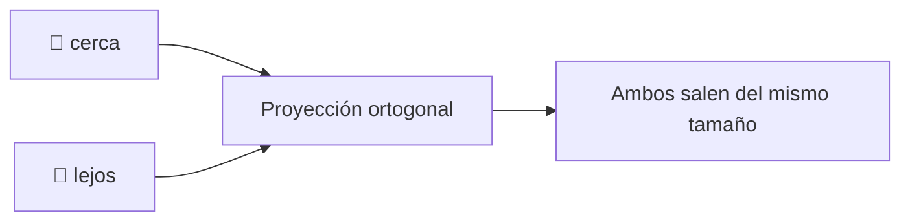

**Usos:** Juegos 2D, vistas isométricas, minimapas, UI, editores de niveles.

```
Matriz ortogonal:
┌                                     ┐
| 2/(R-L)   0        0      -(R+L)/(R-L) |
|  0      2/(T-B)    0      -(T+B)/(T-B) |
|  0        0     -2/(F-N)  -(F+N)/(F-N) |
|  0        0        0           1      |
└                                     ┘
```

### 8.3. Comparativa visual

| Proyección | Perspectiva | Ortogonal |
|---|---|---|
| Objetos lejanos | Se ven más pequeños | Mismo tamaño |
| Líneas paralelas | Convergen en punto de fuga | Siguen paralelas |
| Uso típico | Juegos 3D (FPS, RPG) | Juegos 2D, isométricos |
| Realismo | Alto | Bajo (estilizado) |

---

## 9. Orientación

### 9.1. Ángulos de Euler

Describen rotación como tres rotaciones consecutivas alrededor de ejes: **Yaw** (guiñada), **Pitch** (cabeceo), **Roll** (alabeo).

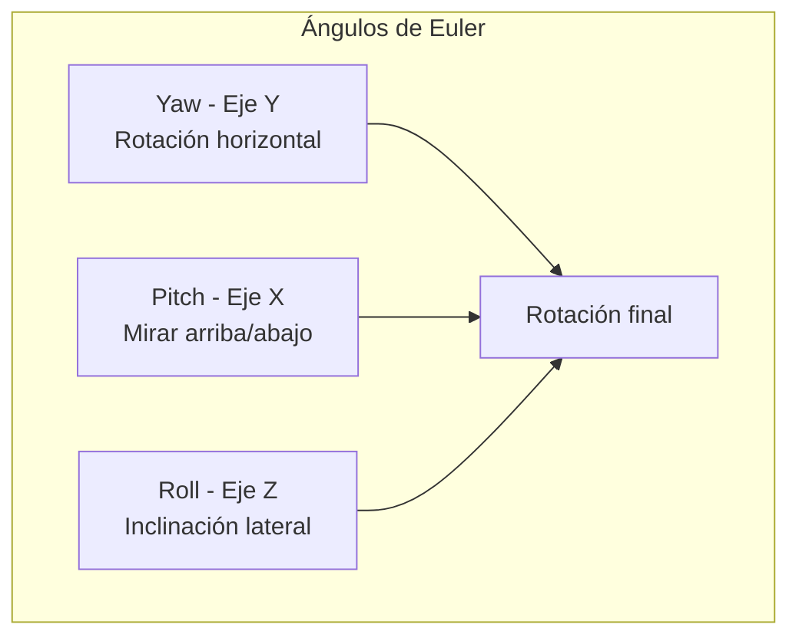

```
// En un FPS típico:
yaw += mouse_x * sensibilidad    // Mirar izquierda/derecha
pitch += mouse_y * sensibilidad  // Mirar arriba/abajo
pitch = clamp(pitch, -89°, 89°) // Evitar bloqueo de cardán
```

#### ⚠️ Problema: Bloqueo de Cardán (Gimbal Lock)

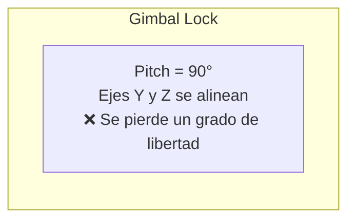

Cuando pitch = ±90°, los ejes de yaw y roll se alinean y se pierde un eje de rotación. **Solución:** usar **cuaterniones**.

### 9.2. Cuaterniones (Quaternions)

Un **cuaternión** es un número complejo en 4 dimensiones. Suena raro, pero es la **mejor forma** de representar rotaciones en 3D.

```
q = w + xi + yj + zk

donde:
- w: parte escalar (cos(θ/2))
- (x, y, z): vector unitario (eje de rotación × sin(θ/2))
- i² = j² = k² = ijk = -1
```

#### Ventajas de los cuaterniones

| Propiedad | Euler | Cuaternión |
|---|---|---|
| **Gimbal lock** | ❌ Sí | ✅ No |
| **Interpolación suave** (SLERP) | ❌ | ✅ Sí |
| **Composición eficiente** | ❌ | ✅ Sí |
| **Intuitivo para humanos** | ✅ | ❌ |

#### SLERP (Spherical Linear Interpolation)

Suaviza entre dos rotaciones:

```
q_resultado = slerp(q_inicio, q_final, t)
// t = 0 → rotación inicial
// t = 1 → rotación final
```

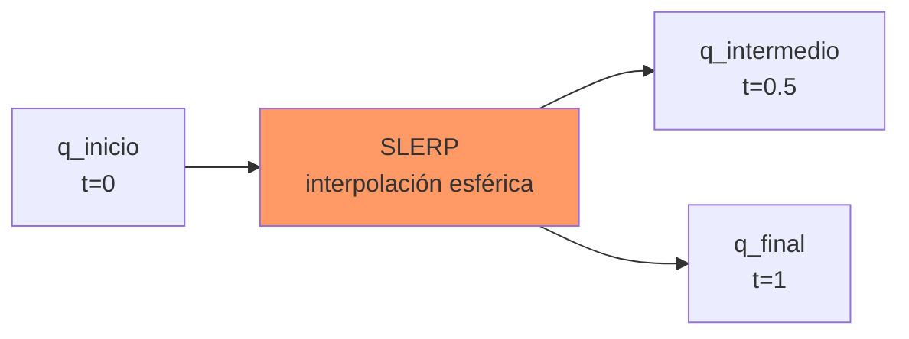

**Aplicaciones:**
- Animación de personajes (huesos rotan suavemente entre keyframes)
- Orientación de cámara sin gimbal lock
- Estabilización de vehículos espaciales / drones

#### Conversión Euler ↔ Cuaternión

```
// Euler a Cuaternión (Unity-like)
Quaternion.Euler(yaw, pitch, roll)

// Cuaternión a Euler
Quaternion q = ...
Vector3 euler = q.eulerAngles
```

---

## 10. Resumen visual: Pipeline completo de transformaciones

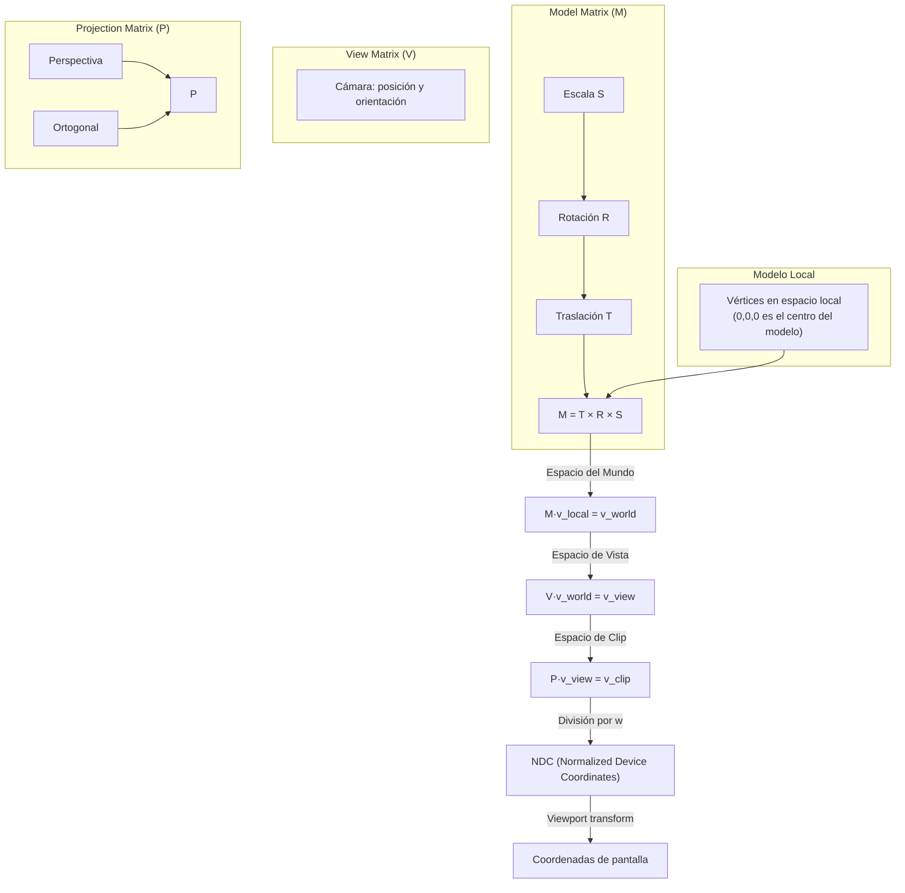

---

## 11. Hoja de referencia rápida

| Concepto | Fórmula / Notación |
|---|---|
| Magnitud vector | `|v| = √(x² + y² + z²)` |
| Vector unitario | `v̂ = v / |v|` |
| Producto punto | `a·b = |a||b|cosθ` |
| Producto cruz 3D | `a×b = (ay·bz-az·by, ...)` |
| Matriz identidad | Diagonal de 1s, resto 0s |
| Transformación afín | `T × R × S` |
| Proyección perspectiva | `w_div = 1/z` |
| Cuaternión rotación | `q = (cos(θ/2), axis·sin(θ/2))` |
| SLERP | Interpolación esférica entre cuaterniones |

> 💡 **Regla de oro:** En gráficos 3D, todo se reduce a mover puntos (vectores) a través de transformaciones (matrices). Domina vectores y matrices 4×4, y tendrás dominada la base matemática de los videojuegos.

## Relacionados:
- [[desarrollo-del-lado-del-cliente-gamedev]] #anterior 
- [[curvas]] #extra 
- [[fisica-deteccion de colisiones]] #siguiente 