# Motores de Juegos

## ¿Qué es un motor de juegos?

Un **motor de juegos** (game engine) es un framework de software que proporciona las herramientas y abstracciones necesarias para crear videojuegos. Evita tener que reinventar la rueda cada vez que se hace un juego.

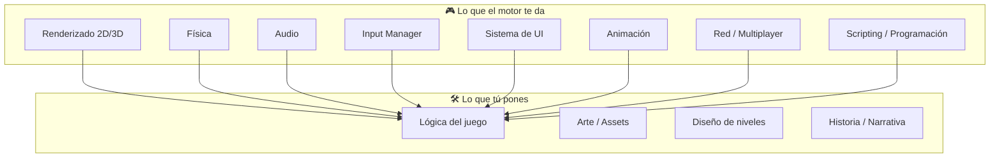

### ¿Motor comercial o nativo?

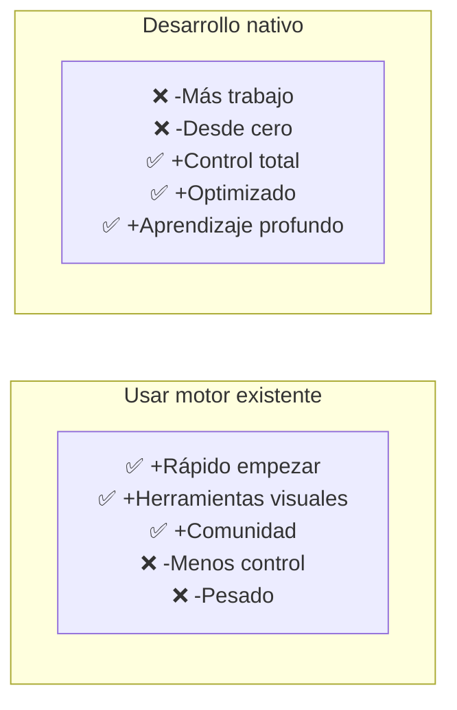

---

## 1. Godot

**Lenguaje principal:** GDScript, C#, C++ (GDExtension)
**Tipo:** 2D y 3D
**Licencia:** MIT (100% gratuito y open-source)

### 1.1. Filosofía

Godot usa un sistema de **escenas y nodos**. Todo es un **nodo** organizado en un árbol.

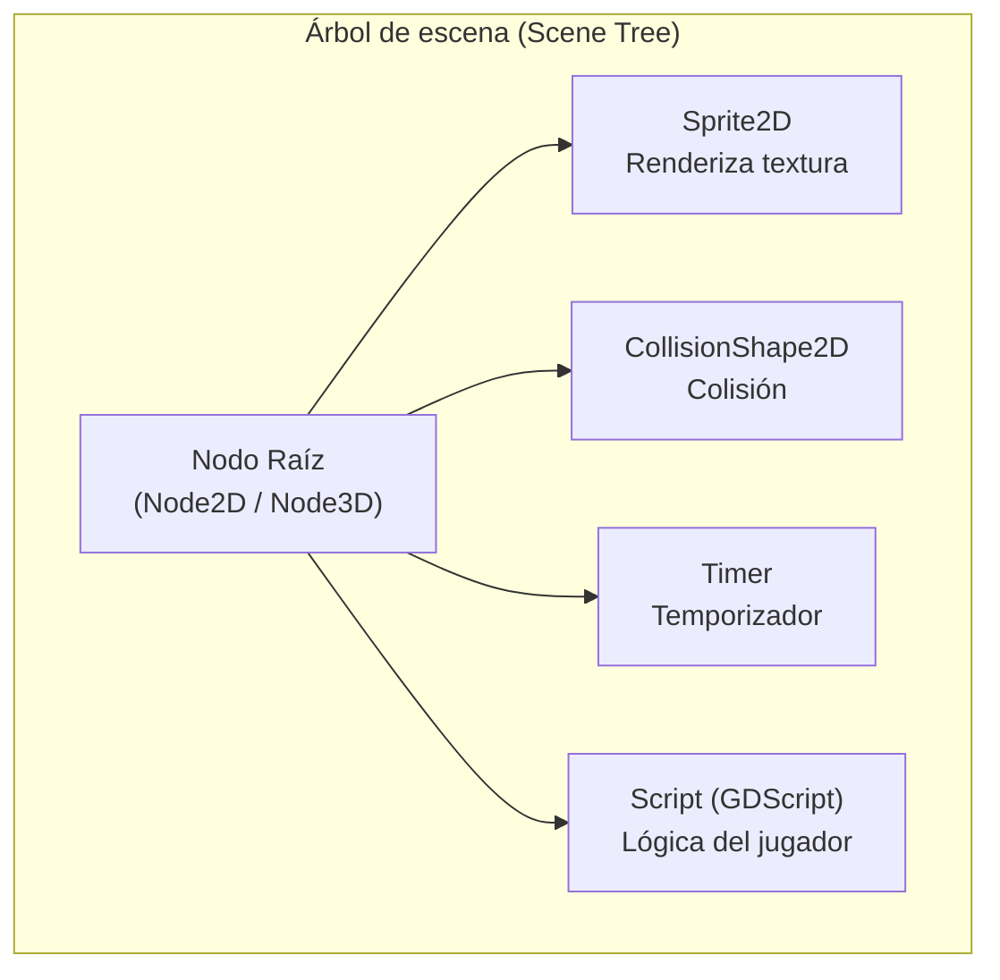

### 1.2. Sistema de señales (Signals)

Godot usa un patrón **observer** desacoplado: los nodos emiten señales y otros nodos (o el mismo) las escuchan.

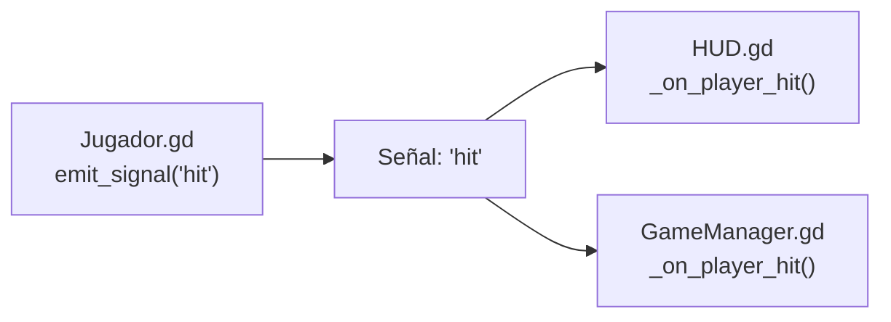

```
# Jugador.gd
signal hit(damage)  # Definición de la señal

func recibir_golpe(dmg):
    health -= dmg
    hit.emit(dmg)  # Emitir señal

# HUD.gd
func _ready():
    jugador.hit.connect(_on_player_hit)

func _on_player_hit(dmg):
    label.text = "Vida: %d" % jugador.health
```

### 1.3. Escenas como bloques

Todo es una **escena** (archivo `.tscn`) que puede anidarse dentro de otra.

```
Personaje.tscn   →    Jugador.tscn   →   Nivel.tscn
  - Sprite             - Personaje        - Jugador
  - Collision           - Script          - Enemigo
  - Animación           - Cámara          - Escenario
```

### 1.4. Pros y Contras

| ✅ Ventajas | ❌ Desventajas |
|---|---|
| Gratuito y open-source (MIT) | Ecosistema más pequeño |
| Ligero (~50MB) | Menos assets en tienda |
| Excelente para 2D | 3D menos maduro que UE/Unity |
| GDScript fácil de aprender | Pocas ofertas laborales |
| Editor integrado muy completo | Menos tutoriales AAA |

**¿Cuándo usarlo?** Juegos 2D, prototipos rápidos, proyectos indie, educación.

---

## 2. Unreal Engine

**Lenguaje principal:** C++, Blueprints (Visual Scripting)
**Tipo:** 3D (también 2D con Paper2D)
**Licencia:** Royalty 5% (gratuito hasta 1M USD)

### 2.1. Filosofía

Unreal está construido para **gráficos AAA**. Su pipeline de renderizado es de los más avanzados del mercado.

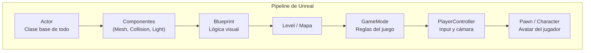

### 2.2. Blueprints vs C++

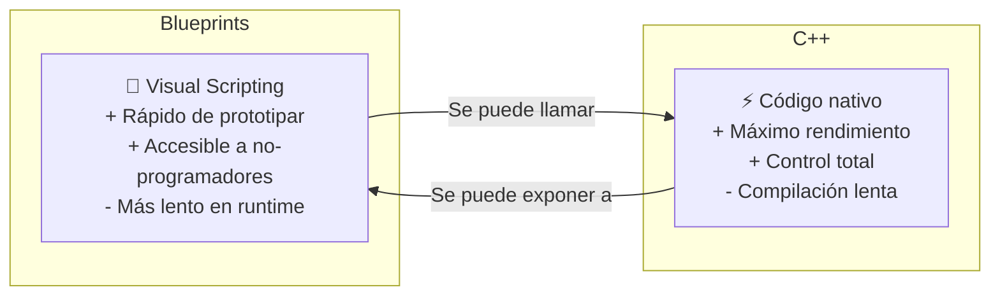

**Flujo de trabajo típico:** Prototipar en Blueprint → pasar a C++ lo crítico en rendimiento.

### 2.3. Sistema de materiales

Los materiales en Unreal son **node-based** (basados en nodos):

```
Material (shader graph)
  ├── Texture Sample (albedo)
  ├── Texture Sample (normal map)
  ├── Texture Sample (roughness)
  ├── Constant3Vector (color)
  └── → Material Output
```

### 2.4. Pros y Contras

| ✅ Ventajas | ❌ Desventajas |
|---|---|
| Renderizado AAA impresionante | Curva de aprendizaje alta |
| Blueprints para no-programadores | Pesado (~100GB con contenido) |
| C++ nativo → máximo control | Compilación lenta |
| Herramientas de cine/animación | Royalty 5% |
| Gran ecosistema (Marketplace, Quixel) | Sobredimensionado para 2D |

**¿Cuándo usarlo?** Juegos 3D AAA, shooters, gráficos realistas, cinemáticas, VR/AR.

---

## 3. Unity 3D

**Lenguaje principal:** C#
**Tipo:** 2D y 3D
**Licencia:** Gratuito (Personal), Pro (pago por asiento)

### 3.1. Filosofía

Unity usa un sistema de **GameObjects y Componentes**. Un GameObject vacío + componentes = cualquier cosa.

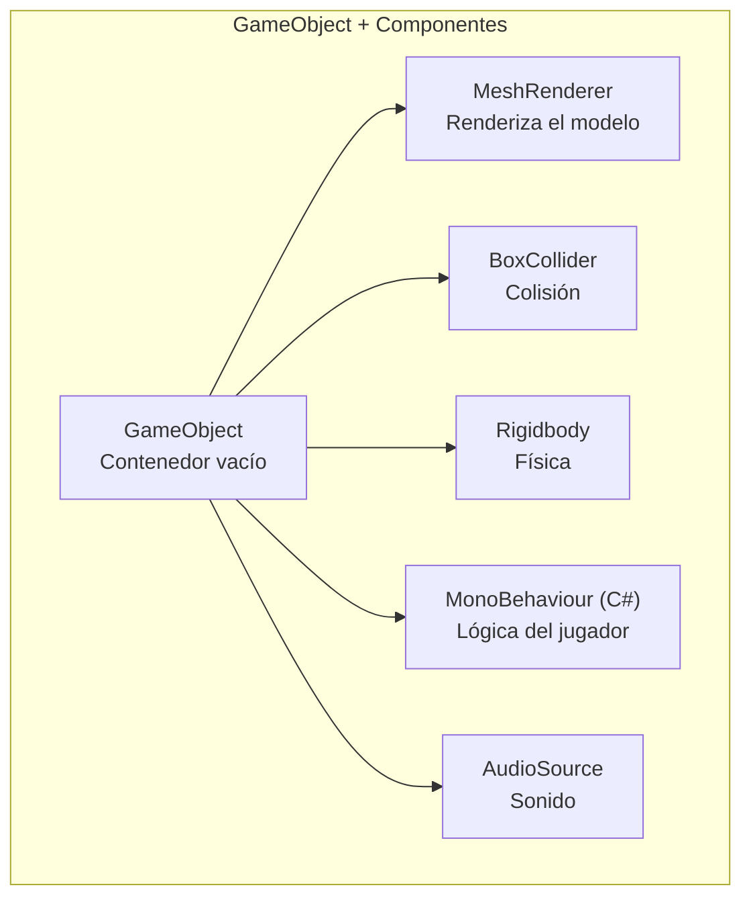

```
// Ejemplo: mover un GameObject con física
public class PlayerMovement : MonoBehaviour
{
    public float speed = 10f;
    private Rigidbody rb;

    void Start()
    {
        rb = GetComponent<Rigidbody>();
    }

    void FixedUpdate()
    {
        float h = Input.GetAxis("Horizontal");
        float v = Input.GetAxis("Vertical");
        Vector3 mov = new Vector3(h, 0, v) * speed;
        rb.AddForce(mov);
    }
}
```

### 3.2. Pipeline de renderizado (SRP)

Unity ofrece **pipelines intercambiables**:

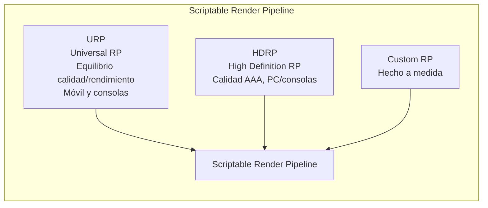

### 3.3. Asset Store y ecosistema

Unity tiene el **Asset Store** más grande del mercado:

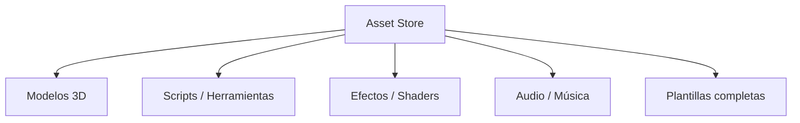

### 3.4. Pros y Contras

| ✅ Ventajas | ❌ Desventajas |
|---|---|
| Versátil (2D y 3D) | Rendimiento 3D < Unreal |
| C# fácil y moderno | Cambios de versión rompen proyectos |
| Asset Store enorme | UI frustrante a veces (aunque mejora) |
| Multiplataforma excelente | Overhead en proyectos grandes |
| Gran comunidad / tutoriales | Política de precios cambió (runtime fee) |

**¿Cuándo usarlo?** Juegos 2D, móviles, prototipos, indie, juegos multiplataforma, AR/VR.

---

## 4. Comparativa general

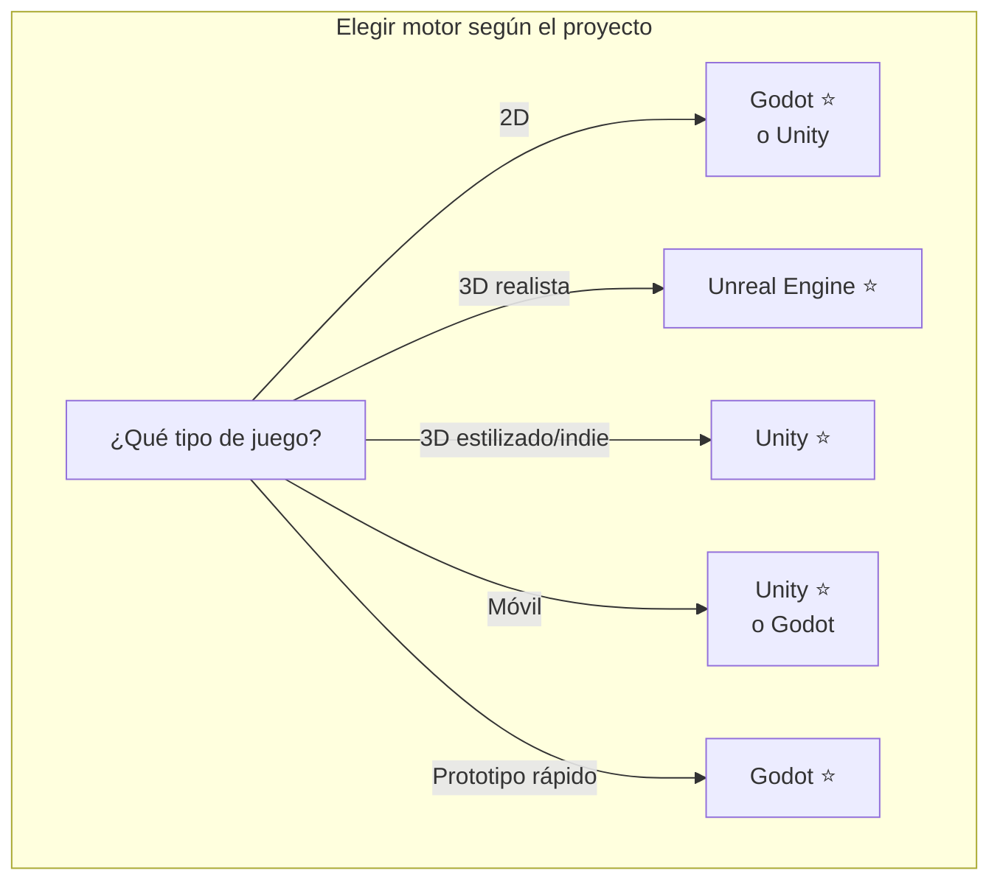

| Aspecto | Godot | Unity | Unreal |
|---|---|---|---|
| **Licencia** | MIT (gratis) | Gratis + Pro | Royalty 5% |
| **Lenguaje** | GDScript / C# | C# | C++ / Blueprints |
| **Peso instalación** | ~50 MB | ~5 GB | ~100 GB |
| **2D** | ⭐⭐⭐⭐⭐ | ⭐⭐⭐⭐ | ⭐⭐ |
| **3D** | ⭐⭐⭐ | ⭐⭐⭐⭐ | ⭐⭐⭐⭐⭐ |
| **Rendimiento** | Bueno | Bueno | Excelente |
| **Curva aprendizaje** | Baja | Media | Alta |
| **Empleo** | Baja | Alta | Muy alta (AAA) |
| **Comunidad** | Creciendo | Muy grande | Grande |
| **Editor visual** | Completo | Completo | Muy completo |

---

## 5. Desarrollo nativo (sin motor comercial)

También conocido como **"from scratch"** o **"roll your own engine"**. Usas bibliotecas de bajo nivel y construyes todo tú mismo.

### 5.1. Stack típico

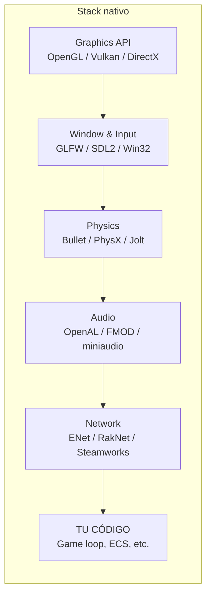

### 5.2. Bibliotecas populares por área

| Área | Biblioteca |
|---|---|
| **Gráficos** | OpenGL, Vulkan, DirectX 12, Metal |
| **Ventana/Input** | GLFW, SDL2, SFML |
| **Matemáticas** | GLM (OpenGL Mathematics) |
| **Física** | Bullet Physics, PhysX, Jolt |
| **Audio** | OpenAL, miniaudio, FMOD |
| **Red** | ENet, RakNet, Steamworks SDK |
| **ECS** | EnTT, Flecs |
| **Assets** | Assimp (modelos), stb_image (texturas) |

### 5.3. Arquitectura de motor nativo

```
tu_juego/
├── core/
│   ├── game_loop.cpp      // Fixed step + variable render
│   ├── input_manager.cpp   // Teclado, ratón, mando
│   └── debug.cpp           // Logging, profiling
├── graphics/
│   ├── renderer.cpp        // Pipeline de renderizado
│   ├── shader.cpp          // Compilación de shaders
│   ├── mesh.cpp            // Mallas / VAO / VBO
│   └── camera.cpp          // Frustum, matrices VP
├── physics/
│   └── physics_world.cpp   // Bullet/PhysX wrapper
├── audio/
│   └── audio_engine.cpp    // OpenAL / miniaudio
├── ecs/
│   └── world.cpp           // Sistema ECS (EnTT)
├── assets/
│   └── asset_manager.cpp   // Carga/gestión de recursos
└── main.cpp
```

### 5.4. Pros y Contras

| ✅ Ventajas | ❌ Desventajas |
|---|---|
| Control TOTAL del código | Años de desarrollo |
| Sin licencias ni regalías | Sin herramientas visuales |
| Optimizado al máximo | Sin Asset Store |
| Aprendizaje profundo | Tienes que hacer TODO |
| Sin bloatware | Depuración compleja |
| Ideal para estudios técnicos | Equipo grande necesario |

**¿Cuándo usarlo?**
- Cuando quieres **aprender** cómo funcionan los motores por dentro
- Cuando necesitas **rendimiento extremo** (demoscene, juegos retro, experimentos)
- Cuando el motor comercial **no te da el control** que necesitas
- Grandes estudios con equipo de engine dedicado (EA, Riot, Rockstar)

### 5.5. Game Loop nativo mínimo

```
// Mínimo indispensable para un juego nativo
#include <GLFW/glfw3.h>
#include <glm/glm.hpp>

int main() {
    glfwInit();
    GLFWwindow* window = glfwCreateWindow(800, 600, "Mi Juego", NULL, NULL);
    
    double lastTime = glfwGetTime();
    
    while (!glfwWindowShouldClose(window)) {
        double currentTime = glfwGetTime();
        float deltaTime = currentTime - lastTime;
        lastTime = currentTime;
        
        // Input
        if (glfwGetKey(window, GLFW_KEY_W)) moverAdelante(deltaTime);
        if (glfwGetKey(window, GLFW_KEY_ESCAPE)) break;
        
        // Actualizar
        actualizarFisica(deltaTime);
        actualizarIA(deltaTime);
        
        // Renderizar
        glClear(GL_COLOR_BUFFER_BIT | GL_DEPTH_BUFFER_BIT);
        renderizarEscena();
        
        glfwSwapBuffers(window);
        glfwPollEvents();
    }
    
    glfwTerminate();
    return 0;
}
```

---

## 6. Resumen: ¿Qué camino elegir?

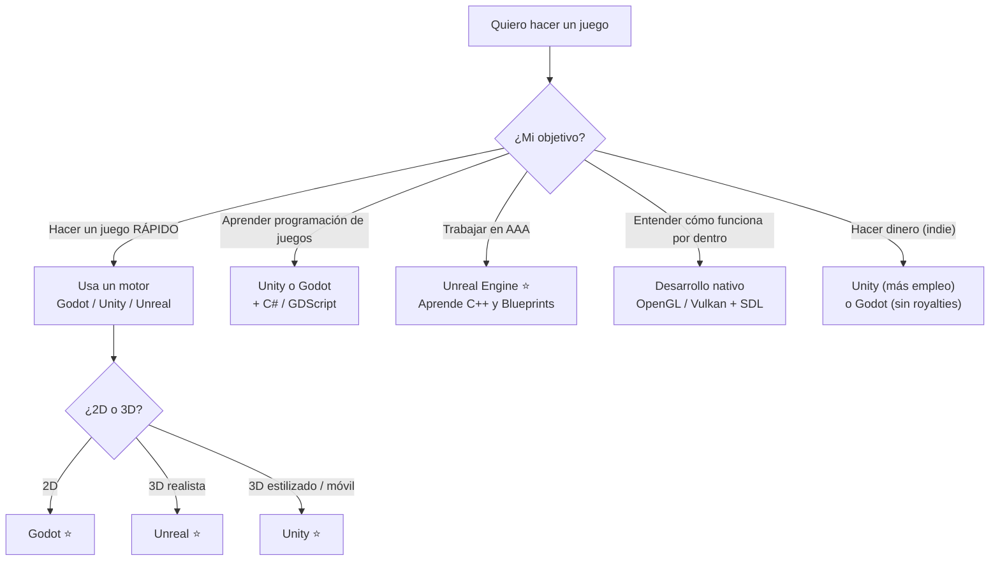

> 💡 **Regla de oro:** No hay motor "mejor". Hay motor **más adecuado** para tu proyecto, tu equipo y tus objetivos. Unreal para AAA gráfico, Unity para versatilidad multiplataforma, Godot para 2D y proyectos libres, nativo para aprendizaje y control extremo.

## Relacionados:
- [[fisicas-dinamicas]] #anterior 
- [[lenguajes-de-programación-para-videojuegos]] #siguiente 