# Renderizado Avanzado

## 1. PBR (Physically Based Rendering)

**PBR** es el estándar moderno de renderizado. Busca simular el **comportamiento físico de la luz** en las superficies, produciendo resultados realistas y consistentes bajo cualquier condición de iluminación.


### 1.1. Principios fundamentales del PBR

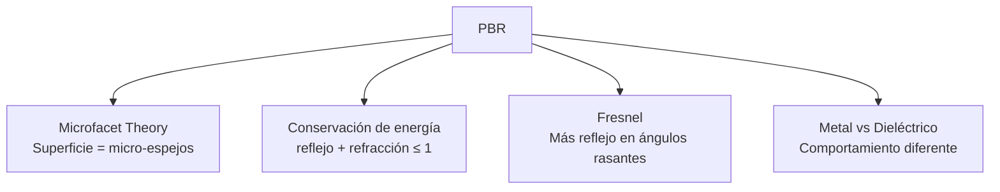

---

### 1.2. Microsurface Scattering (Teoría de Microfacetas)

La superficie no es perfectamente lisa. Está compuesta de **micro-espejos** orientados aleatoriamente.

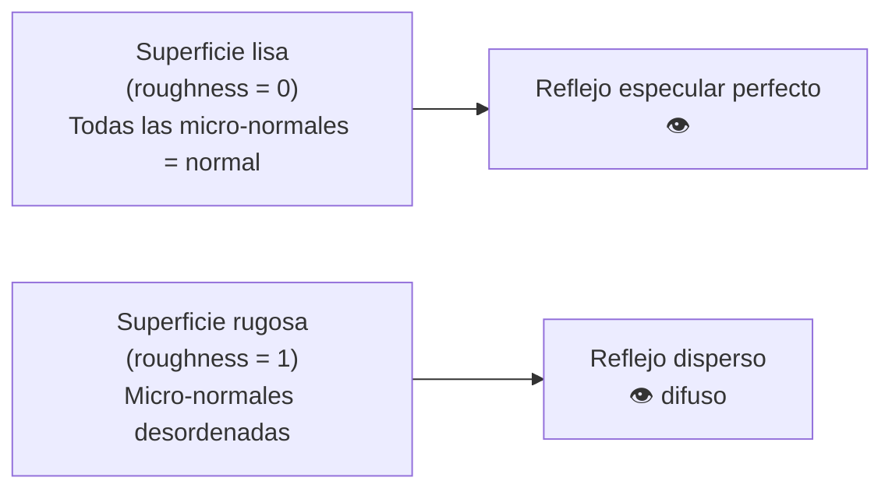

**Distribución GGX (Trowbridge-Reitz):**

La función de distribución de micro-normales más usada:

```
D(n, h, α) = α² / (π · ((n·h)² · (α² - 1) + 1)²)

n = normal de la superficie
h = half-vector (entre luz y vista)
α = roughness² (roughness al cuadrado)
```

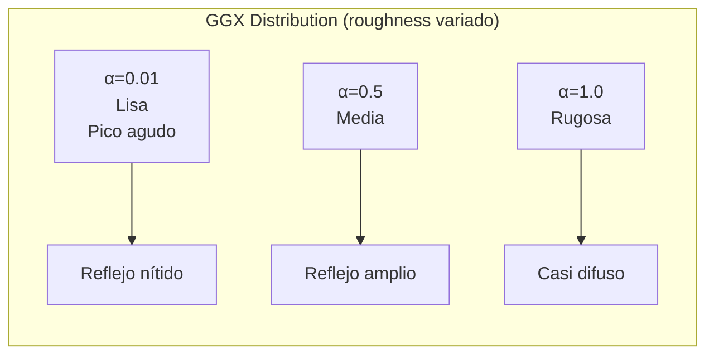

**Función geométrica (Smith):**

Modela el **auto-sombreo** de las micro-facetas:

```
G(n, v, l, α) = G₁(n·v) · G₁(n·l)

G₁(x) = 2x / (x + √(α² + (1 - α²)x²))

v = dirección de vista
l = dirección de luz
```

---

### 1.3. Conservación de la Energía

**La luz reflejada + la luz refractada no puede superar la luz incidente.**

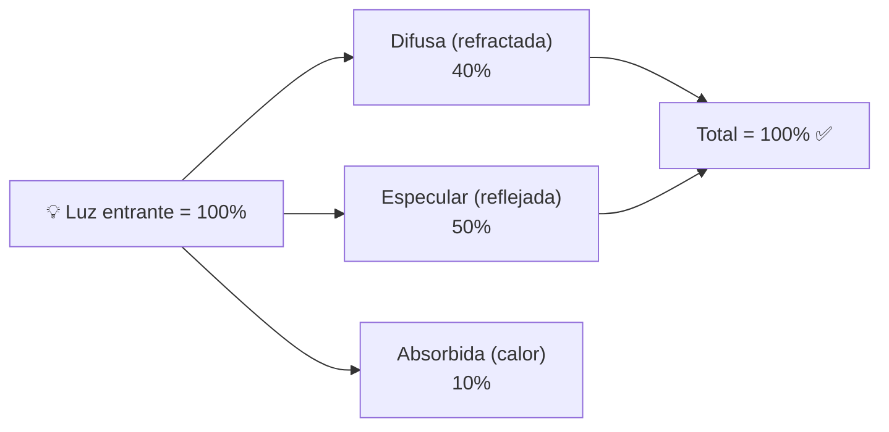

**En PBR, el término difuso se **atenúa** cuando el especular aumenta:**

```
// Fresnel: F toma parte de la energía para el especular
// El difuso recibe lo que sobra: (1 - F)

vec3 F = fresnelSchlick(NdotV, F0);
vec3 kD = (1 - F) * (1 - metalness);  // Metal: kD = 0

// Ecuación de reflectancia:
Lo = (kD * albedo / π + D * F * G / (4 * NdotV * NdotL)) * LdotV * lightColor;
```

**Para metales (metalness = 1):**
- **kD = 0** → no hay componente difusa (los metales no refractan luz)
- Toda la luz se refleja especularmente

**Para dieléctricos (metalness = 0):**
- kD > 0 → hay componente difusa
- F₀ = 0.04 (Fresnel en incidencia normal para la mayoría de no-metales)

---

### 1.4. Translucencia y Transparencia

#### Transparencia (objetos que se ven a través)

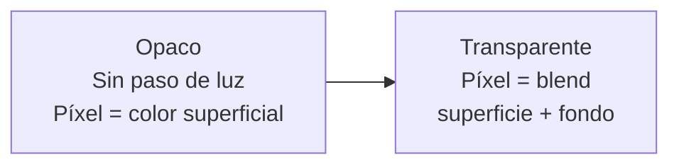

**Técnicas:**

| Técnica | Cómo funciona | Cuándo usarla |
|---|---|---|
| **Alpha Blending** | `color = src * α + dst * (1-α)` | Vidrio, agua, humo |
| **Alpha Testing** | Descartar píxeles con α < umbral | Hojas, rejas, pelo |
| **Order Independent (OIT)** | Ordenar fragmentos por profundidad | Múltiples capas de transparencia |
| **Weighted Blended** | Aproximación sin ordenar | Efectos complejos |

```
// Alpha Blending (GPU config)
glEnable(GL_BLEND);
glBlendFunc(GL_SRC_ALPHA, GL_ONE_MINUS_SRC_ALPHA);

// En shader:
FragColor = vec4(albedo, alpha);  // alpha controla la transparencia
```

**Problema:** El alpha blending requiere **ordenar** los objetos transparentes (de atrás a adelante).

#### Translucencia (subsurface scattering)

La luz **penetra** la superficie, se dispersa por dentro, y sale en otro punto.


```
// Subsurface Scattering simplificado (wrap lighting)
float translucency = dot(lightDir, -normal) * wrap + 1 - wrap;
translucency = max(0, translucency);
vec3 subsurface = lightColor * translucency * subsurfaceColor * subsurfaceStrength;
```

**Materiales con translucencia:** piel, mármol, cera, jade, leche, hojas.

---

### 1.5. Metalicidad (Metalness Workflow)

El **metalness** determina si un material es metal o dieléctrico (no-metal).

| Propiedad | Dieléctrico (metalness = 0) | Metal (metalness = 1) |
|---|---|---|
| **Albedo** | Color difuso (madera, piedra) | Color del metal (oro→amarillo, cobre→naranja) |
| **F₀ (Fresnel)** | 0.04 (fijo) | Albedo (el color del metal) |
| **Difuso** | Sí (kD > 0) | No (kD = 0) |
| **Reflejo** | Débil (4%) | Fuerte (70-100%) |
| **Ejemplos** | Madera, plástico, piel, tela | Oro, hierro, cobre, aluminio |

```
// PBR metalness workflow
uniform sampler2D albedoMap;
uniform sampler2D normalMap;
uniform sampler2D metallicMap;
uniform sampler2D roughnessMap;

void main() {
    vec4 albedo = texture(albedoMap, uv);
    float metalness = texture(metallicMap, uv).r;
    float roughness = texture(roughnessMap, uv).r;
    
    vec3 F0 = mix(vec3(0.04), albedo.rgb, metalness);
    
    // ... calcular lighting con F0, roughness, metalness
}
```

**Pipeline de texturas PBR:**

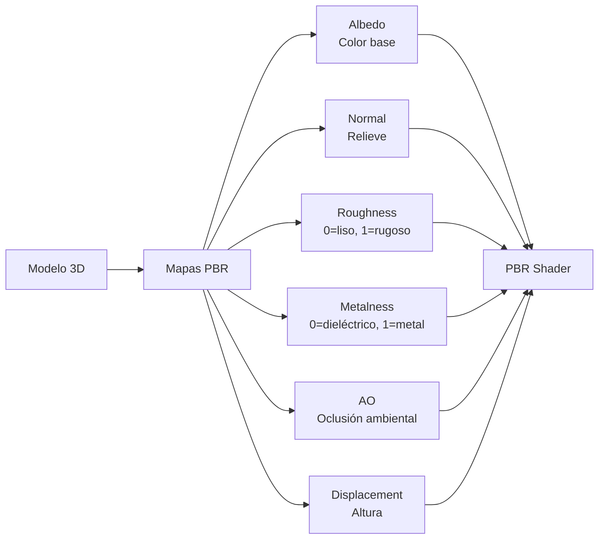

### 1.6. Ecuación completa PBR (Cook-Torrance)

```
Lo(p, ωₒ) = ∫(fᵣ(p, ωᵢ, ωₒ) · Lᵢ(p, ωᵢ) · (n·ωᵢ)) dωᵢ

fᵣ = kD · albedo/π + ks · (D·F·G)/(4·(n·ωᵢ)·(n·ωₒ))

donde:
D = Normal Distribution Function (GGX)
F = Fresnel (Schlick)
G = Geometry Function (Smith)
kD = (1 - F) * (1 - metalness)
ks = F
```

---

## 2. Trazado de Rayos (Ray Tracing)

### 2.1. Recordatorio del concepto

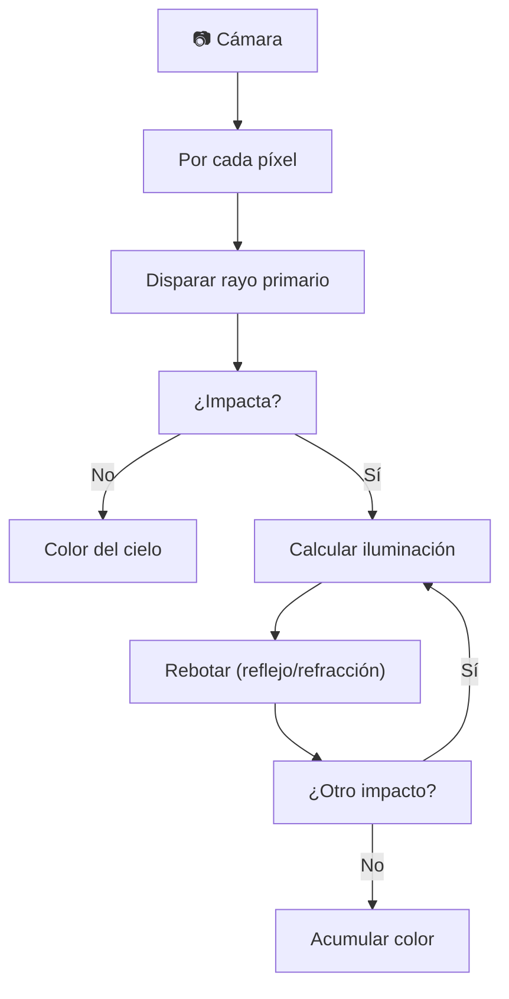

### 2.2. Ray Tracing en tiempo real

El RT en tiempo real no reemplaza la rasterización: la **complementa**.

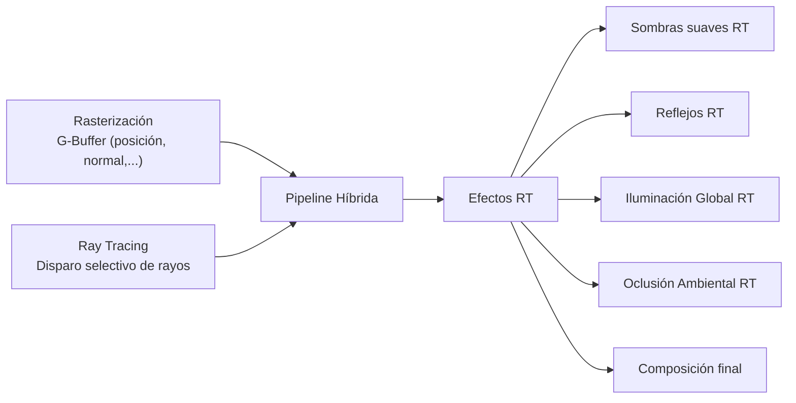

---

### 2.3. DirectX Ray Tracing (DXR)

Extensión de DirectX 12 para RT en hardware. Introducida con NVIDIA RTX (2018).

**Pipeline DXR:**

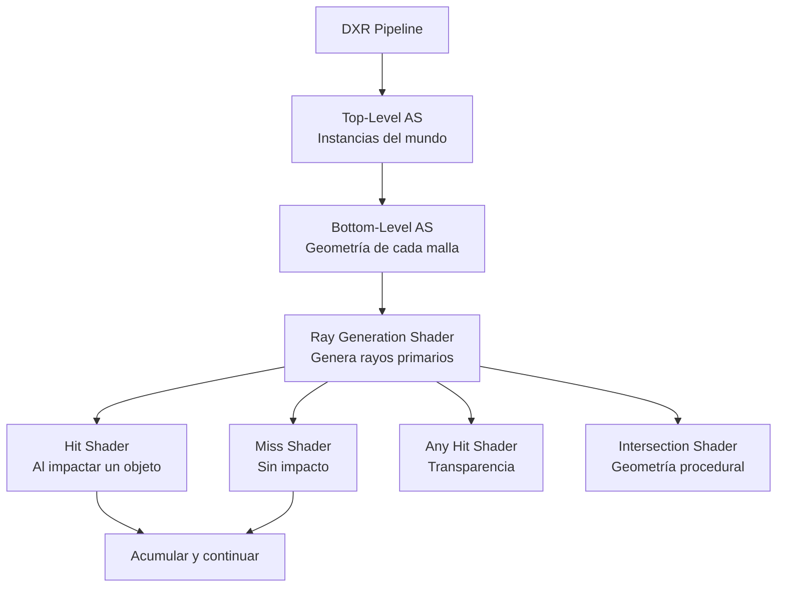

```
// Ray Generation Shader (HLSL DXR)
[shader("raygeneration")]
void RayGen() {
    uint2 launchIdx = DispatchRaysIndex().xy;
    uint2 launchDim = DispatchRaysDimensions().xy;
    
    float2 uv = (launchIdx + 0.5f) / launchDim;
    RayDesc ray;
    ray.Origin = cameraPos;
    ray.Direction = calculateDirection(uv);
    ray.TMin = 0.001f;
    ray.TMax = 1000.0f;
    
    RayPayload payload;
    TraceRay(accelStruct, RAY_FLAG_NONE, 0xFF, 0, 0, 0, ray, payload);
    
    output[launchIdx] = float4(payload.color, 1.0f);
}

// Hit Shader
[shader("closesthit")]
void ClosestHit(inout RayPayload payload, Attributes attr) {
    float3 hitPos = WorldRayOrigin() + RayTCurrent() * WorldRayDirection();
    float3 normal = normalize(mul(attr.normal, (float3x3)objectToWorld));
    
    // Calcular iluminación en el punto de impacto
    payload.color = calculateLighting(hitPos, normal);
}

// Miss Shader
[shader("miss")]
void Miss(inout RayPayload payload) {
    payload.color = skyColor;  // Color del cielo
}
```

**Pipeline completo en DXR:**

```cpp
// 1. Crear acceleration structures (BLAS + TLAS)
// 2. Crear State Object con los shaders
// 3. Crear Shader Binding Table
// 4. DispatchRays() en cada frame
```

---

### 2.4. Vulkan Ray Tracing

Extensión `VK_KHR_ray_tracing_pipeline` (similar a DXR pero multiplataforma).

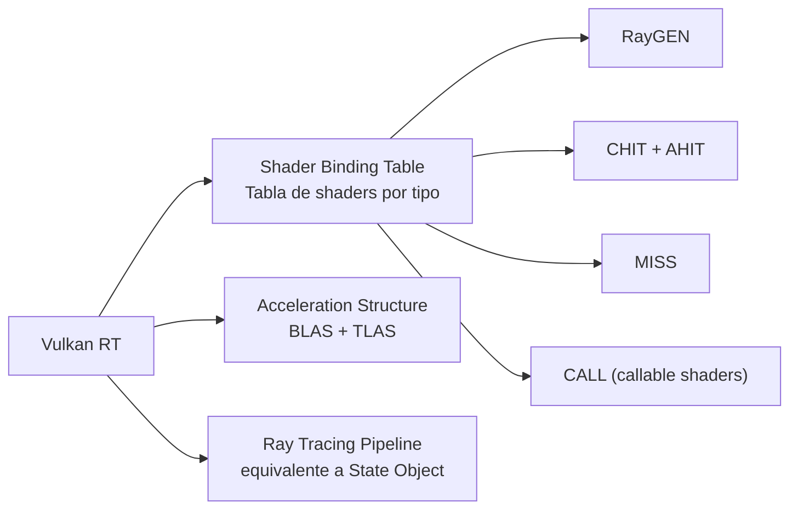

```cpp
// Crear pipeline Vulkan RT (C++)
VkRayTracingPipelineCreateInfoKHR pipelineInfo{};
pipelineInfo.sType = VK_STRUCTURE_TYPE_RAY_TRACING_PIPELINE_CREATE_INFO_KHR;
pipelineInfo.stageCount = shaderStageCount;
pipelineInfo.pStages = shaderStages;
pipelineInfo.groupCount = groupCount;
pipelineInfo.pGroups = groups;
pipelineInfo.maxPipelineRayRecursionDepth = 1;

vkCreateRayTracingPipelinesKHR(device, VK_NULL_HANDLE, VK_NULL_HANDLE,
                                1, &pipelineInfo, nullptr, &pipeline);
```

**Diferencia clave con DXR:**
- Vulkan RT es multiplataforma (AMD, NVIDIA, Intel)
- Vulkan expone el Shader Binding Table explícitamente
- Vulkan requiere manejo de memoria más manual

---

### 2.5. OptiX

**OptiX** es el framework de RT de NVIDIA. No es una API gráfica directamente, sino un **acelerador** construido sobre CUDA.

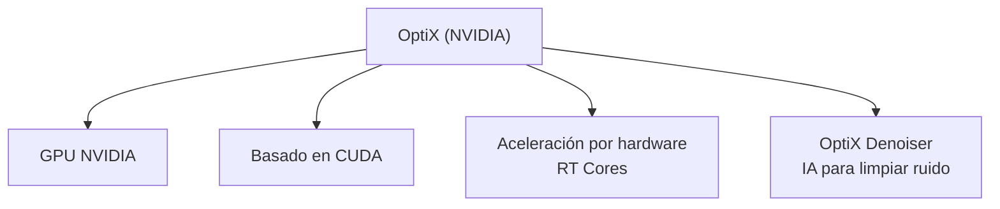

**Características únicas de OptiX:**

| Característica | Beneficio |
|---|---|
| **RT Cores** | Hardware dedicado para intersección rayo-triángulo |
| **Motion blur** | Acelerado por hardware |
| **Multi-GPU** | Escalable a varias GPUs |
| **Denoising IA** | Red neuronal para limpiar 1 spp → calidad 1000 spp |
| **Curves** | Ray tracing contra curvas (pelo, césped) |

```
// OptiX pipeline (C++ + CUDA)
optix::Context context = optix::Context::create();
context->setRayTypeCount(2);
context->setEntryPointCount(1);

// Programas OptiX
context->createProgramFromPTXFile(raygen_ptx, "raygen");
context->createProgramFromPTXFile(closesthit_ptx, "closesthit");
context->createProgramFromPTXFile(miss_ptx, "miss");

// Acceleration structure
context->createAccelerationStructure("MyAccel", bottomLevelAS);

// Lanzar rayos
context->launch(0, width, height);
```

---

## 3. Comparativa de técnicas RT

| Característica | DXR | Vulkan RT | OptiX |
|---|---|---|---|
| **Plataforma** | Windows/Xbox | Multiplataforma | NVIDIA (Win/Linux) |
| **API base** | DirectX 12 | Vulkan | CUDA |
| **Complejidad** | Alta | Muy alta | Media |
| **Denoising** | Terceros | Terceros | ✅ Integrado (IA) |
| **Motion blur HW** | No | No | ✅ Sí |
| **Multi-GPU** | Sí | Sí | ✅ Nativo |
| **Adopción juegos** | Alta (Cyberpunk, etc.) | Media | Herramientas/películas |

### ¿Qué camino elegir?

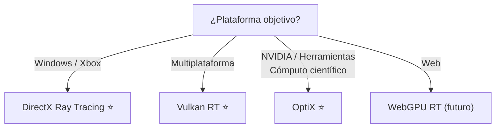

> 💡 **Regla de oro:** PBR es el estándar para cualquier juego moderno (úsalo siempre). Ray Tracing es el futuro, pero hoy se usa en **pipeline híbrida**: rasterización para el 90% del render, RT para sombras, reflejos y AO selectivos. DXR para Windows, Vulkan RT para multiplataforma.
