# Shader

## ¿Qué es un shader?

Un **shader** es un pequeño programa que se ejecuta en la **GPU** (Graphics Processing Unit). Es el corazón de la computación gráfica moderna.

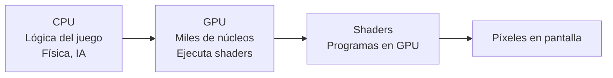

### Tipos de shaders

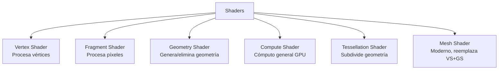

### Lenguajes de shaders

```
HLSL   → DirectX (Windows/Xbox)
GLSL   → OpenGL, Vulkan (multiplataforma)
MSL    → Metal (Apple)
SPIR-V → Formato intermedio (Vulkan)
```

---

## 1. Tubería de Gráficos (Graphics Pipeline)

La **pipeline gráfica** es el proceso que sigue un modelo 3D hasta convertirse en píxeles en pantalla.

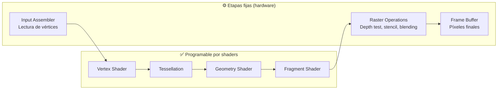

### 1.1. Pipeline clásica (paso a paso)

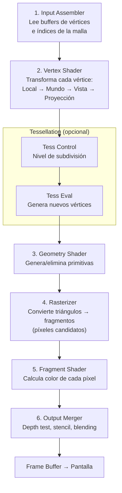

### 1.2. Vertex Shader (GLSL)

```
#version 460 core
layout (location = 0) in vec3 aPos;
layout (location = 1) in vec3 aNormal;
layout (location = 2) in vec2 aTexCoord;

uniform mat4 model;
uniform mat4 view;
uniform mat4 projection;

out vec3 FragPos;
out vec3 Normal;
out vec2 TexCoord;

void main() {
    FragPos = vec3(model * vec4(aPos, 1.0));
    Normal = mat3(transpose(inverse(model))) * aNormal;
    TexCoord = aTexCoord;
    
    gl_Position = projection * view * vec4(FragPos, 1.0);
}
```

### 1.3. Fragment Shader (GLSL)

```
#version 460 core
in vec3 FragPos;
in vec3 Normal;
in vec2 TexCoord;

uniform sampler2D albedoMap;
uniform vec3 lightPos;
uniform vec3 viewPos;

out vec4 FragColor;

void main() {
    vec3 color = texture(albedoMap, TexCoord).rgb;
    
    // Iluminación básica
    vec3 norm = normalize(Normal);
    vec3 lightDir = normalize(lightPos - FragPos);
    float diff = max(dot(norm, lightDir), 0.0);
    
    vec3 result = color * (0.1 + diff * 0.9);
    FragColor = vec4(result, 1.0);
}
```

---

## 2. Sampling

### 2.1. ¿Qué es sampling?

**Sampling** es el proceso de tomar valores discretos de una función continua. En gráficos, significa **muestrear texturas** en coordenadas UV.

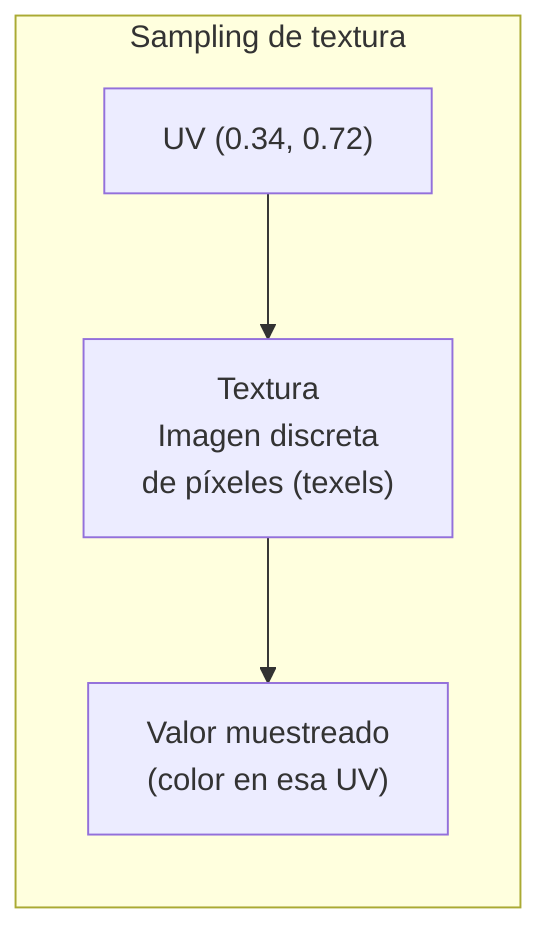

### 2.2. Modos de filtrado

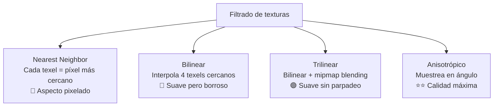

```
// Muestreo en GLSL
vec4 color;

// Nearest neighbor (pixelado)
color = texture(sampler, uv);

// Con filtrado anisotrópico
color = texture(sampler, uv);  // Configurado en la API

// Muestreo manual con derivadas (mipmap level)
float mipLevel = textureQueryLod(sampler, uv).x;
color = textureLod(sampler, uv, mipLevel);
```

### 2.3. Mipmaps

Son versiones **pre-filtradas** y reducidas de la textura para evitar **aliasing** cuando un objeto está lejos.

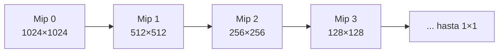

```
// Determinar mip level automático
float mipLevel = log2(max(dFdx(uv).x, dFdy(uv).y));
// dFdx/dFdy = derivadas de la UV en la pantalla
```

### 2.4. Aliasing y Antialiasing

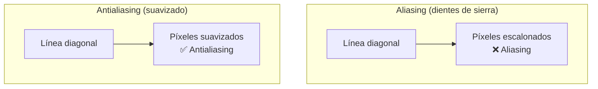

**Técnicas de antialiasing:**

| Técnica | Cómo funciona | Coste |
|---|---|---|
| **SSAA** | Renderizar a mayor resolución y downscale | Muy alto |
| **MSAA** | Multi-sample solo en bordes de polígonos | Medio |
| **FXAA** | Filtro post-process (detecta bordes) | Bajo |
| **TAA** | Temporal: acumula frames anteriores | Medio |

---

## 3. Rasterización

### 3.1. ¿Qué es la rasterización?

Convertir **triángulos 3D** → **píxeles 2D**. Es la técnica **dominante** en juegos en tiempo real.

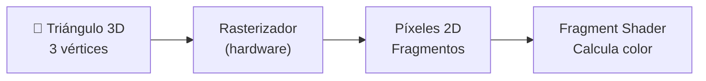

### 3.2. El proceso

```
Por cada triángulo:
  1. Proyectar vértices a 2D (pantalla)
  2. Calcular bounding box en píxeles
  3. Por cada píxel en el bounding box:
     a. ¿Está dentro del triángulo? (edge function)
     b. Si sí → generar fragmento
     c. Interpolar atributos (UV, normal, depth)
     d. Ejecutar Fragment Shader
```

### 3.3. Edge Function

Determina si un píxel está dentro de un triángulo:

```
// Edge function: producto cruz 2D
float edge(vec2 a, vec2 b, vec2 p) {
    return (b.x - a.x) * (p.y - a.y) - (b.y - a.y) * (p.x - a.x);
}

// Un píxel está dentro si edge(A,B,P), edge(B,C,P), edge(C,A,P) tienen el mismo signo
bool inside(vec2 A, vec2 B, vec2 C, vec2 P) {
    float e1 = edge(A, B, P);
    float e2 = edge(B, C, P);
    float e3 = edge(C, A, P);
    return (e1 >= 0 && e2 >= 0 && e3 >= 0) ||
           (e1 <= 0 && e2 <= 0 && e3 <= 0);
}
```

### 3.4. Interpolación de atributos (Barycentric coordinates)

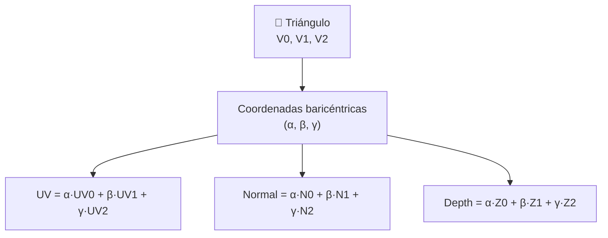

### 3.5. Rasterización vs Ray Tracing

| Aspecto | Rasterización | Ray Tracing |
|---|---|---|
| **Velocidad** | ⚡ Muy rápida | 🐢 Lenta (aunque mejora) |
| **Calidad** | Aproximada (sombras, reflejos) | Física (perfecta) |
| **Uso** | Estándar en juegos | Cine, RTX (híbrido) |
| **Hardware** | Cualquier GPU | GPU moderna (RTX, PS5, Xbox) |

---

## 4. Trazado de Rayos (Ray Tracing)

### 4.1. Concepto

Simula el **comportamiento físico de la luz**: traza rayos desde la cámara, rebotando por la escena.

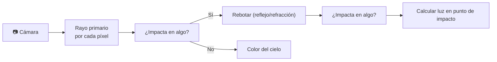

### 4.2. Pipeline híbrida (estándar moderno)

Los juegos actuales usan **rasterización + ray tracing**:

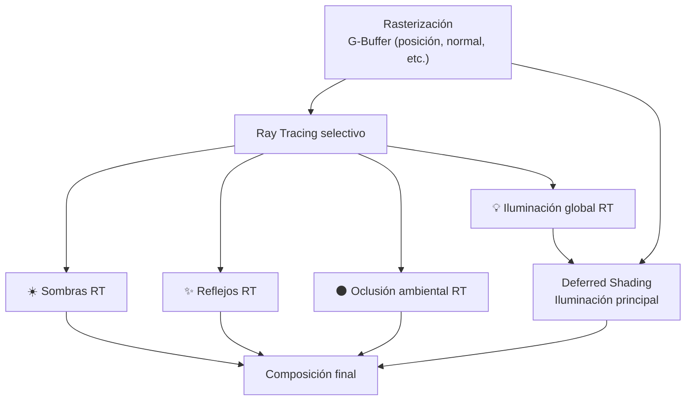

### 4.3. Tipos de efectos RT

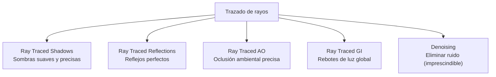

### 4.4. Ejemplo: Ray Tracing en GLSL (Compute Shader)

```
#version 460 core
#extension GL_EXT_ray_tracing : require

layout(set = 0, binding = 0) uniform accelerationStructureEXT topLevelAS;

layout(location = 0) rayPayloadEXT vec3 hitColor;

void main() {
    vec3 origin = cameraPos;
    vec3 direction = calculateRayDirection(gl_GlobalInvocationID.xy);
    
    // Trazar rayo
    traceRayEXT(topLevelAS,        // Acceleration structure
                gl_RayFlagsNoneEXT, // Flags
                0xFF,               // Cull mask
                0,                  // Ray offset
                0,                  // Ray offset
                0,                  // Ray offset
                origin,             // Origen
                0.001,              // Tmin
                direction,          // Dirección
                1000.0,             // Tmax
                0                   // Payload location
    );
    
    imageStore(outputImage, ivec2(gl_GlobalInvocationID.xy), vec4(hitColor, 1.0));
}
```

### 4.5. Denoising

El RT puro con pocos rayos por píxel (1-4) produce **mucho ruido**. El **denoising** es obligatorio:

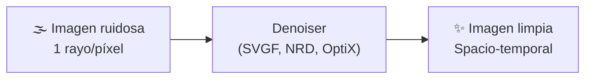

**Denoisers comunes:**
- **SVGF** (Spatiotemporal Variance-Guided Filtering)
- **NRD** (NVIDIA Real-Time Denoiser)
- **OptiX Denoiser** (IA, muy rápido)

---

## 5. Resumen visual del pipeline completo

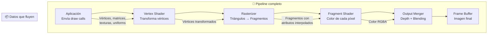

### Lenguajes por plataforma

```
Plataforma     │ API gráfica    │ Lenguaje shader
───────────────┼────────────────┼────────────────
PC Windows     │ DirectX 12     │ HLSL
PC multiplataf │ Vulkan         │ GLSL / SPIR-V
PC / Linux     │ OpenGL         │ GLSL
Mac / iOS      │ Metal          │ MSL
PS5            │ Proprietary    │ PSSL (basado en HLSL)
Xbox Series    │ DirectX 12 HW  │ HLSL
Nintendo Switch│ NVN            │ GLSL modificado
Web            │ WebGL / WebGPU │ GLSL / WGSL
```

> 💡 **Regla de oro:** El Vertex Shader mueve geometría, el Fragment Shader pinta píxeles, y el Ray Tracing (cuando se pueda) hace que todo luzca real. En la práctica, los juegos modernos usan **rasterización para el 90%** y **RT para los efectos clave** (sombras, reflejos, AO).

## Relacionados:
- [[color-y-animacion]] #anterior 
- [[apis-graficas]] #siguiente 