# Visibilidad y Oclusión

## ¿Por qué es importante?

En una escena 3D típica puede haber millones de triángulos. Renderizarlos todos sería imposible. Las técnicas de **visibilidad y oclusión** determinan **qué se ve y qué no**, ahorrando miles de draw calls.

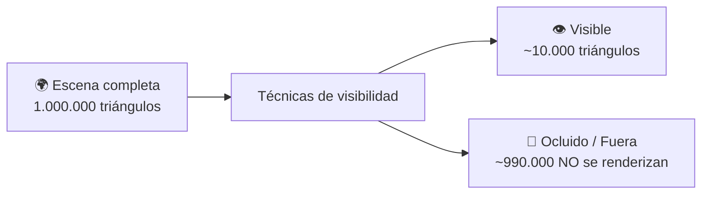

---

## 1. Culling

**Culling** = eliminar objetos que no aportan a la imagen final.

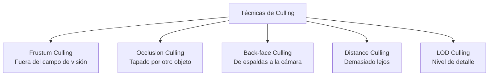

### 1.1. Frustum Culling

El **frustum** es la pirámide truncada que representa lo que ve la cámara. Todo lo que esté fuera se descarta.

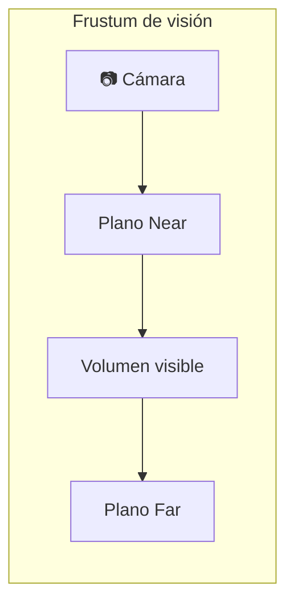

**Los 6 planos del frustum:**

```
 1. Plano Near (cerca)
 2. Plano Far  (lejos)
 3. Plano Left (izquierda)
 4. Plano Right (derecha)
 5. Plano Top (arriba)
 6. Plano Bottom (abajo)
```

**Prueba punto vs frustum:**

```
bool isInsideFrustum(vec3 point, Plane[6] frustum) {
    for (int i = 0; i < 6; i++) {
        // Ecuación del plano: N·P + d >= 0 → dentro
        if (dot(frustum[i].normal, point) + frustum[i].d < 0)
            return false;  // Fuera de este plano → descartar
    }
    return true;
}
```

Para objetos grandes se usa la **bounding sphere** o **AABB** en lugar del punto:

```
bool sphereInFrustum(vec3 center, float radius, Plane[6] frustum) {
    for (int i = 0; i < 6; i++) {
        float dist = dot(frustum[i].normal, center) + frustum[i].d;
        if (dist < -radius) return false;  // Esfera completamente fuera
    }
    return true;
}
```

### 1.2. Light Culling

No todas las luces afectan a todos los objetos. Se determina qué luces iluminan qué partes de la escena.

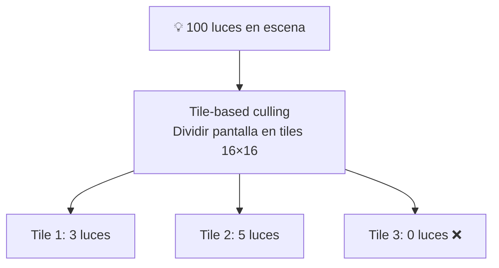

**Técnicas:**
- **Tile-based:** Divide la pantalla en tiles y asigna luces por tile
- **Cluster-based:** Divide en clusters 3D (más preciso)
- **Z-bucket:** Por rango de profundidad

```
// Tile-based light culling (compute shader)
for each tile (16×16 píxeles):
    for each light:
        if light afecta este tile:
            añadir light a lista del tile

// Fragment shader: cada píxel solo itera las luces de su tile
for light in lightList[tileIndex]:
    color += calcularLuz(light, fragment);
```

### 1.3. Shadow Culling

No todos los objetos proyectan sombra, ni todos la reciben. Optimización de shadow maps.

```
Cada objeto tiene flags:
  - CastShadow  : ¿proyecta sombra? (sí/no)
  - ReceiveShadow : ¿recibe sombra? (sí/no)

Objetos que no proyectan sombra → no se renderizan en el shadow map
Objetos que no reciben sombra → no ejecutan el shader de sombras

Ejemplo:
  Suelo:    Cast=No,  Receive=Sí
  Pared:    Cast=Sí,  Receive=Sí
  Césped:   Cast=No,  Receive=Sí
  Techo:    Cast=Sí,  Receive=No
```

---

## 2. Clipping

**Clipping** = recortar partes de geometría que quedan fuera del volumen visible.

### 2.1. Clipping de Polígono (2D)

Recorta un polígono contra un rectángulo (viewport) o contra los planos del frustum.

```
// Algoritmo Sutherland-Hodgman
function clipPolygon(vertices, plano):
    salida = []
    for each edge (v_i, v_{i+1}):
        if v_{i+1} está dentro:
            if v_i está fuera:
                salida.push(intersectar(v_i, v_{i+1}, plano))
            salida.push(v_{i+1})
        else if v_i está dentro:
            salida.push(intersectar(v_i, v_{i+1}, plano))
    return salida
```

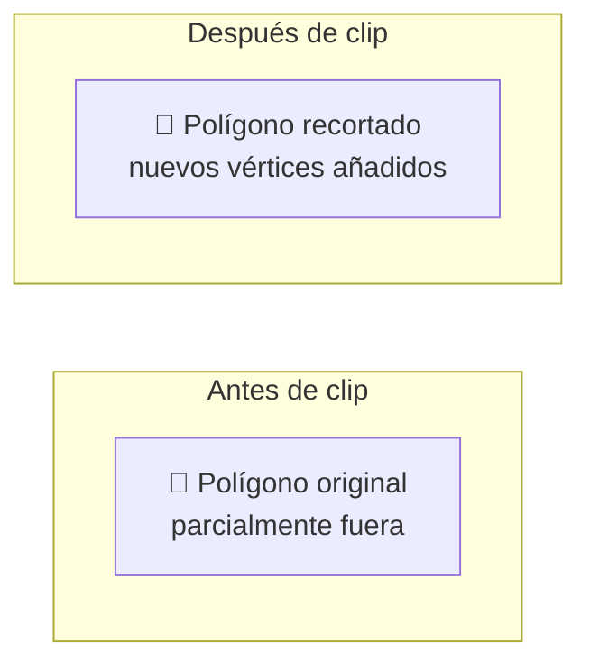

### 2.2. Clipping de Poliedro (3D)

Versión 3D del clipping de polígono. Recorta un volumen 3D contra los planos del frustum.

**Homogeneous clipping (hardware):**
En la pipeline moderna, el clipping se hace en **coordenadas homogéneas** después de la transformación de proyección:

```
// Después de multiplicar por la matriz de proyección:
vértice_clip = projection * view * model * vértice_local

// El hardware descarta automáticamente vértices donde:
//   -w < x < w
//   -w < y < w
//   -w < z < w
// Si algún vértice del triángulo cruza el borde → se recorta
```

---

## 3. Occlusion Culling (Occluder)

Determina qué objetos están **tapados** por otros. Es más avanzado que frustum culling.

### 3.1. Concepto

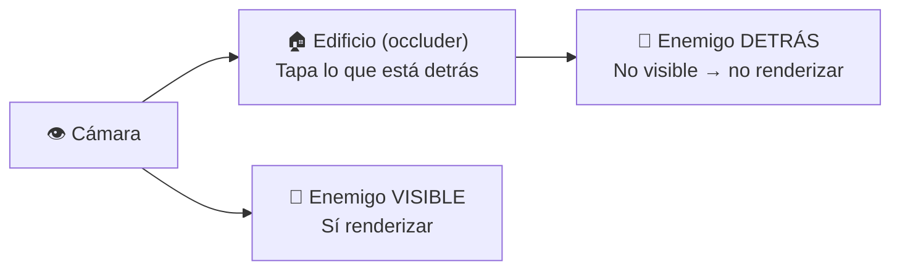

### 3.2. Técnicas de occlusion culling

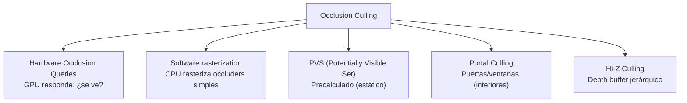

#### Hardware Occlusion Queries

```
// 1. Crear query
GLuint query;
glGenQueries(1, &query);

// 2. Renderizar objetos grandes y cercanos primero (occluders)
renderizarEdificios();

// 3. Preguntar por objetos pequeños
glBeginQuery(GL_ANY_SAMPLES_PASSED, query);
renderizarEnemigo();  // Renderiza solo el bounding box
glEndQuery(query);

// 4. Leer resultado
GLuint visible;
glGetQueryObjectuiv(query, GL_QUERY_RESULT, &visible);

if (visible) {
    renderizarEnemigoDetallado();  // Se ve → renderizar completo
}
```

#### Portal Culling

Para escenas de **interiores**: divide en habitaciones conectadas por portales (puertas, ventanas).

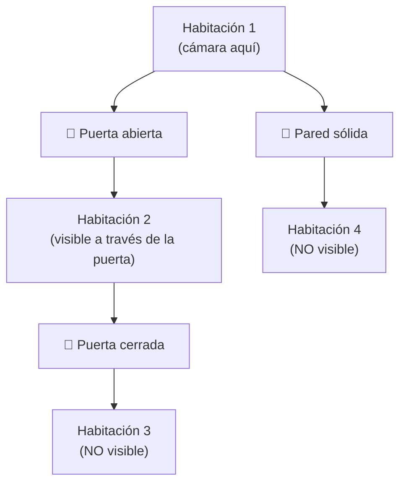

#### PVS (Potentially Visible Set)

Precalculado en tiempo de compilación del mapa. Divide en celdas y calcula qué es visible desde cada una.

```
// Datos precalculados:
Celda 1 → puede ver: {Celda 1, Celda 2, Celda 5}
Celda 2 → puede ver: {Celda 1, Celda 2, Celda 3}
Celda 3 → puede ver: {Celda 2, Celda 3, Celda 4}

// En runtime:
celdaActual = determinarCelda(camara.position);
objetosRenderizar = PVS[celdaActual];
```

#### Hi-Z Culling

Usa una **pirámide de profundidad** (depth mipmap) para descartar objetos de golpe.

```
// 1. Generar Hi-Z map (mipmaps del depth buffer)
// 2. Por cada objeto:
//    - Proyectar bounding box a pantalla
//    - Obtener profundidad mínima del Hi-Z map en esa región
//    - Si el objeto está detrás de esa profundidad → oculto
```

### 3.3. Implementación práctica (Unreal Engine)

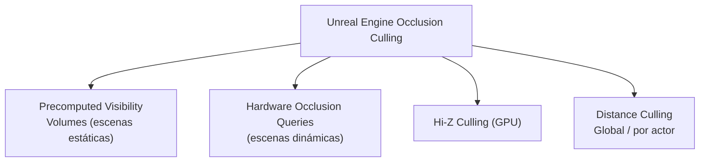

### 3.4. Comparativa

| Técnica | Estático/Dinámico | Coste CPU | Coste GPU | Precisión |
|---|---|---|---|---|
| Frustum Culling | Ambos | Bajo | Ninguno | Baja (solo fuera de vista) |
| HW Occlusion Queries | Dinámico | Medio | Medio | Alta |
| Portal Culling | Estático | Bajo | Ninguno | Muy alta (interiores) |
| PVS | Estático | Muy bajo | Ninguno | Muy alta (precalculado) |
| Hi-Z Culling | Ambos | Bajo | Medio | Alta |
| Software Occlusion | Dinámico | Alto | Bajo | Alta |

---

## 4. Niebla (Fog)

La niebla no solo es atmosférica: es una **herramienta de optimización** que permite ocultar el pop-in de objetos lejanos.

### 4.1. Tipos de niebla

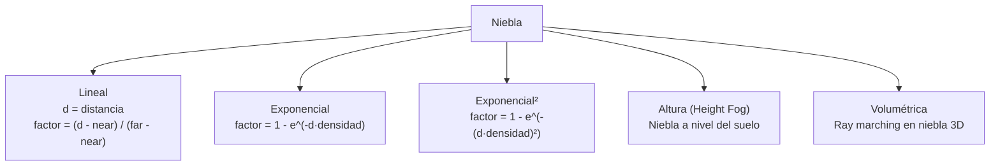

### 4.2. Fórmulas

```
// Niebla lineal
float fogFactor = (viewDistance - fogStart) / (fogEnd - fogStart);
fogFactor = clamp(fogFactor, 0.0, 1.0);
finalColor = mix(sceneColor, fogColor, fogFactor);

// Niebla exponencial
float fogFactor = 1.0 - exp(-density * viewDistance);
finalColor = mix(sceneColor, fogColor, fogFactor);

// Niebla exponencial² (más realista)
float fogFactor = 1.0 - exp(-pow(density * viewDistance, 2));
finalColor = mix(sceneColor, fogColor, fogFactor);
```

### 4.3. Height Fog (Niebla por altura)


```
// Height fog: niebla que aumenta cerca del suelo
float heightFactor = exp(-falloff * max(0.0, fogHeight - worldPos.y));
float fogAmount = fogDensity * viewDistance * heightFactor;
```

### 4.4. Niebla como optimización

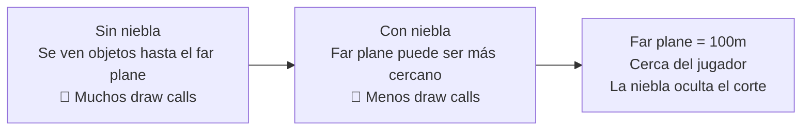

---

## 5. Jerarquía completa de visibilidad

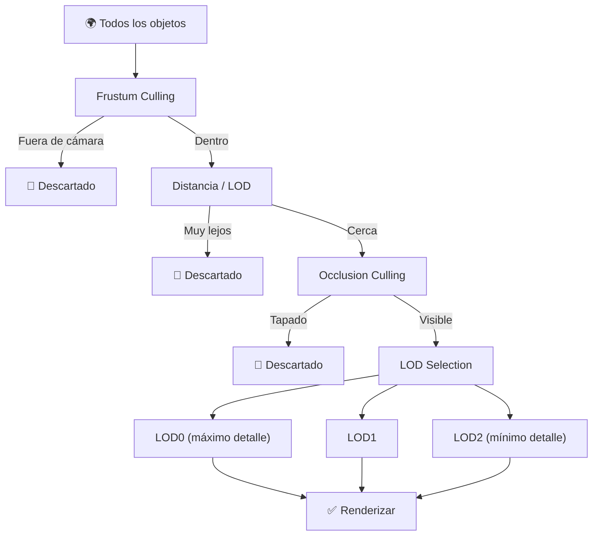

### Orden de ejecución (recomendado)

```
Por cada frame:
  1. Frustum Culling      → descarta 50-70% (rápido, CPU)
  2. Distance Culling     → descarta objetos lejanos
  3. Occlusion Culling    → descorta objetos tapados (más caro)
  4. LOD Selection        → elegir nivel de detalle
  5. Shadow Culling       → qué objetos al shadow map
  6. Light Culling        → qué luces afectan a qué
  7. Enviar draw calls a GPU
```

> 💡 **Regla de oro:** No renderices lo que no se ve. Empieza con Frustum Culling (es gratis y descarta la mitad), añade occlusion culling para interiores/urbanas, y usa niebla para disimular el pop-in de objetos lejanos.
