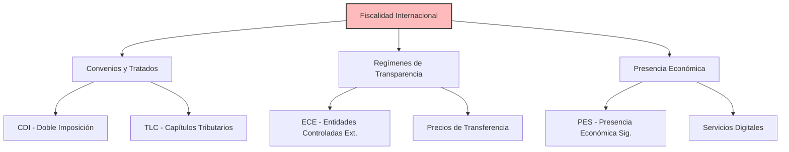

# 🌎 Fiscalidad Internacional (Colombia)
> **TL;DR:** Marco normativo sobre la tributación de rentas extranjeras, convenios de doble imposición y regímenes de transparencia fiscal internacional.

## ## Resumen Ejecutivo y Contexto
La fiscalidad internacional regula la forma en que los residentes en Colombia tributan por sus rentas de fuente extranjera y cómo los no residentes tributan por sus rentas de fuente nacional. Se enfoca en evitar la doble imposición y el abuso de tratados.

## ## Estructura de Fiscalidad Internacional

## ## Marco Legal y Normativo
- **Estatuto Tributario (Art. 24, 25, 26, 260-1 a 260-11):** Normas sobre fuente de renta y precios de transferencia.
- **Ley 1607 de 2012:** Introdujo normas antielusión internacional.
- **Convenios de Doble Imposición (CDI):** Tratados firmados por Colombia con países como España, Chile, Suiza, México, etc.
- **Modelo de Convenio de la OCDE:** Base técnica para la mayoría de los CDI de Colombia.

## ## Conceptos Clave

### ### 1. Convenios de Doble Imposición (CDI)
Buscan que una misma renta no sea gravada por dos estados. Colombia aplica el principio de renta mundial para sus residentes.

### ### 2. Entidades Controladas del Exterior (ECE)
Régimen que obliga a declarar rentas pasivas obtenidas a través de entidades en el exterior para evitar el diferimiento del impuesto.
- **Ley:** Art. 822 a 833 del Estatuto Tributario.

### ### 3. Presencia Económica Significativa (PES)
Nueva figura que grava a empresas del exterior que venden bienes o servicios digitales en Colombia sin tener presencia física.
- **Ley:** Art. 20-3 del Estatuto Tributario (Ley 2277 de 2022).

---
*Documento optimizado para consulta técnica y RAG.*
