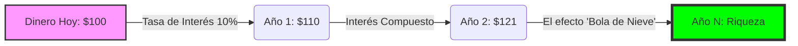
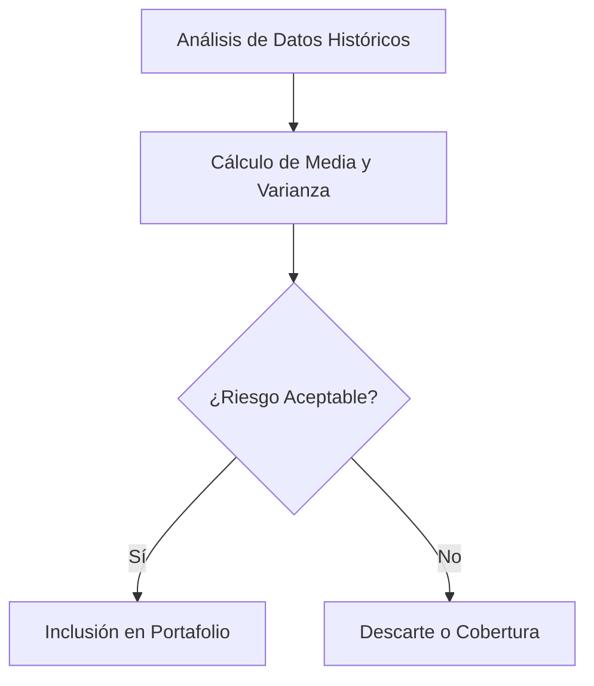
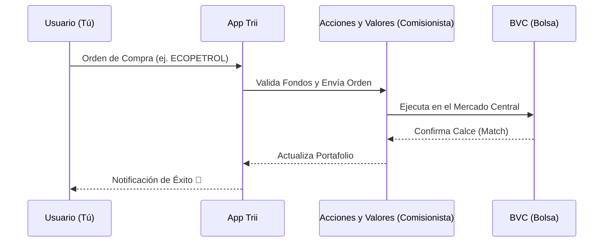

# 🧱 Nivel 1: Cimientos (The Groundwork)

Bienvenido al primer escalón de tu carrera como Gestor de Portafolios. Antes de elegir acciones o programar bots, debemos entender las "reglas físicas" del dinero.

---

## 1. Valor del Dinero en el Tiempo (TVM) ⏳
El concepto más importante: **Un peso hoy vale más que un peso mañana.** ¿Por qué? Por el *Costo de Oportunidad* y la capacidad de generar intereses.

### Componentes Clave:
- **PV (Present Value):** Lo que tienes hoy.
- **FV (Future Value):** Lo que tendrás después de un tiempo.
- **i (Interest Rate):** Tu tasa de crecimiento o "alquiler" del dinero.
- **n (Periods):** El tiempo que dejas trabajar al dinero.

### Visualización del TVM:

> **Regla de Oro:** El interés compuesto es la octava maravilla del mundo. Quien lo entiende, lo gana; quien no, lo paga.

---

## 2. Estadística para Finanzas 📊
Como gestor, no predices el futuro, **gestionas probabilidades.** La estadística es tu brújula para medir el **Riesgo**.

| Concepto | Uso en Portafolios |
| :--- | :--- |
| **Media (Promedio)** | El retorno esperado de un activo. |
| **Desviación Estándar** | La "Volatilidad" o qué tanto se aleja el precio de su promedio. |
| **Correlación** | ¿Se mueven dos activos juntos? (Clave para la diversificación). |

### El Ciclo del Riesgo:

---

## 3. Mercado Local: BVC y Trii 🇨🇴
Para un gestor en Colombia, la **Bolsa de Valores de Colombia (BVC)** es el patio de juegos principal.

### El Ecosistema:
1. **Emisores:** Empresas que necesitan capital (Ecopetrol, Bancolombia, GEB).
2. **Inversionistas:** Tú, buscando rentabilidad.
3. **Intermediarios (SCB):** Comisionistas de bolsa. Aquí entra **Trii**, que democratiza el acceso permitiéndote comprar desde tu celular sin los montos mínimos prohibitivos de antes.

### Cómo fluye una orden en Trii:

---

## 🛠️ Próximos Pasos
Una vez domines estos conceptos, estarás listo para el **Nivel 2**, donde aprenderás a valorar si el precio de esa acción en Trii es "barato" o "caro" usando análisis fundamental.

**Recursos relacionados:**
- [[03_Recursos/finanzas/portafolio|Resumen de mi Portafolio Actual]]
- [[02_Areas/finanzas/cdts|Renta Fija Local (CDTs)]]
- [[portafolio]] #extra 
- [[nivel-2-analisis-y-valoración]] #siguiente 
