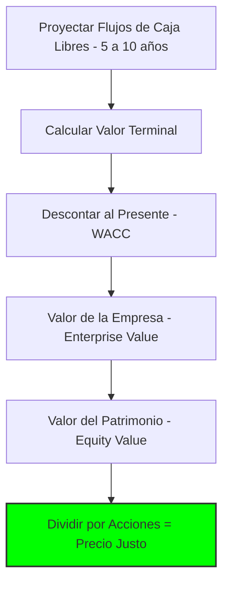
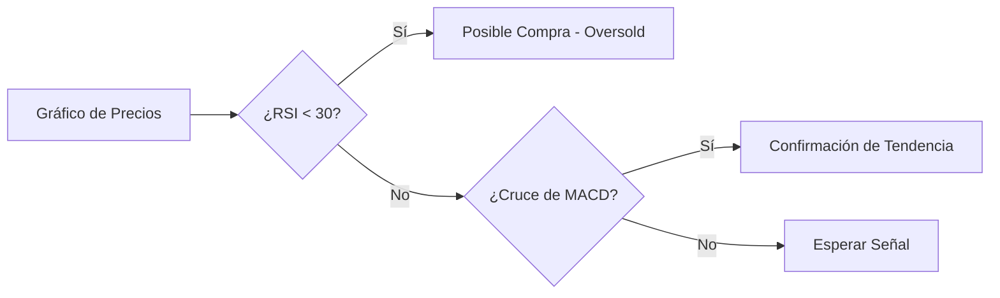

# 🔍 Nivel 2: Análisis y Valoración

Ahora que entiendes cómo se mueve el dinero en el tiempo (Nivel 1), es hora de responder la pregunta del millón: **¿Cuánto vale realmente este activo?**

---

## 1. Análisis Fundamental: El "Valor Intrínseco" 🏢
El análisis fundamental busca determinar el valor real de una empresa estudiando sus finanzas.

### A. Flujo de Caja Descontado (DCF)
Es el método "Rey". Consiste en proyectar cuánto dinero ganará la empresa en el futuro y traer ese dinero al presente usando una tasa de descuento.



### B. Valoración por Múltiplos
Compara a la empresa con sus "vecinos" (competidores).
- **P/E (Price to Earnings):** ¿Cuántos años de utilidades estoy pagando hoy?
- **EV/EBITDA:** Mide la capacidad operativa para generar caja.

---

## 2. Análisis Técnico: El "Sentimiento del Mercado" 📈
Mientras el fundamental mira el *por qué*, el técnico mira el *cuándo*. Se basa en que el precio ya descuenta toda la información y que los humanos repetimos patrones.

### Indicadores Clave:
- **RSI (Relative Strength Index):** Mide si un activo está "sobrecomprado" (>70) o "sobrevendido" (<30).
- **MACD:** Identifica cambios en la tendencia y el momentum.

### Lógica de Decisión Técnica:


---

## 3. Python: Tu Superpoder de Extracción 🐍
Como gestor moderno, no copias y pegas datos de Excel. Usas código para automatizar la recolección de datos masivos.

### Ejemplo de Flujo en Python (yfinance):
```python
import yfinance as yf

# 1. Definir el activo (ej: Apple)
ticker = "AAPL"

# 2. Descargar datos históricos de 1 año
data = yf.download(ticker, period="1y")

# 3. Calcular un indicador simple (Media Móvil)
data['MA20'] = data['Close'].rolling(window=20).mean()

print(f"Último precio de {ticker}: {data['Close'][-1]}")
```

> **Tip de Pro:** Python te permite analizar 100 empresas en el mismo tiempo que un analista tradicional analiza una sola.

---

## 🛠️ Próximos Pasos
Con el análisis fundamental y técnico dominados, el siguiente paso es el **Nivel 3**, donde aprenderás a combinar múltiples activos para crear un **Portafolio Diversificado** que maximice el retorno minimizando el riesgo.

**Recursos relacionados:**
- [[03_Recursos/finanzas/eficiencia-indicadores-tecnicos|Guía Profunda de Indicadores]]
- [[02_Areas/finanzas/analisis-empresarial-y-mercado|Plantilla de Análisis de Empresas]]
- [[01-roadmaps/gestor-portafolio/nivel-1-cimientos|nivel-1-cimientos]] #anterior 
- [[eficiencia-indicadores-tecnicos]] #extra 
- [[nivel-3-construccion-de-portafolio]] #siguiente 
