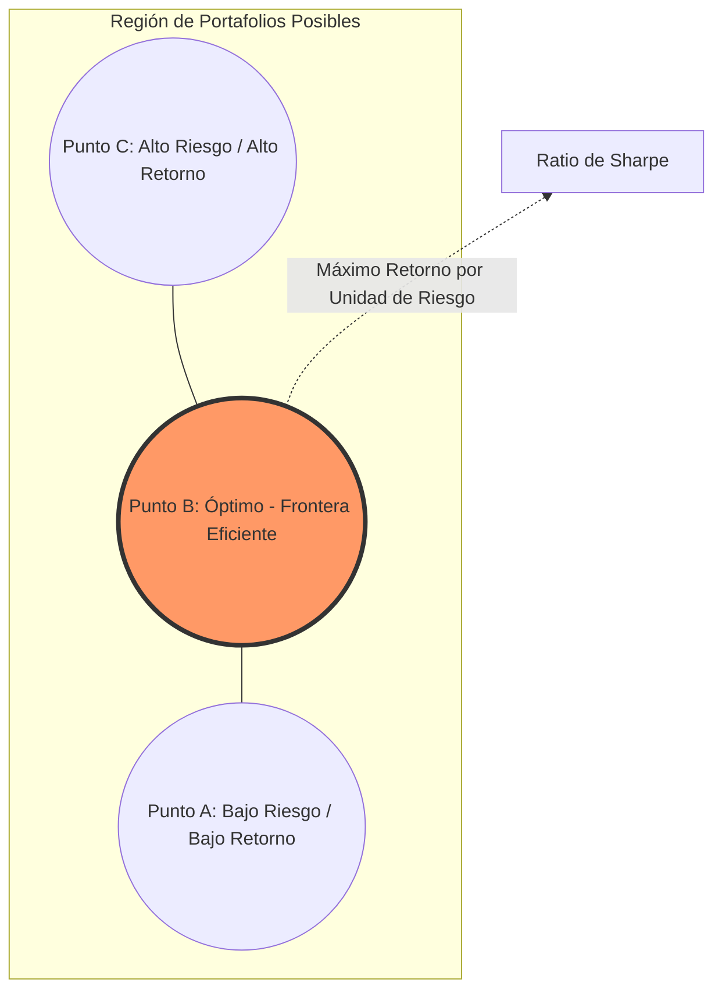
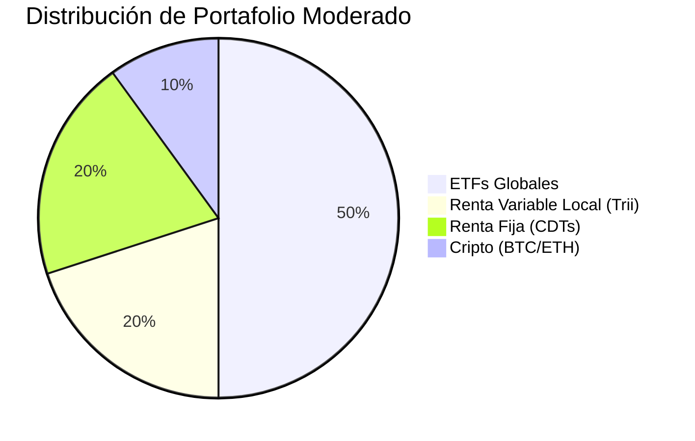
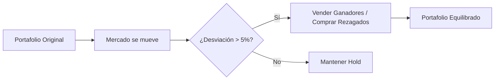

# 🏗️ Nivel 3: Construcción de Portafolio

Ya sabes analizar activos individuales (Nivel 2). Ahora aprenderás el "Arte de la Mezcla": cómo combinar activos para que el portafolio sea más fuerte que la suma de sus partes.

---

## 1. Teoría Moderna de Portafolio (Markowitz) 📐
Harry Markowitz demostró que no importa tanto el riesgo de un activo solo, sino cómo ese activo **contribuye al riesgo total** del grupo.

### La Frontera Eficiente
Es el conjunto de portafolios que ofrecen el mayor retorno esperado para un nivel de riesgo determinado.

> **Lección Clave:** La diversificación es el único "almuerzo gratis" en finanzas; reduce el riesgo sin necesariamente sacrificar el retorno.

---

## 2. Asset Allocation: El "Mix" de Activos 🍎🥦
El 90% de la variabilidad de tus retornos vendrá de tu **Asignación de Activos**, no de elegir la acción individual perfecta.

### Tu menú de instrumentos:
- **ETFs (Exchanged Traded Funds):** Canastas diversificadas globales (ej: `IWVL`, `VTI`).
- **FICs (Fondos de Inversión Colectiva):** Gestión profesional local para diversificar en Colombia.
- **Criptoactivos:** "Oro Digital" o activos de alta beta para potenciar el crecimiento (con alta volatilidad).
- **Renta Fija:** El ancla del portafolio (CDTs, Bonos).

### Ejemplo de Pesos (Asset Weights):

---

## 3. Rebalanceo: Manteniendo el Rumbo 🧭
Con el tiempo, los activos que suben mucho de precio pesarán más de lo que planeaste originalmente, exponiéndote a más riesgo.

### El Proceso de Rebalanceo:
1. **Definir Pesos Objetivo:** (Ej: 60% Acciones / 40% Bonos).
2. **Monitorear Deriva (Drift):** Si las acciones suben al 70%.
3. **Ejecutar:** Vender el 10% de lo que subió y comprar lo que bajó (Vender caro, Comprar barato).

---

## 🛠️ Próximos Pasos
Una vez que tengas tu portafolio construido, entraremos al **Nivel 4**, donde aprenderás a protegerlo. Veremos cómo medir el impacto de crisis financieras y cómo la **ética y la fiscalidad** juegan un rol crucial en la supervivencia a largo plazo.

**Recursos relacionados:**
- [[02_Areas/finanzas/resumen-reglamento-fic-potencial-usa|Estudio de Caso: FIC USA]]
- [[03_Recursos/finanzas/portafolio|Ver mis Pesos Actuales]]
- [[nivel-2-analisis-y-valoración]] #anterior 
- [[resumen-reglamento-fic-potencial-usa]] #extra 
- [[nivel-4-riesgo-y-etica]] #siguiente 
