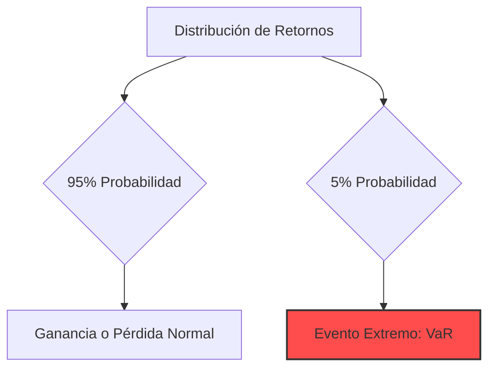
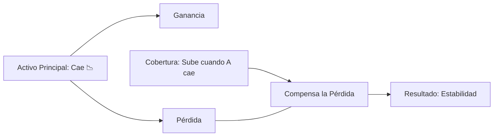

# 🛡️ Nivel 4: Riesgo y Ética

En los niveles anteriores aprendiste a ganar dinero. En este nivel aprenderás a **no perderlo** y a cumplir con tus responsabilidades legales. Un buen gestor no es el que más gana en un mercado alcista, sino el que sobrevive a un mercado bajista.

---

## 1. Métricas de Riesgo: Midiendo el Peligro 📏
No puedes gestionar lo que no puedes medir. Estas herramientas te dicen qué tan "seguro" es tu portafolio.

### A. Value at Risk (VaR)
Responde a la pregunta: *¿Cuánto es lo máximo que puedo perder en un día con un 95% de confianza?*

### B. Sharpe Ratio
Mide el retorno extra que recibes por cada unidad de riesgo que asumes.
- **Sharpe > 1:** Bueno.
- **Sharpe > 2:** Excelente.
- **Sharpe < 1:** Estás asumiendo demasiado riesgo para el poco premio que recibes.

---

## 2. Coberturas (Hedging): Tu Seguro de Vida ☂️
El Hedging consiste en tomar una posición que compense las posibles pérdidas de otra.

### Ejemplo Clásico:
Tienes acciones de Ecopetrol en Trii (Posición Larga), pero temes que el precio del petróleo caiga.
- **Estrategia:** Compras una opción de "Venta" (Put) o inviertes en un activo que suba cuando el petróleo baje (Correlación Inversa).

---

## 3. Fiscalidad y DIAN 📜
Ser un gestor profesional implica ser un ciudadano responsable. En Colombia, tus inversiones tienen impactos tributarios.

| Concepto | Impacto en Colombia (DIAN) |
| :--- | :--- |
| **Dividendos** | Tienen una retención en la fuente (aprox. 15% para residentes). |
| **Ganancia de Capital** | Se paga sobre la utilidad al vender el activo. |
| **Declaración de Activos** | Debes reportar tus inversiones en el exterior (ej: XTB, Interactive Brokers). |

> **Ética Profesional:** La manipulación de mercado (pump & dump) o el uso de información privilegiada no solo son ilegales, sino que destruyen la confianza en el sistema financiero.

---

## 🛠️ Próximos Pasos
Ahora que sabes proteger tu capital, estás listo para el nivel final: **Nivel 5: Especialización y IA**. Allí es donde llevaremos todo este conocimiento al siguiente nivel usando algoritmos que tomen estas decisiones de riesgo por ti.

**Recursos relacionados:**
- [[03_Recursos/finanzas/fiscalidad-internacional-colombia|Detalle de Impuestos en Exterior]]
- [[03_Recursos/finanzas/impuestos-nacionales-dian|Calendario Tributario]]
- [[nivel-3-construccion-de-portafolio]] #anterior 
- [[fiscalidad-internacional-colombia]] #extra 
- [[nivel-5-especializacion-ia]] #siguiente 
