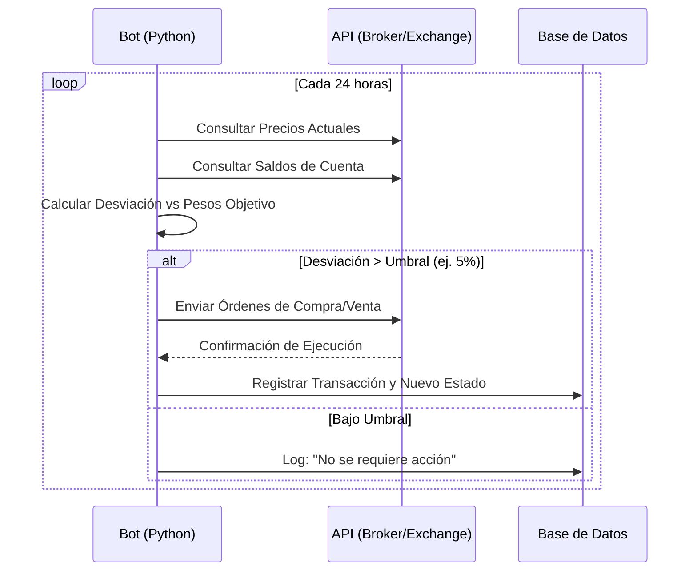
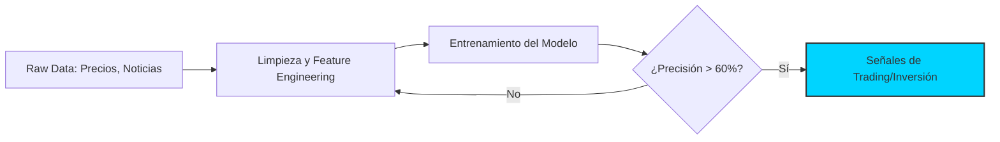

# 🚀 Nivel 5: Especialización e IA

Has llegado a la frontera del conocimiento. En este nivel, dejamos de usar herramientas manuales para construir **sistemas inteligentes**. Aquí es donde la ingeniería de software y las finanzas se fusionan para crear una ventaja competitiva (Alpha).

---

## 1. Automatización de Rebalanceo (Python) 🤖
Un gestor humano se cansa y tiene sesgos. Un bot de rebalanceo ejecuta la estrategia 24/7 sin emociones.

### Flujo Lógico de un Bot de Rebalanceo:

---

## 2. Modelos de IA Predictivos 🧠
La IA no adivina el futuro, pero identifica patrones que el ojo humano ignora.

### Áreas de Aplicación:
- **Análisis de Sentimiento (NLP):** Procesar miles de noticias y tweets para medir si el mercado está eufórico o aterrorizado.
- **Series Temporales (LSTM/Prophet):** Predecir tendencias basadas en datos históricos.
- **Detección de Anomalías:** Identificar comportamientos inusuales que preceden a una caída del mercado.

### Pipeline de IA en Finanzas:

---

## 3. Certificaciones de Élite: CFA y FRM 🏆
Para gestionar capital institucional (fondos de pensiones, soberanos), necesitas las "credenciales de oro".

| Certificación | Enfoque Principal | Reconocimiento |
| :--- | :--- | :--- |
| **CFA (Chartered Financial Analyst)** | Gestión de inversiones, ética y valoración de activos. | El estándar global más prestigioso. |
| **FRM (Financial Risk Manager)** | Gestión de riesgos financieros y derivados complejos. | Ideal para bancos y Hedge Funds. |

---

## 🏁 Fin del Roadmap: El Gestor del Futuro
Al completar este nivel, ya no eres solo un inversionista; eres un **Arquitecto Financiero**. Tienes la base teórica (Nivel 1), la capacidad analítica (Nivel 2), la visión estratégica (Nivel 3), la disciplina de riesgo (Nivel 4) y el poder tecnológico (Nivel 5).

**Recursos de cierre:**
- [[02_Areas/finanzas/propuestas_automatizacion_ia|Mis Ideas de Automatización]]
- [[03_Recursos/ia-y-agentes/indice-desarrollo-ia|MOC: Desarrollo de IA]]
- [[nivel-4-riesgo-y-etica]] #anterior 
- [[propuestas_automatizacion_ia]] #estra

---
*Felicidades por completar el diseño de tu Roadmap. La ejecución comienza hoy.*
