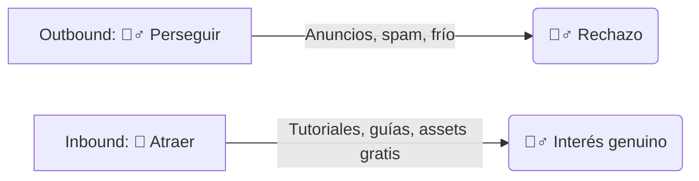
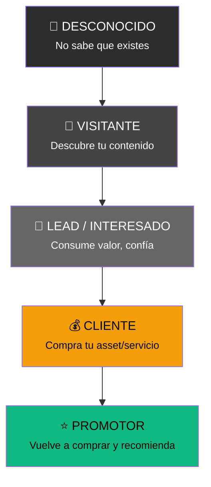
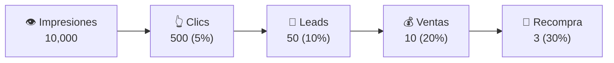
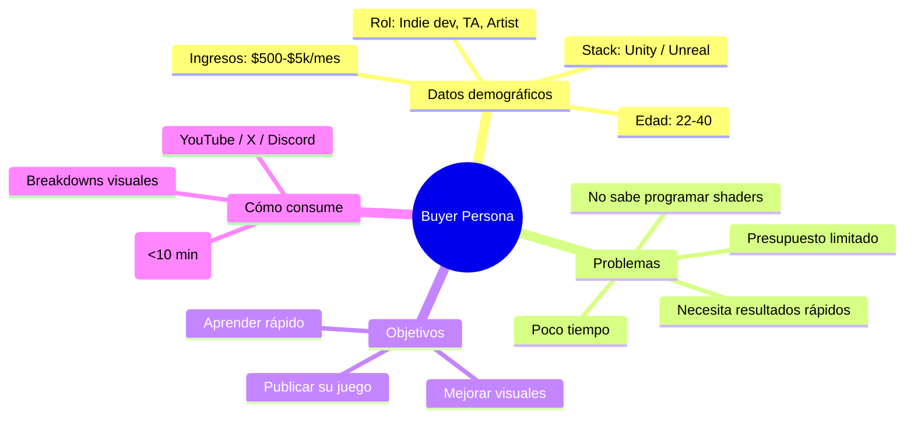
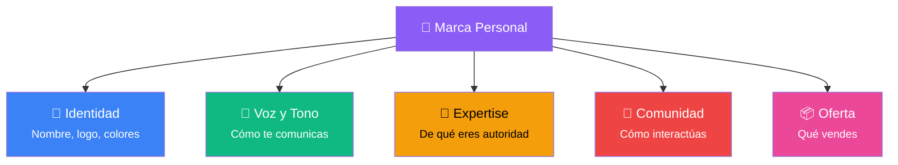

# 🚩 Fase 1: Fundamentos y Estrategia de Marketing

> **🎯 Objetivo:** Entender cómo piensa un marketer y construir los cimientos estratégicos antes de crear cualquier contenido.

---

## 1. 🧠 Mentalidad Inbound: Atraer vs Perseguir

### El problema del "marketing tradicional"

El marketing clásico (Outbound) interrumpe: llamadas en frío, anuncios intrusivos, spam. La gente lo ignora o lo bloquea.

El **Inbound Marketing** da la vuelta a la tortilla: **creas valor para que ellos vengan a ti**.



### ¿Por qué Inbound funciona para Technical Artists?

| Outbound (❌) | Inbound (✅) |
|---|---|
| "COMPRA MI SHADER" | "Aprende a hacer este shader (y si quieres, cómpralo)" |
| Email masivo a estudios | Tutorial en YouTube que un indie dev encuentra buscando |
| Banner publicitario | Post en X/Twitter con un breakdown visual impactante |

> **💡 Principio clave:** *"La gente no quiere que le vendan, quiere aprender, resolver problemas y crear cosas increíbles. Si les ayudas, te comprarán."*

### La regla 80/20 del contenido

```
  80% del contenido → VALOR PURO (tutoriales, tips, breakdowns)
  20% del contenido → PROMOCIÓN SUTIL ("esto lo conseguí con mi tool")
```

---

## 2. 🔄 El Funnel de Ventas: De desconocido a cliente fiel

El **funnel (embudo)** describe el viaje mental de una persona desde que no sabe que existes hasta que te compra y te recomienda.



### Las 3 etapas clave del funnel

| Etapa | ¿Qué busca el usuario? | ¿Qué haces tú? | Ejemplo para Tech Artist |
|---|---|---|---|
| **TOFU** (Top of Funnel) | Inspiración, aprender | Atraer con valor gratuito | "Cómo hacer un dissolve shader en 5 min" (blog/video) |
| **MOFU** (Middle of Funnel) | Soluciones específicas | Educar y generar confianza | Comparativa: "Mi tool vs hacerlo manual" |
| **BOFU** (Bottom of Funnel) | Comprar | Convertir con oferta clara | "Cómpralo en Gumroad con 20% OFF esta semana" |

> **📐 Ejemplo práctico:** Un indie dev busca "cómo hacer nieve dinámica en Unity". Encuentra tu tutorial (TOFU), se suscribe a tu newsletter (MOFU), y al mes compra tu shader de nieve (BOFU).

### Métricas del funnel



> Cada cifra es un **cuello de botella**. Si tienes 10,000 impresiones pero 0 ventas, el problema está en MOFU o BOFU.

---

## 3. 👤 Buyer Persona: Define tu nicho

Un **Buyer Persona** es un arquetipo semificticio de tu cliente ideal. No es "todo el mundo" — es **alguien muy concreto**.



### Ejemplo: Buyer Persona para Tech Artist

> **🎮 "Diego, el Indie Dev"**
> - **Edad:** 28 años
> - **Rol:** Desarrollador indie en solitario
> - **Stack:** Unity + Blender
> - **Dolor principal:** Sus juegos se ven genéricos, no sabe programar shaders y gasta horas en efectos que podría comprar por $10
> - **Objetivo:** Publicar su primer juego en Steam con visuals competitivos
> - **Dónde pasa el tiempo:** X/Twitter, Reddit (r/Unity3D), YouTube tutorials
> - **Lenguaje:** "Necesito que se vea AAA sin ser AAA"

> **💼 "Laura, la Lead Artist"**
> - **Edad:** 35 años
> - **Rol:** Technical Artist en estudio mediano
> - **Stack:** Unreal Engine 5 + Houdini
> - **Dolor principal:** Su equipo es lindo optimizando assets, necesita herramientas de pipeline
> - **Objetivo:** Reducir tiempos de producción en un 30%
> - **Dónde pasa el tiempo:** LinkedIn, Polycount, ArtStation

### Ejercicio práctico

Define TU buyer persona respondiendo:

1. ¿Qué **cargo/título** tiene?
2. ¿Cuál es su **mayor frustración** diaria?
3. ¿Qué **solución** le ofreces?
4. ¿Dónde **pasa el tiempo** online?
5. ¿Qué **lenguaje** usa? (técnico, casual, ejecutivo...)

---

## 4. 🎨 Marca Personal: Coherencia ante todo

Tu marca personal es **lo que la gente dice de ti cuando no estás presente**. Como Technical Artist, tu marca es una mezcla de:

- **Habilidades técnicas:** Shaders, tools, pipelines
- **Estilo visual:** Tu firma estética
- **Voz (tone of voice):** ¿Eres técnico? ¿Divertido? ¿Directo?
- **Propuesta de valor:** ¿Qué obtiene alguien que te sigue?

### Los 5 pilares de una marca personal sólida



### Coherencia visual (cheat sheet)

| Elemento | Recomendación |
|---|---|
| **Colores** | 2-3 colores fijos en logo, banner, thumbnails |
| **Tipografía** | 1 fuente para títulos + 1 para cuerpo |
| **Thumbnails** | Misma plantilla/template siempre |
| **Foto de perfil** | La misma en todas las plataformas |
| **Bio** | Mismo mensaje adaptado a cada red |

### Tu "Elevator Pitch"

En 1 frase: **"Ayudo a [buyer persona] a [solución] mediante [tu expertise]"**

> *Ejemplo: "Ayudo a indie devs a darle vida a sus juegos con shaders listos para usar, sin programar una línea de código."*

---

## 📋 Checklist de la Fase 1

Antes de pasar a la Fase 2, asegúrate de tener esto claro:

- [ ] Entiendo la diferencia entre Inbound y Outbound
- [ ] Tengo definido mi buyer persona (nombre, dolor, solución)
- [ ] Conozco las 3 etapas del funnel (TOFU, MOFU, BOFU)
- [ ] He definido mi marca personal: colores, tono, expertise
- [ ] Tengo un elevator pitch de 1 frase
- [ ] Sé dónde pasa el tiempo mi audiencia objetivo

---

## 📚 Recursos adicionales

- [[guia-marca-personal]] — Guía detallada de marca personal
- [HubSpot: Inbound Marketing](https://www.hubspot.com/inbound-marketing)
- "They Ask, You Answer" — Marcus Sheridan (libro)

---

> **⬅️ Fase 1 completa | [[fase-2-contenido-y-seo-marketing]] #siguiente →**
