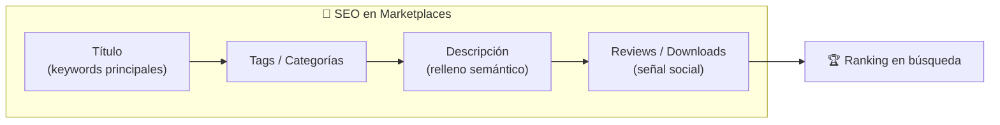
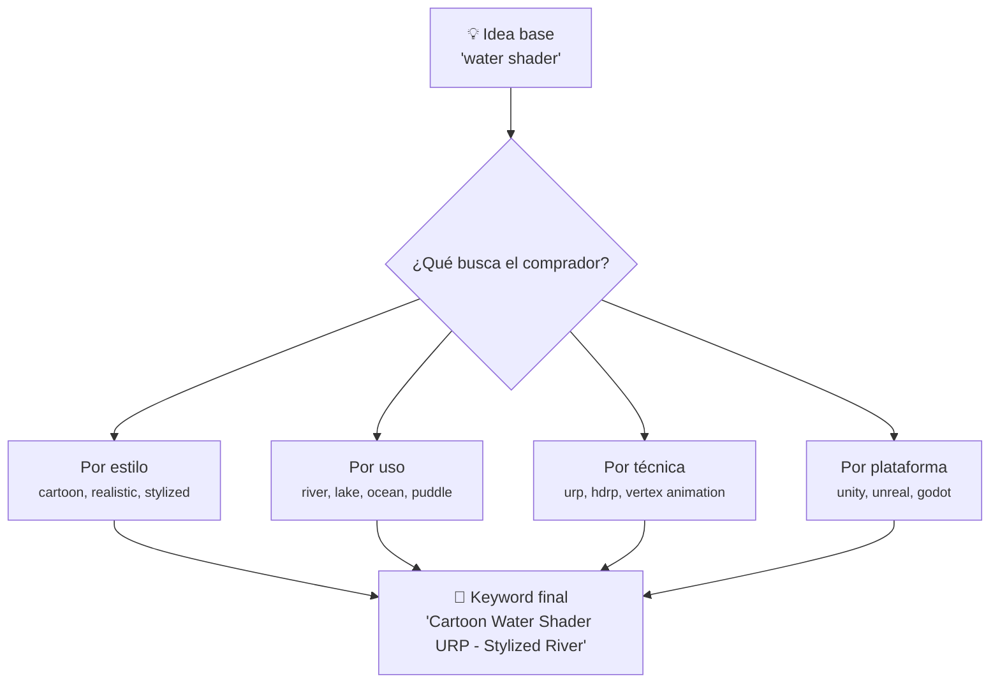
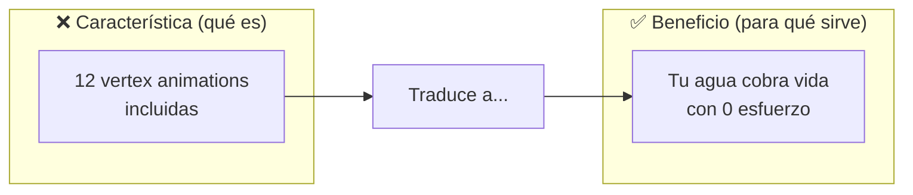
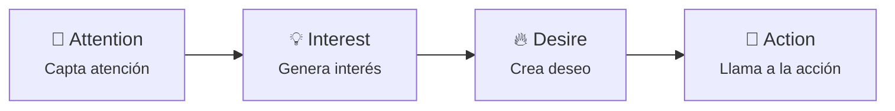
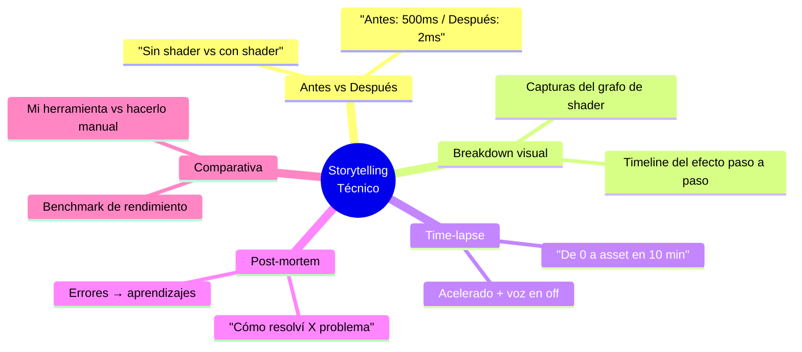

# 📝 Fase 2: Contenido y SEO

> **🎯 Objetivo:** Crear contenido que atraiga a tu buyer persona y sea encontrable en buscadores y marketplaces.

---

## 1. 🔍 SEO para Marketplaces: Fab, Gumroad e Itch.io

El SEO en marketplaces funciona diferente a Google. Aquí compites en **plataformas cerradas** donde cada tienda tiene su propio algoritmo.



### Anatomía de un listing optimizado

```
┌─────────────────────────────────────────────────────┐
│  🏆 TÍTULO (máximo 60 caracteres)                   │
│  "Cartoon Water Shader URP | Stylized River & Lake" │
├─────────────────────────────────────────────────────┤
│  🏷️ TAGS (usa TODOS los disponibles)                │
│  water, shader, cartoon, stylized, urp, river, lake │
│  vertex animation, toon, environment, vfx           │
├─────────────────────────────────────────────────────┤
│  📝 DESCRIPCIÓN (primeras 150 líneas = crítica)     │
│  [SEO text + beneficios + technical specs]          │
├─────────────────────────────────────────────────────┤
│  📸 IMÁGENES y VIDEO (primer slide = portada)       │
│  ---                                                │
└─────────────────────────────────────────────────────┘
```

### Estrategia de keywords para assets



> **📐 Ejemplo práctico:**
> - ❌ Título malo: "My Cool Water Shader"
> - ✅ Título bueno: "Stylized Water Shader URP | Toon River & Lake | Unity"
> - ❌ Tags malos: "water", "cool", "shader"
> - ✅ Tags buenos: "water", "shader", "cartoon", "urp", "unity", "river", "stylized", "toon", "lake", "vfx"

### SEO diferencial por plataforma

| Plataforma | Clave de ranking | Estrategia |
|---|---|---|
| **Fab (Unity)** | Tags exactos + descripción larga | Usa todos los tags, sé específico en specs técnicas |
| **Gumroad** | Descripción + previews + reviews | Buena descripción + enlaces externos + testimonios |
| **Itch.io** | Tags + comunidad + precio bajo | Tags comunitarios, bundles, "pay what you want" |

---

## 2. ✍️ Copywriting: Escribir descripciones que vendan beneficios

### Características vs Beneficios



| Característica | → | Beneficio |
|---|---|---|
| "Soporta URP y HDRP" | → | "Funciona en cualquier proyecto Unity sin configurar" |
| "8 variaciones de color" | → | "Encuentra el tono perfecto en segundos" |
| "Optimizado para mobile" | → | "Corre a 60fps hasta en smartphones" |
| "Código comentado" | → | "Modifícalo sin romper nada" |

### La fórmula AIDA para descripciones



**Ejemplo AIDA para un shader de agua:**

> 🎯 **Attention:** "Dale vida a tus ríos y lagos con un solo clic."
>
> 💡 **Interest:** "Este shader URP incluye 12 animaciones pre-hechas, reflejos dinámicos y profundidad渐变. No necesitas ser programador."
>
> 🔥 **Desire:** "Imagina a los jugadores sumergiéndose en un mundo acuático que se siente vivo. Con actualizaciones gratuitas de por vida."
>
> 🚀 **Action:** "Descárgalo ahora y úsalo en tu proyecto hoy. Satisfaction guaranteed o te devolvemos tu dinero."

### Plantilla de descripción para Gumroad/Fab

```
# 🏆 [TÍTULO DEL ASSET]

## 📖 ¿Qué es?
[1-2 líneas explicando el asset y su propósito]

## ✨ ¿Por qué lo necesitas?
- [Beneficio 1]: [explicación breve]
- [Beneficio 2]: [explicación breve]
- [Beneficio 3]: [explicación breve]

## 🛠️ Technical Specs
- Plataforma: Unity 2022+ / URP / HDRP
- Formato: .unitypackage
- Versión: 1.0
- Documentación: incluida
- Soporte: vía Discord / email

## 📸 Previews
[gallery de imágenes + video demostrativo]

## 💬 Testimonios
"Ha sido un salvavidas para mi juego" — @indie_dev

## 📦 What's included
- 12 vertex animations
- 8 color presets
- Demo scene
- Full C# source

## 🚀 ¡Cómpralo ahora!
[Botón de compra]
```

---

## 3. 📖 Storytelling Técnico: Narrar el "cómo se hizo"

Los Technical Artists tienen una ventaja única: **tu proceso es contenido**. La gente ama ver breakdowns técnicos porque:

1. **Aprenden** — descubren técnicas nuevas
2. **Confían** — ven que sabes lo que haces
3. **Se inspiran** — quieren hacer algo similar

### Formatos de storytelling técnico



### Estructura de un buen breakdown

```
1️⃣  EL PROBLEMA
    "Los árboles de mi juego se veían planos..."

2️⃣  LA SOLUCIÓN (técnica)
    "Usé vertex animation + noise distortion..."

3️⃣  EL RESULTADO (visual + data)
    [GIF comparativo antes/después]
    "Pasamos de 15ms a 3ms por draw call"

4️⃣  EL ASSET (CTA suave)
    "Este shader está disponible en Gumroad si quieres usarlo"
```

> **💡 Tip:** No des todo el código gratis. Enseña el **concepto**, pero la **implementación pulida** es tu producto.

---

## 4. 🎬 Video Marketing: Showcases rápidos

El video es el formato que más convierte en marketplaces. Un buen showcase:

### Tipos de video para assets

| Tipo | Duración | Plataforma | Objetivo |
|---|---|---|---|
| **Showcase rápido** | 15-30s | X / TikTok / YouTube Shorts | Captar atención |
| **Tutorial breakdown** | 3-10 min | YouTube | Enseñar + generar confianza |
| **Comparison reel** | 30-60s | Gumroad / Fab | Mostrar valor vs default |
| **Live coding** | 10-30 min | Twitch / YouTube | Comunidad + autoridad |

### Guión para un showcase de 30 segundos

```
⏱️ 0:00 - 0:05 → Hook visual impactante
   "Mira cómo transformamos este bosque..."

⏱️ 0:05 - 0:20 → Demostración
   [Mostrar el shader/asset en acción desde varios ángulos]

⏱️ 0:20 - 0:25 → Dato técnico rápido
   "Optimizado para mobile, 60fps asegurados"

⏱️ 0:25 - 0:30 → CTA
   "Link en bio / disponible en Gumroad"
```

### Checklist para video de asset

- [ ] **Hook** en los primeros 3 segundos
- [ ] **Luz buena** (no grabes en habitación oscura)
- [ ] **Música** libre de derechos
- [ ] **Texto superpuesto** para quien ve sin sonido
- [ ] **CTA claro** al final
- [ ] **Link** en descripción / bio
- [ ] **Thumbnail** llamativo (misma plantilla de marca)

> **📱 Para X/Twitter:** Los videos de assets con before/after en bucle vertical (9:16) son los que más engagement generan.

---

## 📋 Checklist de la Fase 2

- [ ] Tengo optimizados los títulos y tags de mis assets en Fab/Gumroad/Itch
- [ ] Mis descripciones usan la fórmula AIDA (Attention → Interest → Desire → Action)
- [ ] He traducido características técnicas a beneficios para el comprador
- [ ] Tengo al menos 1 breakdown técnico publicado
- [ ] He creado un showcase en video de 30s de mi asset estrella
- [ ] Uso la misma plantilla visual para thumbnails

---

## 📚 Recursos adicionales

- [Google Keyword Planner](https://ads.google.com/home/tools/keyword-planner/) — Para investigar keywords
- [AnswerThePublic](https://answerthepublic.com/) — Preguntas reales de usuarios
- [Canva](https://canva.com/) — Thumbnails rápidos con plantillas

---

> **⬅️ [[fase-1-fundamentos-y-estrategia-marketing]] #anterior  | Fase 2 completa [[fase-3-redes-sociales-y-automatizacion-marketing]] #siguiente  →**
