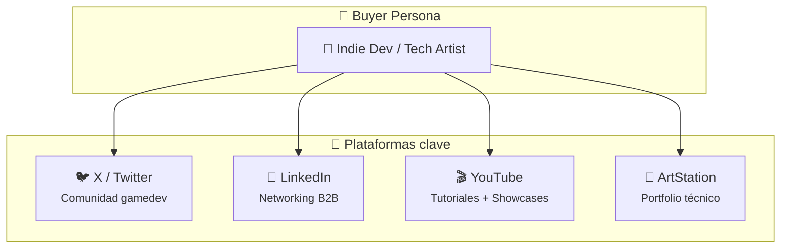
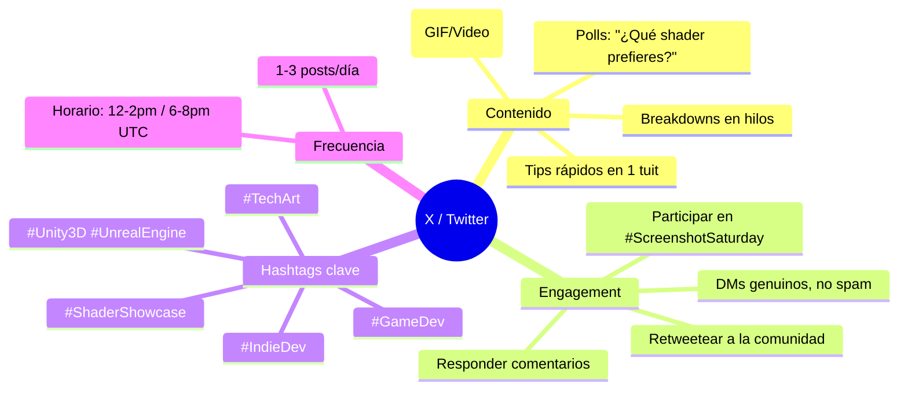
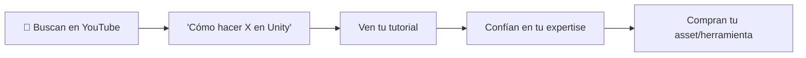
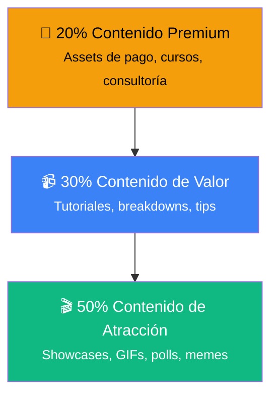
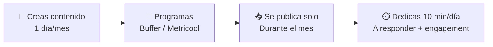
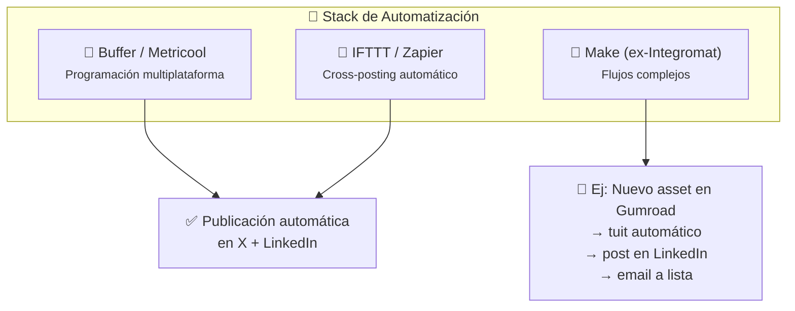

# 🤖 Fase 3: Redes Sociales y Automatización

> **🎯 Objetivo:** Construir presencia en las redes correctas sin quemarte, usando automatización para escalar.

---

## 1. 🧭 Estrategia por Plataforma

No necesitas estar en todas partes. Necesitas estar **donde está tu buyer persona**.



### X / Twitter: El hub de la comunidad gamedev



**Ejemplo de hilo viral en X:**

```
🧵 1/5: "Cómo hacer un shader de disolución en Unity en 5 minutos"

[pantallazo del efecto]

2/5: El truco está en usar noise 3D + clip() en el fragment shader...

[gif del grafo de shader]

3/5: Así se ve en acción con diferentes texturas...

[video corto]

4/5: ¿Quieres el asset completo? Lo tengo en Gumroad con 20% OFF

5/5: ¿Te gustó este tipo de contenido? Sígueme para más Tech Art 🚀
```

> **💡 Regla de oro en X:** *Cada tuit debe dar valor o entretenimiento. Si no es una de las dos cosas, no lo publiques.*

### LinkedIn: Networking B2B profesional

| Contenido que funciona | Contenido que NO funciona |
|---|---|
| Breakdowns técnicos profesionales | "Mira mi nuevo asset" sin contexto |
| Lecciones aprendidas en proyectos | Spam de links sin valor |
| Opiniones sobre la industria gamedev | Posts genéricos de ChatGPT |
| Consejos de pipeline y optimización | Autobombo sin sustancia |

**Ejemplo de post en LinkedIn:**

> *"Este mes optimicé el pipeline de shading para un estudio con el que colaboro. Redujimos el tiempo de iteración de 3 días a 4 horas.*
>
> *El secreto: un sistema modular de shaders en Unity URP que permite cambiar materiales sin recompilar.*
>
> *¿Has implementado algo similar en tu pipeline? Me encantaría saber cómo lo resolvéis."*

### YouTube: El buscador de tutoriales



**Estrategia de contenido para YouTube:**

| Tipo de video | Frecuencia | Duración | Objetivo |
|---|---|---|---|
| **Tutorial** (cómo hacer X) | 1-2/semana | 5-15 min | Atraer (TOFU) |
| **Showcase** (mi asset en acción) | 1/mes | 1-3 min | Convertir (BOFU) |
| **Comparison** (mi tool vs default) | 1/mes | 3-5 min | Persuadir (MOFU) |
| **Live coding** | 1/quincena | 30-60 min | Comunidad |

---

## 2. 🎨 Estrategia de Contenido Visual

Como Technical Artist, tu superpoder es que **tu trabajo ya es visual**. Aprovéchalo.

### La pirámide de contenido



### Formatos visuales que funcionan

```
┌────────────────────────────────────────────┐
│  📸 BEFORE / AFTER (el más viral)          │
│  ┌──────────┐  ┌──────────┐               │
│  │  Before  │  │  After   │               │
│  │ (default)│→ │ (shader) │               │
│  └──────────┘  └──────────┘               │
│  "Mismo escena, mismo mesh, diferente     │
│   shader. ¿Cuál prefieres?"                │
├────────────────────────────────────────────┤
│  🎥 SCREEN RECORDING + VOZ                 │
│  "Veamos qué pasa si tweeteamos este       │
│   valor en el grafo..."                    │
├────────────────────────────────────────────┤
│  📊 DATOS VISUALES                         │
│  "Antes: 15ms | Después: 3ms"             │
│  [Barra de rendimiento animada]            │
└────────────────────────────────────────────┘
```

---

## 3. 🔄 Automatización: Trabaja una vez, publica siempre

El burnout de redes es real. La automatización te permite **mantener consistencia sin estar 24/7**.



### Herramientas de automatización



### Flujo de trabajo semanal optimizado

| Día | Actividad | Tiempo |
|---|---|---|
| **Lunes (creación)** | Grabas 3-4 videos/tutoriales | 2-3h |
| **Martes (edición)** | Editas, escribes copies, haces thumbnails | 2h |
| **Miércoles (programación)** | Subes todo a Buffer/Metricool para la semana | 30min |
| **Jueves-Domingo** | Solo respondes comments y DMs | 10min/día |

### Qué automatizar (y qué no)

| ✅ Automatizable | ❌ NO automatizar |
|---|---|
| Publicación programada de posts | Respuestas a comments |
| Cross-posting (X → LinkedIn) | DMs de venta |
| Recordatorios de lanzamientos | Engagement genuino |
| Analíticas semanales | Crisis management |

---

## 4. 📅 Calendario de Contenido

### Plantilla de calendario semanal

```
┌─────────┬────────────────┬────────────────┬────────────────┐
│  Día    │  Plataforma    │  Tipo          │  Tema          │
├─────────┼────────────────┼────────────────┼────────────────┤
│ Lun     │  X             │  Tip rápido    │  "Optimiza     │
│         │                │                │   draw calls"  │
├─────────┼────────────────┼────────────────┼────────────────┤
│ Mar     │  YouTube       │  Tutorial      │  "Shader de    │
│         │                │                │   disolución"  │
├─────────┼────────────────┼────────────────┼────────────────┤
│ Mié     │  LinkedIn      │  Breakdown     │  "Cómo reduje  │
│         │                │  profesional   │   3 días a 4h" │
├─────────┼────────────────┼────────────────┼────────────────┤
│ Jue     │  X             │  Showcase GIF  │  Before/After  │
│         │                │                │  de mi asset   │
├─────────┼────────────────┼────────────────┼────────────────┤
│ Vie     │  X / LinkedIn  │  Poll /        │  "¿URP o HDRP?"│
│         │                │  Pregunta      │                │
├─────────┼────────────────┼────────────────┼────────────────┤
│ Sáb     │  X             │  Meme /        │  "Cuando el    │
│         │                │  Humor         │  artista pide  │
│         │                │                │   'brillito'"  │
├─────────┼────────────────┼────────────────┼────────────────┤
│ Dom     │  —             │  Descanso      │  Sin publicar  │
└─────────┴────────────────┴────────────────┴────────────────┘
```

### Herramientas recomendadas

| Herramienta | Para qué | Precio |
|---|---|---|
| **Buffer** | Programar X + LinkedIn + TikTok | Gratis (3 cuentas) |
| **Metricool** | Analíticas + programación | Desde $12/mes |
| **Canva** | Thumbnails + banners | Gratis/PRO |
| **CapCut** | Edición rápida de videos | Gratis |
| **OBS Studio** | Grabación de pantalla | Gratis |

---

## 📋 Checklist de la Fase 3

- [ ] Elegí 1-2 plataformas principales (no intento estar en todas)
- [ ] Tengo perfil optimizado en X y/o LinkedIn (bio, foto, banner)
- [ ] Mi perfil deja claro: **qué hago + para quién + CTA**
- [ ] Creé un calendario de contenido semanal
- [ ] Configuré Buffer/Metricool con al menos 1 semana de contenido
- [ ] Preparé 3 formatos de contenido: showcase, tutorial, breakdown
- [ ] Dedico máximo 10 min/día a engagement (no a publicar)

---

## 📚 Recursos adicionales

- [[automatizacion-redes-sociales]] — Guía detallada de flujos no-code
- [Buffer](https://buffer.com) — Programación social gratuita
- [Metricool](https://metricool.com) — Analíticas + programación
- [Canva](https://canva.com) — Diseño de thumbnails y banners

---

 - [[fase-2-contenido-y-seo-marketing]] #anterior
 - Fase 3 completa
 - [[fase-4-marketing-para-technical-artist]] #siguiente**
