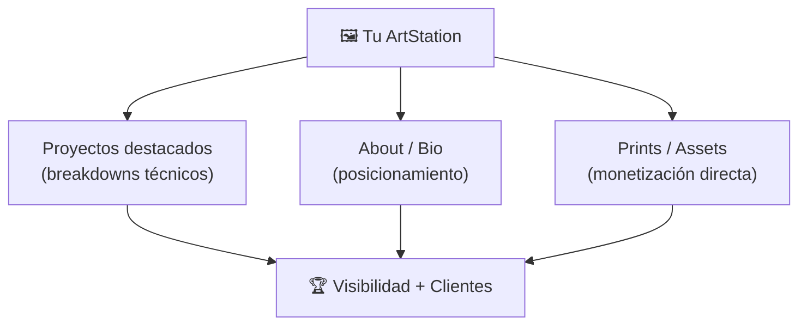
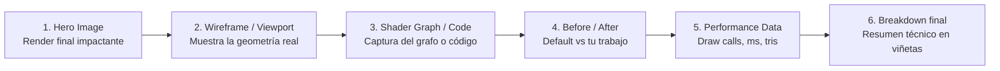
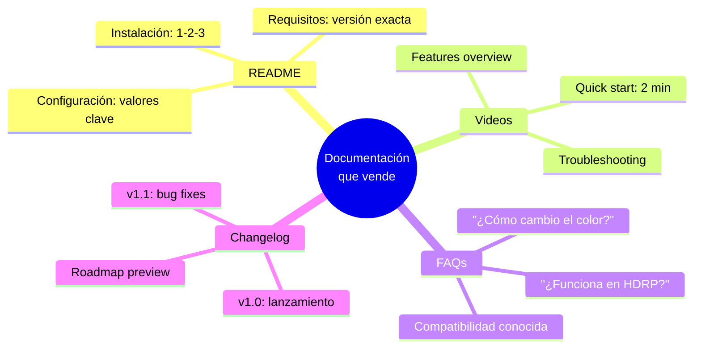
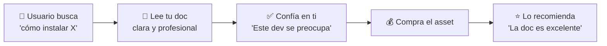
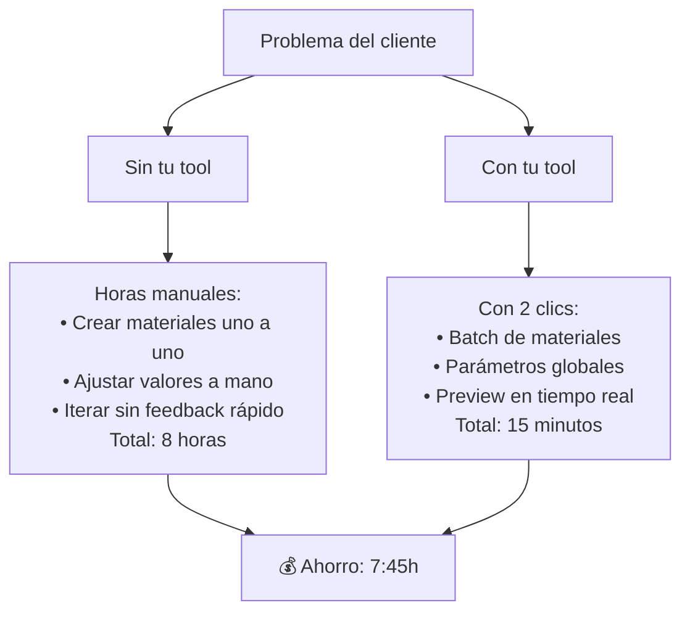
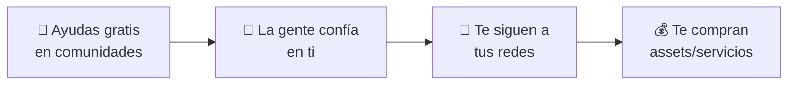
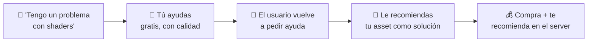

# 🛠️ Fase 4: Marketing para Technical Artists

> **🎯 Objetivo:** Convertir tu expertise técnico en una ventaja de marketing que ningún otro creador puede replicar.

---

## 1. 🎨 ArtStation: Tu escaparate técnico

ArtStation no es solo para concept artists. Es el **portafolio profesional** de la industria y donde estudios y clientes buscan talento técnico.



### Cómo estructurar un breakdown técnico en ArtStation



### Plantilla de post en ArtStation

```
┌─────────────────────────────────────────┐
│  🏆 TÍTULO                               │
│  "Stylized Ice Shader - URP Breakdown"  │
├─────────────────────────────────────────┤
│  📸 IMAGEN 1: RENDER FINAL              │
│  (La imagen más impactante primero)     │
├─────────────────────────────────────────┤
│  📐 IMAGEN 2: VIEWPORT + WIREFRAME      │
│  (Muestra que es real-time, no prender) │
├─────────────────────────────────────────┤
│  📊 IMAGEN 3: SHADER GRAPH              │
│  (Captura del grafo completo)           │
├─────────────────────────────────────────┤
│  ⚡ IMAGEN 4: PERFORMANCE               │
│  "3 draw calls | 0.2ms | 3k triangles" │
├─────────────────────────────────────────┤
│  📝 DESCRIPTION                          │
│  [Explica el qué, el cómo y el por qué] │
│  • Propósito: hielo stylized para RPG   │
│  • Técnica: noise distortion +          │
│    fresnel + cubemap reflection         │
│  • Optimizado para mobile y desktop     │
│  • Creado en Unity URP 2022.3          │
├─────────────────────────────────────────┤
│  🔗 LINKS                                │
│  "Disponible en Gumroad | Tutorial en YT"│
└─────────────────────────────────────────┘
```

> **💡 Tip clave:** ArtStation premia la **calidad visual** primero. Asegúrate de que tu hero image sea impresionante aunque el breakdown sea técnico. La gente scrollea — la primera imagen decide si siguen leyendo.

### Lo que NO hacer en ArtStation

| ❌ Error | ✅ Alternativa |
|---|---|
| Subir solo el resultado final | Incluir breakdown técnico |
| Descripción genérica ("aquí mi shader") | Explicar el proceso y decisiones |
| Ignorar tags | Usar tags: tech art, shader, unity, vfx |
| No incluir links | Enlazar a Gumroad / GitHub / YouTube |
| Una sola imagen | 4-8 imágenes con variedad |

---

## 2. 📚 Documentación como Marketing

La documentación de calidad es **tu mejor vendedor silencioso**. Un asset con docs claras se vende solo.



### La documentación como embudo de confianza



### Plantilla de README para un asset

```markdown
# 🏆 [Nombre del Asset]

> Breve descripción: qué hace y para quién es.

## 📋 Requisitos
- Unity 2022.3+
- URP 14.x o HDRP 14.x
- No requiere paquetes externos

## 🚀 Instalación rápida
1. Importa el .unitypackage
2. Arrastra `Prefabs/Water_Basic` a tu escena
3. Ajusta valores en el inspector

## ⚙️ Configuración
| Parámetro | Default | Descripción |
|-----------|---------|-------------|
| _WaveSpeed | 0.5 | Velocidad de ondas |
| _ColorDeep | #1a5276 | Color aguas profundas |
| _Tessellation | 4.0 | Nivel de teselado |

## 🔧 Solución de problemas
- **"Se ve rosa"** → Asegúrate de tener URP instalado
- **"Bajo FPS"** → Reduce _Tessellation a 2.0

## 📦 Contenido del paquete
- 3 prefabs (River, Lake, Ocean)
- 8 materiales preconfigurados
- Demo scene
- Full source code

## 📜 Changelog
- v1.1 — Añadido soporte para HDRP
- v1.0 — Lanzamiento inicial
```

> **📐 Ejemplo real:** Assets con documentación clara tienen **hasta 3x más probabilidad** de ser comprados que aquellos sin ella. La documentación reduce la fricción y el miedo a "romper algo".

---

## 3. 🏭 Showcase de Pipeline: Vende eficiencia

Como Technical Artist, no vendes solo un asset — vendes **tiempo ahorrado**. El showcase de pipeline muestra **cuánto tiempo le quitas al cliente**.



### Cómo estructurar un Pipeline Showcase

```
┌─────────────────────────────────────────────────┐
│  🎬 VIDEO SHOWCASE (1-2 minutos)                │
├─────────────────────────────────────────────────┤
│  0:00 — Problema: "Crear 50 materiales a mano"  │
│  0:15 — Solución lenta: proceso manual (timelapse)│
│  0:30 — Solución rápida: tu tool en acción       │
│  0:45 — Comparativa lado a lado                  │
│  1:00 — Resultado final + datos de rendimiento   │
│  1:15 — CTA: "Descarga la tool en Gumroad"       │
└─────────────────────────────────────────────────┘
```

### Métricas que importan en un showcase

| Métrica | Cómo mostrarla |
|---|---|
| **Tiempo ahorrado** | "8h → 15min (97% más rápido)" |
| **Draw calls** | "De 200 a 12 draw calls" |
| **FPS gain** | "De 45 a 60 FPS en mobile" |
| **Pasos eliminados** | "De 15 clics a 1 clic" |
| **Consistencia** | "100% consistente vs hecho a mano" |

> **💡 Tip:** Un buen pipeline showcase no solo muestra *qué hace* la tool, sino **cuánto tiempo/dinero le ahorra al comprador**. Traduce siempre a valor económico.

---

## 4. 👥 Comunidades: Donde se construye la reputación

Participar en comunidades no es hacer spam. Es **posicionarte como experto** ayudando a otros.



### Las 4 comunidades clave para Tech Artists

| Comunidad | Enfoque | Frecuencia | Estrategia |
|---|---|---|---|
| **Polycount** | Arte técnico, shaders | Semanal | Responder dudas técnicas, compartir WIP |
| **Reddit (r/Unity3D, r/UnrealEngine)** | Gamedev general | 2-3/semana | Tutoriales cortos, before/after, tips |
| **Discord (servidores de Tech Art)** | Especializado | Diaria | Ayuda rápida, networking, beta testers |
| **Unity/Unreal Forums** | Oficial/soporte | Semanal | Solucionar bugs, compartir assets |

### Reglas de oro en comunidades

```
✅ HACER:
  • Responder dudas con genuina intención de ayudar
  • Compartir conocimiento sin esperar nada a cambio
  • Dar crédito cuando usas el trabajo de otros
  • Preguntar feedback ANTES de vender
  • Ser constante (1 año > 1 mes intenso)

❌ NO HACER:
  • Spammear links de tus assets
  • Responder solo para promocionarte
  • Ser negativo o despectivo con novatos
  • Quejarte de competidores
  • Entrar solo a vender (se nota y repele)
```

### De helper a vendor: el camino natural



> **📐 Ejemplo real:** En el Discord de "Tech Art Club" o "Shader Forge", los que más ayudan son los que más venden. La comunidad **premia la generosidad** con confianza → ventas.

### Cómo empezar en Polycount

```
1. Crea una cuenta con tu nombre real / marca
2. Completa tu perfil: link a portfolio + redes
3. Busca hilos donde puedas aportar valor
4. Responde con sustancia: explica el POR QUÉ, no solo el cómo
5. Comparte tu WIP en el hilo de "What are you working on?"
6. Después de 3-4 meses de participación activa...
   → Crea un hilo "Showcase" de tu propio asset
```

---

## 📋 Checklist de la Fase 4

- [ ] Tengo al menos 1 breakdown técnico en ArtStation con 4+ imágenes
- [ ] Mi bio en redes deja claro: **qué soy + para quién + qué vendo**
- [ ] Mi asset estrella tiene un README/documentación completo
- [ ] Tengo un video showcase de pipeline ( < 2 min )
- [ ] Participo activamente en al menos 1 comunidad (Polycount, Reddit, Discord)
- [ ] He ayudado a 5+ personas gratis antes de promocionar algo

---

## 📚 Recursos adicionales

- [ArtStation — Cómo escribir descriptions](https://help.artstation.com/s/article/description-text-formatting)
- [Polycount — Tech Art Forum](https://polycount.com/categories/technical-art)
- [r/Unity3D](https://reddit.com/r/Unity3D)
- [Tech Art Club Discord](https://discord.gg/techartclub)

---

- [[fase-3-redes-sociales-y-automatizacion-marketing]] #anterior 
- Fase 4 completa
- [[fase-5-paid-media-y-analitics-marketing]] #siguiente 
