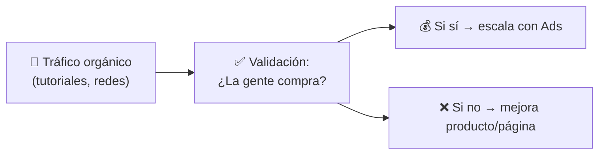
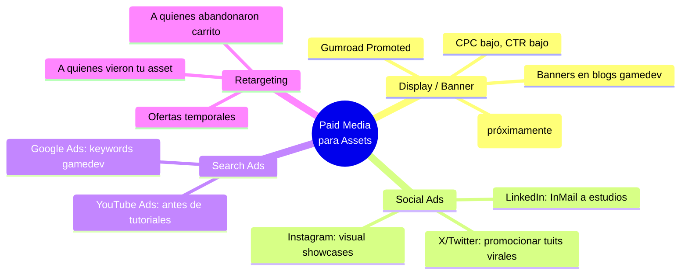
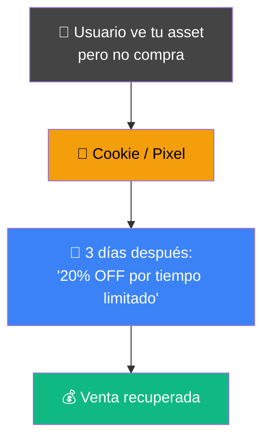
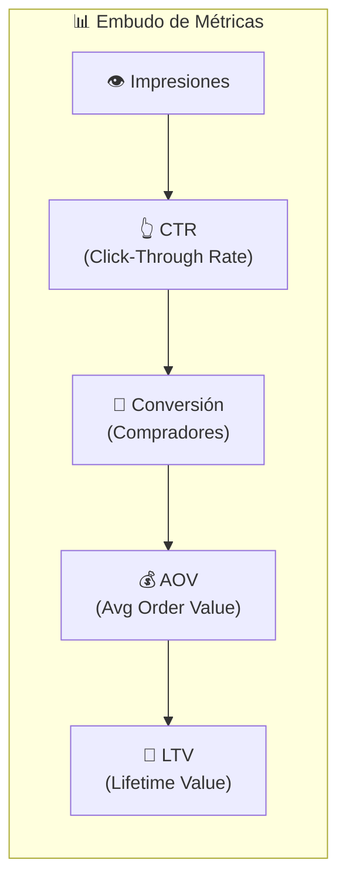
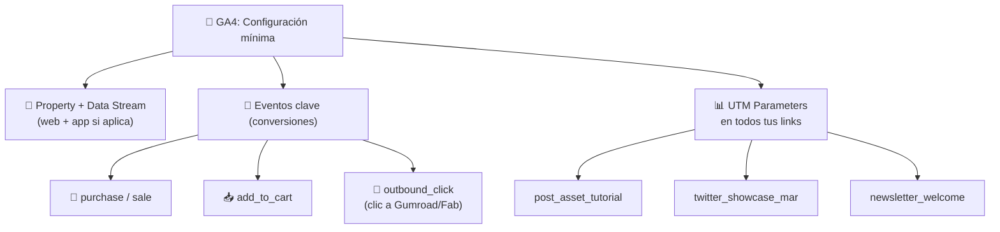
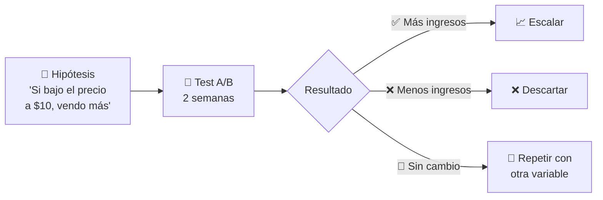

# 📊 Fase 5: Paid Media y Analytics

> **🎯 Objetivo:** Invertir dinero estratégicamente en publicidad y medir todo para saber qué funciona (y qué no).

---

## 1. 💰 SEM / Social Ads: Cuando el tráfico orgánico no basta

El contenido orgánico es la base. Los ads son **aceleradores** — solo tiene sentido cuando ya tienes un producto que convierte.



### Cuándo empezar a pagar por tráfico

```
┌────────────────────────────────────────────────────┐
│  ✅ SEÑALES DE QUE ESTÁS LISTO PARA ADS:           │
│  • Ya tienes 10+ ventas orgánicas                  │
│  • Tu tasa de conversión es > 2%                   │
│  • Tienes reviews positivos en tu asset            │
│  • Tu landing page / Gumroad está optimizada       │
│  • Tienes presupuesto para perder los primeros     │
│    meses (aprendizaje)                             │
├────────────────────────────────────────────────────┤
│  ❌ NO EMPECEMOS ADS SI...                         │
│  • Acabas de lanzar (valida orgánico primero)      │
│  • Tu página de producto es débil                   │
│  • No tienes reviews                               │
│  • Tu asset tiene bugs conocidos                   │
└────────────────────────────────────────────────────┘
```

### Tipos de campañas para Tech Artists



### Retargeting: Tu mejor inversión



**Estrategia de retargeting en 3 pasos:**

| Día | Mensaje | Oferta |
|---|---|---|
| Día +1 | "¿Aún estás pensando en [asset]?" | Recordatorio suave |
| Día +3 | "Mira este breakdown en acción" | Video showcase |
| Día +7 | "Oferta exclusiva para ti" | 20% OFF + bonus |

> **💡 Tip:** El retargeting funciona mejor que el cold traffic porque la gente **ya conoce** tu producto. El ROI suele ser 3x-5x vs campañas de prospección.

### Presupuesto inicial recomendado

```
┌─────────────────────────────────────────────────────┐
│  🚀 PRESUPUESTO MÍNIMO PARA TESTAR                  │
├─────────────────────────────────────────────────────┤
│  Google Ads:         $5-10/día (palabras clave)     │
│  Twitter Ads:        $5-10/día (tuits promocionados)│
│  Retargeting:        $3-5/día (audiencia caliente)  │
│  Total:              ~$300-500/mes para aprender     │
└─────────────────────────────────────────────────────┘
```

---

## 2. 📈 KPIs: Las métricas que realmente importan

No midas por medir. Mide **lo que impacta tu negocio**.



### KPIs esenciales para creadores de assets

| KPI | Fórmula | Buen valor | Qué indica |
|---|---|---|---|
| **CTR** | Clicks / Impresiones × 100 | > 2% | ¿El título/imagen enganchan? |
| **Tasa de conversión** | Compras / Visitantes × 100 | > 3% | ¿La página convence? |
| **CAC** (Costo Adquisición) | Gasto en ads / Compras | < $5 | ¿Es rentable el canal? |
| **ROAS** (Return on Ad Spend) | Ingresos / Gasto en ads | > 3x | ¿Ganas más de lo que gastas? |
| **AOV** | Ingresos totales / Pedidos | > $15 | ¿El precio es correcto? |
| **Churn rate** | Clientes perdidos / Total | < 30% | ¿Vuelven a comprar? |

### Cómo calcular tu CAC máximo

```
CAC máximo = Precio del asset × Margen

Ejemplo:
  • Precio: $20
  • Comisión Gumroad/Fab: 10% ($2)
  • Margen: $18
  • CAC máximo: $18

👉 Si gastas más de $18 en ads para conseguir
   una venta de $20, pierdes dinero.
```

> **📐 Ejemplo práctico:** Si tu asset cuesta $25 y tienes un ROAS de 4x, significa que por cada $1 invertido en ads, ganas $4. Con $500/mes en ads → $2,000/mes en ingresos.

### Trampas métricas comunes

| ❌ No te obsesiones con... | ✅ Enfócate en... |
|---|---|
| Likes y seguidores | Conversiones y revenue |
| Vistas de video | CTR y watch time > 50% |
| Impresiones | ROAS y CAC |
| Precio bajo = más ventas | AOV y margen de beneficio |
| Una métrica aislada | El embudo completo |

---

## 3. 📊 Google Analytics 4 (GA4): Mide tu tráfico

GA4 es gratis y te dice **de dónde vienen tus visitantes y qué hacen** en tu página de venta.

### Qué configurar sí o sí



### UTM Parameters: Tu GPS de tráfico

Cada link que compartas debe llevar UTMs para saber de dónde viene cada visita.

```
Formato:
  https://gumroad.com/l/tu-asset?utm_source=twitter
                                    &utm_medium=social
                                    &utm_campaign=showcase_marzo

Ejemplos:

  📱 Twitter:     ?utm_source=twitter&utm_medium=social
  📧 Newsletter:  ?utm_source=email&utm_medium=email
  🎬 YouTube:     ?utm_source=youtube&utm_medium=video
  📝 Blog:        ?utm_source=blog&utm_medium=article
  📢 Ads:         ?utm_source=google&utm_medium=cpc
```

> **💡 Tip:** Usa [Google URL Builder](https://ga-dev-tools.google/campaign-url-builder/) para generar UTMs sin errores.

### Dashboard mínimo en GA4

```
┌─────────────────────────────────────────────────────────────┐
│  📊 REPORTE SEMANAL (15 min)                                │
├─────────────────────────────────────────────────────────────┤
│  1. Usuarios totales → ¿crece el tráfico?                   │
│  2. Fuente de tráfico → ¿qué canal trae más gente?          │
│  3. Páginas vistas → ¿qué contenido atrae?                   │
│  4. Tasa de rebote → ¿la gente se queda o se va?            │
│  5. Conversiones → ¿cuántas ventas/visitas a Gumroad?      │
│  6. ROAS (si haces ads) → ¿estás ganando dinero?           │
└─────────────────────────────────────────────────────────────┘
```

### Lo que NO necesitas (todavía)

```
❌ Atribución multitouch
❌ Modelos de atribución personalizados
❌ Segmentos avanzados
❌ BigQuery export
❌ Audiencias predictivas

📌 Empieza con lo básico: UTMs → Eventos → Reporte semanal
```

---

## 4. 🧪 Experimentos: Testea antes de escalar



### Qué testear primero

| Variable | Cómo testearlo | Duración |
|---|---|---|
| **Precio** | $15 vs $20 vs $25 | 2-3 semanas cada uno |
| **Thumbnail** | A/B en redes sociales | 1 semana |
| **Título del asset** | Cambiar keywords principales | 2 semanas |
| **CTA del landing** | "Comprar" vs "Empezar ahora" | 1 semana |
| **Oferta** | Descuento vs Bonus incluido | 2 semanas |

> **⚠️ Regla de oro:** Cambia UNA variable a la vez. Si cambias precio + título + thumbnail a la vez, no sabrás qué funcionó.

---

## 📋 Checklist de la Fase 5

- [ ] Tengo tráfico orgánico validado (10+ ventas) antes de considerar ads
- [ ] Configuré GA4 en mi landing page / Gumroad
- [ ] Todos mis links tienen UTMs (source, medium, campaign)
- [ ] Sé cuál es mi CAC máximo y no lo supero
- [ ] Mido semanalmente: usuarios, fuente, tasa de conversión
- [ ] Tengo un experimento A/B en marcha (precio, thumbnail u oferta)
- [ ] Calculé mi ROAS de las últimas 4 semanas

---

## 📚 Recursos adicionales

- [Google Analytics 4 — Setup Guide](https://support.google.com/analytics/answer/9304153)
- [Google URL Builder](https://ga-dev-tools.google/campaign-url-builder/)
- [Facebook Ads Library](https://www.facebook.com/ads/library/) — Inspirarse en campañas de otros

---

- [[fase-4-marketing-para-technical-artist]] #anterior 
- Fase 5 completa
- [[fase-6-especializacion-e-ia-marketing]] #siguiente 
