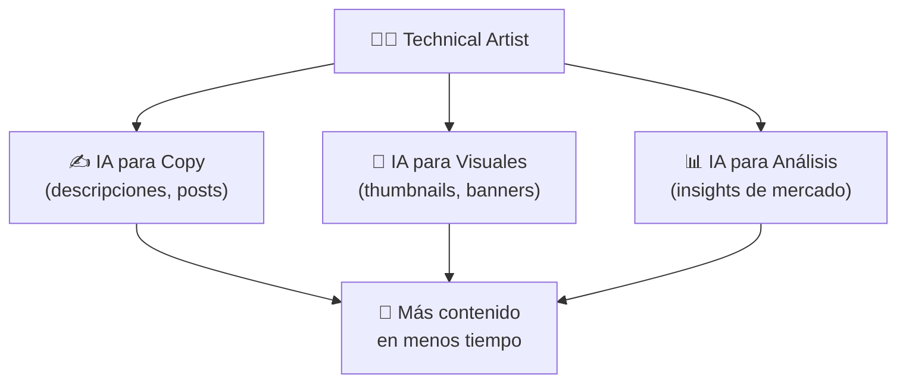
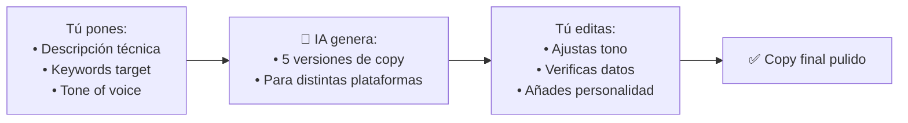
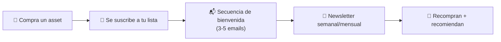
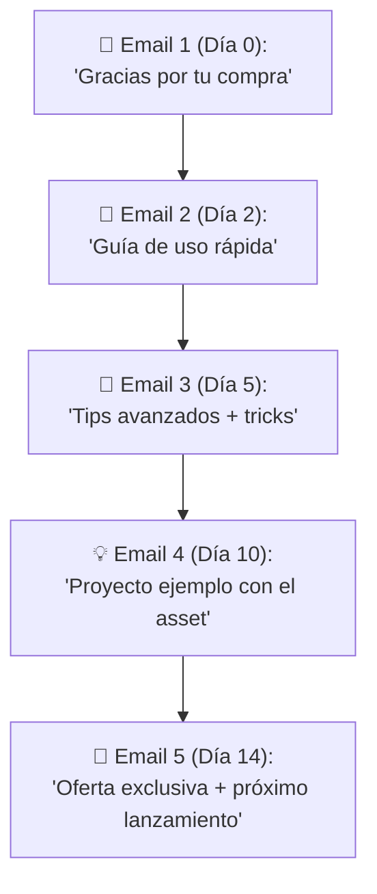
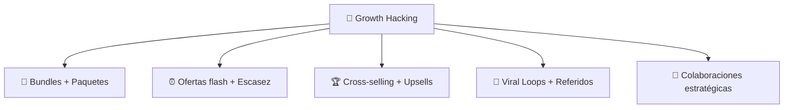
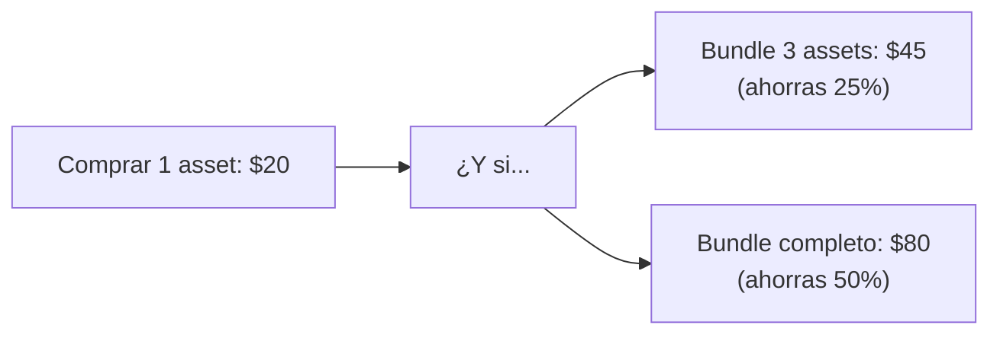
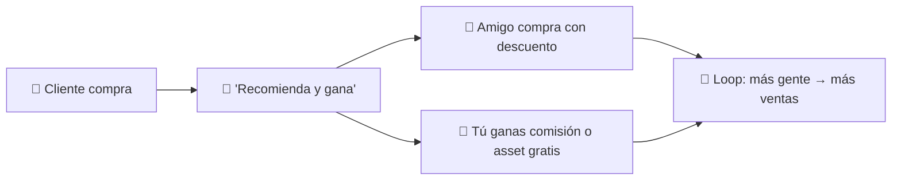
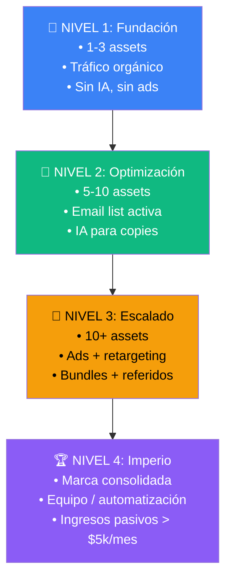

# 🚀 Fase 6: Especialización e IA

> **🎯 Objetivo:** Diferenciarte con herramientas de IA, fidelizar clientes con email marketing y escalar con tácticas de growth hacking.

---

## 1. 🤖 IA Generativa aplicada al Marketing de Assets

La IA no reemplaza al Technical Artist — **potencia al que sabe usarla**. Úsala para automatizar las partes repetitivas del marketing.



### Copywriting con IA



**Prompt template para descripciones de assets:**

```
Eres un copywriter especializado en assets para videojuegos.
Tu tono es técnico pero accesible, persuasivo sin ser ventajoso.

Producto: [nombre del asset]
Plataforma: Unity URP
Público: Indie devs y Technical Artists
Características técnicas:
- [feature 1]
- [feature 2]
- [feature 3]

Genera:
1. Título optimizado para SEO (max 60 chars)
2. Descripción corta para Gumroad (3 líneas)
3. 5 puntos de beneficio (no características)
4. Call to Action (1 línea)
```

**Ejemplo real de uso:**

| Sin IA | Con IA + edición humana |
|---|---|
| "Water shader para Unity con animaciones" | "🌊 Transforma tus ríos en 30 segundos — Stylized Water Shader URP con 12 animaciones pre-hechas. Sin código. Sin estrés." |
| *30 min escribiendo* | *5 min generando + 5 min editando* |

### Thumbnails y banners con IA

| Tarea | Herramienta | Prompt ejemplo |
|---|---|---|
| Thumbnail para tuto de shader | Midjourney / DALL-E | "isometric game scene with stylized ice shader, unreal engine style, vibrant colors, 3D render, thumbnail --ar 16:9" |
| Banner para Gumroad | Canva AI / Photoshop GenAI | "tech art banner with glowing shader nodes connected, dark background, cyan and purple neon --ar 3:1" |
| Fondo para video | Runway / Pika Labs | "slow motion abstract flowing energy, game dev aesthetic" |

> **⚠️ Advertencia:** No uses IA para generar el asset final que vendes. El valor de un Technical Artist está en el **criterio técnico, la optimización y la originalidad**. La IA es para marketing, no para el producto.

### Análisis de mercado con IA

```
Prompt: "Analiza los 10 assets más vendidos en la categoría
'Shaders' de Unity Asset Store. Dame:
1. Patrones comunes en títulos y tags
2. Rango de precios más frecuente
3. Características más mencionadas en las reviews positivas
4. Quejas comunes en reviews negativas
5. Oportunidades no cubiertas"
```

> **💡 Tip:** Usa IA para identificar **gaps de mercado**. Si todos los shaders de agua son realistas y no hay stylizados, esa es tu oportunidad.

---

## 2. 📧 Email Marketing: Convierte compradores en fans

El email es el canal con **mejor ROI del marketing digital**: ~$42 por cada $1 invertido. Y es tuyo — no dependes del algoritmo de X ni Instagram.



### Qué NO hacer con email marketing

```
❌ Comprar listas de emails
❌ Spammear todos los días
❌ Solo enviar ofertas y ventas
❌ No tener forma de darse de baja
❌ Usar "Dear customer" genérico
```

### Secuencia de bienvenida para compradores de assets



**Email 1 — Bienvenida (día 0):**

```
Asunto: 🎉 ¡Gracias! Aquí tienes [Asset Name]

Hola [Nombre],

Gracias por comprar [Asset Name]. 
En 5 minutos tendráslo funcionando en tu proyecto.

⬇️ DESCARGAR: [link]
📖 DOCUMENTACIÓN: [link]
🐛 REPORTAR BUG: [link]

¿Necesitas ayuda? Responde a este email.

— [Tu nombre]
```

**Email 4 — Proyecto ejemplo (día 10):**

```
Asunto: 🌊 Mira lo que puedes hacer con [Asset Name]

Hola [Nombre],

Esta semana usé [Asset Name] para recrear
la escena del lago de [Juego Famoso].

Resultado:
[GIF antes/después]

¿Quieres el archivo del proyecto?
Lo tienes aquí: [link]

Próximo viernes: lanzamos la versión 2.0
con 3 nuevos efectos. Stay tuned.

— [Tu nombre]
```

### Qué enviar (y con qué frecuencia)

| Tipo | Frecuencia | Contenido |
|---|---|---|
| **Newsletter** | 1-2/mes | Tutoriales, nuevos assets, tips |
| **Ofertas exclusivas** | 1/mes | Descuentos solo para suscriptores |
| **Lanzamientos** | Cuando aplique | Nuevo asset con preview |
| **Encuestas** | 1/trimestre | "¿Qué asset necesitas?" |

### Herramientas de email marketing

| Herramienta | Gratis hasta | Ideal para |
|---|---|---|
| **MailerLite** | 1,000 suscriptores | Newsletters + automatización |
| **ConvertKit** | 1,000 suscriptores | Creadores de contenido |
| **Buttondown** | Pago desde $9/mes | Newsletters técnicas minimalistas |
| **Beehiiv** | 2,500 suscriptores | Newsletters + monetización |

> **💡 Recolecta emails desde el día 1.** Añade un campo de email en la compra de Gumroad/Fab. Cada comprador es un suscriptor potencial.

---

## 3. 🚀 Growth Hacking: Tácticas para escalar

Growth Hacking es **marketing experimental con foco en crecimiento rápido y medible**. No necesitas gran presupuesto, necesitas creatividad.



### Bundles: Más valor, mayor ticket



**Estrategias de bundling:**

| Tipo | Ejemplo | Por qué funciona |
|---|---|---|
| **Completa la colección** | "Pack de 5 shaders de naturaleza" | Mayor valor percibido |
| **Para principiantes** | "Starter Pack: shader + doc + scene" | Reduce fricción de entrada |
| **Estacional** | "Halloween VFX Pack" | Urgencia temporal |
| **Cross-sell** | "Shader + modelo 3D que lo usa" | Complementarios |

### Ofertas flash + escasez

```
┌─────────────────────────────────────────────┐
│  ⏰ LANZAMIENTO CON CUENTA ATRÁS            │
├─────────────────────────────────────────────┤
│  "Nuevo asset: Cartoon Fire Shader"         │
│                                             │
│  🎉 Precio de lanzamiento: $15 (vs $25)    │
│  ⏳ Quedan 48h...                           │
│  🔥 Primeros 50 compradores: bonus extra   │
│                                             │
│  [COMPRAR AHORA]                            │
└─────────────────────────────────────────────┘
```

> **⚠️ La escasez debe ser real.** Si siempre dices "últimos días" nunca pasa, pierdes credibilidad. Úsalo solo en lanzamientos.

### Viral Loops: Que tus clientes te traigan clientes



**Ejemplo de programa de referidos:**

```
Tú compartes tu link único:
  gumroad.com/l/tu-asset?ref=TU_USUARIO

Cuando alguien compra con tu link:
  ✅ Ellos: 15% OFF
  ✅ Tú: 10% de comisión en crédito

Gana suficiente crédito → canjea por assets gratis.
```

### Colaboraciones estratégicas

| Colaboración | Cómo funciona | Beneficio |
|---|---|---|
| **Cross-promo con otro creador** | "Tú recomiendas mi asset; yo el tuyo" | Audiencia compartida |
| **Review a cambio de copia gratis** | Envías tu asset a un YouTuber/Twitch | Exposición + prueba social |
| **Asset gratuito para comunidad** | "Free shader para miembros de tu Discord" | Leads calificados |
| **Joint venture tutorial** | Dos Tech Artists hacen un tuto juntos | Audiencia + networking |

> **💡 Busca creadores con audiencias complementarias pero NO competidoras directas.** Ej: tú haces shaders → colaboras con alguien que hace modelos 3D.

---

## 4. 🧗 La escalera del crecimiento



---

## 📋 Checklist de la Fase 6

- [ ] Tengo prompts de IA optimizados para copys de assets
- [ ] Uso IA para thumbnails/banners (no para el producto final)
- [ ] Configuré una secuencia de bienvenida de 5 emails para compradores
- [ ] Envío newsletter al menos 1 vez al mes
- [ ] Tengo al menos 1 bundle activo (comprar 2+ = descuento)
- [ ] He hecho al menos 1 colaboración con otro creador
- [ ] Mi embudo completo está funcionando: atraer → convertir → fidelizar

---

## 📚 Recursos adicionales

- [[guia-ollama]] — Guía de IA generativa local
- [MailerLite](https://www.mailerlite.com) — Email marketing gratuito
- [ConvertKit](https://convertkit.com) — Para creadores
- [GrowthHackers.com](https://growthhackers.com) — Casos de estudio

---

- [[fase-5-paid-media-y-analitics-marketing]] #anterior 
- 🏁 Fase 6 completa 
- Fin del roadmap de marketing 🚀**
- [[meta-independencia-financiera-marketing]] #siguiente 
