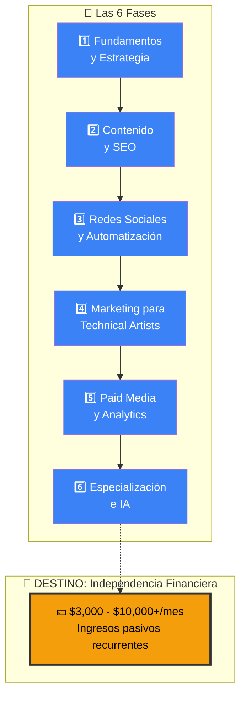
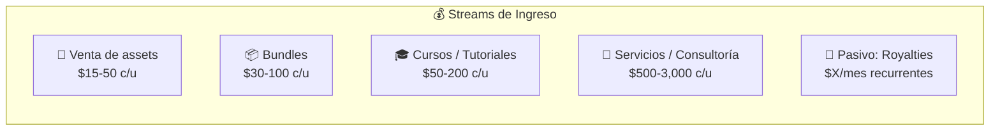
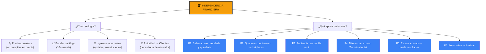
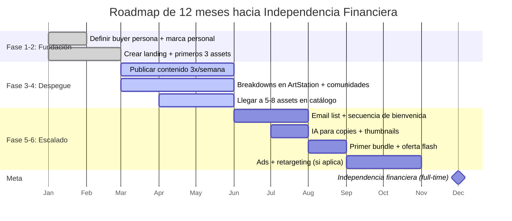
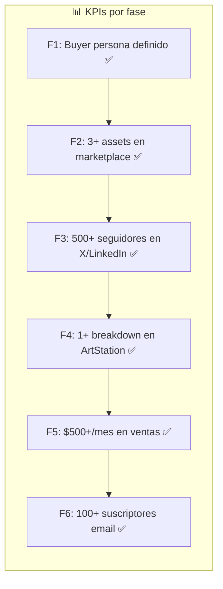

# 🏆 META GLOBAL: INDEPENDENCIA FINANCIERA

> **Visión:** Generar ingresos pasivos escalables mediante la venta de assets digitales y servicios de Tech Art de alto valor, sin depender de un empleo tradicional.

---

## 🗺️ El Mapa Completo



---

## 📊 Los Números de la Independencia



### Escenarios realistas

| Escenario | Assets vendidos/mes | Ingreso mensual | Estilo de vida |
|---|---|---|---|
| 🌱 **Part-time** | 10-20 assets ($15-25 c/u) | $150-500 | Cobertura de gastos básicos |
| 🌿 **Semi-profesional** | 30-60 assets ($15-25 c/u) | $500-1,500 | Side income significativo |
| 🌳 **Full-time** | 80-150 assets ($15-25 c/u) | $1,500-3,500 | Reemplaza empleo tradicional |
| 🌲 **Imperio** | 200+ assets + cursos + servicios | $3,500-10,000+ | Libertad financiera |

> **⚠️ Realidad:** Estos números asumen assets de calidad, marketing consistente y al menos 12-18 meses de trabajo constante. No es un "get rich quick" — es un "get rich slow" construyendo un negocio real.

---

## 🔗 Cómo Cada Fase Contribuye a la Meta



---

## 🧭 La Ruta de 12 Meses



---

## 📈 Indicadores Clave de Progreso



### Hitos de ingreso

| Hito | Ingreso/mes | Señal |
|---|---|---|
| 🥇 **Validación** | $100 | Alguien paga por tu trabajo |
| 🥈 **Side income** | $500 | Cubre servicios / ocio |
| 🥉 **Media jornada** | $1,500 | Reduce horas en empleo |
| 🏆 **Full-time** | $3,000 | Reemplaza salario |
| 👑 **Libertad** | $5,000+ | Excede gastos de vida |

---

## 🧠 Principios Fundamentales

```
┌─────────────────────────────────────────────────────────┐
│  📌 LEYES DE LA INDEPENDENCIA COMO TECH ARTIST          │
├─────────────────────────────────────────────────────────┤
│                                                         │
│  1. El producto es el marketing                          │
│     → Un asset excelente se vende solo                  │
│                                                         │
│  2. La consistencia vence al talento                     │
│     → 1 asset/mes durante 12 meses > 12 assets en 1 mes │
│                                                         │
│  3. No compitas en precio, compite en valor              │
│     → $25 con documentación > $5 sin nada               │
│                                                         │
│  4. Construye audiencia antes de producto                │
│     → 1,000 fans que confían en ti > 10,000 desconocidos │
│                                                         │
│  5. Automatiza para escalar                              │
│     → Tu tiempo es el recurso más escaso                │
│                                                         │
│  6. Datos > Opiniones                                    │
│     → Mide todo, decide con números                     │
│                                                         │
└─────────────────────────────────────────────────────────┘
```

---

## 🎯 Tu Plan de Acción Inmediato

```
┌─────────────────────────────────────────────────────────┐
│  📋 PRÓXIMOS 7 DÍAS                                     │
├─────────────────────────────────────────────────────────┤
│  ☐ Lee la Fase 1 completa                               │
│  ☐ Define tu buyer persona (escríbelo)                  │
│  ☐ Elige tu plataforma principal (X/LinkedIn)           │
│  ☐ Escribe tu elevator pitch de 1 frase                 │
│  ☐ Prepara tu perfil: bio, foto, banner                 │
└─────────────────────────────────────────────────────────┘

┌─────────────────────────────────────────────────────────┐
│  📋 PRÓXIMOS 30 DÍAS                                    │
├─────────────────────────────────────────────────────────┤
│  ☐ Publica tu primer breakdown técnico                  │
│  ☐ Crea o mejora tu primer asset en Gumroad/Fab         │
│  ☐ Escribe una descripción AIDA para ese asset          │
│  ☐ Publica 3 veces/semana en tu red principal           │
│  ☐ Únete a 1 comunidad (Polycount, Discord, Reddit)     │
└─────────────────────────────────────────────────────────┘
```

---

## 📚 Recursos del Roadmap

| Fase | Archivo |
|---|---|
| 1️⃣ Fundamentos y Estrategia | [[fase-1-fundamentos-y-estrategia-marketing]] |
| 2️⃣ Contenido y SEO | [[fase-2-contenido-y-seo-marketing]] |
| 3️⃣ Redes Sociales y Automatización | [[fase-3-redes-sociales-y-automatizacion-marketing]] |
| 4️⃣ Marketing para Technical Artists | [[fase-4-marketing-para-technical-artist]] |
| 5️⃣ Paid Media y Analytics | [[fase-5-paid-media-y-analitics-marketing]] |
| 6️⃣ Especialización e IA | [[fase-6-especializacion-e-ia-marketing]] |

---

> **🏁 Este es el destino final.** Cada fase es un paso hacia este objetivo. No necesitas completarlas todas para empezar a ver resultados — cada fase construye sobre la anterior.

> *"El mejor momento para empezar fue hace 6 meses. El segundo mejor momento es hoy."*

## Relacionados:
- [[fase-6-especializacion-e-ia-marketing]] #anterior 
- [[fase-1-fundamentos-y-estrategia-marketing]] #siguiente 