# Elementos Núcleo del LLM

Cuando le envías un prompt a un LLM, no solo importa **lo que dices**, sino también **cómo configuras los parámetros** que controlan la generación. Estos parámetros determinan si la respuesta es predecible, creativa, corta o estructurada.

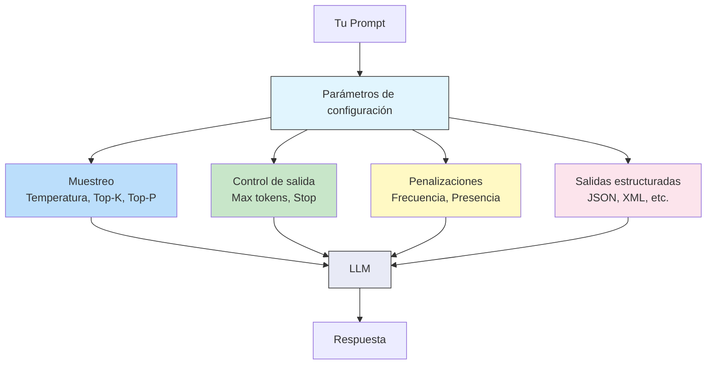

---

## Parámetros de Muestreo

Los parámetros de muestreo controlan **cómo el LLM elige la siguiente palabra** entre todas las opciones posibles.

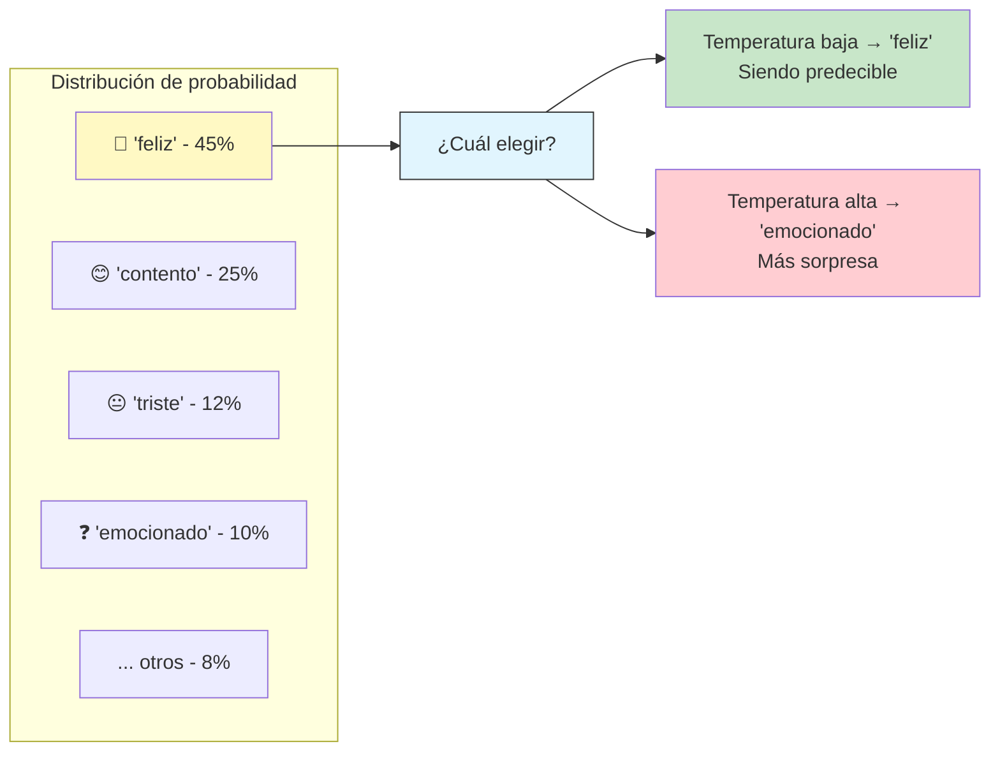

---

### Temperatura

Controla **qué tan "creativa"** o **"determinista"** es la respuesta.

| Temperatura | Efecto | Uso recomendado |
|-------------|--------|----------------|
| **0.0 — 0.2** | Casi siempre elige la palabra más probable | Preguntas factuales, código, extracción de datos |
| **0.3 — 0.7** | Balance entre precisión y creatividad | Chat general, explicaciones, resúmenes |
| **0.8 — 1.0** | Alta variabilidad y creatividad | Lluvia de ideas, poesía, narrativa |
| **> 1.0** | Muy riesgoso, puede volverse incoherente | Experimentación |

```
Temperatura baja (0.1):
Prompt:  "Completa: El cielo es de color ___"
Salida:  "azul"          ← la opción más probable, siempre la misma

Temperatura alta (0.9):
Prompt:  "Completa: El cielo es de color ___"
Salida:  "índigo en el atardecer, a veces rosado o naranja"
                         ← más variedad, menos predecible
```

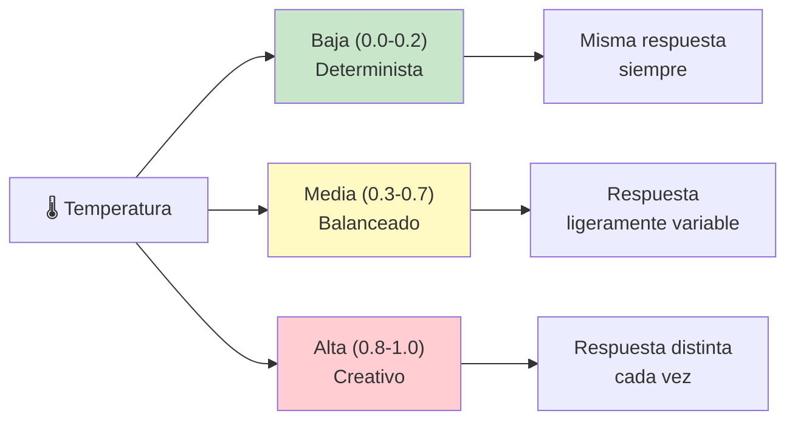

> 💡 **Regla práctica:** empieza con `temperature=0.0` para tareas que requieren precisión, y súbela solo si necesitas variedad creativa.

---

### Top-K

Limita la selección al **top K tokens más probables**. El modelo solo considera las `K` mejores opciones y descarta el resto.

```
Top-K = 10:
De 50,000 tokens posibles en el vocabulario...
solo los 10 más probables pueden ser elegidos.
```

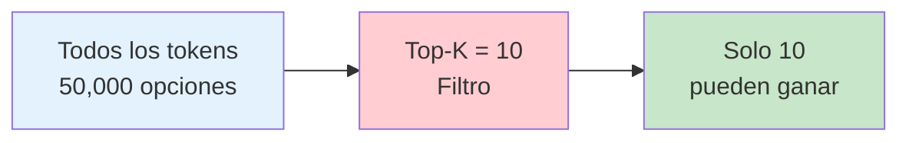

| Top-K | Efecto |
|-------|--------|
| **1** | Equivalente a temperatura 0 — siempre la misma palabra |
| **10 — 40** | Balance típico (valor por defecto en muchos modelos) |
| **0 o desactivado** | Sin límite, se usa solo Top-P |

---

### Top-P (Nucleus Sampling)

En lugar de un número fijo de tokens (como Top-K), Top-P selecciona el **conjunto mínimo de tokens cuya probabilidad acumulada** alcance el valor `P`.

```
Top-P = 0.9:
Se ordenan los tokens de mayor a menor probabilidad,
y se seleccionan hasta que la suma acumulada ≥ 0.9 (90%)
```

| Top-P | Efecto |
|-------|--------|
| **0.1** | Muy restrictivo, casi siempre el mismo token |
| **0.9** | Valor típico — balance entre variedad y coherencia |
| **1.0** | Considera todos los tokens (equivalente a desactivado) |

### Temperatura + Top-P: ¿Cómo se combinan?

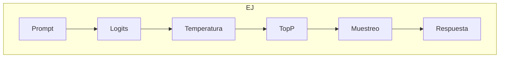

> 🔧 **Recomendación:** usa **Top-P** en lugar de Top-K. La mayoría de los proveedores recomiendan: `temperature: 0.7, top_p: 0.9` como punto de partida.

---

## Control de Salida

Controlan **cuánto** puede generar el modelo y **cuándo detenerse**.

### Tokens Máximos (`max_tokens`)

Define el **límite superior** de tokens que el modelo puede generar en la respuesta.

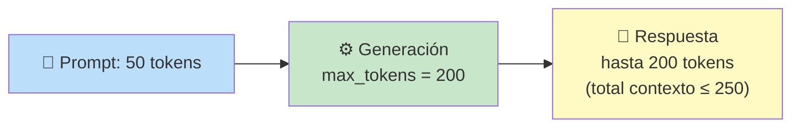

| max_tokens | Cuándo usarlo |
|------------|--------------|
| **50 — 100** | Respuestas cortas, clasificaciones, extracción de datos |
| **200 — 500** | Explicaciones, resúmenes, correos |
| **500 — 2000** | Análisis detallados, código, documentos |
| **Sin límite (0)** | El modelo decide — útil pero costoso |

> ⚠️ **max_tokens + prompt_tokens ≤ ventana de contexto.** Si tu prompt usa 30K tokens y `max_tokens=10K`, caben justo en una ventana de 40K. Pero si la ventana es 32K, la generación se corta antes.

### Secuencias de Parada (`stop`)

Son **secuencias de texto** que, cuando el modelo las genera, detienen inmediatamente la generación.

```
Ejemplo:
stop: ["\n", "---", "```"]

Prompt:  "Enumera 3 colores:"
Generación comienza: "1. Rojo\n2. Azul\n3. Verde\n"
                           ↑ se detiene aquí porque encuentra "\n"
                           después del 3er elemento... pero mejor:

stop: ["4.", "---"]
Prompt:  "Enumera exactamente 3 colores:\n1. Rojo\n2. Azul\n3."
Generación: " Verde"  → se detiene antes de generar "4."
```

**Usos comunes:**
- Detener después de `\n\n` (doble salto de línea) para párrafos
- Detener en `---` para separadores
- Detener en etiquetas de cierre como `</output>` en salidas XML
- Detener en ```` ``` ```` para bloques de código

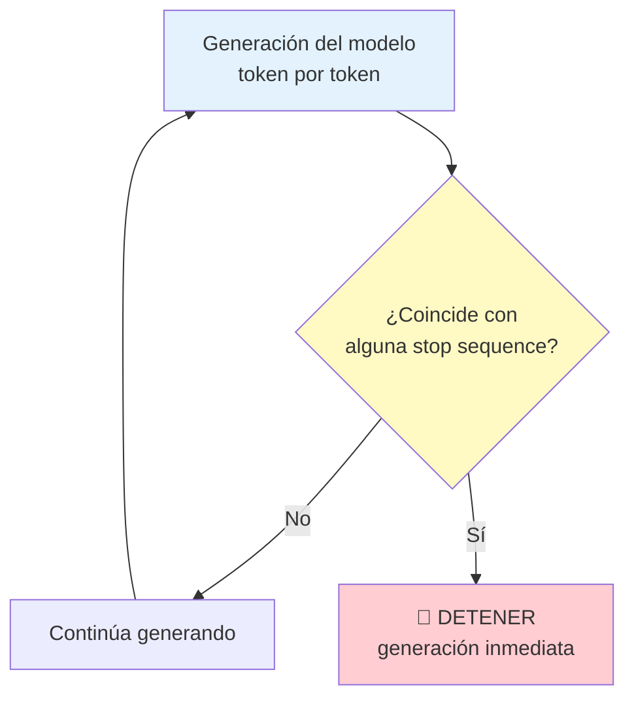

---

## Penalizaciones por Repetición

Evitan que el modelo **se repita** o se quede atascado en bucles.

### Frecuencia de Penalidad (`frequency_penalty`)

Penaliza tokens que **ya aparecieron** en el texto generado. Mientras más veces aparece un token, más se penaliza.

| Valor | Efecto |
|-------|--------|
| **0.0** | Sin penalización — puede repetir palabras libremente |
| **0.3 — 0.5** | Ligera reducción de repeticiones |
| **0.7 — 1.0** | Fuerte reducción — fomenta vocabulario variado |
| **> 1.0** | Muy agresivo — puede sonar antinatural |

```
Sin penalización (0.0):
"El proyecto es muy importante y muy necesario y muy útil."

Con penalización (0.7):
"El proyecto es importante, necesario y útil."
                     ↑ evitó repetir "muy"
```

### Presencia de Penalidad (`presence_penalty`)

Penaliza tokens **que ya han aparecido al menos una vez**, sin importar cuántas veces. Fomenta hablar de **nuevos temas**.

| Valor | Efecto |
|-------|--------|
| **0.0** | Sin efecto |
| **0.3** | Suave — promueve algo de variedad temática |
| **0.6 — 1.0** | Fuerte — cambia de tema activamente |

### Frecuencia vs Presencia

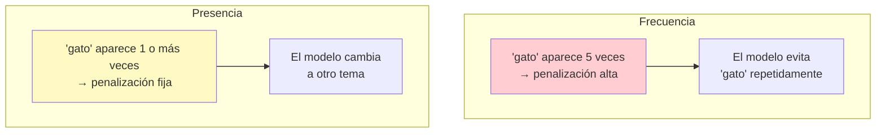

| | Frequency Penalty | Presence Penalty |
|--|------------------|-----------------|
| Penaliza | Cada aparición extra | Que aparezca (una vez basta) |
| Efecto | Reduce repetición de palabras | Fomenta diversidad temática |
| Mejor para | Código, listas, enumeraciones | Escritura creativa, diálogos |

---

## Salidas Estructuradas

Poder pedirle al LLM que devuelva **formatos específicos** en lugar de texto libre.

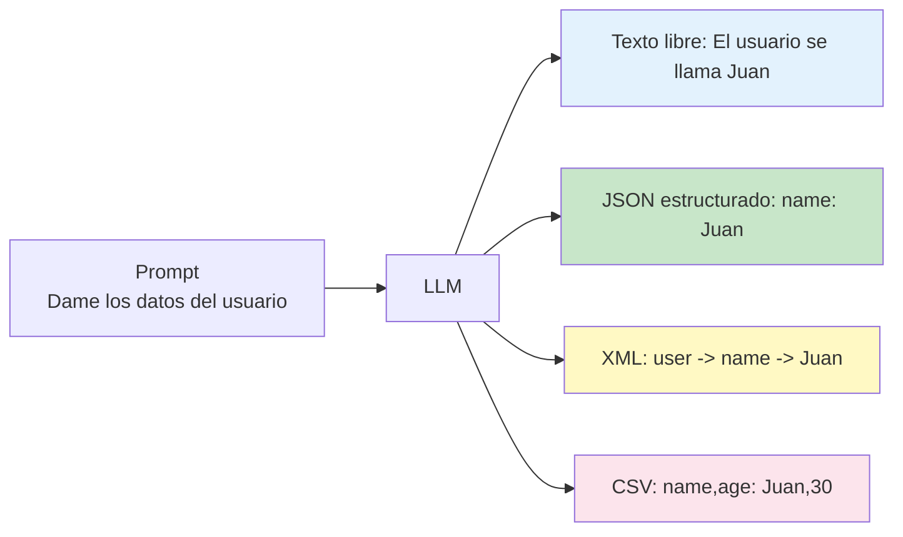

### ¿Por qué usar salidas estructuradas?

- ✅ Fáciles de parsear por código
- ✅ Predecibles y consistentes
- ✅ Se pueden validar con schemas
- ✅ Ideales para pipelines automatizados

### Ejemplo: JSON Mode

```
Prompt:
  "Extrae los datos del siguiente texto y devuélvelos en JSON.
  Texto: 'Juan Pérez tiene 30 años y vive en Bogotá'
  
  Formato:
  {
    \"nombre\": \"\",
    \"edad\": 0,
    \"ciudad\": \"\"
  }"

Respuesta:
  {
    "nombre": "Juan Pérez",
    "edad": 30,
    "ciudad": "Bogotá"
  }
```

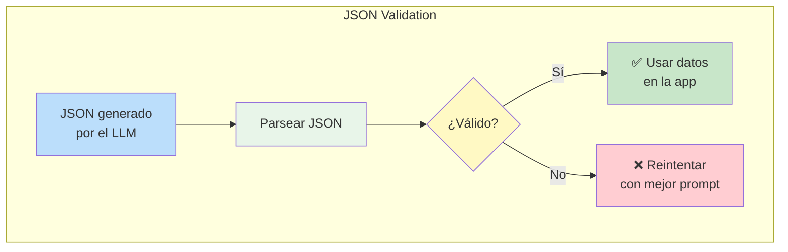

### Formatos comunes

| Formato | Cuándo usarlo |
|---------|--------------|
| **JSON** | APIs, datos estructurados, integración con código |
| **XML** | Prompt injection defense, datos jerárquicos |
| **Markdown** | Documentación, respuestas legibles para humanos |
| **CSV** | Exportación de tablas, hojas de cálculo |
| **YAML** | Configuraciones, archivos de infraestructura |

### Buenas prácticas para salidas estructuradas

1. **Proporciona el schema exacto** en el prompt
2. **Usa ejemplos** del formato esperado
3. **Pide que NO agregue texto extra** fuera de la estructura
4. **Valida la salida** del lado del código (¡no confíes ciegamente!)
5. **Usa JSON Mode** si el proveedor lo soporta

---

## Resumen Visual

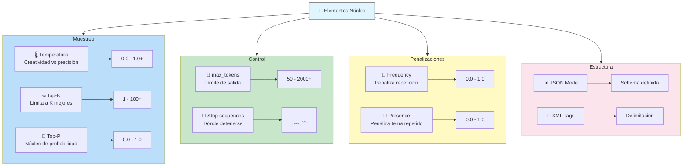

---

## Relacionados

- [[introduccion-a-prompt-engineering]] ← Anterior: conceptos básicos
- [[tecnicas-de-propting-engineering]] → Siguiente: técnicas de prompting
