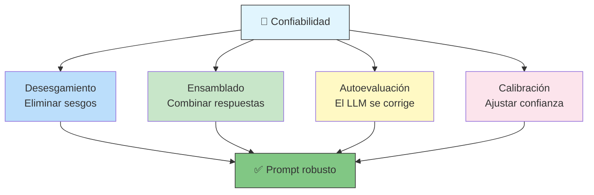
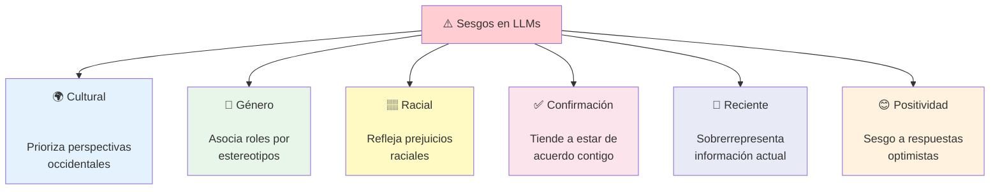
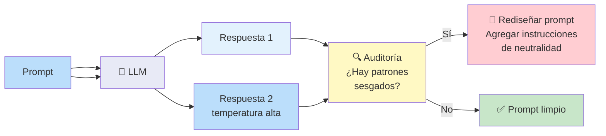
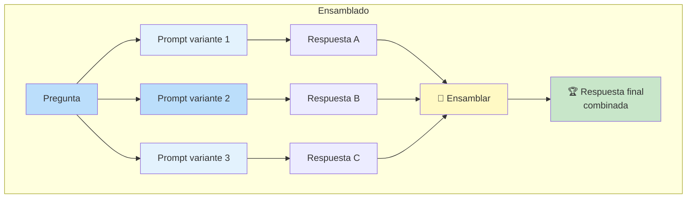
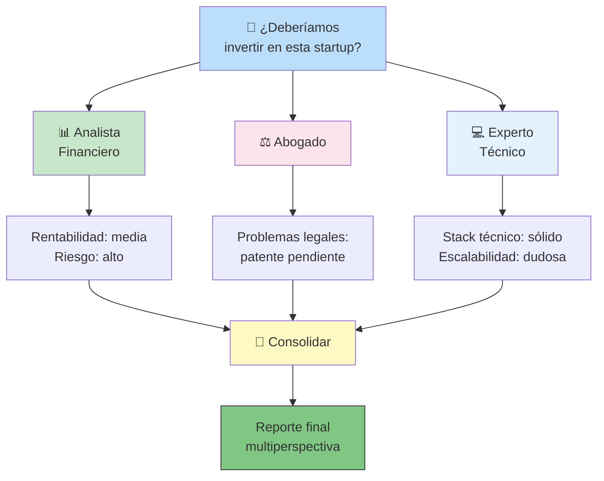
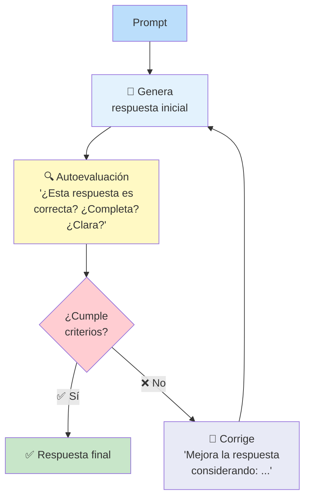
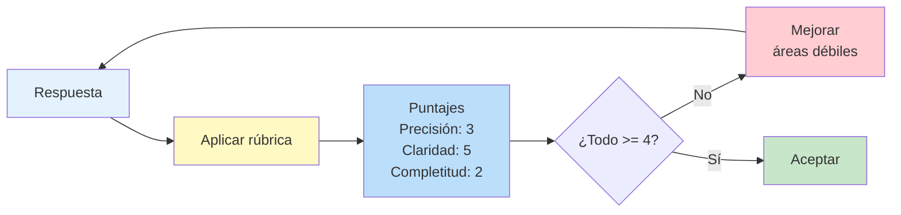
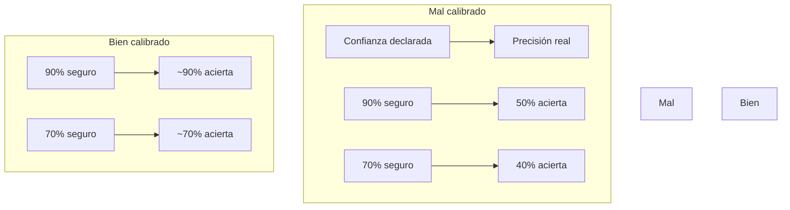
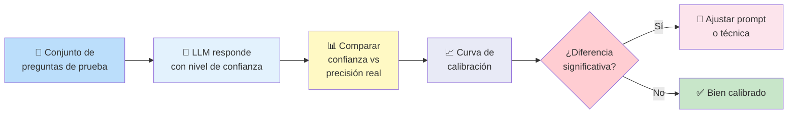
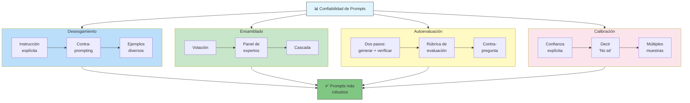

# Mejorando la Confiabilidad

Los LLMs son poderosos pero **no son perfectos**. Pueden tener sesgos, ser inconsistentes o fallar en casos borde. Este documento cubre técnicas para hacer tus prompts más **robustos, justos y predecibles**.



---

## Desesgamiento de Prompts

Los LLMs aprenden de datos humanos, y los datos humanos contienen **sesgos**. El desesgamiento busca reducir o eliminar estos sesgos en las respuestas.

### Tipos de sesgo comunes



### Ejemplos de sesgo

**Sesgo de género:**
```
❌ Prompt: "El médico recomendó una cirugía. ____ es muy experimentado."
    → El modelo completa con "Él" (asocia médico con masculino)

✅ Prompt neutro: "El médico recomendó una cirugía. El/La doctor(a)
    es muy experimentado(a). ¿Cuál es el pronóstico?"
    → Evita asumir género
```

**Sesgo de confirmación:**
```
❌ Prompt: "¿No crees que la programación funcional es el mejor enfoque?"
    → El modelo tiende a estar de acuerdo contigo

✅ Prompt: "¿Cuáles son las ventajas y desventajas de la programación
    funcional frente a la orientada a objetos?"
    → Fomenta una respuesta balanceada
```

### Técnicas de desesgamiento

| Técnica | Descripción | Ejemplo |
|---------|-------------|---------|
| **Instrucción explícita** | Pide neutralidad en el prompt | _"Sé objetivo y neutral"_ |
| **Contra-prompting** | Pide explícitamente considerar otras perspectivas | _"Considera también el punto de vista opuesto"_ |
| **Eliminar contexto sesgado** | No incluyas suposiciones en el prompt | En lugar de _"Como todo el mundo sabe..."_, ve directo a la pregunta |
| **Diversidad en ejemplos** | Usa ejemplos variados en few-shot | Nombres diversos, contextos variados |
| **Debiasing en system prompt** | Instrucción base contra sesgos | _"No asumas género, raza, religión..."_ |

```
Ejemplo de system prompt desesgado:

System:
  "Eres un asistente objetivo y neutral.
  - No asumas género, nacionalidad, raza o religión.
  - Si la pregunta tiene múltiples perspectivas, preséntalas todas.
  - No estés de acuerdo automáticamente con el usuario.
  - Basa tus respuestas en evidencia factual.
  - Si no hay consenso, indícalo."
```

### Cómo detectar sesgos



---

## Ensamblado de Prompts

Combinar **múltiples prompts o respuestas** para obtener un resultado más robusto que cualquiera individualmente.



### Estrategias de ensamblado

| Estrategia | Cómo funciona | Cuándo usarla |
|------------|--------------|---------------|
| **Votación** | Múltiples prompts, misma pregunta, mayoría gana | Clasificación, opción múltiple |
| **Promedio** | Varias respuestas numéricas, se promedian | Estimaciones, rangos |
| **Cascada** | Prompt 1 → limpia, Prompt 2 → refina, Prompt 3 → verifica | Tareas complejas de múltiples pasos |
| **Panel de expertos** | Cada prompt tiene un rol diferente, se consolida | Análisis desde múltiples perspectivas |

### Ejemplo: Votación

```
Prompt variante A:
  "Clasifica este email como spam (1) o no spam (0): {email}"

Prompt variante B:
  "Eres un filtro de correo. ¿Este email es spam? Responde SI o NO: {email}"

Prompt variante C:
  "Analiza el siguiente email y determina si es correo no deseado.
   Devuelve solo 'spam' o 'no_spam': {email}"

Resultados:
  A → spam
  B → no spam  ← error
  C → spam
  → Votación: spam (2/3) ✅
```

### Ejemplo: Panel de Expertos

```
System A: "Eres un analista financiero. Evalúa el riesgo de esta inversión."
System B: "Eres un abogado. Identifica problemas legales en esta propuesta."
System C: "Eres un experto en tecnología. Evalúa la viabilidad técnica."

→ Llama a los 3, consolida las respuestas en un reporte único.
```



---

## LLM Autoevaluación

Hacer que el propio LLM **evalúe y critique su propia respuesta** o la de otro modelo.



### Técnicas de autoevaluación

#### 1. Verificación en dos pasos

```
Paso 1 — Generar:
  "Responde: ¿Cuál es la capital de Australia?"

Paso 2 — Verificar:
  "Revisa tu respuesta anterior. ¿Estás seguro de que {respuesta}
   es la capital de Australia? Si no, corrígelo."
```

#### 2. Cadena de verificación

```
"Responde la pregunta. Luego, para cada afirmación en tu respuesta,
 indica si estás: (a) 100% seguro, (b) moderadamente seguro,
 (c) no seguro. Para (b) y (c), explica qué información adicional
 necesitarías para estar 100% seguro."
```

#### 3. Contra-pregunta

```
"Responde: ¿Qué es la teoría de cuerdas?

Después de responder, hazte esta contra-pregunta:
'¿Hay alguna visión alternativa o crítica a esta teoría que deba mencionar?'
Si la hay, agrégala a tu respuesta."
```

#### 4. Evaluación con rúbrica

```
Prompt de autoevaluación:
  "Evalúa tu respuesta anterior usando esta rúbrica:
   - Precisión (1-5): ¿Los hechos son correctos?
   - Claridad (1-5): ¿Se entiende fácilmente?
   - Completitud (1-5): ¿Cubre todos los aspectos?
   - Neutralidad (1-5): ¿Es objetiva?
   
   Si algún puntaje es menor a 4, genera una versión mejorada."
```



### Limitaciones de la autoevaluación

| ⚠️ Problema | Explicación |
|-------------|-------------|
| **Falso sentido de seguridad** | El modelo puede aprobar su propia respuesta incorrecta |
| **Ceguera a patrones** | Si el modelo tiene un sesgo, la autoevaluación también lo tendrá |
| **Costo adicional** | Duplica o triplica el número de llamadas al LLM |
| **Mejora marginal** | Para respuestas factuales, RAG o búsqueda externa suele ser más efectivo |

> 💡 **Regla:** la autoevaluación funciona mejor para **calidad de escritura, claridad y formato** que para **precisión factual**.

---

## Calibrando LLM

La calibración busca **ajustar la confianza del modelo** para que sus niveles de certeza reflejen la realidad.

```
Modelo mal calibrado:
  "Estoy 100% seguro de que la respuesta es..." → pero se equivoca el 30% de las veces

Modelo bien calibrado:
  Cuando dice "100% seguro" → acierta el 100% de las veces
  Cuando dice "70% seguro" → acierta ~70% de las veces
```



### Técnicas de calibración

#### 1. Preguntar nivel de confianza explícitamente

```
"Responde la siguiente pregunta y luego indica tu nivel de confianza
 en la respuesta (0-100%):

 Pregunta: ¿Cuál es la fórmula química del agua?
 
 Explica brevemente tu razonamiento y luego:
 Confianza: ___%"
```

#### 2. Forzar al modelo a decir "No sé"

```
Prompt:
  "Si no estás 100% seguro de la respuesta, responde
  'No estoy seguro' en lugar de adivinar.

  Pregunta: {pregunta}"
```

#### 3. Múltiples muestras para medir consistencia

```python
def calibrar_respuesta(prompt, n_muestras=5):
    """Genera N respuestas y mide la consistencia."""
    respuestas = []
    for _ in range(n_muestras):
        resp = llm_call(prompt, temperature=0.3)
        respuestas.append(resp)
    
    consistencia = len(set(respuestas)) / len(respuestas)
    confianza_estimada = 1 - consistencia
    
    # Si todas son iguales → alta confianza
    # Si varían mucho → baja confianza
    return respuestas[0], confianza_estimada
```

#### 4. Prompt de calibración

```
"Eres un asistente calibrado. Para cada pregunta:
1. Responde solo si estás seguro
2. Si tienes dudas, indícalo
3. Califica tu certeza como: 'alta', 'media' o 'baja'

Pregunta: {pregunta}

Formato de respuesta:
Respuesta: ...
Certeza: [alta/media/baja]
Razonamiento: ..."
```

### Evaluación de calibración



### Errores frecuentes de calibración

| Error | Descripción | Ejemplo |
|-------|-------------|---------|
| **Sobreconfianza** | el modelo dice estar seguro cuando no debería | _"100% seguro"_ sobre un hecho inventado |
| **Subconfianza** | el modelo es inseguro incluso cuando acierta | _"Quizás..."_ en una respuesta correcta |
| **Confianza uniforme** | siempre da el mismo nivel de confianza | Todo es "moderadamente seguro" |
| **Confianza inversa** | más seguro cuando se equivoca | Errores graves presentados con alta certeza |

---

## Resumen Visual



---

## Tabla Comparativa: ¿Qué técnica usar?

| Problema | Técnica recomendada | Esfuerzo | Impacto |
|----------|-------------------|----------|---------|
| **Sesgos en respuestas** | Desesgamiento | Bajo | Alto |
| **Respuestas inconsistentes** | Ensamblado (votación) | Medio | Muy alto |
| **Respuestas incompletas** | Autoevaluación | Medio | Alto |
| **Modelo demasiado confiado** | Calibración | Bajo | Medio |
| **Fallos en casos borde** | Ensamblado + Autoevaluación | Alto | Muy alto |
| **Necesito máxima precisión** | Las 4 combinadas | Alto | Máximo |

---

## Relacionados

- [[ingenieria-de-prompts]] ← Anterior: automatización y mejores prácticas
