# Técnicas de Prompting

Las técnicas de prompting son **patrones y estrategias** para estructurar tus instrucciones y obtener mejores resultados de un LLM. Cada técnica resuelve un tipo de problema diferente.

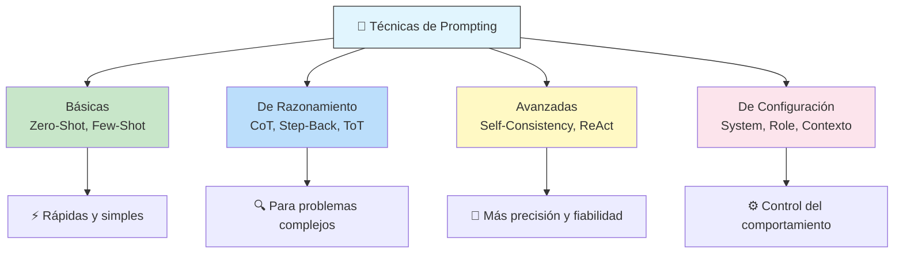

---

## Zero-Shot Prompting

Consiste en darle al LLM una **instrucción directa sin ejemplos**. El modelo usa su conocimiento pre-entrenado para responder.

```
Prompt:  "Traduce al inglés: 'Hola, ¿cómo estás?'"
Salida:  "Hello, how are you?"
```

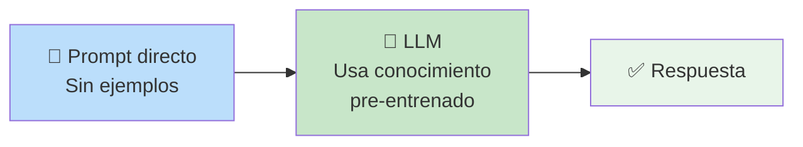

| Cuándo usarlo | Ventajas | Limitaciones |
|--------------|----------|--------------|
| Tareas simples y directas | Rápido, económico, sin preparación | Falla en tareas complejas o matizadas |
| Traducciones, resúmenes cortos | Un solo llamado al modelo | Puede ser inconsistente en formato |

```
✅ Buen zero-shot:   "Clasifica este email como 'spam' o 'no spam': {email}"
❌ Mal zero-shot:    "Resuelve este problema matemático complejo sin pasos intermedios"
```

---

## One-Shot / Few-Shot Prompting

Proporcionas **1 o más ejemplos** en el prompt para guiar el formato, tono y estilo de la respuesta.

### One-Shot (1 ejemplo)

```
Prompt:
  Traduce del español al inglés.
  Ejemplo: "Hola" → "Hello"
  Ahora traduce: "¿Dónde está la biblioteca?"

Salida: "Where is the library?"
```

### Few-Shot (varios ejemplos)

```
Prompt:
  Extrae el sentimiento de cada frase:
  Frase: "Me encanta este producto" → Positivo
  Frase: "Es terrible, no funciona" → Negativo
  Frase: "El clima está nublado" → Neutral
  Frase: "La película fue increíble" →

Salida: Positivo
```

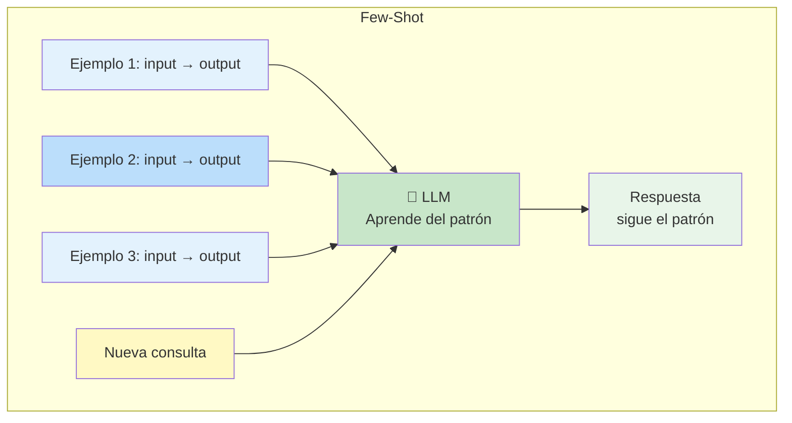

| Técnica | Ejemplos | Cuándo usarla |
|---------|----------|--------------|
| **Zero-Shot** | 0 | Tareas que el modelo ya conoce bien |
| **One-Shot** | 1 | Dar un formato de referencia |
| **Few-Shot** | 2-5 | Guiar un patrón específico de respuesta |
| **Many-Shot** | 5+ | Casos borde, tonos muy específicos |

> 💡 **Regla:** pocos ejemplos (2-3) bien seleccionados > muchos ejemplos mal elegidos.

---

## Step-Back Prompting

Le pides al LLM que **primero piense en un nivel más abstracto** (step-back) antes de responder la pregunta concreta.

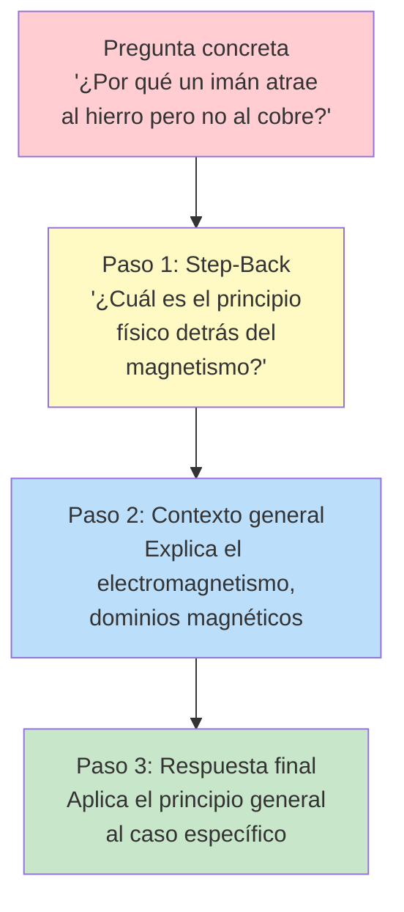

```
Sin Step-Back:
  P: "¿Por qué un imán atrae al hierro pero no al cobre?"
  R: "Porque el hierro tiene propiedades magnéticas."

Con Step-Back:
  P: "Antes de responder, piensa: ¿Cuál es el principio físico del
      magnetismo? ¿Qué hace que un material sea ferromagnético?
      Ahora responde por qué el imán atrae al hierro pero no al cobre."
  R: "El magnetismo se debe al alineamiento de dominios magnéticos...
      El hierro tiene electrones desapareados que permiten este
      alineamiento. El cobre tiene su capa d llena, por lo que no
      puede alinear sus dominios magnéticos..."
      ↑ Respuesta mucho más fundamentada
```

| Cuándo usarlo | Ejemplo de step-back |
|--------------|---------------------|
| Preguntas de física/ciencia | _"¿Cuál es la ley física relevante?"_ |
| Problemas de matemáticas | _"¿Qué fórmula o teorema aplica aquí?"_ |
| Análisis de código | _"¿Cuál es el patrón de diseño subyacente?"_ |
| Preguntas de historia | _"¿Qué contexto histórico es relevante?"_ |

---

## Chain of Thought (CoT) — Cadena de Pensamiento

Le pides al LLM que **razone paso a paso** antes de dar la respuesta final. Esto mejora drásticamente la precisión en tareas de razonamiento.

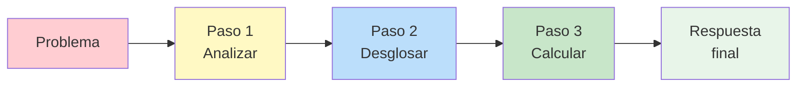

```
Sin CoT:
  P: "Si tengo 12 manzanas y regalo 3, luego compro 5 más,
      ¿cuántas tengo?"
  R: "14 manzanas."  ← puede acertar o fallar sin explicación

Con CoT:
  P: "Si tengo 12 manzanas y regalo 3, luego compro 5 más,
      ¿cuántas tengo? Piensa paso a paso."
  R: "Empiezo con 12 manzanas.
      Regalo 3 → 12 - 3 = 9 manzanas.
      Compro 5 → 9 + 5 = 14 manzanas.
      Respuesta final: 14 manzanas."
```

### CoT Zero-Shot

Simplemente agregas _"Piensa paso a paso"_ al final del prompt.

```
Prompt: "Un rectángulo tiene 20cm de perímetro. Su largo es
          el doble del ancho. ¿Cuánto mide cada lado? Piensa paso a paso."
```

### CoT Few-Shot

Incluyes un ejemplo donde muestras el razonamiento paso a paso.

```
Prompt:
  P: "Si 3 lápices cuestan $15, ¿cuánto cuestan 7 lápices?"
  R: "1 lápiz cuesta $15 ÷ 3 = $5. 7 lápices cuestan 7 × $5 = $35."

  P: "Si 4 cuadernos cuestan $28, ¿cuánto cuestan 9 cuadernos?"
  R:
```

> 🔬 **Impacto:** CoT puede mejorar la precisión en problemas de razonamiento matemático de ~18% a ~80% en modelos avanzados.

---

## Self-Consistency — Auto-Consistencia

Genera **múltiples respuestas** para el mismo prompt (usando temperatura > 0) y luego elige la **más consistente** (por votación).

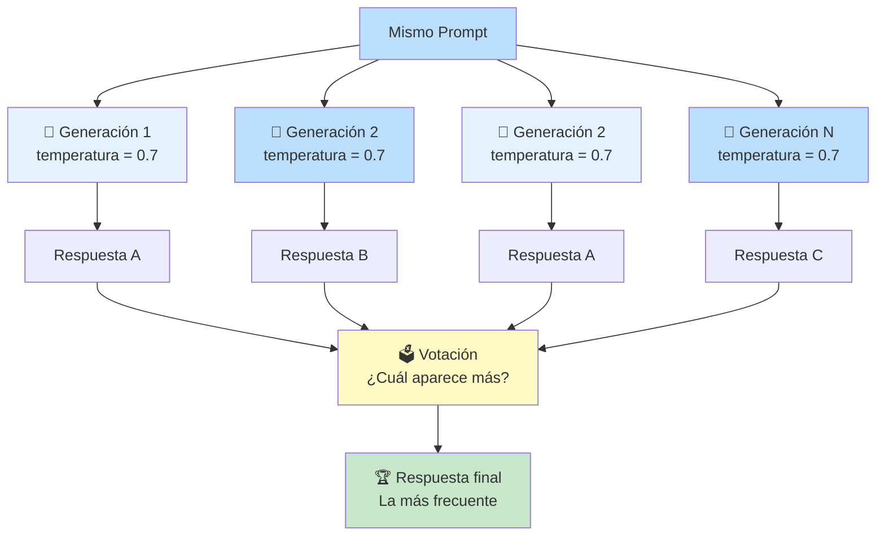

```
Prompt: "¿Cuál es la capital del país donde nació Gabriel García Márquez?"

Generación 1: "Gabriel García Márquez nació en Colombia.
              La capital de Colombia es Bogotá." → Bogotá
Generación 2: "Nació en Colombia (Aracataca). Capital: Bogotá." → Bogotá
Generación 3: "Colombia. Bogotá." → Bogotá
Generación 4: "Gabriel García Márquez era colombiano.
              La capital es Medellín." → Medellín ← error

Votación: Bogotá (3) vs Medellín (1)
Final: ✅ Bogotá
```

| Ventajas | Costo |
|----------|-------|
| Mayor precisión en problemas complejos | Múltiples llamadas al LLM (3-5x más caro) |
| Reduce el ruido de una sola generación | Mayor latencia |
| Ideal para problemas de opción múltiple | No útil para tareas creativas (poesía, etc.) |

> ⚡ **Variante:** también se puede usar con CoT — generas múltiples cadenas de pensamiento y votas la respuesta final más común.

---

## Tree of Thoughts (ToT) — Árbol de Pensamientos

El modelo explora **múltiples líneas de razonamiento en paralelo**, evaluando cada una antes de decidir cuál seguir. Como un "árbol" de pensamientos.

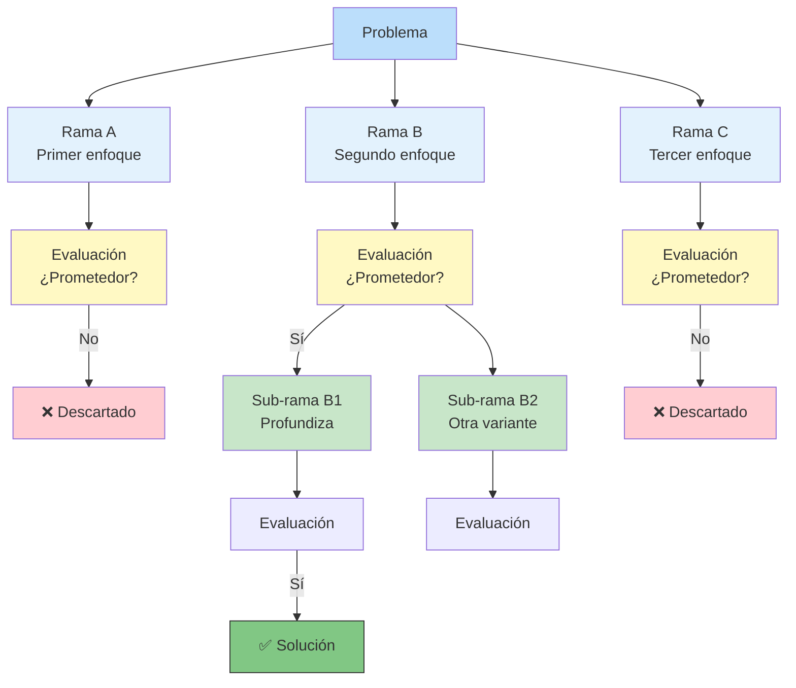

**ToT vs CoT:**

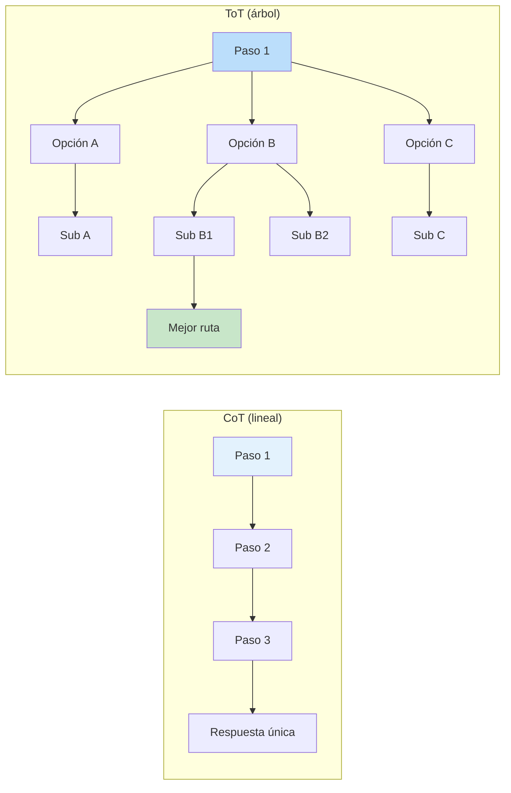

> 🔬 ToT es más potente que CoT pero **significativamente más costoso** en tokens y llamadas. Solo se usa en problemas que lo justifican (acertijos complejos, optimización, planeación).

---

## ReAct — Razonamiento + Acción

Combina **razonamiento** (thinking) con **acciones** (calling tools). El modelo alterna entre pensar y actuar.

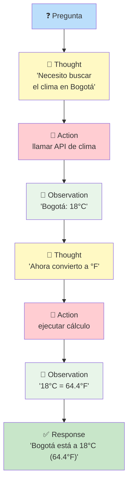

**Estructura típica de ReAct:**

```
Thought: Necesito averiguar la población de Tokio.
Action: search("población de Tokio 2024")
Observation: Tokio tiene aproximadamente 14 millones de habitantes.
Thought: Ahora necesito compararlo con la población de Nueva York.
Action: search("población de Nueva York 2024")
Observation: Nueva York tiene aproximadamente 8.4 millones.
Thought: Tokio (14M) es significativamente más grande que Nueva York (8.4M).
Response: Tokio tiene ~14M de habitantes, mientras que Nueva York
          tiene ~8.4M. Tokio es casi 1.7 veces más grande.
```

### ReAct vs CoT vs ToT

| Técnica | Razonamiento | Acciones | Uso |
|---------|-------------|----------|-----|
| **CoT** | Secuencial lineal | ❌ No | Problemas de lógica pura |
| **ToT** | Ramificado | ❌ No | Problemas con múltiples caminos |
| **ReAct** | Intercalado | ✅ Sí | Agentes, preguntas que requieren búsqueda |

---

## Prompt Tuning

Técnica más avanzada donde se **aprenden vectores "soft prompt"** mediante optimización, en lugar de escribir prompts manualmente. A diferencia del fine-tuning, **no modifica los pesos del modelo**, solo ajusta el prompt de entrada.

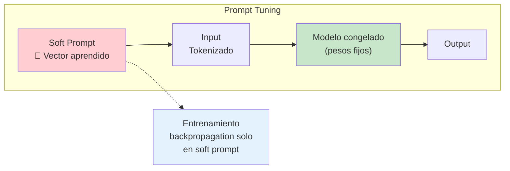

| | Prompt Engineering | Prompt Tuning | Fine-Tuning |
|--|-------------------|---------------|-------------|
| **Qué cambia** | El texto del prompt | Vectores aprendidos | Pesos del modelo |
| **Requiere GPU** | ❌ No | ✅ Sí (leve) | ✅ Sí (pesada) |
| **Datos** | ❌ No requiere | ✅ 100-1000 ejemplos | ✅ Miles de ejemplos |
| **Flexibilidad** | Máxima (cambias texto) | Media (requiere re-entreno) | Baja (modelo fijo) |

---

## Sistema / Role / Contexto

Técnicas que controlan **cómo se comporta** el LLM antes de darle la tarea concreta.

### System Prompt

Es la **instrucción base** que define el comportamiento general del modelo. Generalmente no visible para el usuario final.

```
System:
  "Eres un asistente de IA amable, servicial y honesto.
   Si no sabes algo, dilo. No inventes información.
   Responde siempre en español."

User: "¿Qué es la inteligencia artificial?"
```

### Rol Prompting

Le asignas un **rol específico** al modelo para que adopte una perspectiva o estilo.

```
"Actúa como un tutor de matemáticas para niños de 10 años.
 Explica los conceptos de forma simple y con ejemplos divertidos.

 Pregunta: ¿Qué es una fracción?"
```

### Prompt Contextual

Le das **contexto relevante** antes de la pregunta para que la respuesta sea precisa.

```
"Contexto: Eres un agente de soporte técnico para una empresa de software.
 El usuario acaba de comprar una licencia y no puede activarla.

 Historial del ticket: El usuario intentó activar con el código XYZ123
 pero recibe 'código inválido'.

 Pregunta: ¿Qué le dices al usuario?"
```

### ¿Cuál usar?

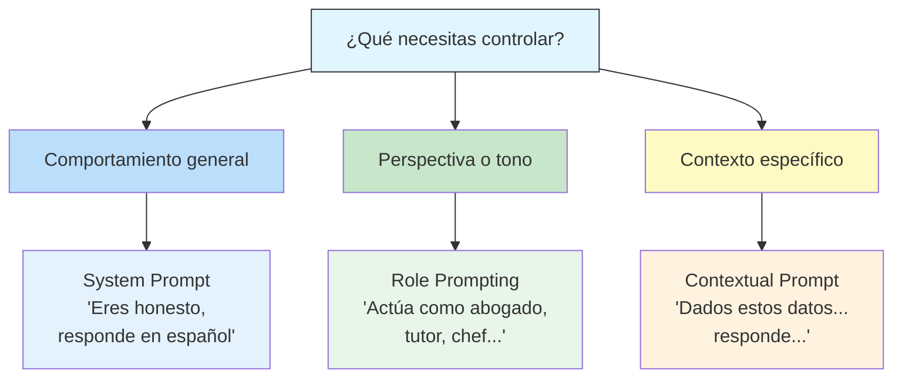

### Combinación común

La mayoría de las aplicaciones usan **los tres niveles juntos**:

```
System:
  "Eres un asistente útil para desarrolladores. Respondes en español."

User (contexto):
  "El usuario está usando Python 3.12 y tiene este error:
   TypeError: 'int' object is not iterable

   Código:
   for i in 5:
       print(i)"

User (rol + tarea):
  "Actúa como un mentor senior de Python y explica:
   1. Por qué ocurre este error
   2. Cómo solucionarlo
   3. Una analogía para entenderlo"
```

---

## Comparativa: ¿Qué técnica usar?

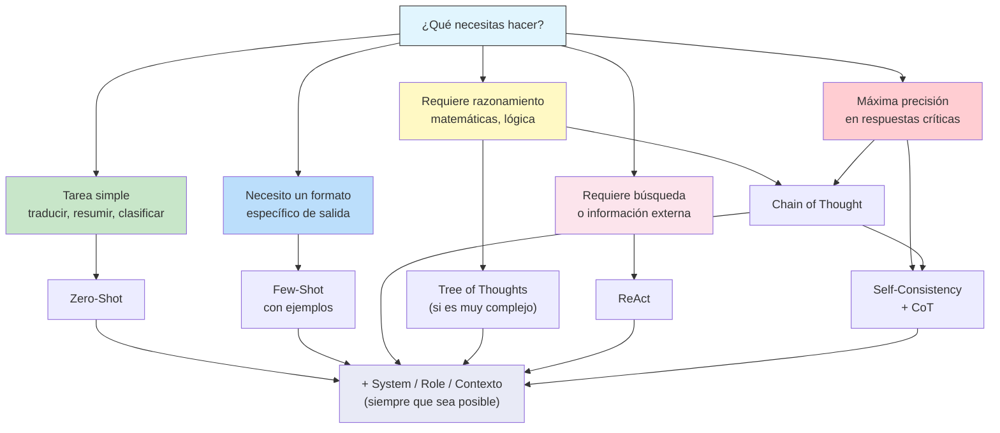

---

## Resumen Visual

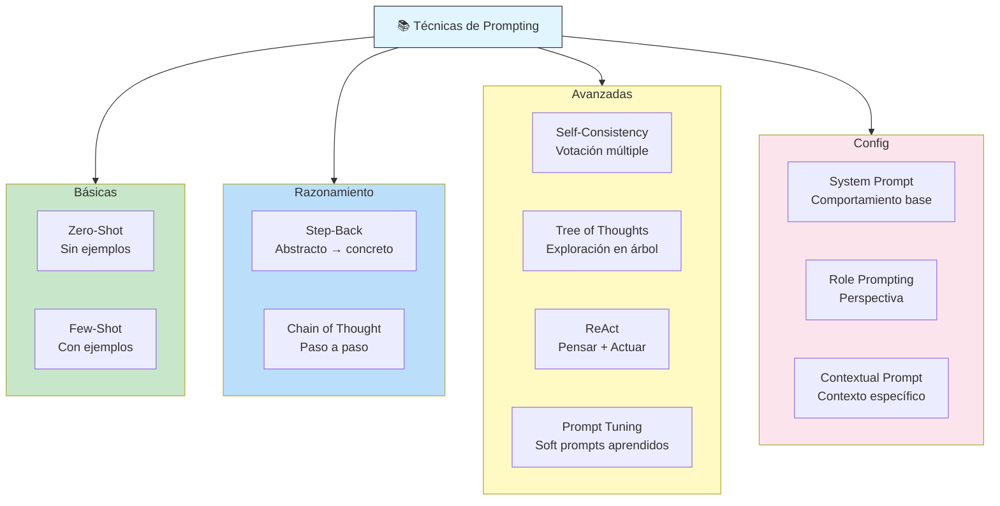

---

## Relacionados

- [[elementos-nucleo-llm-prompt-engineering]] ← Anterior: parámetros y configuración del LLM
- [[ingenieria-de-prompts]] → Siguiente: automatización y mejores prácticas
